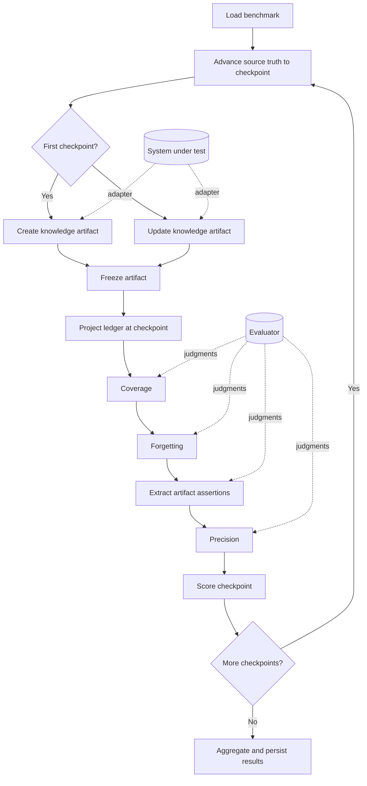
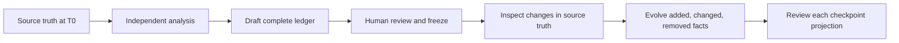

# KEB 🧪

**The Knowledge Evolution Benchmark measures whether knowledge artifacts stay
complete, accurate, and current as their underlying truth changes.**

A knowledge artifact might be a repository wiki, a personal brain, an internal
knowledge base, generated documentation, or another maintained representation of
changing source material. KEB does not require Git, source code, Markdown, or
even a model-driven system.

Most evaluations inspect one artifact once. KEB supports both point-in-time and
longitudinal evaluation:

```text
Point in time
truth @ T0 → artifact K0 → evaluate quality

Longitudinal
truth @ T0 → create K0 → evaluate
truth @ T1 → update K1 → evaluate change handling
truth @ T2 → update K2 → evaluate change handling
```

KEB asks three core questions:

| Question                                               | Metric         | Plain-English meaning                                       |
| ------------------------------------------------------ | -------------- | ----------------------------------------------------------- |
| 📚 Did the artifact represent what is true?            | **Coverage**   | Expected facts appear correctly in the artifact.            |
| 🎯 Is what the artifact says supported?                | **Precision**  | Concrete artifact claims are supported by the Truth Ledger. |
| 🧹 Did the artifact stop presenting what became false? | **Forgetting** | Obsolete facts are no longer presented as current.          |

Those checkpoint judgments also produce longitudinal maintenance metrics for
discovering new knowledge, correcting changed knowledge, forgetting stale
knowledge, and retaining unchanged knowledge.

## 🧱 What is a benchmark?

A benchmark is the complete frozen test case:

```text
Benchmark
├── ordered source-truth states or events
├── checkpoint boundaries
├── system adapter that creates or updates the artifact
└── Truth Ledger
    ├── facts true at T0
    ├── facts introduced or changed at T1
    └── facts introduced, changed, or removed at T2
```

The **Truth Ledger is the ground-truth part of the benchmark**. It is authored
from independent analysis of the underlying source material and frozen before
evaluation. No system under test creates or modifies it during a run.

The benchmark is broader than the ledger because it also defines the evolving
source truth, checkpoint sequence, and system-under-test adapter.

Possible source evolutions include:

| Domain         | Source truth over time                   | Knowledge artifact                 |
| -------------- | ---------------------------------------- | ---------------------------------- |
| Code           | Repository snapshots or commits          | Repository wiki                    |
| Personal brain | Added, edited, or deleted notes/messages | Maintained personal knowledge base |
| Operations     | Configuration and runbook changes        | Operational documentation          |
| Organization   | Policies, people, and process changes    | Internal knowledge hub             |

Git commits are therefore one convenient way to define repeatable checkpoints,
not part of KEB's conceptual requirement.

### Current Git/OpenWiki implementation

The first KEB adapter uses Git commits as source-truth checkpoints and OpenWiki
as the system under test. The committed `calc-evolution` benchmark has three
checkpoints:

| Checkpoint | Repository change             | Selected active truth                                                   |
| ---------- | ----------------------------- | ----------------------------------------------------------------------- |
| T0         | calc 1.0.0                    | `add` and `negate` exist; `VERSION` is `"1.0.0"`.                       |
| T1         | Introduce `subtract`          | `add`, `negate`, and `subtract` exist; version remains `"1.0.0"`.       |
| T2         | Remove `negate`, bump version | `add` and `subtract` exist; `negate` is absent; `VERSION` is `"2.0.0"`. |

An individual logical fact keeps the same ID while its truth changes:

```json
{
  "id": "version-value",
  "category": "config",
  "versions": [
    {
      "statement": "VERSION is the string \"1.0.0\".",
      "fromCheckpoint": "T0",
      "untilCheckpoint": "T2"
    },
    {
      "statement": "VERSION is the string \"2.0.0\".",
      "fromCheckpoint": "T2"
    }
  ]
}
```

At T1, KEB selects the first version. At T2, it selects the second version and
treats the first as obsolete knowledge that the artifact must forget.

## 🗺️ End-to-end architecture



At each checkpoint, KEB measures point-in-time quality. Across checkpoint
transitions, it measures whether the artifact adapted correctly:

```text
                         POINT-IN-TIME
source truth @ Tn ──▶ Truth Ledger @ Tn ◀──compare──▶ artifact @ Tn
                                                coverage + precision

                         LONGITUDINAL
ledger Tn ──changed──▶ ledger Tn+1
                              ▲
                              │ compare evolution
                              ▼
artifact Kn ─updated─▶ artifact Kn+1
             discovery + correction + forgetting + retention
```

The artifact persists between checkpoints. In the current Git/OpenWiki adapter,
the source truth is a repository and the artifact is a wiki:

```text
repository @ T0 ──init──▶ wiki K0
                            │
repository @ T1 + wiki K0 ──update──▶ wiki K1
                                         │
repository @ T2 + wiki K1 ──update──▶ wiki K2
```

T2 therefore evaluates how well OpenWiki maintained the artifact it created at
T0 and updated at T1—not a fresh generation with no memory. Another adapter
could replay note edits, messages, policy revisions, database snapshots, or
timestamped events instead of Git commits.

### One checkpoint, step by step

| Step | Generic KEB operation                                       | Current Git/OpenWiki adapter                            |
| ---- | ----------------------------------------------------------- | ------------------------------------------------------- |
| 1    | Load checkpoint definitions and ledger versions.            | Load commits and `benchmark.json`.                      |
| 2    | Materialize the checkpoint's source truth.                  | Check out a commit in an isolated worktree.             |
| 3    | Ask the system under test to create or update its artifact. | Run OpenWiki `init` or `update` using the system model. |
| 4    | Freeze and persist the artifact before evaluation.          | Capture every generated wiki document.                  |
| 5    | Select active and obsolete ledger facts.                    | Deterministic ledger projection.                        |
| 6    | Evaluate coverage of every active fact.                     | BM25 retrieval plus evaluator-model judgment.           |
| 7    | Evaluate whether obsolete fact versions were forgotten.     | BM25 retrieval plus evaluator-model judgment.           |
| 8    | Extract concrete assertions from the artifact.              | Section filtering plus evaluator-model extraction.      |
| 9    | Evaluate each retained assertion against the active ledger. | Evaluator-model judgment.                               |
| 10   | Score the checkpoint and, finally, the complete trace.      | Deterministic calculation and persistence.              |

KEB does not require the system under test to use a model. The current OpenWiki
system does, and may perform many agent calls. The current evaluator also uses a
model for semantic judgments, split into stable, bounded batches.

The current implementation has two intentionally separate model roles:

| Role                   | Responsibility                                                                                |
| ---------------------- | --------------------------------------------------------------------------------------------- |
| 🤖 **System model**    | Operates OpenWiki and creates or updates the artifact being evaluated.                        |
| ⚖️ **Evaluator model** | Extracts assertions and judges coverage, precision, and forgetting against the frozen ledger. |

In the current adapter, Git replay, ledger projection, Markdown sectioning, BM25
retrieval, filtering, deduplication, scoring, and persistence are deterministic
code paths.

## 📚 Coverage: did the artifact represent what is true?

Coverage starts from the Truth Ledger and searches the artifact.

```text
active ledger fact
        │
        ▼
retrieve likely artifact sections
        │
        ▼
evaluator judges all supplied sections together
        │
        ├── correct
        ├── partial
        ├── contradicted
        └── missing
```

In the current Markdown evaluator, BM25 initially retrieves the eight most
relevant artifact sections for each active fact. The evaluator receives the fact
and those candidate sections.

### Worked coverage example

Active T1 ledger fact:

```text
subtract(a, b) returns the first argument minus the second.
```

Possible artifact evidence and verdicts:

| Artifact text                       | Verdict        | Why                                       |
| ----------------------------------- | -------------- | ----------------------------------------- |
| “`subtract(a, b)` returns `a - b`.” | `correct`      | The complete fact is accurate.            |
| “The library exports `subtract`.”   | `partial`      | It confirms existence but omits behavior. |
| “`subtract(a, b)` returns `b - a`.” | `contradicted` | It states incompatible behavior.          |
| No section describes `subtract`.    | `missing`      | The artifact does not represent the fact. |

A model may initially return `missing` because BM25 did not retrieve the right
section. KEB therefore treats `missing` as provisional and checks every remaining
section in bounded batches before finalizing it.

```text
top BM25 sections say missing
             │
             ▼
inspect every unexamined section
             │
             ├── find support → correct or partial
             └── find none    → final missing
```

This keeps retrieval quality from silently becoming a coverage failure.

## 🎯 Precision: is what the artifact says supported?

Precision runs in the opposite direction. It starts from the artifact and checks
every retained claim against the Truth Ledger.

```text
every eligible artifact section
          │
          ▼
extract concrete assertions
          │
          ▼
deterministic filtering and deduplication
          │
          ▼
compare each assertion with the complete active ledger
          │
          ├── supported
          └── unsupported
```

### Worked precision example

Suppose the artifact says:

```text
add returns a + b.
add validates both inputs.
See the API page for details.
If validation is added later, update the README.
```

The model extracts the four statements. Deterministic rules then remove content
that is not a current-state domain assertion:

```text
Removed: “See the API page for details.”
         ↳ artifact navigation

Removed: “If validation is added later, update the README.”
         ↳ hypothetical contributor advice
```

The retained assertions are checked against the complete active ledger:

```text
Truth Ledger
├── add returns a + b
└── add performs no input validation

Artifact assertion                     Verdict
─────────────────────────────────────  ───────────
add returns a + b                      supported
add validates both inputs              unsupported
```

Precision for this example is:

```text
supported assertions     1
──────────────────── = ───── = 50%
retained assertions      2
```

### What counts as unsupported?

An assertion is supported only when one or more active ledger facts positively
establish the complete claim. It is unsupported when:

- the ledger contradicts it;
- the ledger establishes only part of it; or
- the ledger says nothing about it.

The evaluator is deliberately forbidden from checking source code or relying on
outside knowledge during judgment. The frozen ledger is its sole authority.

Under KEB's strict benchmark definition, an unsupported assertion counts against
precision even if it happens to be true in the underlying source. That outcome
means
either:

1. the artifact hallucinated or overclaimed; or
2. the benchmark ledger is incomplete and must be corrected.

This is why ledger completeness is essential.

### What is excluded before judgment?

Code-owned rules exclude:

- artifact navigation and structural descriptions;
- change-history narration that is outside the benchmark's current-state scope;
- subjective editorial descriptions;
- contributor or caller advice;
- hypothetical and counterfactual scenarios;
- normalized exact duplicates; and
- conservative recognized families of equivalent absence claims.

Generic lexical similarity is recorded for audit but does not automatically
remove assertions because similar wording can describe different functions or
numeric cases.

## 🧹 Forgetting: did stale knowledge disappear?

Forgetting checks prior ledger versions that are no longer active.

```text
obsolete ledger version
          │
          ▼
retrieve likely artifact sections
          │
          ▼
evaluator checks whether the old claim is still current
          │
          ├── lingering
          └── forgotten
```

### Worked forgetting example

At T1:

```text
negate(x) is exported.
```

At T2, `negate` is removed. The T1 statement becomes an obsolete fact version.
KEB searches the T2 artifact for that old knowledge:

| T2 artifact text                         | Verdict     | Why                                                     |
| ---------------------------------------- | ----------- | ------------------------------------------------------- |
| “`negate(x)` returns `-x`.”              | `lingering` | The artifact still presents the removed API as current. |
| “`negate` was removed in version 2.0.0.” | `forgotten` | Historical removal is not a current claim.              |
| No mention of `negate` anywhere.         | `forgotten` | The stale fact is absent.                               |

Like coverage, an initial `forgotten` verdict is provisional. KEB checks every
remaining section before finalizing it because stale knowledge could be hiding
elsewhere in the artifact.

Forgetting does not require the artifact to erase history. Migration notes and
explicit statements that something was removed are allowed; the old behavior
must simply not be presented as current truth.

## 📊 Scoring

KEB combines **Quality** and **Maintenance**:

```text
KEB Score = (Quality + Maintenance) / 2
```

### Quality

Quality evaluates the artifact at every checkpoint.

```text
Trace Coverage = correctly represented active facts / all active facts

Trace Precision = supported artifact assertions / all retained artifact assertions

Quality = harmonic mean(Trace Coverage, Trace Precision)
```

The harmonic mean makes a system earn both coverage and precision. An artifact
cannot score well by saying almost nothing, nor by saying everything
indiscriminately.

### Maintenance

Maintenance evaluates transitions between checkpoints:

| Metric                              | Question                                              |
| ----------------------------------- | ----------------------------------------------------- |
| 🌱 **New-Knowledge Discovery**      | Did newly true facts appear?                          |
| 🔄 **Changed-Knowledge Correction** | Did the new truth appear and the old truth disappear? |
| 🧹 **Complete Forgetting**          | Did removed knowledge stop appearing as current?      |
| 🛡️ **Stable Retention**             | Did correct, unchanged knowledge remain correct?      |

The eligible rates are averaged into the Maintenance score.

### Diagnostics

KEB also reports signals that do not affect the headline score:

- **Recovery Rate** — whether a missed introduction, change, or removal is fixed
  at a later checkpoint.
- **Stale-Knowledge Lifetime** — how many checkpoints obsolete knowledge lingers
  before it is first forgotten.
- **Efficiency** — system runtime and documentation churn. Token and cost capture
  can be added when usage telemetry is available.

## 📒 Authoring the Truth Ledger

The active ledger at every checkpoint should be a comprehensive census of the
material source truth that the artifact is expected to represent—not merely a
list of facts that changed.

Depending on the domain, categories might include:

- identities, entities, relationships, and attributes;
- behaviors, decisions, defaults, and configuration;
- architecture, components, processes, and execution flows;
- timelines, commitments, constraints, and meaningful absences;
- source or artifact structure; and
- facts that were introduced, changed, or removed across the trace.

Facts should be atomic and independently checkable:

```text
Avoid:
  add exists, accepts two numbers, returns their sum, and has JSDoc.

Prefer:
  add exists.
  add has signature add(a: number, b: number): number.
  add returns a + b.
  add has JSDoc for both parameters and its return value.
```

Atomic facts make coverage verdicts interpretable. If the artifact documents the
signature but omits JSDoc, one fact is correct and one is missing instead of one
large fact becoming vaguely partial.

### Authoring workflow



For a small source set, author the ledger manually. For a larger domain, a model
may help draft candidates from independent source analysis, but a human must
review and freeze the result before evaluation. The system under test's artifact
must never be used as ground truth.

Ask at each checkpoint:

> What should a high-quality artifact represent now?

not merely:

> What changed since the preceding checkpoint?

The executable schema and validation rules live in
[`core/types.ts`](./core/types.ts) and
[`benchmark/validation.ts`](./benchmark/validation.ts).

## 🔬 Evaluator mechanics and reliability

The current evaluator splits generated Markdown into stable, bounded sections.
Coverage and forgetting reuse one BM25 index over those sections. Precision
visits every eligible section rather than relying on retrieval. Other artifact
formats can provide their own sectioning and retrieval adapters while preserving
the same evaluation contract.

Semantic judgments use direct schema-validated model calls with:

- stable bounded batches;
- a five-minute timeout per attempt;
- at most two attempts;
- provider retries disabled inside each attempt;
- sequential passes and observable failure boundaries; and
- no evaluator-forced sampling parameter.

Evidence citations must name sections that were actually supplied in the bounded
request. A model failure, invalid schema, invented identity, or unavailable
citation fails the pass instead of silently inventing a default verdict.

## 💾 Audit artifacts

Every run writes to a timestamped directory under `evals/keb/.results/`:

```text
calc-evolution-<timestamp>/
├── artifacts/
│   ├── T0/                 # exact frozen artifact at T0
│   ├── T0.json             # fingerprint and document inventory
│   ├── T1/
│   └── T1.json
├── assertions/
│   ├── T0.json             # all extracted, excluded, and retained assertions
│   └── T1.json
├── result.json             # completed runs: verdicts, scores, and diagnostics
├── report.md               # completed runs: detailed human-readable report
└── error.json              # failed runs: bounded failure details
```

Artifacts are persisted before evaluation, and assertion inventories are
persisted before precision judgment. They therefore survive later evaluator
failures and can be inspected without reading provider traces.

## ▶️ Running the Git/OpenWiki adapter

Configure the provider and model IDs. Store provider credentials in the expected
environment variable; never commit them to the repository.

```sh
export OPENWIKI_PROVIDER=anthropic
export OPENWIKI_MODEL_ID=claude-sonnet-5
export KEB_EVALUATOR_MODEL_ID=claude-sonnet-5

# Set ANTHROPIC_API_KEY in your shell or secret manager.
```

Run the calc benchmark:

```sh
pnpm exec tsx evals/keb/run.ts \
  --benchmark evals/keb/benchmarks/calc-evolution
```

The terminal shows checkpoint progress and a compact final score. Detailed
verdicts remain in the result directory rather than being dumped to the terminal.

## ⚖️ Comparing systems

A valid comparison holds every evaluation input constant:

```text
same source evolution and checkpoints
same Truth Ledger
same evaluator model
same repetition count
             │
             ▼
change only the system under test
```

For example:

```text
OpenWiki baseline
        vs.
OpenWiki + grounded claims
```

This isolates whether the system change improved knowledge maintenance rather
than merely generating a different artifact.

## ✅ Tests

Run the deterministic KEB suite and typecheck:

```sh
pnpm exec vitest run evals/keb
pnpm run eval:keb:typecheck
```

Include live provider-backed tests:

```sh
KEB_LIVE=1 pnpm exec vitest run evals/keb
```

Live tests require provider credentials; deterministic tests do not.
