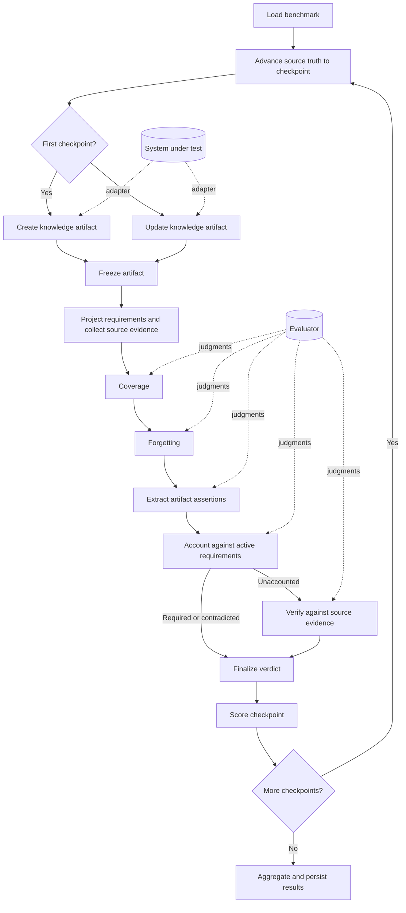
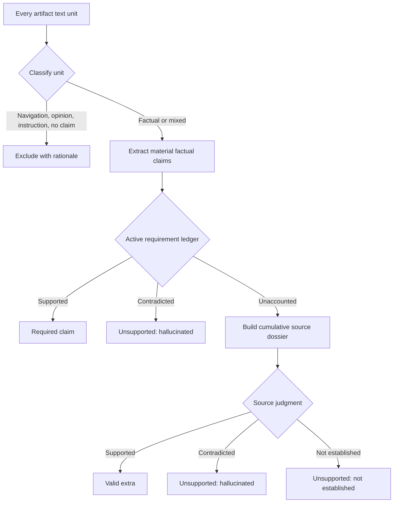
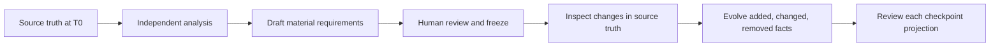

# KEB 🧪

**The Knowledge Evolution Benchmark measures whether knowledge artifacts stay
complete, accurate, and current as their underlying truth changes.**

A knowledge artifact might be a repository wiki, a personal brain, an internal
knowledge base, generated documentation, or another maintained representation of
changing source material. KEB's evaluation model is source- and artifact-agnostic;
the executable V1 runner currently implements Git checkpoints, OpenWiki, and
Markdown artifacts.

Most evaluations inspect one artifact once. KEB supports both point-in-time and
longitudinal evaluation:

```text
Point in time
truth @ T0 → artifact K0 → evaluate quality

Longitudinal
truth @ T0 → create K0 → evaluate
truth @ T1 → update K1 → evaluate change handling
truth @ T2 → update K2 → evaluate change handling
```

KEB asks three core questions:

| Question                                               | Metric         | Plain-English meaning                                               |
| ------------------------------------------------------ | -------------- | ------------------------------------------------------------------- |
| 📚 Did the artifact represent what matters?            | **Coverage**   | Required knowledge appears correctly in the artifact.               |
| 🎯 Is what the artifact says supported?                | **Precision**  | Claims are checked against requirements, then source evidence.      |
| 🧹 Did the artifact stop presenting what became false? | **Forgetting** | Obsolete requirements are no longer presented as current knowledge. |

Those checkpoint judgments also produce longitudinal maintenance metrics for
discovering new knowledge, correcting changed knowledge, forgetting stale
knowledge, and retaining unchanged knowledge.

## 🧱 What is a benchmark?

A benchmark is the frozen source evolution and its human-authored expectations:

```text
Benchmark
├── ordered source-truth states or events
├── checkpoint boundaries
└── Truth Package
    ├── material knowledge requirements
    ├── temporal validity and supersession
    └── optional human-audit evidence references

Evaluation run
├── benchmark
├── system under test
├── source-evidence adapter
└── evaluator
```

In the current manifest schema, the **Truth Package** is the human-authored
ground-truth specification: material knowledge requirements and their validity
ranges. During a run, the separately supplied source-evidence adapter normalizes
the frozen source at each checkpoint into an evidence corpus. Requirements define
what a useful artifact must cover; source evidence verifies additional details
the artifact chooses to state.

The benchmark is broader than the Truth Package because it also defines the
evolving source truth and checkpoint sequence. The system under test, source
adapter, and evaluator are run inputs, which allows the same benchmark to compare
different systems without changing its truth definition. The system under test
never creates or modifies the requirements or source evidence.

Possible source evolutions include:

| Domain         | Source truth over time                   | Knowledge artifact                 |
| -------------- | ---------------------------------------- | ---------------------------------- |
| Code           | Repository snapshots or commits          | Repository wiki                    |
| Personal brain | Added, edited, or deleted notes/messages | Maintained personal knowledge base |
| Operations     | Configuration and runbook changes        | Operational documentation          |
| Organization   | Policies, people, and process changes    | Internal knowledge hub             |

Git commits are therefore one convenient way to define repeatable checkpoints,
not part of KEB's conceptual requirement.

### Current Git/OpenWiki implementation

The first KEB adapter uses Git commits as source-truth checkpoints and OpenWiki
as the system under test. The committed `calc-evolution` benchmark has three
checkpoints:

| Checkpoint | Repository change             | Selected active truth                                                   |
| ---------- | ----------------------------- | ----------------------------------------------------------------------- |
| T0         | calc 1.0.0                    | `add` and `negate` exist; `VERSION` is `"1.0.0"`.                       |
| T1         | Introduce `subtract`          | `add`, `negate`, and `subtract` exist; version remains `"1.0.0"`.       |
| T2         | Remove `negate`, bump version | `add` and `subtract` exist; `negate` is absent; `VERSION` is `"2.0.0"`. |

An individual knowledge requirement keeps the same ID while its truth changes:

```json
{
  "id": "current-version",
  "category": "config",
  "versions": [
    {
      "statement": "The library's current version is 1.0.0.",
      "evidenceRefs": ["src/version.ts", "README.md"],
      "fromCheckpoint": "T0",
      "untilCheckpoint": "T2"
    },
    {
      "statement": "The library's current version is 2.0.0.",
      "evidenceRefs": ["src/version.ts", "README.md"],
      "fromCheckpoint": "T2"
    }
  ]
}
```

At T1, KEB selects the first version. At T2, it selects the second version and
treats the first as obsolete knowledge that the artifact must forget.

`evidenceRefs` are optional, human-auditable pointers documenting where a
requirement came from. In V1 they do not affect retrieval or scoring. The Git
source adapter captures all tracked text files except generated `openwiki/`
content, binary files, and non-file entries; it does not restrict evidence to
these references.

## 🗺️ End-to-end architecture



At each checkpoint, KEB measures point-in-time quality. Across checkpoint
transitions, it measures whether the artifact adapted correctly:

```text
                              POINT-IN-TIME
requirements @ Tn ─────────compare─────────▶ artifact @ Tn
                         coverage

artifact assertions @ Tn ──▶ active requirements
                                 │
                                 ├── accounted → final verdict
                                 └── unaccounted
                                         │
                                         ▼
source truth @ Tn ─────────────▶ evidence corpus → source verification

                              LONGITUDINAL
requirements Tn ──changed──▶ requirements Tn+1
                              ▲
                              │ compare evolution
                              ▼
artifact Kn ─updated─▶ artifact Kn+1
             discovery + correction + forgetting + retention
```

The artifact persists between checkpoints. In the current Git/OpenWiki adapter,
the source truth is a repository and the artifact is a wiki:

```text
repository @ T0 ──init──▶ wiki K0
                            │
repository @ T1 + wiki K0 ──update──▶ wiki K1
                                         │
repository @ T2 + wiki K1 ──update──▶ wiki K2
```

T2 therefore evaluates how well OpenWiki maintained the artifact it created at
T0 and updated at T1—not a fresh generation with no memory. KEB's contracts are
designed to support note edits, messages, policy revisions, database snapshots,
or timestamped events, but V1 would need additional replay and artifact adapters
to run those domains end to end.

### One checkpoint, step by step

| Step | Generic KEB operation                                       | Current Git/OpenWiki adapter                               |
| ---- | ----------------------------------------------------------- | ---------------------------------------------------------- |
| 1    | Load checkpoint definitions and knowledge requirements.     | Load commits and `benchmark.json`.                         |
| 2    | Materialize the checkpoint's source truth.                  | Check out a commit in an isolated worktree.                |
| 3    | Ask the system under test to create or update its artifact. | Run OpenWiki `init` or `update` using the system model.    |
| 4    | Freeze and persist the artifact before evaluation.          | Capture every generated wiki document.                     |
| 5    | Project requirements and collect temporal source evidence.  | Requirements plus current and prior tracked files.         |
| 6    | Evaluate coverage of every active material topic.           | BM25 retrieval plus evaluator-model judgment.              |
| 7    | Evaluate whether obsolete fact versions were forgotten.     | BM25 retrieval plus evaluator-model judgment.              |
| 8    | Extract concrete assertions from the artifact.              | Section filtering plus evaluator-model extraction.         |
| 9    | Account each assertion against active requirements.         | Evaluator-model judgment using the complete active ledger. |
| 10   | Verify only unaccounted assertions against source evidence. | BM25 retrieval plus evaluator-model judgment.              |
| 11   | Score the checkpoint and, finally, the complete trace.      | Deterministic calculation and persistence.                 |

KEB does not require the system under test to use a model. The current OpenWiki
system does, and may perform many agent calls. The current evaluator also uses a
model for semantic judgments, split into stable, bounded batches.

The current implementation has two intentionally separate model roles:

| Role                   | Responsibility                                                                            |
| ---------------------- | ----------------------------------------------------------------------------------------- |
| 🤖 **System model**    | Operates OpenWiki and creates or updates the artifact being evaluated.                    |
| ⚖️ **Evaluator model** | Extracts assertions and judges coverage, precision, and forgetting from bounded evidence. |

The models do not generate benchmark requirements, checkpoint definitions,
source-evidence records, BM25 rankings, temporal transitions, metrics, or scores.
Those remain human-authored or deterministic code paths.

In the current adapter, Git replay, requirement projection, source-evidence
capture, Markdown sectioning, BM25 retrieval, filtering, deduplication, scoring,
and persistence are deterministic code paths.

## 📚 Coverage: did the artifact represent what is true?

Coverage starts from the active knowledge requirements and searches the artifact.

```text
active knowledge requirement
        │
        ▼
retrieve likely artifact sections
        │
        ▼
evaluator judges all supplied sections together
        │
        ├── correct
        ├── partial
        ├── contradicted
        └── missing
```

In the current Markdown evaluator, BM25 initially retrieves the eight most
relevant artifact sections for each active fact. The evaluator receives the fact
and those candidate sections.

### Worked coverage example

Active T1 requirement:

```text
subtract(a, b) returns the first argument minus the second.
```

Possible artifact evidence and verdicts:

| Artifact text                       | Verdict        | Why                                       |
| ----------------------------------- | -------------- | ----------------------------------------- |
| “`subtract(a, b)` returns `a - b`.” | `correct`      | The complete fact is accurate.            |
| “The library exports `subtract`.”   | `partial`      | It confirms existence but omits behavior. |
| “`subtract(a, b)` returns `b - a`.” | `contradicted` | It states incompatible behavior.          |
| No section describes `subtract`.    | `missing`      | The artifact does not represent the fact. |

A model may initially return `missing` because BM25 did not retrieve the right
section. KEB therefore treats `missing` as provisional and checks every remaining
section in bounded batches before finalizing it.

```text
top BM25 sections say missing
             │
             ▼
inspect every unexamined section
             │
             ├── find support → correct or partial
             └── find none    → final missing
```

This keeps retrieval quality from silently becoming a coverage failure.

## 🎯 Precision: is what the artifact says supported?

Precision runs in the opposite direction from coverage. Coverage starts with
human-authored requirements. Precision starts with every code-owned text unit in
the artifact, decides whether it contains a material factual claim, and checks
every retained claim through two truth layers.



The active requirement ledger is the complete set of material knowledge the
benchmark requires. It is deliberately not an impossible inventory of everything
true in the source. Ledger silence therefore means `unaccounted`, not false. Only
unaccounted claims require the source-verification pass.

### Step 1: account for every text unit

Before truth judgment, the evaluator must return exactly one classification for
every supplied Markdown block:

| Text                                                   | Classification | Precision claim                                |
| ------------------------------------------------------ | -------------- | ---------------------------------------------- |
| “`add(a, b)` returns `a + b`.”                         | `factual`      | Keep the complete behavior claim.              |
| “Because there are no tests, validate manually.”       | `mixed`        | Keep “There are no tests”; discard the advice. |
| “See the API page.”                                    | `navigation`   | None.                                          |
| “This library is elegant.”                             | `opinion`      | None.                                          |
| “Run the functions manually.”                          | `instruction`  | None.                                          |
| A heading or transition with no subject-matter meaning | `no-claim`     | None.                                          |

This is model-based because the distinction is semantic, but it is accountable:
a unit cannot silently disappear, factual and mixed units must produce claims,
excluded units must produce none, and every decision is persisted with a
rationale. Code-owned filters then remove narrow deterministic categories such as
commit archaeology and exact duplicates.

### Worked precision example

Suppose the active ledger requires:

```text
The library provides add(a, b), which returns a + b.
```

The artifact says:

```text
add returns a + b.
add validates both inputs.
See the API page for details.
If validation is added later, update the README.
```

The text-unit classifier excludes content that is not a material domain claim:

```text
Removed: “See the API page for details.”
         ↳ artifact navigation

Removed: “If validation is added later, update the README.”
         ↳ hypothetical contributor advice
```

The remaining assertions first go to the complete active ledger:

```text
add returns a + b         → supported by requirement → required knowledge
add validates both inputs → unaccounted
```

Only the second assertion goes to source verification. BM25 finds likely source
records first. If they do not establish the claim, KEB accumulates additional
records instead of replacing the earlier evidence. Complete inventories are
always present, so repository-wide absence claims can use closed-world evidence.

```text
Current source evidence
├── add returns a + b
└── add performs no input validation

Artifact assertion          Final class                Why
──────────────────────────  ─────────────────────────  ─────────────────────────────
add returns a + b           required claim              Active requirement supports it
add validates both inputs   unsupported: hallucinated   Current source proves otherwise
```

Precision for this example is:

```text
supported assertions     1
──────────────────── = ───── = 50%
judged assertions     2
```

### Step 2: make a binary truth judgment

An assertion finishes as:

- **supported / required claim** when the active ledger establishes it;
- **supported / valid extra** when source evidence establishes it;
- **unsupported / hallucinated** when a truth layer proves something
  incompatible; or
- **unsupported / not established** when the complete available evidence does
  not establish the claim.

`supported` versus `unsupported` is the scored decision. The unsupported subtype
is diagnostic: it distinguishes an explicit conflict from an assertion that adds
unstated intent, policy, causality, guarantees, or other detail the source does
not establish.

Current-state assertions require current evidence. Historical evidence may
support explicitly historical assertions, but cannot establish that obsolete
behavior remains current.

The source verifier may use ordinary deterministic consequences of supplied
code. For example, `return a + b` directly supports “`add(2, 3)` returns `5`.” It
may also combine a complete path inventory with file contents to establish that
no test suite exists. It may not invent project intent, policy, or guarantees.

If the model itself fails to return a structurally and semantically valid answer,
that is different from an unsupported artifact claim. KEB retries the individual
judgment and then records `indeterminate` plus an audit warning. Indeterminate
items reduce Evaluator Completeness and do not enter the precision denominator.

In short:

```text
source cannot establish the artifact claim → unsupported system output
evaluator cannot produce a valid judgment → indeterminate evaluator output
```

### What is excluded before judgment?

The model classifier and narrow code-owned rules exclude:

- artifact navigation and structural descriptions;
- change-history narration that is outside the benchmark's current-state scope;
- subjective editorial descriptions;
- contributor or caller advice;
- hypothetical and counterfactual scenarios;
- normalized exact duplicates; and
- conservative recognized families of equivalent claims.

Generic lexical similarity is recorded for audit but does not automatically
remove assertions because similar wording can describe different functions or
numeric cases.

## 🧹 Forgetting: did stale knowledge disappear?

Forgetting checks prior requirement versions that are no longer active.

```text
obsolete requirement version
          │
          ▼
retrieve likely artifact sections
          │
          ▼
evaluator checks whether the old claim is still current
          │
          ├── lingering
          └── forgotten
```

### Worked forgetting example

At T1:

```text
negate(x) is exported.
```

At T2, `negate` is removed. The T1 statement becomes an obsolete fact version.
KEB searches the T2 artifact for that old knowledge:

| T2 artifact text                         | Verdict     | Why                                                     |
| ---------------------------------------- | ----------- | ------------------------------------------------------- |
| “`negate(x)` returns `-x`.”              | `lingering` | The artifact still presents the removed API as current. |
| “`negate` was removed in version 2.0.0.” | `forgotten` | Historical removal is not a current claim.              |
| No mention of `negate` anywhere.         | `forgotten` | The stale fact is absent.                               |

Like coverage, an initial `forgotten` verdict is provisional. KEB checks every
remaining section before finalizing it because stale knowledge could be hiding
elsewhere in the artifact.

Forgetting does not require the artifact to erase history. Migration notes and
explicit statements that something was removed are allowed; the old behavior
must simply not be presented as current truth.

## 📊 Scoring

KEB combines **Quality** and **Maintenance**:

```text
KEB Score = (Quality + Maintenance) / 2
```

### Quality

Quality evaluates the artifact at every checkpoint.

```text
Checkpoint Coverage = correct active requirements / active requirements

Trace Coverage = mean of checkpoint Coverage scores

Checkpoint Precision =
  (required knowledge + valid extra knowledge)
  / (required knowledge + valid extra knowledge + unsupported)

Trace Precision = mean of checkpoint Precision scores

Quality = harmonic mean(Trace Coverage, Trace Precision)
```

The checkpoint macro-average gives each checkpoint equal weight even when they
contain different numbers of requirements or assertions. The harmonic mean makes
a system earn both coverage and precision. Every validly judged unsupported
claim lowers precision. Its subtype distinguishes an established conflict from a
claim the complete supplied evidence does not establish.

### Maintenance

Maintenance evaluates transitions between checkpoints:

| Metric                              | Question                                              |
| ----------------------------------- | ----------------------------------------------------- |
| 🌱 **New-Knowledge Discovery**      | Did newly true facts appear?                          |
| 🔄 **Changed-Knowledge Correction** | Did the new truth appear and the old truth disappear? |
| 🧹 **Complete Forgetting**          | Did removed knowledge stop appearing as current?      |
| 🛡️ **Stable Retention**             | Did correct, unchanged knowledge remain correct?      |

The eligible rates are averaged into the Maintenance score.

### Diagnostics

KEB also reports signals that do not affect the headline score:

- **Recovery Rate** — whether a missed introduction, change, or removal is fixed
  at a later checkpoint.
- **Stale-Knowledge Lifetime** — how many checkpoints obsolete knowledge lingers
  before it is first forgotten.
- **Efficiency** — system runtime and documentation churn. Token and cost capture
  can be added when usage telemetry is available.

Precision also reports its composition:

- **Required knowledge** — ledger-supported assertions;
- **Valid extra knowledge** — source-supported assertions outside the ledger;
- **Unsupported: hallucinated** — a truth layer establishes incompatible truth;
  and
- **Unsupported: not established** — complete available evidence does not
  establish the claim.

Evaluator Completeness is reported separately from system quality:

```text
Evaluator Completeness = valid semantic judgments / attempted judgments
```

An `indeterminate` item means a schema-valid batch contained an invalid judgment
and an isolated repair request also failed. It is excluded from semantic score
denominators and never becomes a hallucination merely because evaluation failed.
Reduced Evaluator Completeness makes the resulting KEB score explicitly
provisional rather than quietly treating evaluator failure as system failure.

## 📒 Authoring the Truth Package

Human-authored requirements should capture the material source truth the artifact
is expected to represent—not every mechanically observable property. The source
adapter captures the underlying evidence needed to verify additional claims.

Depending on the domain, categories might include:

- identities, entities, relationships, and attributes;
- behaviors, decisions, defaults, and configuration;
- architecture, components, processes, and execution flows;
- timelines, commitments, constraints, and meaningful absences;
- source or artifact structure; and
- facts that were introduced, changed, or removed across the trace.

Coverage facts should be meaningful, independently checkable topic claims:

```text
Avoid:
  add exists.
  add is exported.
  add has two parameters.
  add returns a number.
  add is defined in src/calc.ts.

Prefer:
  The library provides add(a, b), which returns the sum a + b.
```

Exact values and behavior remain part of the claim when they are material. “The
library exposes a version” is insufficient when the useful truth is “the current
version is 1.0.0.” File placement, declaration syntax, exact counts, and similar
implementation details are not coverage requirements by default.

Repository archaeology—commit counts, incidental file inventories, commentary
wording, fixture provenance, and absent tooling with no material consequence—is
outside the default evaluation scope.

### Authoring workflow



For a small source set, author requirements manually. For a larger domain, a model
may help draft candidates from independent source analysis, but a human must
review and freeze the result before evaluation. The system under test's artifact
must never be used as ground truth.

Ask at each checkpoint:

> What should a high-quality artifact represent now?

not merely:

> What changed since the preceding checkpoint?

The executable requirement schema and validation rules live in
[`core/types.ts`](./core/types.ts) and
[`benchmark/validation.ts`](./benchmark/validation.ts).

## 🔬 Evaluator mechanics and reliability

The current evaluator splits generated Markdown into stable, bounded sections and
then into fence-aware text units. Coverage and forgetting reuse one BM25 index
over artifact sections. Precision classifies every eligible text unit, accounts
retained claims against the complete active requirement ledger, then uses a
separate BM25 index over normalized source evidence only for unaccounted claims.
Source evidence is cumulative across fallback batches, and complete inventories
always accompany judgments. The source-evidence interface is generic, but the V1
runner still directly owns Git replay, OpenWiki execution, and Markdown capture;
other domains require those additional adapters.

Semantic judgments use direct schema-validated model calls with:

- stable bounded batches;
- exactly one extraction classification per supplied text unit;
- a five-minute timeout per attempt;
- at most two attempts;
- provider retries disabled inside each attempt;
- sequential passes and observable failure boundaries; and
- no evaluator-forced sampling parameter.

The reviewed boundary examples used by deterministic evaluator tests live in
[`evaluator/fixtures/precision-gold.json`](./evaluator/fixtures/precision-gold.json).
They intentionally cover navigation, opinion, instruction, mixed content,
direct code inference, closed-world absence, explicit contradiction, and
unsupported intent.

Evidence citations must name sections that were actually supplied in the bounded
request. An initial provider failure, schema-wide failure, or unusable assertion
inventory still fails the pass because there is no trustworthy batch to preserve.
When a schema-valid judgment batch contains one malformed item, KEB preserves
valid neighboring judgments and retries only that item with isolated evidence.
If both isolated attempts fail for any reason, the item becomes `indeterminate`,
an audit warning is persisted, and the run continues with reduced Evaluator
Completeness.

## 💾 Audit artifacts

Every run writes to a timestamped directory under `evals/keb/.results/`:

```text
calc-evolution-<timestamp>/
├── artifacts/
│   ├── T0/                 # exact frozen artifact at T0
│   ├── T0.json             # fingerprint and document inventory
│   ├── T1/
│   ├── T1.json
│   ├── T2/
│   └── T2.json
├── assertions/
│   ├── T0.json             # classified units plus all excluded/retained claims
│   ├── T1.json
│   └── T2.json
├── evidence/
│   ├── T0.json             # normalized source evidence used by precision
│   ├── T1.json
│   └── T2.json
├── result.json             # verdicts, warnings, scores, and diagnostics
├── report.md               # completed runs: detailed human-readable report
└── error.json              # failed runs: bounded failure details
```

Artifacts and source evidence are persisted before evaluation, and assertion
inventories are persisted before precision judgment. They therefore survive
later evaluator failures and can be inspected without reading provider traces.

The assertion inventory is the main precision-tuning artifact. For every text
unit it records the classification, extracted claims, and rationale; for every
claim it records deterministic exclusions, deduplication, stable assertion IDs,
and near-duplicate diagnostics.

## ▶️ Running the Git/OpenWiki adapter

Configure the provider and model IDs. Store provider credentials in the expected
environment variable; never commit them to the repository.

```sh
export OPENWIKI_PROVIDER=anthropic
export OPENWIKI_MODEL_ID=claude-sonnet-5
export KEB_EVALUATOR_MODEL_ID=claude-sonnet-5

# Set ANTHROPIC_API_KEY in your shell or secret manager.
```

Run the calc benchmark:

```sh
pnpm exec tsx evals/keb/run.ts \
  --benchmark evals/keb/benchmarks/calc-evolution
```

The terminal shows checkpoint progress and a compact precision composition:

```text
│ ✅ T1 · coverage 83% · precision 92% · forgetting 100% (2/2)
│    ↳ 12 material claims · 8 required · 3 valid extras · 1 unsupported (1 hallucinated · 0 not established)
```

`required claims` and `valid extras` are supported artifact assertions, not the
number of coverage requirements. Detailed claim text and citations remain in the
result directory rather than being dumped to the terminal.

### Re-evaluate a saved run

Evaluator tuning does not require regenerating the knowledge artifact. A
completed run already contains the exact artifact and source-evidence snapshots
for every checkpoint. Re-evaluate them with:

```sh
pnpm run eval:keb:reevaluate -- \
  --benchmark evals/keb/benchmarks/calc-evolution \
  --run evals/keb/.results/calc-evolution-<timestamp> \
  --evaluator-model claude-sonnet-5
```

This does **not** invoke OpenWiki or replay the source repository. It reprojects
the active requirements and obsolete versions, reruns every semantic evaluator
pass, recomputes all point-in-time and longitudinal scores, and writes a new
standalone audit directory. The new result preserves the original system runtime
and model metadata only as observations; no prior semantic verdict is reused.

## ⚖️ Comparing systems

A valid comparison holds every evaluation input constant:

```text
same source evolution and checkpoints
same Truth Package and source evidence
same evaluator model
same repetition count
             │
             ▼
change only the system under test
```

For example:

```text
OpenWiki baseline
        vs.
OpenWiki + grounded claims
```

This isolates whether the system change improved knowledge maintenance rather
than merely generating a different artifact.

## ✅ Tests

Run the deterministic KEB suite and typecheck:

```sh
pnpm exec vitest run evals/keb
pnpm run eval:keb:typecheck
```

Include live provider-backed tests:

```sh
KEB_LIVE=1 pnpm exec vitest run evals/keb
```

Live tests require provider credentials; deterministic tests do not.
