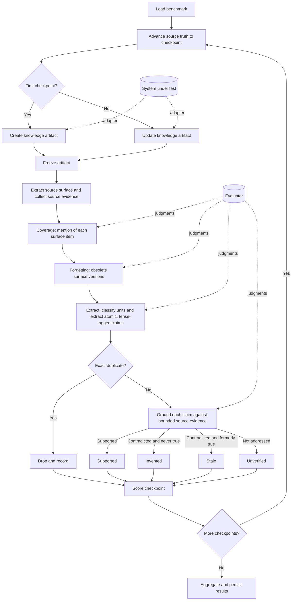
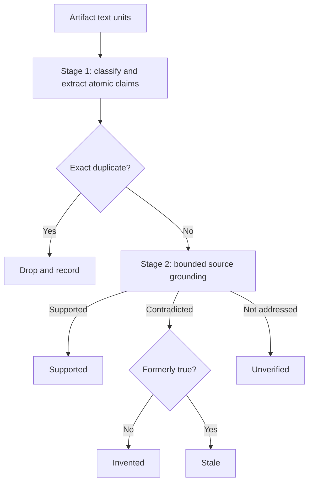

# LEDGER 🧪

**LEDGER (Longitudinal Evaluation of Drift, Grounding, Evolution, and
Retention) measures whether knowledge artifacts stay complete, accurate, and
current as their underlying truth changes.**

A knowledge artifact might be a repository wiki, a personal brain, an internal
knowledge base, generated documentation, or another maintained representation of
changing source material. LEDGER's evaluation model is source- and artifact-agnostic;
the executable V1 runner currently implements Git checkpoints, OpenWiki, and
Markdown artifacts.

Most evaluations inspect one artifact once. LEDGER supports both point-in-time and
longitudinal evaluation:

```text
Point in time
source @ T0 → artifact K0 → evaluate quality

Longitudinal
source @ T0 → create K0 → evaluate
source @ T1 → update K1 → evaluate change handling
source @ T2 → update K2 → evaluate change handling
```

LEDGER asks three core questions:

| Question                                               | Metric         | Plain-English meaning                                               |
| ------------------------------------------------------ | -------------- | ------------------------------------------------------------------- |
| 📚 Did the artifact represent what matters?            | **Coverage**   | The code's public surface is mentioned in the artifact.             |
| 🎯 Is what the artifact says supported?                | **Precision**  | Each claim is grounded directly against source evidence.            |
| 🧹 Did the artifact stop presenting what became false? | **Forgetting** | Obsolete surface knowledge is no longer presented as current.       |

Those checkpoint judgments also produce longitudinal maintenance metrics for
discovering new knowledge, correcting changed knowledge, forgetting stale
knowledge, and retaining unchanged knowledge.

## 🧭 Source is the ground truth

LEDGER has no hand-authored truth ledger. The source repository at each checkpoint
**is** the ground truth, and everything scoreable is derived from it automatically:

- The **coverage checklist** is the code's public surface, extracted deterministically
  at each commit.
- **Precision** grounds every artifact claim directly against source evidence, which
  can both establish a claim and refute it.
- The **forgetting watch set** and the longitudinal transitions are computed by
  diffing the surface between consecutive checkpoints.

This removes the subjective, expensive step of authoring a census of "what matters"
by hand, and it removes a whole class of measurement error: a claim can no longer be
called invented merely because a human census was silent about it.

## 🧱 What is a benchmark?

A benchmark is just a frozen source evolution and its checkpoint boundaries:

```text
Benchmark
├── ordered source-truth states or events
└── named checkpoint boundaries

Evaluation run
├── benchmark
├── system under test
├── source-evidence adapter
└── evaluator
```

There is no human-authored truth object in the manifest. At each checkpoint the
source-evidence adapter normalizes the frozen source into an evidence corpus, and
the surface extractor reads the same source to produce the coverage checklist. The
system under test, source adapter, and evaluator are run inputs, so the same
benchmark can compare different systems without changing anything about its truth.
The system under test never sees or modifies the surface or the source evidence.

Possible source evolutions include:

| Domain         | Source truth over time                   | Knowledge artifact                 |
| -------------- | ---------------------------------------- | ---------------------------------- |
| Code           | Repository snapshots or commits          | Repository wiki                    |
| Personal brain | Added, edited, or deleted notes/messages | Maintained personal knowledge base |
| Operations     | Configuration and runbook changes        | Operational documentation          |
| Organization   | Policies, people, and process changes    | Internal knowledge hub             |

Git commits are therefore one convenient way to define repeatable checkpoints,
not part of LEDGER's conceptual requirement.

### Current Git/OpenWiki implementation

The first LEDGER adapter uses Git commits as source-truth checkpoints and OpenWiki
as the system under test. The committed `calc` benchmark has three checkpoints:

| Checkpoint | Repository change             | Public surface at this checkpoint                                       |
| ---------- | ----------------------------- | ----------------------------------------------------------------------- |
| T0         | calc 1.0.0                    | `add` and `negate` exported; version is `"1.0.0"`.                      |
| T1         | Introduce `subtract`          | `add`, `negate`, and `subtract` exported; version remains `"1.0.0"`.    |
| T2         | Remove `negate`, bump version | `add` and `subtract` exported; `negate` absent; version is `"2.0.0"`.   |

The surface is derived, not declared. At T0 the extractor emits items like:

```text
The repository includes the source file `src/calc.ts`.
The module `src/calc.ts` exports a function `add(a: number, b: number): number`.
The module `src/calc.ts` exports a function `negate(x: number): number`.
The library's current released version is "1.0.0".
```

At T2, `negate` no longer appears in the surface and the version item changes to
`"2.0.0"`. The surface diff records `negate` as removed and the version as changed,
so the T1 forms (`negate` exported, version `"1.0.0"`) become obsolete knowledge the
artifact must stop presenting as current.

## 🗺️ End-to-end architecture



At each checkpoint, LEDGER measures point-in-time quality. Across checkpoint
transitions, it measures whether the artifact adapted correctly:

```text
                              POINT-IN-TIME
surface @ Tn ─────────────compare─────────────▶ artifact @ Tn
                         coverage (mention)

artifact assertions @ Tn ──▶ bounded source evidence @ Tn
                                 │
                                 ├── supported     → supported
                                 ├── contradicted  → stale or invented
                                 └── not-addressed → unverified

                              LONGITUDINAL
surface Tn ──diff──▶ surface Tn+1
                      ▲
                      │ compare evolution
                      ▼
artifact Kn ─updated─▶ artifact Kn+1
             discovery + correction + forgetting + retention
```

The artifact persists between checkpoints. In the current Git/OpenWiki adapter,
the source truth is a repository and the artifact is a wiki:

```text
repository @ T0 ──init──▶ wiki K0
                            │
repository @ T1 + wiki K0 ──update──▶ wiki K1
                                         │
repository @ T2 + wiki K1 ──update──▶ wiki K2
```

T2 therefore evaluates how well OpenWiki maintained the artifact it created at
T0 and updated at T1, not a fresh generation with no memory. LEDGER's contracts are
designed to support note edits, messages, policy revisions, database snapshots,
or timestamped events, but V1 would need additional replay and artifact adapters
to run those domains end to end.

### One checkpoint, step by step

| Step | Generic LEDGER operation                                     | Current Git/OpenWiki adapter                            |
| ---- | ------------------------------------------------------------ | ------------------------------------------------------- |
| 1    | Load checkpoint definitions.                                 | Load commits and `benchmark.json`.                      |
| 2    | Materialize the checkpoint's source truth.                   | Check out a commit in an isolated worktree.             |
| 3    | Ask the system under test to create or update its artifact.  | Run OpenWiki `init` or `update` using the system model. |
| 4    | Freeze and persist the artifact before evaluation.           | Capture every generated wiki document.                  |
| 5    | Extract the source surface and collect temporal evidence.    | Parse exports/files/version; capture tracked files.     |
| 6    | Evaluate coverage: is each surface item mentioned?           | BM25 retrieval plus evaluator-model judgment.           |
| 7    | Evaluate whether obsolete surface versions were forgotten.   | BM25 retrieval plus evaluator-model judgment.           |
| 8    | Classify text units and extract atomic, tense-tagged claims. | Evaluator-model extraction plus exact deduplication.    |
| 9    | Ground each current claim against bounded source evidence.   | One bounded BM25 top-eight judgment, then stop.         |
| 10   | Score the checkpoint and, finally, the complete trace.       | Deterministic calculation and persistence.              |

LEDGER does not require the system under test to use a model. The current OpenWiki
system does, and may perform many agent calls. The current evaluator also uses a
model for semantic judgments, split into stable, bounded batches.

The current implementation has two intentionally separate model roles:

| Role                   | Responsibility                                                                            |
| ---------------------- | ----------------------------------------------------------------------------------------- |
| 🤖 **System model**    | Operates OpenWiki and creates or updates the artifact being evaluated.                    |
| ⚖️ **Evaluator model** | Extracts assertions and judges coverage, precision, and forgetting from bounded evidence. |

The models do not generate the surface, checkpoint definitions, source-evidence
records, BM25 rankings, temporal transitions, metrics, or scores. Those are
deterministic code paths.

In the current adapter, Git replay, surface extraction, source-evidence capture,
Markdown sectioning, BM25 retrieval, exact deduplication, scoring, and persistence
are all deterministic.

## 🧬 The source surface

The surface is the deterministic, code-owned checklist of what a useful artifact
should mention at a checkpoint. For a TypeScript repository, the extractor parses
each source file with the TypeScript compiler API and emits three kinds of item:

| Kind      | One item per                          | Example statement                                                          |
| --------- | ------------------------------------- | -------------------------------------------------------------------------- |
| `symbol`  | Exported declaration                  | ``The module `src/calc.ts` exports a function `add(a: number, b: number): number`.`` |
| `file`    | Parseable source file                 | ``The repository includes the source file `src/calc.ts`.``                 |
| `version` | The library version                   | `The library's current released version is "1.0.0".`                       |

Each item carries a stable `factId` (for example `symbol:add`) and a
content-addressed `factVersionId` derived from a hash of its statement. Symbol
statements are built from the type signature, so a change that alters behavior
without changing the signature (for example `const v = 1` becoming `const v = 2`)
is stable, while a signature change (for example adding a parameter) is a genuine
`changed` transition. The version item is read from an exported `VERSION` constant
or, failing that, `package.json`.

Surface extraction is **TypeScript-only for V1**, behind a clean seam so other
languages can be added later without touching the evaluators or scoring. Both
committed benchmarks are TypeScript. The extractor and its diff live in
[`benchmark/surface.ts`](./benchmark/surface.ts).

Coverage is a **mention-only floor**. It asks whether the artifact names or refers
to each surface item anywhere, not whether it describes it completely or correctly.
This is objective, needs nothing hand-authored, and closes the empty-artifact
loophole: an artifact that says almost nothing cannot quietly score full precision,
because coverage anchors the other side of Quality.

## 📚 Coverage: did the artifact represent the surface?

Coverage starts from the surface items and searches the artifact.

```text
surface item
        │
        ▼
retrieve likely artifact sections
        │
        ▼
evaluator judges all supplied sections together
        │
        ├── correct   (a mention exists)
        └── missing   (no supplied section mentions it)
```

In the current Markdown evaluator, BM25 initially retrieves the eight most
relevant artifact sections for each surface item. The evaluator receives the item
and those candidate sections.

### Worked coverage example

Surface item at T1:

```text
The module `src/calc.ts` exports a function `subtract(a: number, b: number): number`.
```

Possible artifact evidence and verdicts:

| Artifact text                                | Verdict   | Why                                        |
| -------------------------------------------- | --------- | ------------------------------------------ |
| “`subtract(a, b)` returns `a - b`.”          | `correct` | It names the exported symbol.              |
| “The library also exports `subtract`.”       | `correct` | A mention is enough; behavior is optional. |
| No section names or refers to `subtract`.    | `missing` | The artifact does not mention the item.    |

A model may initially return `missing` because BM25 did not retrieve the right
section. LEDGER therefore treats `missing` as provisional and checks every remaining
section in bounded batches before finalizing it.

```text
top BM25 sections say missing
             │
             ▼
inspect every unexamined section
             │
             ├── find a mention → correct
             └── find none      → final missing
```

This keeps retrieval quality from silently becoming a coverage failure. The
`FactVerdict` enum still carries `partial`, `contradicted`, and `indeterminate`
values for schema and report compatibility, but a mention-only judgment resolves to
`correct` or `missing`.

## 🎯 Precision: is what the artifact says supported?

Precision runs in the opposite direction from coverage. Coverage starts from the
surface. Precision starts from every code-owned text unit in the artifact, extracts
atomic claims, and grounds each current claim directly against source evidence.



Source is the scoreable contract. Unlike a hand-authored census, source evidence
can both **establish** a claim and **refute** it. Mere silence is still not
contradiction: a claim the evidence neither confirms nor denies is `unverified`,
never invented.

### Stage 1: extract accountable atomic claims

Before truth judgment, the evaluator must return exactly one classification for
every supplied Markdown block:

| Text                                                   | Classification  | Extracted claim and tense            |
| ------------------------------------------------------ | --------------- | ------------------------------------ |
| “`add(a, b)` returns `a + b`.”                         | `factual`       | Complete behavior claim; `current`   |
| “Because there are no tests, validate manually.”       | `mixed`         | “There are no tests”; `current`      |
| “`negate` was removed in 2.0.0.”                       | `factual`       | Complete removal claim; `historical` |
| “See the API page.”                                    | `navigation`    | None                                 |
| “This wiki documents every export.”                    | `meta-artifact` | None                                 |
| “This library is elegant.”                             | `opinion`       | None                                 |
| “Run the functions manually.”                          | `instruction`   | None                                 |
| A heading or transition with no subject-matter meaning | `no-claim`      | None                                 |

This is model-based because the distinction is semantic, but it is accountable:
a unit cannot silently disappear, factual and mixed units must produce claims,
excluded units must produce none, and every decision is persisted with a
rationale. Claims are atomic, self-contained, detail-preserving, and tagged as
`current` or `historical`. Compounds are split when their parts could receive
different verdicts, pronouns are resolved without adding facts, and exact names,
values, defaults, conditions, and exceptions are preserved. Only normalized
exact duplicates are removed.

The extraction taxonomy is the only semantic filtering layer. Navigation, wiki
self-description, commit archaeology, editorial asides, hypothetical future
work, prescriptive advice, opinions, and text with no claim are handled here, not
by code-side regex families.

### Stage 2: ground each claim against bounded source evidence

For each deduplicated claim, BM25 selects the top eight current and historical
source-evidence records shared across the bounded batch. The judge receives that
context once and returns one of three verdicts:

- `supported` requires cited evidence that establishes the claim. A current claim
  needs current evidence; a historical claim needs evidence that it held at the
  earlier checkpoint it describes.
- `contradicted` requires cited evidence establishing an incompatible truth.
  `formerlyTrue` is true only when cited historical evidence shows the complete
  claim held at an earlier checkpoint.
- `not-addressed` means the supplied evidence neither establishes the claim nor
  establishes anything incompatible with it.

The three verdicts route to the four final classes:

| Grounding verdict                     | Final class                              |
| ------------------------------------- | ---------------------------------------- |
| `supported`                           | `supported`                              |
| `contradicted`, `formerlyTrue: false` | `invented`                               |
| `contradicted`, `formerlyTrue: true`  | `stale`                                  |
| `not-addressed`                       | `unverified`                             |

The judge may apply ordinary language and runtime semantics to supplied code, such
as arithmetic and direct control flow. Retrieval ends after the one bounded
judgment: a missed refutation is a tolerated sampling false negative, measured by
the defect harness rather than chased with a scan-everything fallback. When a
checkpoint's evidence corpus is empty, grounding is short-circuited to `unverified`
with no model call.

### Final classes and worked example

Every deduplicated claim ends in exactly one class:

| Class        | Meaning                                                                |
| ------------ | ---------------------------------------------------------------------- |
| `supported`  | The source evidence establishes the claim.                             |
| `invented`   | Source refutes the claim and it was never true, a hallucination.       |
| `stale`      | False now but established in a former world state, a failure to forget. |
| `unverified` | The source neither established nor refuted the claim.                  |

Suppose the source shows that `add(a, b)` returns `a + b`, and the artifact claims
that `add` returns `a + b`, that `add` validates both inputs, and that no CI
workflow exists. The first claim is `supported`. If retrieved source evidence
directly shows that `add` performs no validation, the second is `invented`. If the
bounded evidence neither establishes nor refutes the absence of CI, the third is
`unverified`, reported as a padding diagnostic, not treated as a hallucination.

If an isolated source-judgment repair also fails, the claim is conservatively
recorded as `unverified` with an audit warning. Evaluator failures never create an
`invented` or `stale` verdict.

## 🧹 Forgetting: did stale knowledge disappear?

Forgetting checks surface versions that were current at an earlier checkpoint and
are now obsolete because the surface diff recorded them as removed or changed.

```text
obsolete surface version
          │
          ▼
retrieve likely artifact sections
          │
          ▼
evaluator checks whether the old claim is still current
          │
          ├── lingering
          └── forgotten
```

The watch set is sticky. Forgetting is not treated as permanent: an obsolete
version stays under watch and is re-evaluated at every later checkpoint, and it
leaves the watch set only if the surface revives that exact form as current truth
again.

### Worked forgetting example

At T1:

```text
The module `src/calc.ts` exports a function `negate(x: number): number`.
```

At T2, `negate` is removed, so the T1 statement becomes an obsolete surface
version. LEDGER searches the T2 artifact for that old knowledge:

| T2 artifact text                         | Verdict     | Why                                                     |
| ---------------------------------------- | ----------- | ------------------------------------------------------- |
| “`negate(x)` returns `-x`.”              | `lingering` | The artifact still presents the removed API as current. |
| “`negate` was removed in version 2.0.0.” | `forgotten` | Historical removal is not a current claim.              |
| No mention of `negate` anywhere.         | `forgotten` | The stale fact is absent.                               |

Like coverage, an initial `forgotten` verdict is provisional. LEDGER checks every
remaining section before finalizing it because stale knowledge could be hiding
elsewhere in the artifact.

Forgetting does not require the artifact to erase history. Migration notes and
explicit statements that something was removed are allowed; the old behavior
must simply not be presented as current truth.

## 📊 Scoring

LEDGER combines **Quality** and **Maintenance**:

```text
LEDGER Score = (Quality + Maintenance) / 2
```

### Quality

Quality evaluates the artifact at every checkpoint.

```text
Checkpoint Coverage = mentioned surface items / surface items

Trace Coverage = mean of checkpoint Coverage scores

Adjudicated Claims = supported + invented + stale

Checkpoint Precision = supported / adjudicated
Checkpoint Hallucination Rate = invented / adjudicated
Checkpoint Staleness Rate = stale / adjudicated
Checkpoint Unverified Rate = unverified / all deduplicated claims

Trace metrics = mean of their defined checkpoint values

Quality = harmonic mean(Trace Coverage, Trace Precision)
```

The checkpoint macro-average gives each checkpoint equal weight even when they
contain different numbers of surface items or assertions. The harmonic mean makes
a system earn both coverage and precision. `Unverified` claims never enter a
score denominator and are never a penalty. They remain visible as the padding
guardrail, while coverage prevents a system from earning quality by saying nothing.

If a checkpoint has no adjudicated claims, its precision, hallucination rate,
and staleness rate are `null`; the run succeeds with a report warning. Null
checkpoints are excluded from each trace mean. If trace precision is entirely
null, Quality and the final LEDGER Score are null. Unverified Rate is zero when no
claims were extracted.

### Maintenance

Maintenance evaluates transitions between checkpoints:

| Metric                              | Question                                              |
| ----------------------------------- | ----------------------------------------------------- |
| 🌱 **New-Knowledge Discovery**      | Did newly introduced surface facts appear correctly?  |
| 🔄 **Changed-Knowledge Correction** | Did the new form appear and the old form disappear?   |
| 🧹 **Complete Forgetting**          | Did removed surface facts stop appearing as current?  |
| 🛡️ **Stable Retention**             | Did correct, unchanged surface facts remain correct?  |

The eligible rates are averaged into the Maintenance score.

### Diagnostics

LEDGER also reports signals that do not affect the headline score:

- **Recovery Rate** - whether a missed introduction, change, or removal is fixed
  at a later checkpoint.
- **Stale-Knowledge Lifetime** - how many checkpoints obsolete knowledge lingers
  before it is first forgotten.
- **Efficiency** - system runtime and documentation churn. Token and cost capture
  can be added when usage telemetry is available.

Precision also reports its composition:

- **Supported** - source-established claims;
- **Invented** - false claims that were never true;
- **Stale** - false current claims that were true at an earlier checkpoint; and
- **Unverified** - claims the source neither established nor refuted.

The report prints assertion-side Staleness Rate beside fact-side forgetting at
each checkpoint. They measure the same failure from opposite directions and
should broadly correlate; divergence is a debugging signal, not another score.

Evaluator Completeness is reported separately from system quality:

```text
Evaluator Completeness = valid semantic judgments / attempted judgments
```

Coverage and forgetting items that remain invalid after isolated repair become
`indeterminate`. Precision repair failures become `unverified` with an audit
warning so every extracted claim still has exactly one of the four final classes.
Evaluator failure never becomes a hallucination. Reduced Evaluator Completeness
makes the resulting LEDGER score explicitly provisional rather than quietly treating
evaluator failure as system failure.

### Why unverified is not a penalty

Unlike FActScore-style factuality metrics, LEDGER reports unverifiable claims rather
than penalizing them, following audit practice: a scope limitation is not a
misstatement. Coverage prevents a system from scoring well by saying almost
nothing, and the unverified rate keeps unverifiable padding visible without
incorrectly treating it as a factual error.

## 🔬 Evaluator mechanics and reliability

The current evaluator splits generated Markdown into stable, bounded sections and
then into fence-aware text units. Coverage and forgetting reuse one BM25 index
over artifact sections. Precision classifies every text unit, exact-deduplicates
the extracted claims, then uses a separate BM25 index for one top-eight grounding
judgment on each claim. The source-evidence interface is generic, but the V1
runner still directly owns Git replay, OpenWiki execution, and Markdown capture;
other domains require those additional adapters.

Semantic judgments use direct schema-validated model calls with:

- stable bounded batches;
- exactly one extraction classification per supplied text unit;
- a five-minute timeout per attempt;
- at most two attempts;
- provider retries disabled inside each attempt;
- sequential passes and observable failure boundaries; and
- no evaluator-forced sampling parameter.

The reviewed boundary examples used by deterministic evaluator tests live in
[`evaluator/fixtures/precision-gold.json`](./evaluator/fixtures/precision-gold.json).
They intentionally cover navigation, opinion, instruction, mixed content,
meta-artifact text, tense, direct code inference, explicit contradiction, and
formerly-true boundaries.

Evidence citations must name records that were actually supplied in the bounded
request. An initial provider failure, schema-wide failure, or unusable assertion
inventory still fails the pass because there is no trustworthy batch to preserve.
When a schema-valid judgment batch contains one malformed item, LEDGER preserves
valid neighboring judgments and retries only that item with isolated evidence.
If both isolated attempts fail, an audit warning is persisted. Coverage and
forgetting items become `indeterminate`; precision items become `unverified`.

## 💾 Audit artifacts

Every run writes to a timestamped directory under `evals/ledger/.results/`:

```text
calc-<timestamp>/
├── artifacts/
│   ├── T0/                 # exact frozen artifact at T0
│   ├── T0.json             # fingerprint and document inventory
│   ├── T1/
│   ├── T1.json
│   ├── T2/
│   └── T2.json
├── assertions/
│   ├── T0.json             # classified units plus all excluded/retained claims
│   ├── T1.json
│   └── T2.json
├── evidence/
│   ├── T0.json             # normalized source evidence used by precision
│   ├── T1.json
│   └── T2.json
├── result.json             # verdicts, warnings, scores, and diagnostics
├── report.md               # completed runs: detailed human-readable report
├── unverified-claims.md    # completed runs: worklist of unverified claims
└── error.json              # failed runs: bounded failure details
```

Artifacts and source evidence are persisted before evaluation, and assertion
inventories are persisted before precision judgment. They therefore survive
later evaluator failures and can be inspected without reading provider traces.

The assertion inventory is the main precision-tuning artifact. For every text
unit it records the classification, extracted claims, and rationale; for every
claim it records deterministic exclusions, deduplication, stable assertion IDs,
and final verdict provenance.

## ▶️ Running the Git/OpenWiki adapter

Configure the provider and model IDs. Store provider credentials in the expected
environment variable; never commit them to the repository.

```sh
export OPENWIKI_PROVIDER=anthropic
export OPENWIKI_MODEL_ID=claude-sonnet-5
export LEDGER_EVALUATOR_MODEL_ID=claude-sonnet-5

# Set ANTHROPIC_API_KEY in your shell or secret manager.
```

Run the calc benchmark:

```sh
pnpm exec tsx evals/ledger/run.ts \
  --benchmark evals/ledger/benchmarks/calc
```

The terminal emphasizes the core quality signals and how much of the surface and
claim inventory was evaluated:

```text
┌ 🧪 LEDGER · calc
│ 3 checkpoints · anthropic · system claude-sonnet-5 · evaluator claude-sonnet-5
│
├ 📍 1/3 · T0 · 973be7a · calc 1.0.0 with add and negate
│ 📚 Captured 4 documents
│ 🔍 Evaluating 5 surface items · 0 obsolete versions
│ ✅ T0 · coverage 100% · precision 100% · hallucination 0% · forgetting -
│
├ 📍 2/3 · T1 · 0ee8f29 · introduce subtract
│ 🔍 Evaluating 6 surface items · 0 obsolete versions
│ ✅ T1 · coverage 100% · precision 100% · hallucination 0% · forgetting -
│
├ 📍 3/3 · T2 · 811b273 · remove negate, bump to 2.0.0
│ 🔍 Evaluating 5 surface items · 2 obsolete versions
│ ✅ T2 · coverage 100% · precision 100% · hallucination 0% · forgetting 100% (2/2)
│
├ 📊 LEDGER 100.0% · quality 100.0% · maintenance 100.0%
│  ├ coverage 100.0%
│  ├ precision 100.0%
│  ├ hallucination 0.0%
│  └ forgetting 100.0%
│
├ 🔬 Unverified claims
│  └ 57 claims the source evidence neither confirmed nor refuted → …/unverified-claims.md
│     review them for hidden hallucinations or missing evidence
│
└ 🎉 LEDGER 100.0%

📁 Results · evals/ledger/.results/calc-<timestamp>
```

Precision is 100% here while 57 claims are unverified: precision scores only the
adjudicated claims (supported, invented, stale), and unverified claims stay out of
that denominator. Detailed maintenance dimensions, unverified rates, claim text,
provenance, and citations remain in the report and result directory. Evaluator
completeness appears in the terminal only when it falls below 100%.

### Re-evaluate a saved run

Evaluator tuning does not require regenerating the knowledge artifact. A
completed run already contains the exact artifact snapshots for every checkpoint.
Because source is now the ground truth, re-evaluation re-reads the repository at
each commit, so the benchmark's source must be available:

```sh
pnpm run eval:ledger:reevaluate \
  --benchmark evals/ledger/benchmarks/calc \
  --run evals/ledger/.results/calc-<timestamp> \
  --evaluator-model claude-sonnet-5
```

This does **not** invoke OpenWiki. It re-extracts the surface and obsolete
versions, reruns every semantic evaluator pass, recomputes all point-in-time and
longitudinal scores, and writes a new standalone audit directory. The new result
preserves the original system runtime and model metadata only as observations; no
prior semantic verdict is reused.

## ⚖️ Comparing systems

A valid comparison holds every evaluation input constant:

```text
same source evolution and checkpoints
same source-evidence adapter
same evaluator model
same repetition count
             │
             ▼
change only the system under test
```

For example:

```text
OpenWiki baseline
        vs.
OpenWiki + grounded claims
```

This isolates whether the system change improved knowledge maintenance rather
than merely generating a different artifact.

## 🧪 Meta-evaluation

The optional provider-backed tier treats the evaluator as a calibrated
instrument rather than patching individual misses in production code:

- the gold-agreement gate measures **extraction/classification** and **source
  grounding** against human-reviewed cases, requiring at least 0.90 agreement for
  each stage; and
- the defect harness evaluates captured clean artifacts plus five mutations:
  invented fact, stale fact, coverage gap, spurious deletion, and unverified
  padding. Every defect must be killed in its expected class, with zero invented
  claims on the clean baseline.

A miss is added to the gold set and addressed only through a globally applicable
prompt improvement, rechecked against the whole set. The harnesses and process
rules are documented in [`meta/README.md`](./meta/README.md).

## ✅ Tests

Run the deterministic LEDGER suite and typecheck:

```sh
pnpm exec vitest run evals/ledger
pnpm run eval:ledger:typecheck
```

Include live provider-backed tests:

```sh
LEDGER_LIVE=1 pnpm exec vitest run evals/ledger
```

Live tests require provider credentials; deterministic tests do not.
