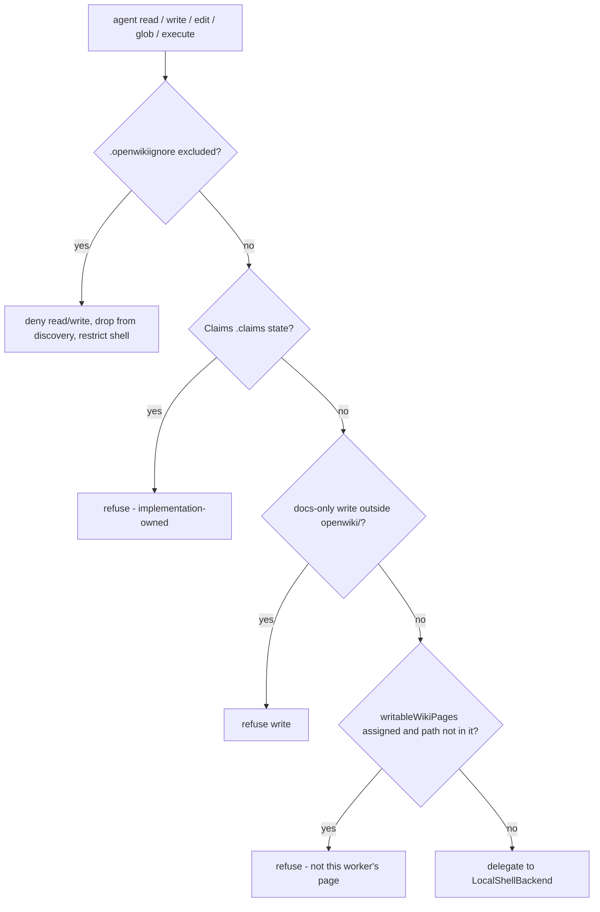

# Docs-Only Backend & Access Boundary

Every file and shell operation the agent performs goes through
`OpenWikiLocalShellBackend` (`src/agent/docs-only-backend.ts`), which wraps
deepagents' `LocalShellBackend`. Because the agent may be **prompt-injected via
untrusted repository content**, this backend is a security boundary, not a
convenience layer: all path checks canonicalize before matching.

## Where the backend is used

The same backend class is constructed in two places with different write
scoping:

- **Shared agent core** (`createOpenWikiAgentGraph` in `src/agent/index.ts`)
  builds one `OpenWikiLocalShellBackend` for the long-lived init/update/chat
  graph, with `docsOnly = command !== "chat"`, no `writableWikiPages`, and the
  run's `outputMode`. This graph owns the single user conversation and runs to
  completion.
- **Repository workers** (`runPlanningAgent` and `runPageAgent` in
  `src/repository-runner.ts`) each construct a **fresh** backend for one
  bounded worker, with `docsOnly: true`, `outputMode: "repository"`, and an
  explicit `writableWikiPages` array: `[]` for the planner (read-only) and
  `[job.path]` for each page worker. The worker backend is discarded when that
  worker finishes.

Both then wrap the backend in the composite backend from
`createAgentBackend` (`src/agent/agent-backend.ts`), which mounts the read-only
virtual filesystems and applies `AGENT_FILESYSTEM_PERMISSIONS`.

## Three independent boundaries

Order in which the backend evaluates the access boundaries for a mutating
operation. The `.openwikiignore` and Claims checks gate every operation; the
docs-only and `writableWikiPages` checks gate writes, edits, deletes, and
uploads.

### 1. `.openwikiignore` exclusion

Paths excluded by `.openwikiignore` are **hard-denied** on read/write/edit,
**silently dropped** from `ls`/`glob`/`grep` discovery, and **rejected** for
upload/download. While any rule is active, shell `execute` is restricted to a
small anchored allowlist — currently `pwd` and
`git rev-parse [--no-pager] HEAD`. The allowlist is deliberate: an arbitrary
shell command (variable expansion, command substitution, `find -exec`, `git
show HEAD:<path>`) cannot be statically proven not to read an ignored path, so
discovery and reads must go through the gated file tools instead. Each allowlist
entry is fully anchored (`^...$`) so it cannot be prefixed or chained with a
second command.

`OpenWikiIgnore` (`src/agent/openwiki-ignore.ts`) compiles gitignore-style
patterns with **last-match-wins** ordering: every rule is applied in file order
and a match sets the decision to `!rule.negated`, so a later `!` rule can
re-include a path an earlier rule excluded. Matching is **case-insensitive**
everywhere, which is security-relevant: on case-insensitive filesystems an
alternate-cased spelling like `Secrets/token.txt` must not slip past a
`secrets/` exclusion.

Before matching, `normalizeIgnorePath` canonicalizes the candidate path — this
is a **security boundary, not cosmetic cleanup**. It anchors the path to `/`,
collapses `.`/`..` and `./` spellings with `path.posix.normalize`, and strips the
anchors back off. Without it, equivalent spellings such as `./secrets/token.txt`
or `secrets/../secrets/token.txt` would fail to match an anchored `/secrets` rule
and leak an excluded file. Anchoring first also means a leading `..` cannot escape
above the repository root (`../foo` collapses to `foo`).

### 2. Docs-only write confinement

In `docs-only` repository runs (every command except `chat`), writes and edits
are refused unless the path is under `openwiki/`. `local-wiki` mode relaxes this
check entirely, since the local wiki _is_ the whole write target. The
`openwiki/` prefix test is itself canonicalized via `path.posix.normalize`, so a
path such as `/openwiki/../AGENTS.md` cannot escape the confinement.

### 3. Claims ownership

Repository `.claims` sidecar state is implementation-owned. It is hidden from
generic file tools and refused to shell `execute`, which is redirected to the
`inspect_claims` and `resolve_claims` tools instead. This is defense in depth
for state already excluded from discovery. The ownership check is gated on
`outputMode === "repository"`; a `local-wiki` brain may legitimately keep its
own `.claims` directory, so those paths are not reserved there.

## Per-worker write scoping (`writableWikiPages`)

The `writableWikiPages` option restricts each repository worker to mutating only
its assigned page path. It is consulted only in `docs-only` repository mode and
only _after_ the `openwiki/` docs-only check passes:

- `undefined` (the shared agent core) preserves the existing writer behavior —
  any path under `openwiki/` may be written.
- `[]` (the planner worker) makes the backend **read-only** across every
  mutation path (`write`, `edit`, `delete`, `uploadFiles`).
- `[job.path]` (a page worker) confines writes, edits, and deletes to that one
  canonical page. Both the assigned path and the incoming request are
  canonicalized with `normalizeVirtualPath` before comparison, so equivalent
  spellings (`/openwiki//page.md`, `openwiki\page.md`,
  `/openwiki/page.md/../other.md`) are matched against the single assigned page;
  lookalikes such as `/openwiki/page.md.backup` or `/openwiki/../AGENTS.md` are
  refused.

This scoping is what lets each repository page worker run as an independent
bounded agent that cannot clobber another worker's page.

## Mutation tracking

A successful write, edit, or delete records the mutated path in `ToolMessage`
metadata under the `openwikiMutationPath` key (`MUTATION_PATH_METADATA_KEY`).
Downstream middleware — notably the front-matter validator
(`addFrontmatterWarning` in `src/agent/okf-middleware.ts`) — reads this key to
locate and validate exactly the file that changed, without re-scanning the tree.
A refused operation records no metadata, so the validator leaves it alone.

## Glob hardening

The backend rejects unbounded repository-root globs (`**`, `**/*`, `**/**` at
root) and globs targeting `.git` metadata, and recovers from the upstream
`ENOTDIR` failure raised when a worktree's file-backed `.git` pointer is scanned
as a directory. Separately, the composite backend (`OpenWikiCompositeBackend`)
converts the upstream `Maximum call stack size exceeded` `RangeError` into an
actionable message telling the agent to retry with a narrower path or pattern.

## Virtual mounts and permissions

`createAgentBackend` (`src/agent/agent-backend.ts`) composes two **read-only**
virtual filesystems over the wiki backend:

- **`/skills/`** — bundled and user skills under `~/.openwiki/skills`.
- **`/conversation_history/`** — the deepagents summarization middleware's
  history offload, routed under `~/.openwiki/conversation_history`.

Routing the history offload into `~/.openwiki` keeps it out of the documented
repository _and_ out of the docs-only guard's refusal path; without that, the
docs-only guard would refuse the offload write and silently degrade
summarization (narrowing coverage on large repositories). The mount prefix is
kept in sync with deepagents' summarization-middleware default by hand, and a
regression test pins it so a dependency bump that moves the default fails loudly
instead of silently reintroducing misrouted offloads.

Agent-layer filesystem permissions
(`AGENT_FILESYSTEM_PERMISSIONS`) **deny tool writes** to `/skills/**` and
`/conversation_history/**`. Skills are installed by the CLI, never the agent,
and only the summarization middleware may write history — and it writes directly
through the backend, which agent-layer permissions do not affect. Denying tool
writes therefore closes the door on prompt-injected content being persisted into
future sessions' context without touching the legitimate offload.

## Related pages

- [Agent Core & Run Lifecycle](overview.md) — where the shared-core backend is constructed.
- [Middleware Pipeline](middleware.md) — the consumer of mutation metadata.
- [Configuration](../architecture/configuration.md) — `.openwikiignore` and the OpenWiki home.
