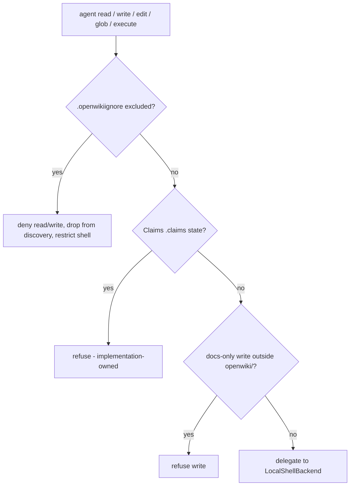

# Docs-Only Backend & Access Boundary

Every file and shell operation the agent performs goes through
`OpenWikiLocalShellBackend` (`src/agent/docs-only-backend.ts`), which wraps
deepagents' `LocalShellBackend`. Because the agent may be **prompt-injected via
untrusted repository content**, this backend is a security boundary, not a
convenience layer: all path checks canonicalize before matching.

## Three independent boundaries

Order in which the backend evaluates the three access boundaries.

### 1. `.openwikiignore` exclusion

Paths excluded by `.openwikiignore` are **hard-denied** on read/write/edit,
**silently dropped** from `ls`/`glob`/`grep` discovery, and **rejected** for
upload/download. While any rule is active, shell `execute` is restricted to a
small anchored allowlist — currently `pwd`, `git rev-parse HEAD`, and removing
`openwiki/_plan.md`. The allowlist is deliberate: an arbitrary shell command
(variable expansion, command substitution, `find -exec`, `git show HEAD:<path>`)
cannot be statically proven not to read an ignored path, so discovery and reads
must go through the gated file tools instead.

`OpenWikiIgnore` (`src/agent/openwiki-ignore.ts`) compiles gitignore-style
patterns with **last-match-wins** ordering: every rule is applied in file order
and a match sets the decision to `!rule.negated`, so a later `!` rule can
re-include a path an earlier rule excluded. Matching is **case-insensitive**
everywhere, which is security-relevant: on case-insensitive filesystems an
alternate-cased spelling like `Secrets/token.txt` must not slip past a
`secrets/` exclusion.

Before matching, `normalizeIgnorePath` canonicalizes the candidate path — this
is a **security boundary, not cosmetic cleanup**. It anchors the path to `/`,
collapses `.`/`..` and `./` spellings with `path.posix.normalize`, and strips the
anchors back off. Without it, equivalent spellings such as `./secrets/token.txt`
or `secrets/../secrets/token.txt` would fail to match an anchored `/secrets` rule
and leak an excluded file. Anchoring first also means a leading `..` cannot escape
above the repository root (`../foo` collapses to `foo`).

### 2. Docs-only write confinement

In `docs-only` repository runs (every command except `chat`), writes and edits
are refused unless the path is under `openwiki/`. `local-wiki` mode relaxes this
check entirely, since the local wiki _is_ the whole write target.

### 3. Claims ownership

Repository `.claims` sidecar state is implementation-owned. It is hidden from
generic file tools and refused to shell `execute`, which is redirected to the
`inspect_claims` and `resolve_claims` tools instead. This is defense in depth
for state already excluded from discovery.

## Mutation tracking

A successful write or edit records the mutated path in `ToolMessage` metadata
under the `openwikiMutationPath` key. Downstream middleware — notably the
front-matter validator — reads this key to locate and validate exactly the file
that changed, without re-scanning the tree.

## Glob hardening

The backend rejects unbounded repository-root globs (`**`, `**/*`, `**/**` at
root) and globs targeting `.git` metadata, and recovers from the upstream
`ENOTDIR` failure raised when a worktree's file-backed `.git` pointer is scanned
as a directory. Separately, the composite backend converts the upstream
`Maximum call stack size exceeded` `RangeError` into an actionable message
telling the agent to retry with a narrower path or pattern.

## Virtual mounts and permissions

The graph composes two **read-only** virtual filesystems over the wiki backend
(`createAgentBackend`):

- **`/skills/`** — bundled and user skills under `~/.openwiki/skills`.
- **`/conversation_history/`** — the deepagents summarization middleware's
  history offload, routed under `~/.openwiki/conversation_history`.

Routing the history offload into `~/.openwiki` keeps it out of the documented
repository _and_ out of the docs-only guard's refusal path; without that, the
docs-only guard would refuse the offload write and silently degrade
summarization (narrowing coverage on large repositories).

Agent-layer filesystem permissions **deny tool writes** to `/skills/**` and
`/conversation_history/**`. Skills are installed by the CLI, never the agent, and
only the summarization middleware may write history — and it writes directly
through the backend, which agent-layer permissions do not affect. Denying tool
writes therefore closes the door on prompt-injected content being persisted into
future sessions' context without touching the legitimate offload.

## Related pages

- [Agent Core & Run Lifecycle](overview.md) — where the backend is constructed.
- [Middleware Pipeline](middleware.md) — the consumer of mutation metadata.
- [Configuration](../architecture/configuration.md) — `.openwikiignore` and the OpenWiki home.
