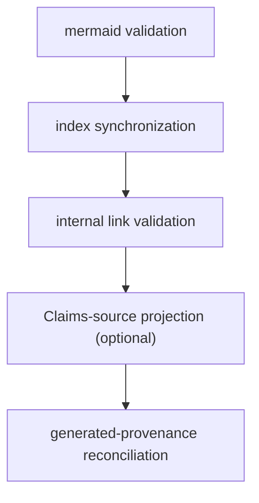

# Middleware Pipeline

For `init` and `update` runs the agent graph mounts an ordered middleware chain
around the agent loop; `chat` runs with **no middleware** at all. The order is:

1. **Translation** (update runs only)
2. **Claims** (repository init/update — see the Claims domain)
3. **OKF index middleware** (deterministic conformance)

Each piece runs its owned work through the run's telemetry wrapper (`inStage`),
tagging failures `okf_error` with a stable per-operation detail so a
conformance-code bug is attributed to OpenWiki rather than misclassified as an
agent error.

## OKF index middleware

`createOpenWikiIndexMiddleware` (`src/agent/okf-middleware.ts`) keeps the wiki
OKF-conformant across a run using three hooks:

- **`beforeAgent`** — `prepareWikiForAuthoring` migrates existing pages to valid
  front matter and snapshots their exact bodies (for later provenance
  reconciliation).
- **`wrapToolCall`** — decorates a _successful_ `write_file`/`edit_file` result
  with a front-matter warning when the mutated wiki page has invalid YAML. It
  deliberately does **not** catch tool throws: LangChain feeds thrown tool
  errors back to the model as a `ToolMessage` for recovery, so turning this into
  a rethrowing catch would make every recoverable tool error fatal.
- **`afterAgent`** — `finalizeWikiArtifacts` runs the deterministic
  post-authoring lifecycle.

The warning path uses the `openwikiMutationPath` metadata the
[backend](backend.md) records, so it validates exactly the file that changed.

### Deterministic finalization order

Fixed order of `finalizeWikiArtifacts` after authoring.

The whole run shares **one ISO 8601 stamp time**, threaded in by the caller, so
every page generated in a run receives the same `generated.at` and stamping is
deterministic under test.

### Link validation

The internal-link validator (`src/agent/wiki-link-validator.ts`) scans generated
Markdown for broken **relative internal links** — both missing target files and
missing heading anchors. Link targets are resolved and checked for existence
against the whole backend tree (the repository, not just the wiki subtree), so a
valid link to a repository source or design file outside `openwiki/` is **not**
flagged. External hrefs (schemes, protocol-relative) are skipped. Heading anchors
are validated **only** against Markdown (`.md`) targets: directory anchors and
GitHub line anchors on source files (for example `#L10`) are deliberately out of
scope and never reported as broken. It excludes the reserved control files
`index.md`, `log.md`, `_plan.md`, and `INSTRUCTIONS.md`, and it clears and
re-applies its broken-link stamp comments each pass (inserted bottom-up by
descending line number, files rewritten only when content changed) so stamps
never accumulate across runs.

## Translation middleware

OpenWiki treats the wiki's language as **persisted state**. An incremental
`update` alone would leave a mix of the old and new language when the language
changes, because the agent only rewrites pages whose source changed. The
translation middleware's `beforeAgent` hook closes that gap. It is mounted on
**every** `update` (and never on `init`/`chat`).

`resolveTranslationPlan` returns `undefined` for any command other than
`update`. Otherwise it targets the requested language, else the persisted one,
else English, and sets `translateAll` only when a requested language's **primary
subtag** differs from the persisted one — so a region-only change like `en` to
`en-GB` does not force a full retranslation.

The pass does one of three things, cheapest first:

- **nothing to do** → only walks the tree (zero model calls);
- **plain update** → retranslates only pages marked
  `openwiki_translation_pending`;
- **real language switch** → retranslates every page.

A single page's translation failure never aborts the run: the page is left in
its previous language, stamped with a pending marker for the next update to
retry, and reported through a secret-redacted warning sink. Translation model
calls are tagged `langsmith:nostream` so their raw translated Markdown stays out
of the `messages` token stream; a single status line is shown once instead, and
only when at least one page is actually translated.

## Related pages

- [Agent Core & Run Lifecycle](overview.md) — where middleware is mounted.
- [Docs-Only Backend](backend.md) — the source of mutation metadata.
- [OKF Overview](../okf/overview.md) — the conformance rules enforced here.
