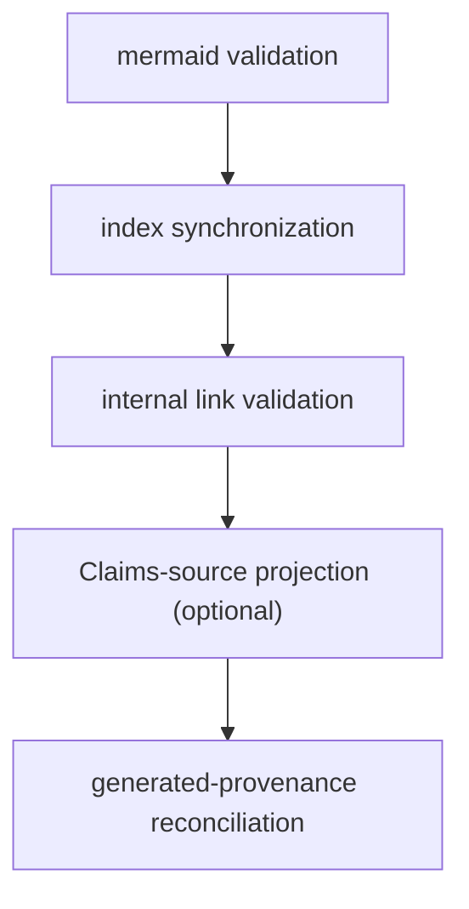

# Middleware Pipeline

The middleware pipeline is the ordered LangChain middleware that the shared agent
core (`createOpenWikiAgentGraph` in `src/agent/index.ts`) mounts around the
DeepAgent loop for **chat and local-wiki** `init`/`update` runs. `chat` runs with
**no middleware at all**; `init` and `update` mount the OKF index middleware, and
`update` additionally mounts the translation middleware.

> **Repository generation bypasses this pipeline entirely.** `init`/`update` in
> `repository` output mode never reach `createOpenWikiAgentGraph` —
> `runOpenWikiAgent` routes them to `runNativeRepositoryGeneration`
> (`src/generation/`), which drives the durable page-job lifecycle. Repository
> runs call `prepareWikiForAuthoring` during `beginRepositoryRun` and
> `finalizeWikiArtifacts` directly from `finishRepositoryRun`, with no
> translation middleware and no shared agent graph.

## Where middleware is mounted

`createOpenWikiAgentGraph` builds the DeepAgent and supplies its `middleware`
array. The set is selected by command:

- **`chat`** — `middleware: []` (no middleware, no translation, no finalization).
- **`init` / `update`** — `[translation?, okf]`:
  1. **Translation middleware** — mounted only on `update`, and only when
     `resolveTranslationPlan` returns a plan. `init` and `chat` never translate.
  2. **OKF index middleware** — always mounted for `init`/`update`.

There is **no separate "Claims middleware."** Claims-source projection is an
optional step *inside* `finalizeWikiArtifacts` (the OKF middleware's `afterAgent`
hook), fed by a deferred `claimSources` callback supplied by a repository Claims
runtime. In the local-wiki/shared-core path the callback is omitted, so the
`claims_sources` step is skipped.

## OKF index middleware

`createOpenWikiIndexMiddleware` (`src/agent/okf-middleware.ts`) keeps the wiki
OKF-conformant across a run using three LangChain hooks:

- **`beforeAgent`** — `prepareWikiForAuthoring` migrates existing pages to valid
  front matter and snapshots their exact bodies (the pre-authoring provenance
  baseline used by later reconciliation).
- **`wrapToolCall`** — decorates a _successful_ `write_file`/`edit_file` result
  with a front-matter warning when the mutated wiki page has invalid YAML. It
  deliberately does **not** catch tool throws: LangChain's tool node swallows a
  thrown tool error into a `ToolMessage` fed back to the model for recovery, so
  rethrowing here would make every recoverable tool error fatal.
- **`afterAgent`** — `finalizeWikiArtifacts` runs the deterministic
  post-authoring lifecycle (below).

The warning path uses the `openwikiMutationPath` metadata the
[backend](backend.md) records, so it validates exactly the file that changed. It
restricts warnings to Markdown files inside the wiki subtree, skipping the
reserved control files `index.md` and `log.md`.

## Deterministic finalization order

Both the OKF middleware's `afterAgent` hook and the repository
`finishRepositoryRun` path converge on `finalizeWikiArtifacts`
(`src/agent/wiki-finalizer.ts`), which runs the post-authoring lifecycle in a
fixed order:

1. **`mermaid`** — `validateWikiMermaid` rewrites unparseable Mermaid fences into
   a `text` fence with an `openwiki: mermaid parse failed` marker.
2. **`index_sync`** — `synchronizeWikiIndexes` regenerates every directory
   `index.md` deterministically.
3. **`link_validation`** — `validateWikiInternalLinks` stamps broken relative
   internal links in place (below).
4. **`claims_sources`** *(optional)* — `synchronizeClaimSources` projects
   page-owned Claims evidence into OKF `sources` blocks, only when a
   `claimSources` callback was supplied (the repository path; skipped for
   local-wiki).
5. **`generated_provenance`** — `finalizeGeneratedProvenance` reconciles every
   page against the pre-authoring snapshot, stamping code-owned `generated`
   provenance on new or changed pages.

`prepareWikiForAuthoring` is the matching pre-step: it runs `migrate` (front
matter normalization) then `provenance_snapshot`, and its returned
`PreparedWikiState` is threaded into finalization. The repository lifecycle
serializes that state into `.run.json` (`serializePreparedWikiState`) and
recreates it after a process restart (`deserializePreparedWikiState`) so a
resumed repository run can finalize deterministically.

## Shared stamp time

The whole run shares **one ISO 8601 stamp time**, threaded in by the caller, so
every page generated in a run receives the same `generated.at` and stamping is
deterministic under test.

- **Local-wiki / shared core** — `runTimestamp` is computed once in
  `runOpenWikiAgent` (`new Date().toISOString()`) and passed through
  `createOpenWikiAgentGraph` into the OKF middleware's `now`.
- **Repository generation** — `finishRepositoryRun` passes `run.state.startedAt`
  (captured at `beginRepositoryRun`) as `at`, and a separate producer actor
  (`run.state.actor.producerActor`) identifies who authored the body changes.

## Link validation

The internal-link validator (`src/agent/wiki-link-validator.ts`) scans generated
Markdown for broken **relative internal links** — both missing target files and
missing heading anchors. Link targets are resolved and checked for existence
against the whole backend tree (the repository, not just the wiki subtree), so a
valid link to a repository source or design file outside `openwiki/` is **not**
flagged. External hrefs (schemes, protocol-relative `//`) are skipped. Heading
anchors are validated **only** against Markdown (`.md`) targets: directory
anchors and GitHub line anchors on source files (for example `#L10`) are
deliberately out of scope and never reported as broken.

It excludes the reserved control files `index.md`, `log.md`, and
`INSTRUCTIONS.md` from scanning, and it clears and re-applies its broken-link
stamp comments each pass (existing stamps stripped first, new stamps inserted
bottom-up by descending line number, files rewritten only when content changed)
so stamps never accumulate across runs.

## Translation middleware

OpenWiki treats the wiki's language as **persisted state**. An incremental
`update` alone would leave a mix of the old and new language when the language
changes, because the agent only rewrites pages whose source changed. The
translation middleware's `beforeAgent` hook closes that gap. It is mounted on
**every** `update` (and never on `init`/`chat`), and only in the local-wiki
shared-core path — repository runs handle language switches through
`requiredRewritePages` page jobs, not through this middleware.

`resolveTranslationPlan` returns `undefined` for any command other than
`update`. Otherwise it targets the requested language, else the persisted one,
else English, and sets `translateAll` only when a requested language's **primary
subtag** differs from the persisted one — so a region-only change like `en` to
`en-GB` does not force a full retranslation. Malformed tags that `Intl.Locale`
cannot parse fall back to comparing the raw tag, so plan resolution never
crashes.

The pass does one of three things, cheapest first:

- **nothing to do** → only walks the tree (zero model calls);
- **plain update** → retranslates only pages marked
  `openwiki_translation_pending`;
- **real language switch** → retranslates every page.

A single page's translation failure never aborts the run: the page is left in
its previous language, stamped with a pending marker for the next update to
retry, and reported through a secret-redacted warning sink. A successful
translation always drops the pending marker deterministically, whatever the
model returned, so a freshly converted page is never left flagged. Translation
model calls are tagged `langsmith:nostream` so their raw translated Markdown
stays out of the `messages` token stream; a single status line is shown once
instead, and only when at least one page is actually translated.

## Telemetry attribution

OKF and finalization operations run through the caller's telemetry wrapper
(`inStage`), tagged `okf_error` with a stable per-operation detail (`migrate`,
`provenance_snapshot`, `mermaid`, `index_sync`, `link_validation`,
`claims_sources`, `generated_provenance`) so a conformance-code failure is
attributed to OpenWiki rather than misclassified as an agent error. The OKF
middleware's `beforeAgent` runs under the `"build"` stage; `afterAgent` runs
under `"finalize"`.

## Related pages

- [Agent Core & Run Lifecycle](overview.md) — where middleware is mounted.
- [Docs-Only Backend](backend.md) — the source of mutation metadata.
- [OKF Overview](../okf/overview.md) — the conformance rules enforced here.
