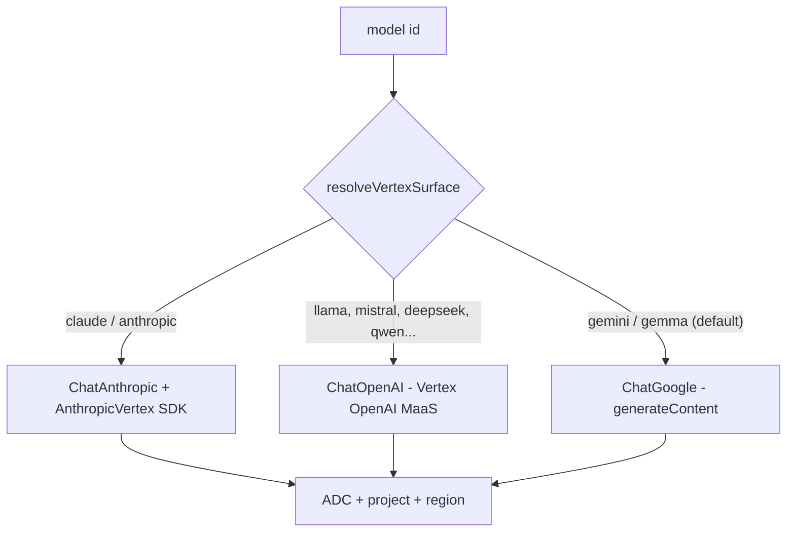

# Model Providers

OpenWiki runs against one of **thirteen** model providers, all normalized behind
a single `BaseChatModel` the agent graph consumes:

`anthropic`, `baseten`, `bedrock`, `copilot`, `fireworks`, `gemini`,
`gemini-enterprise`, `nebius`, `nvidia`, `openai`, `openai-chatgpt`,
`openai-compatible`, `openrouter`.

The registry that declares each provider's labels, model options, and env keys
lives in `src/config/constants.ts`; the agent layer resolves and instantiates
the model in `src/agent/index.ts`.

## Resolution before the model is built

`resolveRunConfig` runs the full pre-build validation, all tagged to the
`config` error stage:

1. Resolve the configured provider and (for external-CLI providers) resolve its
   credential from the owning CLI.
2. Validate the required credential, base URL, secret key, and region for that
   provider, erroring with an actionable message when one is missing.
3. Resolve the model id with `resolveModelId`.
4. Check model availability against the credentials; an `unavailable` model
   aborts the run.

`resolveModelId` reads the requested model or `OPENWIKI_MODEL_ID`, normalizes
and validates it, and errors when the provider exposes no default model options
and none was configured. If the id is a **known model of a different provider**
(for example an Anthropic id left set while the provider is now OpenAI), the run
emits a non-fatal mismatch warning to the event stream and stderr and still
proceeds, since a custom endpoint or gateway may legitimately serve it.

## Building the model

`createModel` dispatches per provider to the correct LangChain client:

| Provider            | Client                       | Notes                                   |
| ------------------- | ---------------------------- | --------------------------------------- |
| `gemini`            | `ChatGoogle` (`gai`)         | streaming disabled, `outputVersion: v0` |
| `gemini-enterprise` | Vertex builder               | surface chosen by model id              |
| `anthropic`         | `ChatAnthropic`              | modern-Claude token default             |
| `openai-chatgpt`    | `ChatOpenAI` → Codex backend | OAuth, Responses API                    |
| `openrouter`        | `ChatOpenRouter`             | optional provider allowlist             |
| `bedrock`           | `ChatBedrockConverse`        | AWS SDK credentials + region            |
| others              | `ChatOpenAI`                 | OpenAI-compatible endpoints             |

### Reasoning effort

Reasoning is opt-in via `OPENWIKI_REASONING_EFFORT` and applies only to models
that declare a reasoning capability in `src/config/reasoning.ts`. Depending on
the capability's transport it is sent either as a Responses-API
`reasoning.effort` field or as a chat-completions `reasoning_effort` kwarg.

### Anthropic output tokens

Anthropic's LangChain default falls back to 4,096 tokens for unknown model ids.
OpenWiki raises that to 16,384 **only** for modern Claude 4/5 families; an
explicit provider-neutral max-output-tokens setting always wins, including for
custom model ids.

## ChatGPT OAuth (Codex backend)

The `openai-chatgpt` provider lets a ChatGPT subscription drive model calls
instead of a metered API key. It reuses `ChatOpenAI` pointed at the Codex
Responses backend (`https://chatgpt.com/backend-api/codex`) with:

- `useResponsesApi: true` (routes to `POST {baseURL}/responses`),
- `zdrEnabled: true` (forces `store: false`, which the Codex backend requires),
- `streaming: true` (the Codex backend rejects non-streaming requests), and
- a Codex fetch wrapper injecting the `chatgpt-account-id`, `originator`, and
  `OpenAI-Beta` headers.

Tokens are refreshed **once at run startup** when expired or near-expiry and
written back to `~/.openwiki/.env` (which also updates `process.env`). This
keeps `createModel` synchronous — there is no background refresh loop, which is
sufficient for a short-lived CLI process.

## Vertex AI (gemini-enterprise)

Vertex surface selection for the `gemini-enterprise` provider.

A single Google project + region + ADC credential can reach all three surfaces;
only the transport differs, keyed off the model id via `resolveVertexSurface`.
Two hardening details are load-bearing:

- The enterprise Gemini path passes an **empty `apiKey`** to block the
  `GOOGLE_API_KEY` fallback that would otherwise flip the client into Vertex
  Express mode and hijack the enterprise auth.
- The Claude-on-Vertex branch neutralizes `ANTHROPIC_*` env variables around the
  `AnthropicVertex` constructor so a stray key cannot clobber the Google OAuth
  token.

## Gemini thought-signature handling

Both Gemini surfaces (AI-Studio `gemini` and enterprise Gemini) disable
streaming and force `outputVersion: "v0"`. Gemini 3.x rejects multi-turn tool
calls whose function-call parts lack their `thoughtSignature`, and LangChain's
streaming aggregator re-emits messages as v1 standard content blocks that drop
that provider-specific signature. Routing through `invoke()` with the v0
converter preserves the raw Gemini parts so the next turn does not 400.

## Related pages

- [Agent Core & Run Lifecycle](overview.md) — where resolution and model build fit.
- [Configuration](../architecture/configuration.md) — `OPENWIKI_*` env variables.
