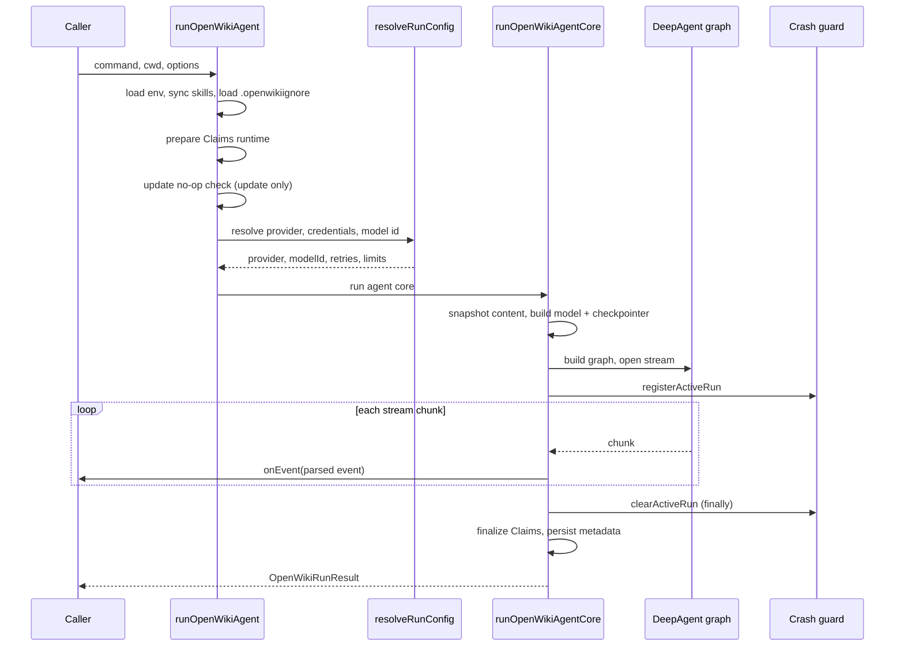

# Agent Core & Run Lifecycle

The agent domain owns the OpenWiki documentation agent: a checkpointed
[DeepAgent](https://github.com/langchain-ai/deepagents) graph that reads a
codebase (or personal knowledge) and writes an OKF Markdown wiki. This page
covers how a run is composed and how it flows end to end. The model layer,
sandbox backend, middleware pipeline, and prompts each have their own page.

## Entry points

Two public factories exist in `src/agent/index.ts`:

- **`runOpenWikiAgent`** is the complete persisted run boundary. It loads
  `~/.openwiki/.env`, syncs bundled skills, resolves provider/model
  configuration, runs the agent core, and owns run-metadata persistence and
  successful-run Claims finalization. Production runs go through here.
- **`createOpenWikiAgent`** is a lower-level factory that builds a graph from an
  already-initialized chat model. It prepares runtime state but does **not** own
  persisted run metadata or successful-run Claims finalization, so callers that
  need the full persisted boundary should use `runOpenWikiAgent`.

Both ultimately call `createOpenWikiAgentGraph`, which invokes deepagents'
`createDeepAgent` with the model, the connector and Claims tools, the SQLite
checkpointer, the composite backend, the middleware pipeline, review subagents,
filesystem permissions, and the system prompt.

## Commands and output modes

A run is parameterized by a **command** (`chat`, `init`, `update`) and an
**output mode** (`local-wiki`, `repository`). Docs-only write confinement is
enabled for every command except `chat`. The command and output mode select the
prompt template, the middleware set, and whether review subagents are attached:

- **chat** runs with no middleware and no review subagents.
- **init / update** layer on the Claims middleware and the OKF index middleware.
  `update` additionally mounts the translation middleware; `init` in repository
  mode additionally attaches the plan critic and QA review subagents.

## Run lifecycle

Sequence of a production run through `runOpenWikiAgent`.

### Startup and no-op short-circuit

`runOpenWikiAgent` loads the environment, syncs bundled skills, and loads
`.openwikiignore` (repository mode only). For a non-`init` repository run it
prepares the Claims runtime up front with fail-fast validation. For an `update`
with no user message it runs the no-op check: when no repository changes are
detected since the last update, it finalizes Claims, refreshes
`.last-update.json` (preserving the persisted language), publishes a `noop`
telemetry outcome, and returns `skipped: true` **without running the agent**.

### Repository init replacement

Repository `init` replaces the existing wiki through a recoverable transaction
(`beginRepositoryWikiReplacement`). The transaction is committed on success and
rolled back on failure; if rollback also fails, an `AggregateError` reports that
the previous wiki could not be fully restored. Init's Claims session is created
**only after** replacement starts so old sidecars cannot be read into the
brand-new wiki or collide with regenerated pages.

### Streaming

The core builds the model and checkpointer, assembles the graph, and opens a
stream. It streams in `messages`+`tools` mode (falling back to `updates`+`tools`
for the `openai-compatible` provider by default, because arbitrary endpoints can
break the `messages` aggregation path). Each chunk is parsed into an
`OpenWikiRunEvent` by `parseAgentStreamChunk`; after emitting an event the loop
yields to the scheduler so Ink can paint streamed text before the iterator
completes.

### Crash safety and finalization

For exactly the stream-consumption window the run registers with the
[crash guard](../reference/platform.md) (`registerActiveRun`). An escaped
runtime failure then records failure telemetry and stamps the run
`interrupted` instead of aborting the process silently; the registration is
cleared in a `finally`.

- On a **late stream failure** the run cleans up temporary working files and
  persists metadata stamped `interrupted`, so partial content stays diffable and
  the next update is not skipped as a no-op against a partial wiki.
- On **success** the run cleans up working files, finalizes Claims at the shared
  run timestamp, and persists `complete` run metadata — but only when content
  changed. `chat` never persists metadata.

## Error staging

Every failure is tagged with a run **stage** (`config`, `build`, `run`,
`finalize`) and an error class as it propagates, so the single telemetry
boundary can classify and attribute the failure to the right phase and owner.
`resolveRunConfig` tags `config`; graph construction and stream open tag
`build`; stream consumption tags `run`; and post-run persistence tags
`finalize`.

## Checkpointing

`chat` uses a persistent SQLite checkpoint file
(`~/.openwiki/openwiki.sqlite`) so a conversation resumes across turns;
`init`/`update` use an in-memory checkpointer. Because a chat session reuses one
`thread_id` and `SqliteSaver` never prunes, persistent chat history is trimmed
to the latest checkpoint per thread after each turn.

## Related pages

- [Model Providers](model-providers.md) — provider resolution and `createModel`.
- [Docs-Only Backend](backend.md) — the sandbox and `.openwikiignore` boundary.
- [Middleware Pipeline](middleware.md) — OKF, translation, and finalization.
- [Prompts & Subagents](prompts.md) — prompt selection and review subagents.
