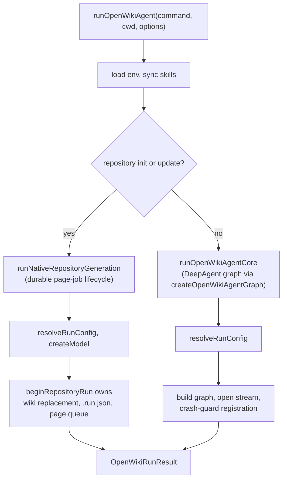
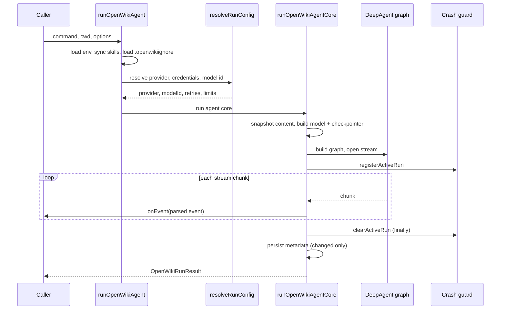
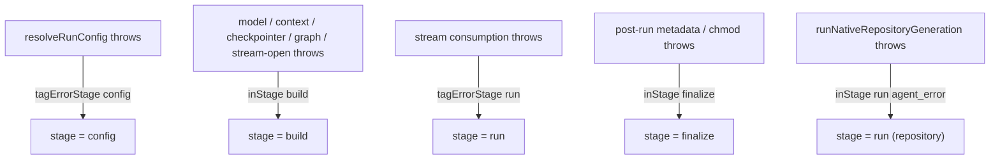

# Agent Core & Run Lifecycle

The agent domain owns the OpenWiki documentation agent: a checkpointed
[DeepAgent](https://github.com/langchain-ai/deepagents) graph that reads a
codebase (or personal knowledge) and writes an OKF Markdown wiki. This page
covers how a run is composed and how it flows end to end. The model layer,
sandbox backend, middleware pipeline, and prompts each have their own page.

## Entry points

Two public factories exist in `src/agent/index.ts`:

- **`runOpenWikiAgent`** is the complete persisted run boundary. It loads
  `~/.openwiki/.env`, syncs bundled skills, resolves provider/model
  configuration, and then branches on the command and output mode. Production
  runs go through here.
- **`createOpenWikiAgent`** is a lower-level factory that builds a graph from an
  already-initialized chat model. It prepares runtime state but does **not** own
  persisted run metadata or Claims finalization, and it refuses repository
  init/update (those use the page-job runner). Callers that need the full
  persisted boundary should use `runOpenWikiAgent`.

## Two run paths

`runOpenWikiAgent` branches on whether the run is a repository generation
command (`outputMode === "repository"` and command `init` or `update`):

The two paths share config resolution (`resolveRunConfig`) but diverge in who
owns durability and Claims finalization.

### Repository init/update — the durable page-job lifecycle

Repository `init` and `update` do **not** run `runOpenWikiAgentCore`. They call
`runNativeRepositoryGeneration` (`src/agent/repository-runner.ts`), wrapped in
the `run` telemetry stage. That runner drives a durable lifecycle owned by
`beginRepositoryRun` / `nextRepositoryPage` / `submitRepositoryPlan` /
`submitRepositoryPage` / `finishRepositoryRun` in `src/generation/repository-run.ts`.
State is persisted to a single `.run.json` checkpoint, so an interrupted run is
resumed (or replanned on source drift) on the next `begin`.

Key ownership boundaries:

- **Repository init replacement is owned by `beginRepositoryRun` in the
  generation core, not by `runOpenWikiAgentCore`.** When the lifecycle begins a
  fresh `init`, it calls `beginRepositoryWikiReplacement` to swap the existing
  `openwiki/` for a blank target through a recoverable transaction. The backup
  is committed only after both run state and `interrupted` metadata are durable;
  on a failed begin the new state is removed and the previous wiki is restored.
- **Claims finalization is owned by the generation core.** The lifecycle
  prepares a Claims runtime up front, finalizes Claims per page on
  `submitRepositoryPage`, and finalizes the whole run in `finishRepositoryRun`.
  `runOpenWikiAgentCore` never participates in repository Claims.

The runner spawns one fresh non-delegating DeepAgent per phase — a planner that
must call `submit_plan`, then one page worker per pending page job that must
write its page and call `submit_page` with that page's Claim set. Workers stream
only tool-lifecycle events (`tool_start`/`tool_end` for `read_file`, `write_file`,
`submit_plan`, `submit_page`, …), never narration.

#### repository_progress events

The native runner emits `repository_progress` events (type
`repository_progress`) so CLI consumers can paint lifecycle progress. The
`stage` field is one of:

- **`planning`** — a fresh planner is about to run.
- **`replanning`** — the run resumed and the plan was invalidated by source
  drift, or finish detected mid-run source drift; a replacement plan is needed.
- **`generating`** — a page worker is running for a specific `page` at
  `pageIndex`/`pageCount`.
- **`finalizing`** — `finishRepositoryRun` is applying deletions, finalizing wiki
  artifacts and Claims, and persisting `complete` metadata.
- **`noop`** — strict update preflight proved no generation was required; the run
  returns `skipped: true` without running any agent.

Each progress event also carries `resumed` (whether it continues an interrupted
durable run) and, during generation, the active `page`/`pageIndex`/`pageCount`.

#### Update no-op short-circuit

For an `update` with no user message, `beginRepositoryRun` runs the no-op check
**after** Claims preflight (a clean Git status cannot hide stale Claims). When
no repository changes are detected since the last update and there are zero
Claims issues, it finalizes Claims, refreshes `.last-update.json` as `complete`
(preserving the persisted language), and returns a `noop` begin view. The runner
then emits a `noop` progress event and `runOpenWikiAgent` records a `noop`
telemetry outcome and returns `skipped: true` **without running any agent**.
`getUpdateNoopStatus` itself refuses to skip when the previous update was
`interrupted` or the requested language changed.

### Chat and local-wiki — the DeepAgent graph

For `chat`, and for `init`/`update` in `local-wiki` mode, `runOpenWikiAgent`
calls `runOpenWikiAgentCore`, which builds the graph via
`createOpenWikiAgentGraph`. That factory invokes deepagents' `createDeepAgent`
with the model, the connector and Claims tools, the SQLite checkpointer, the
composite backend, the middleware pipeline, filesystem permissions, and the
system prompt.

## Commands and output modes

A run is parameterized by a **command** (`chat`, `init`, `update`) and an
**output mode** (`local-wiki`, `repository`). Docs-only write confinement is
enabled for every command except `chat`. The command and output mode select the
prompt template and the middleware set:

- **chat** runs with no middleware and no review subagents.
- **init / update** (local-wiki) layer on the OKF index middleware; `update`
  additionally mounts the translation middleware when the wiki language changed.
  Connector tools are mounted only in `local-wiki` mode — repository generation
  workers get no connector ingestion.

## Run lifecycle (chat and local-wiki)

Sequence of a production chat/local-wiki run through `runOpenWikiAgentCore`.

### Streaming

The core builds the model and checkpointer, assembles the graph, and opens a
stream. It streams in `messages`+`tools` mode (falling back to `updates`+`tools`
for the `openai-compatible` provider by default, because arbitrary endpoints can
break the `messages` aggregation path). Each chunk is parsed into an
`OpenWikiRunEvent` by `parseAgentStreamChunk`; after emitting an event the loop
yields to the scheduler so Ink can paint streamed text before the iterator
completes. The repository workers instead stream `tools`-mode only via
`streamWorkerTools` / `parseWorkerToolEvent`.

### Crash safety and finalization

For exactly the stream-consumption window `runOpenWikiAgentCore` registers with
the crash guard (`registerActiveRun`). An escaped runtime failure then records
failure telemetry and stamps the run `interrupted` instead of aborting the
process silently; the registration is cleared in a `finally`.

- On a **late stream failure** the run persists metadata stamped `interrupted`
  (best-effort, swallowing write errors so the original run error propagates),
  so partial content stays diffable and the next update is not skipped as a
  no-op against a partial wiki.
- On **success** the run persists `complete` run metadata, but only when content
  changed. `chat` never persists metadata.

The crash guard itself is a process-global singleton installed once at CLI
startup. Its `handleFatal` claims the active run synchronously (so a burst of
rejections records only one), records the failure, stamps `interrupted`, writes
a local stderr line, and exits non-zero.

## Error staging

Every failure is tagged with a run **stage** and an error class as it
propagates, so the single telemetry boundary can classify and attribute the
failure to the right phase and owner:

`resolveRunConfig` tags `config`; model/context/checkpointer/graph/stream-open
construction tag `build`; stream consumption tags `run`; post-run persistence
and checkpoint chmod tag `finalize`. The repository branch wraps model creation
in `build` and the whole native generation in `run` with `agent_error`.

## Checkpointing

`chat` uses a persistent SQLite checkpoint file
(`~/.openwiki/openwiki.sqlite`) so a conversation resumes across turns;
`init`/`update` (both paths) use an in-memory checkpointer. Because a chat
session reuses one `thread_id` and `SqliteSaver` never prunes, persistent chat
history is trimmed to the latest checkpoint per thread after each turn
(`prunePersistentCheckpointHistory`). The repository page-job lifecycle does not
use a LangGraph checkpointer at all — durability comes from `.run.json`, not
graph checkpoints.

## Related pages

- [Model Providers](model-providers.md) — provider resolution and `createModel`.
- [Docs-Only Backend](backend.md) — the sandbox and `.openwikiignore` boundary.
- [Middleware Pipeline](middleware.md) — OKF, translation, and finalization.
- [Prompts & Subagents](prompts.md) — prompt selection and review subagents.
- [Generation Overview](../generation/overview.md) — the durable repository page-job lifecycle.
