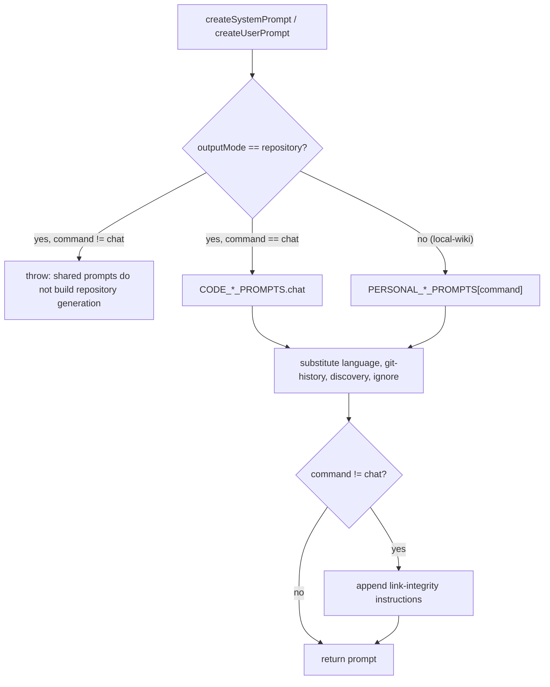
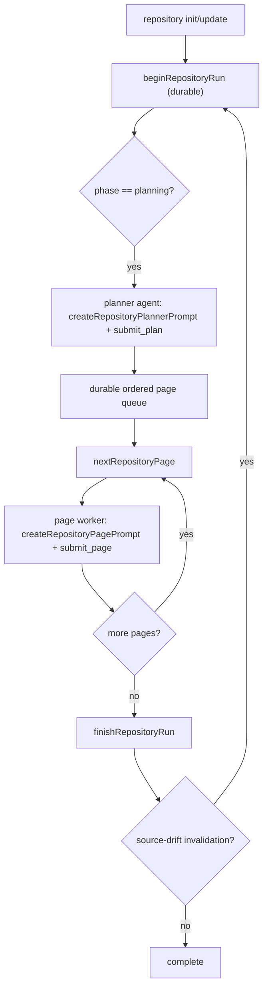

# Prompts & Repository Worker Prompts

OpenWiki runs under two disjoint prompt systems. The **shared prompt layer**
(`src/agent/prompt.ts` plus `src/agent/prompts/code.ts` and
`src/agent/prompts/personal.ts`) builds the system and user prompts for chat and
for the local personal wiki. The **repository worker prompt layer**
(`src/agent/repository-prompts.ts`) builds the bounded planner and page-worker
prompts that drive the native repository `init`/`update` lifecycle. The two
systems never overlap: the shared builders throw when asked to build a
repository `init`/`update` prompt, and the repository runner never calls them.

## Prompt selection and templating

### Shared prompts (chat and local-wiki)

`createSystemPrompt` selects a prompt family by **output mode** and
**command**:

- **repository** output mode → `CODE_SYSTEM_PROMPTS` / `CODE_USER_PROMPTS`, but
  only the `chat` entry is reachable through the shared builder. Repository
  `init`/`update` are rejected before templating (see below).
- **local-wiki** output mode → `PERSONAL_SYSTEM_PROMPTS` /
  `PERSONAL_USER_PROMPTS`, keyed by command (`chat`, `init`, `update`).

It then substitutes four placeholders — `{OUTPUT_LANGUAGE_INSTRUCTIONS}`,
`{GIT_HISTORY_HINT}`, `{DISCOVERY_INSTRUCTION}`, and
`{OPENWIKIIGNORE_INSTRUCTIONS}` — and, for any non-`chat` command, appends the
link-integrity instructions. `createUserPrompt` builds the matching user prompt,
substituting `{USER_MESSAGE}`, `{WIKI_GOAL}`, `{LAST_UPDATE}`,
`{ADDITIONAL_USER_REQUEST}`, and `{RUNTIME_CONTEXT}`.

The two modes differ concretely in where files live. Code (repository) prompts
document a codebase under `/openwiki` and read source from repository-root
paths such as `/src/agent/index.ts`; personal prompts write pages directly
under the virtual root `/` and must not create a nested `openwiki` directory.

### Repository worker prompts (init/update)

Repository `init`/`update` does not use the shared prompt builders at all.
`runOpenWikiAgent` throws early when called with repository `init`/`update`,
routing those commands to `runNativeRepositoryGeneration`, which builds its own
planner and page-worker agents from `repository-prompts.ts`:

- `createRepositoryPlannerPrompt(view, planningContext)` — the bounded planner
  system prompt. Its only output action is `submit_plan`; it forbids writing
  documentation or delegating work. It directs the planner to explore manifests,
  entrypoints, public surfaces, and representative end-to-end flows before
  submitting, to organize around owned systems rather than mirroring the source
  tree, and to include `/openwiki/quickstart.md` on init. In `update` mode it
  appends the changed repository paths and the Claims preflight issues
  (stale/unresolved) so the planner knows what to re-plan.
- `createRepositoryPagePrompt(job, allPages, language)` — the per-page worker
  system prompt. It scopes the worker to exactly one page (`job.path`), inlines
  the title, purpose, seed paths, related pages, page-specific instructions,
  and the page's complete existing Claim set as JSON. In `update` mode it tells
  the worker to read the current page first and preserve accurate unaffected
  content. It requires OKF concept front matter, forbids authoring
  OpenWiki-controlled fields, and directs the worker to call `submit_page` with
  the complete intended material Claim set. Only the `/openwiki/quickstart.md`
  worker additionally receives the complete planned page map for task routing.

Both repository worker agents are deliberately **non-delegating**: a
`NO_DELEGATION_MIDDLEWARE` strips the general-purpose `task` tool that
DeepAgents injects, and `subagents` is always empty. The planner gets a
read-only filesystem surface (`read_file`, `ls`, `glob`, `grep`) plus
`submit_plan`; the page worker adds `write_file` and `edit_file` plus
`submit_page`.

### Language handling

Language instructions tell the agent to write only its **own new or changed**
prose in the target language and to leave the deterministic whole-wiki
translation reconciliation to code (the [translation
middleware](middleware.md)). Within front-matter values it translates `title`,
`description`, and `type` but keeps `tags` in English as stable cross-language
aggregation keys, and copies identifiers, file paths, and URLs byte-for-byte.

### `.openwikiignore` discipline

When `.openwikiignore` is active the prompt suppresses git-history use, forbids
reconstructing history through shell, adds ignore-discipline guidance, and lists
the active patterns so the agent treats matching paths as out of scope. This
mirrors the enforcement in the [docs-only backend](backend.md).

### Diagram and link-integrity discipline

Diagram instructions direct the agent to embed source-grounded mermaid diagrams
for runtime flows, lifecycles, data models, and non-trivial control flow, and to
repair a degraded diagram when it finds a `text` fence preceded by an
`openwiki: mermaid parse failed` HTML comment. Link-integrity instructions teach
the agent the post-run `openwiki: broken internal link` marker so it can
self-repair broken relative links on a later run.

## Skills sync

Bundled skills are synced from the packaged `skills/` directory into
`~/.openwiki/skills` at run startup by `syncBundledSkills`. Each skill is
copied into a unique scratch directory and **atomically renamed** into place.
This avoids the `EEXIST` race that a plain copy hits when two syncs overlap
during `--init`, and it preserves any unrelated user skills already installed.
Because bundled skills may ship read-only (Nix store and immutable container
images mount `skills/` as `dr-xr-xr-x`), the sync recursively grants the
owner-write bit across the staged tree before the atomic swap so that the
`rename` and the scratch-directory cleanup both succeed; the installed copy is
then writable and self-heals on the next sync.

## Claims substance standard

`CLAIMS_SUBSTANCE_GUIDANCE` (`src/claims/guidance.ts`) is the shared
model-facing standard for selecting substantive repository Claims. It is
inlined into every page-worker prompt and reflected in the `submit_page` tool
description, so init, update, migration, and the tool description all enforce
the same definition of an "atomic" Claim. The standard requires that a Claim be
an independently verifiable, evidence-backed proposition capturing a substantive
system truth (responsibilities, control flow, invariants, lifecycle, failure
semantics, extension boundaries), that one component may support several
Claims but a Claim must not exist merely because a symbol exists, and that every
evidence resource use the canonical `repo://<repository-relative-path>` form.
