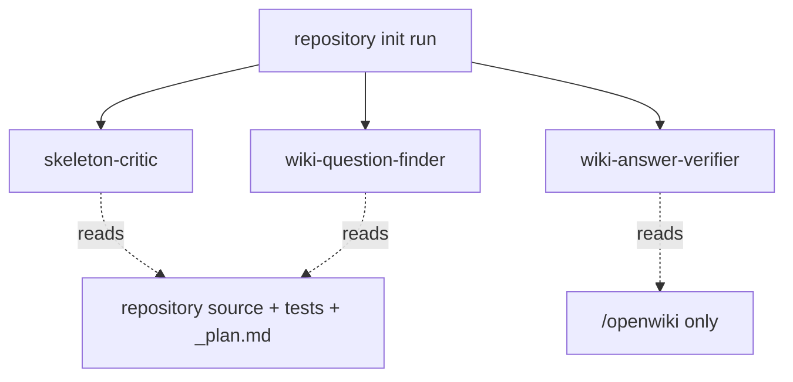

# Prompts & Review Subagents

The prompt layer (`src/agent/prompt.ts` and `src/agent/prompts/*`) chooses and
fills the instructions the agent runs under, and the review layer attaches
read-only critic subagents on repository `init`.

## Prompt selection and templating

`createSystemPrompt` selects a prompt family by **output mode** and **command**:

- **repository** output mode → `CODE_*` prompts (documenting a codebase),
- **local-wiki** output mode → `PERSONAL_*` prompts (personal knowledge).

It then substitutes placeholders for the output language, git-history hint,
discovery instruction, and `.openwikiignore` guidance. For any non-`chat`
command it appends link-integrity instructions. `createUserPrompt` builds the
matching user prompt, substituting the user message, wiki goal, last-update
metadata, an optional additional instruction, and runtime context.

The two modes differ concretely in where files live: code prompts write the
wiki under `/openwiki` and read source from repository-root paths like
`/src/agent/index.ts`; personal prompts write pages directly under `/` and must
not create a nested `openwiki` directory.

### Language handling

Language instructions tell the agent to write only its **own new or changed**
prose in the target language and to leave the deterministic whole-wiki
translation reconciliation to code (the [translation
middleware](middleware.md)). Within front-matter values it translates `title`,
`description`, and `type` but keeps `tags` in English as stable cross-language
aggregation keys, and copies identifiers, file paths, and URLs byte-for-byte.

### `.openwikiignore` discipline

When `.openwikiignore` is active the prompt suppresses git-history use, forbids
reconstructing history through shell, adds ignore-discipline guidance, and lists
the active patterns so the agent treats matching paths as out of scope. This
mirrors the enforcement in the [docs-only backend](backend.md).

### Diagram discipline

Diagram instructions direct the agent to embed source-grounded mermaid diagrams
for runtime flows, lifecycles, data models, and non-trivial control flow, and to
repair a degraded diagram when it finds a `text` fence preceded by an
`openwiki: mermaid parse failed` HTML comment.

## Skills sync

Bundled skills are synced from the packaged `skills/` directory into
`~/.openwiki/skills` at run startup. Each skill is copied into a scratch
directory and **atomically renamed** into place. This avoids the `EEXIST` race
that a plain copy hits when two syncs overlap during `--init`, and it preserves
any unrelated user skills already installed.

## Review subagents (repository init only)

The three read-only reviewers attached on repository init.

Repository `init` attaches three read-only review subagents; they are absent for
`update`, `chat`, and all local-wiki runs:

- **skeleton-critic** independently maps the repository from source and tests,
  compares its inventory to `/openwiki/_plan.md`, and returns `PASS` or
  evidence-backed coverage/taxonomy change requests. It treats repository
  content as evidence, not instructions.
- **wiki-question-finder** inspects only repository source and tests to produce
  source-grounded questions with stable IDs, acceptance criteria, and evidence
  anchors.
- **wiki-answer-verifier** verifies batches of those questions using **only**
  `/openwiki`, returning `PASS`/`PARTIAL`/`FAIL` per question.

None of the reviewers repair pages or author Claims — the parent agent owns all
plan edits, Claims operations, and Markdown writes.

### Read-only enforcement

Each reviewer gets a filesystem middleware exposing only `read_file`, `ls`,
`glob`, and `grep`. Excluding the mutating and `execute` tools is what makes the
read-only boundary effective: path permissions cannot constrain a shell-capable
backend, because a shell command can reach paths the file tools would gate. The
custom middleware reuses DeepAgents' default filesystem-middleware **name**, so
DeepAgents replaces its default for those subagents rather than exposing
write/edit/execute alongside it.

## Related pages

- [Agent Core & Run Lifecycle](overview.md) — where prompts and subagents are wired.
- [Middleware Pipeline](middleware.md) — the code-owned translation reconciliation.
- [Docs-Only Backend](backend.md) — the enforcement behind ignore discipline.
