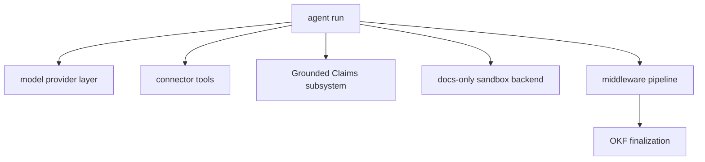

# Architecture Overview

OpenWiki is a Node/TypeScript CLI that uses a [Deep Agents](https://github.com/langchain-ai/deepagentsjs) documentation agent to generate and maintain a wiki. It operates in either a repository **code** mode or a **personal** knowledge mode, and produces a portable [OKF v0.2](../okf/overview.md) Markdown bundle grounded in versioned source [Claims](../claims/overview.md).

This page is the repository-wide map. For the internal run lifecycle — orchestration, transactional init, no-op detection, streaming, and crash handling — see [agent/overview.md](../agent/overview.md).

## Modes

- **Code vs. personal** — a `code` wiki documents a repository; a `personal` wiki documents your own knowledge. Grounded Claims exist only for the code brain.
- **Output mode** — every run targets either `local-wiki` (under the OpenWiki home) or `repository` (checked in beside the code). When no output mode is supplied, a run defaults to `local-wiki`.

## Subsystem composition

An agent run assembles a checkpointed DeepAgent graph from a set of independently owned subsystems:

_The major subsystems wired into a single agent run._

| Subsystem         | Responsibility                                           | Page                                                    |
| ----------------- | -------------------------------------------------------- | ------------------------------------------------------- |
| Model providers   | Resolve provider and model, apply reasoning and retries  | [agent/model-providers.md](../agent/model-providers.md) |
| Connectors        | Ingest external and repository sources as agent tools    | [connectors/overview.md](../connectors/overview.md)     |
| Grounded Claims   | Ground facts in versioned evidence; detect staleness     | [claims/overview.md](../claims/overview.md)             |
| Docs-only backend | Confine writes to the wiki; enforce the ignore boundary  | [agent/backend.md](../agent/backend.md)                 |
| Middleware        | OKF indexing, translation, link validation, finalization | [agent/middleware.md](../agent/middleware.md)           |
| OKF               | Front matter, provenance, verification stamping          | [okf/overview.md](../okf/overview.md)                   |
| Configuration     | OpenWiki home, env, ignore boundary                      | [configuration.md](configuration.md)                    |

## Where to go next

- New to the project? Start at [quickstart.md](../quickstart.md).
- Want the run internals? See [agent/overview.md](../agent/overview.md).
- Curious how facts stay accurate? See [claims/overview.md](../claims/overview.md).
