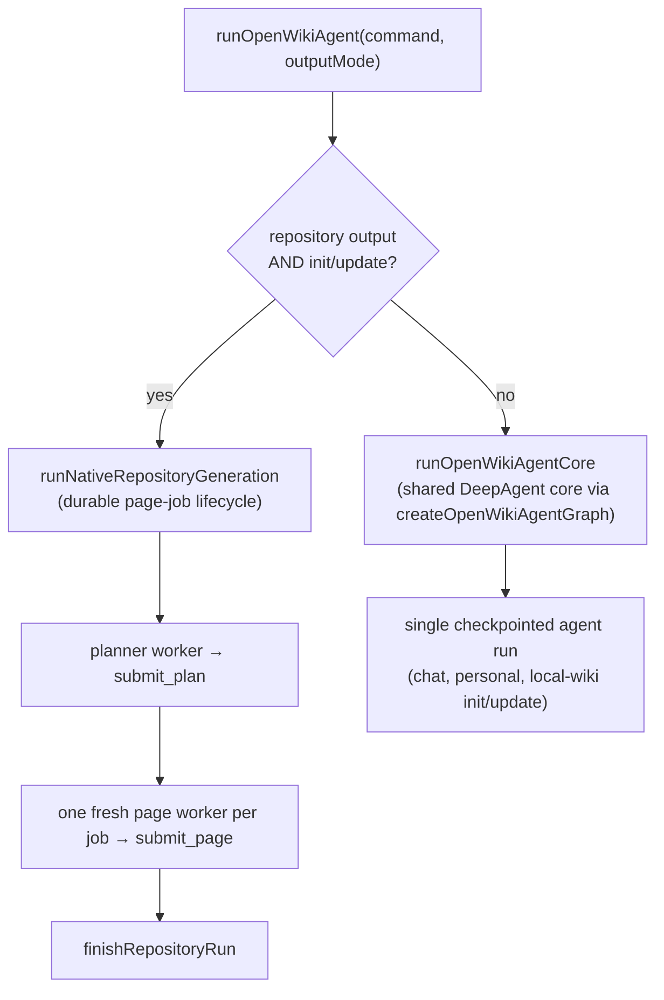
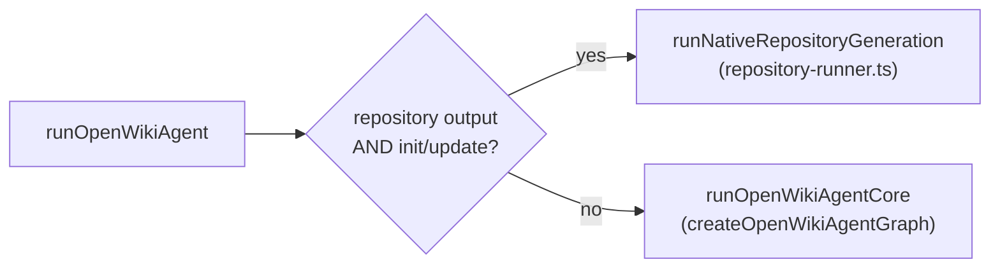
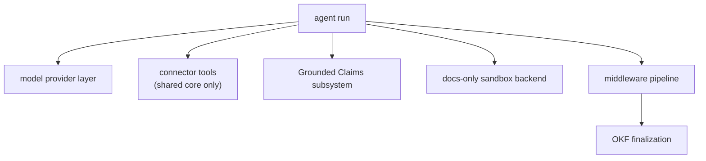

# Architecture Overview

OpenWiki is a Node/TypeScript CLI that uses a [Deep Agents](https://github.com/langchain-ai/deepagentsjs) documentation agent to generate and maintain a wiki. It operates in either a repository **code** mode or a **personal** knowledge mode, and produces a portable [OKF v0.2](../okf/overview.md) Markdown bundle grounded in versioned source [Claims](../claims/overview.md).

This page is the repository-wide map. For the internal run lifecycle — orchestration, transactional init, no-op detection, streaming, and crash handling — see [agent/overview.md](../agent/overview.md).

## Modes

- **Code vs. personal** — a `code` wiki documents a repository; a `personal` wiki documents your own knowledge. Grounded Claims exist only for the code brain.
- **Output mode** — every run targets either `local-wiki` (under the OpenWiki home) or `repository` (checked in beside the code). When no output mode is supplied, a run defaults to `local-wiki`.

## Two generation paths

OpenWiki does not build one graph for every command. `runOpenWikiAgent` inspects the command and output mode and selects one of two execution paths:

_The command dispatcher routes repository `init`/`update` to the durable page-job runner; everything else uses the shared agent core._

### Native repository generation (page-job lifecycle)

Repository `init` and `update` — i.e. `outputMode === "repository"` with `command === "init" | "update"` — go through `runNativeRepositoryGeneration` rather than the shared `createOpenWikiAgentGraph` core. This path owns its own durable lifecycle and never instantiates the single-graph agent used elsewhere:

- A **planner worker** is a fresh, non-delegating DeepAgent bounded to read-only filesystem tools (`read_file`, `ls`, `glob`, `grep`) plus a single `submit_plan` completion tool. It must submit exactly one canonical page plan before exiting.
- **Page workers** run sequentially over the persisted ordered queue. Each gets a fresh DeepAgent bounded to its assigned page: read tools plus `write_file`/`edit_file` and a single `submit_page` completion tool that accepts the page's complete intended Claim set. A worker that exits without calling `submit_page` fails the run.
- The durable checkpoint lives in `openwiki/.run.json`. On a persistent checkout an interrupted run resumes the queue; ephemeral CI runners start fresh after failure unless their workspace is preserved.
- Workers are deliberately non-delegating: a `NO_DELEGATION_MIDDLEWARE` strips the general-purpose `task` tool so planner and page agents cannot spawn subagents.

This is also the lifecycle exposed to external coding-agent integrations (Codex, Claude Code, OpenCode), which drive the same five operations — `openwiki_begin`, `openwiki_submit_plan`, `openwiki_next_page`, `openwiki_submit_page`, `openwiki_finish` — while OpenWiki owns the queue, Claims persistence, source-drift handling, and finalization.

### Shared agent core (chat, personal, local-wiki)

All other runs — `chat`, personal mode, and `local-wiki` `init`/`update` — flow through `runOpenWikiAgentCore`, which builds a single checkpointed DeepAgent graph via `createOpenWikiAgentGraph`. This is the path that assembles connector tools, the docs-only sandbox backend, and the OKF/translation middleware pipeline. `createOpenWikiAgent` (the low-level graph factory) refuses repository `init`/`update` and directs callers to `runOpenWikiAgent` instead, so the page-job runner is the only entry point for repository generation.

## Subsystem composition

The subsystems wired into a run differ by path. The shared agent core composes them all into one graph; the native repository runner composes a narrower, per-worker subset.

_The major subsystems. Connector tools are personal/local-wiki only; repository page workers use filesystem tools plus `submit_plan`/`submit_page` instead._

| Subsystem         | Responsibility                                           | Page                                                    |
| ----------------- | -------------------------------------------------------- | ------------------------------------------------------- |
| Model providers   | Resolve provider and model, apply reasoning and retries  | [agent/model-providers.md](../agent/model-providers.md) |
| Connectors        | Ingest external and repository sources as agent tools    | [connectors/overview.md](../connectors/overview.md)     |
| Grounded Claims   | Ground facts in versioned evidence; detect staleness     | [claims/overview.md](../claims/overview.md)             |
| Docs-only backend | Confine writes to the wiki; enforce the ignore boundary  | [agent/backend.md](../agent/backend.md)                 |
| Middleware        | OKF indexing, translation, link validation, finalization | [agent/middleware.md](../agent/middleware.md)           |
| OKF               | Front matter, provenance, verification stamping          | [okf/overview.md](../okf/overview.md)                   |
| Configuration     | OpenWiki home, env, ignore boundary                      | [configuration.md](configuration.md)                    |

### Connector boundary

Connector tools are a personal/local-wiki capability. `createOpenWikiConnectorTools` returns an empty array for `repository` output mode, so a code-mode run is never handed connector ingestion — it documents a codebase with filesystem tools only. Repository page workers therefore never see connectors, LangSmith, or other credentialed external sources.

## Where to go next

- New to the project? Start at [quickstart.md](../quickstart.md).
- Want the run internals? See [agent/overview.md](../agent/overview.md).
- Curious how facts stay accurate? See [claims/overview.md](../claims/overview.md).
