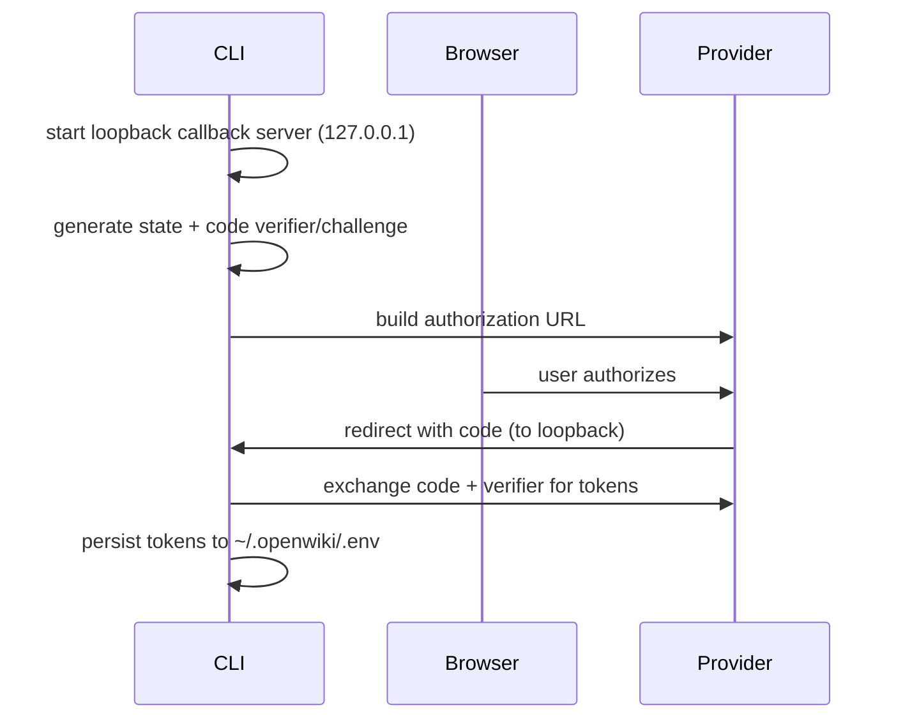

# Authentication

OpenWiki authenticates two different things: **connector OAuth providers** (Gmail, Notion, Slack, X) that grant access to personal data sources, and **model providers**, some of which reuse an external CLI's session. All persisted auth values are written into the OpenWiki home `.env` through the shared env store rather than any provider-specific location.

## Connector OAuth providers

Connector OAuth providers are declared in a single `AUTH_PROVIDERS` registry that maps each to its authorization/token endpoints, client-auth style, scopes, and the env-var names its tokens are written to.

`runOAuthAuth` performs a browser **Authorization Code + PKCE** flow:

_Browser PKCE OAuth flow._

Token access is **lazy and refreshed on demand**: a cached access token is reused unless expired, otherwise refreshed via the provider's refresh token, using an expiry skew so it refreshes slightly early. OAuth discovery fetches protected-resource and authorization-server metadata from well-known endpoints, validating every candidate URL before fetching so discovery cannot be redirected to an arbitrary host.

## Model provider credentials

Some model providers authenticate by reusing an **external CLI's session**, resolving a token by invoking that CLI with a timeout. For the GitHub CLI the hostname is derived from the provider base URL so a reused session targets the correct GitHub tenant.

`configureAuthProvider` writes a connector config for a provider and, unless `--force` is set, leaves an existing config untouched and reports it as `exists`.

For onboarding and credential collection, see [onboarding.md](onboarding.md). For ChatGPT OAuth model access specifically, see [agent/model-providers.md](../agent/model-providers.md).
