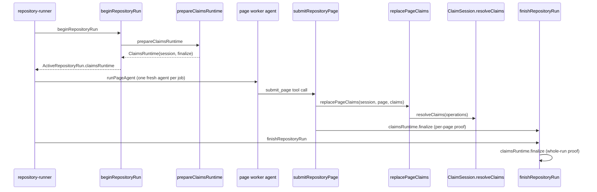
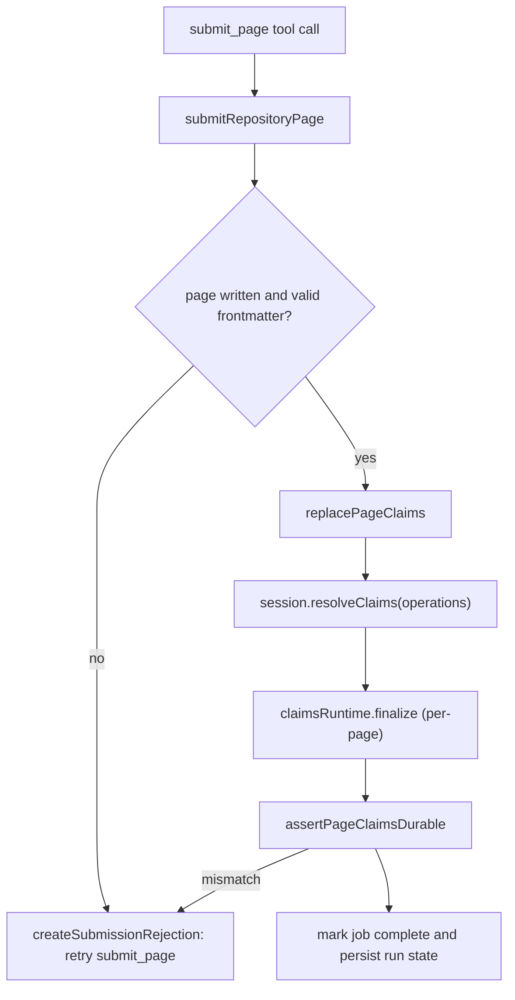

# Claims Agent Integration

Grounded Claims no longer reach the documentation agent through a standing set of
model-called tools. The earlier `createClaimsIntegration` surface — the
`resolve_claims`, `inspect_claims`, and `delete_file` tools plus the lazy
read-note middleware — has been removed. Claims are now submitted through a
single page-completion tool, `submit_page`, that every page worker must call
before its job is considered complete. The Claims session is prepared by
`prepareClaimsRuntime` at run start and finalized by `claimsRuntime.finalize`
both per page and at run finish.

## Lifecycle placement

The Claims runtime is a first-class member of the repository-generation
lifecycle, not something the agent graph constructs on demand.

_Preparation, per-page submission, and whole-run finalization of the Claims runtime._

`prepareClaimsRuntime` returns `undefined` outside repository generation
(`outputMode !== "repository"` or `command === "chat"`), so chat and local-wiki
runs carry no Claims runtime at all. `beginRepositoryRun` treats a missing
runtime as a hard error for repository runs, then exposes it on
`ActiveRepositoryRun.claimsRuntime` for the rest of the run.

## The submit_page tool

Each page worker is a fresh, bounded DeepAgent constructed by `runPageAgent`
in `repository-runner.ts`. Its tool set is the filesystem tools plus exactly one
completion tool, `submit_page`, defined as a `DynamicStructuredTool`:

- **schema** — `{ claims: Array<{ id?, statement, evidence: Array<{ resource }> }> }`
  with `claims` requiring at least one entry (`z.array(ClaimSchema).min(1)`);
  each Claim requires a non-empty `statement` and at least one evidence
  `resource`;
- **single-submission guard** — a worker-scoped `submitted` flag throws if the
  tool is called more than once for the same page worker;
- **rejection handling** — a `RepositoryRunError` with code `invalid_input`
  returned from `submitRepositoryPage` is converted into an error-status
  `ToolMessage` (`createSubmissionRejection`) so the worker loop stays alive and
  can correct the page or payload and retry; any other error is rethrown;
- **completion enforcement** — after the agent stream ends, the runner throws
  `${job.path} worker exited without submit_page.` unless `submitted` is true.

The system prompt instructs the worker to reuse an existing Claim `id` when
retaining or revising a proposition, omit the `id` for a genuinely new Claim,
and treat omitting an old Claim as a retraction. Every evidence resource must be
a canonical `repo://<repository-relative-path>` URI, optionally with a `#Lx-Ly`
line range; bare paths are invalid.

## submitRepositoryPage: the page-completion gate

`submitRepositoryPage` (in `repository-run.ts`) is the lifecycle function the
tool delegates to. Before touching Claims state it enforces page-readiness:

1. the plan must be installed and the run in the `generating` phase;
2. the submitted job must be the current pending job (only the head of the
   ordered queue may be submitted);
3. the worker must have actually written the page — a raw backend read of the
   page path must succeed, or the submission is rejected with
   `Write <path> before submitting its page job.`;
4. the page's front matter must pass `validatePersistedFile`, with a
   per-issue diagnostic otherwise.

Only then does it call `replacePageClaims` against
`run.claimsRuntime.session`, immediately followed by
`run.claimsRuntime.finalize(run.state.startedAt)` and
`assertPageClaimsDurable`. The per-page `finalize` persists this page's dirty
Claim state before the job is marked complete, so a crash after submission
leaves durable, verified sidecars. `assertPageClaimsDurable` re-reads the
persisted sidecar and proves that the Claim set, page-version hash,
verification event, and frontmatter `verified` projection all match the
in-memory session — otherwise it throws an `invalid_state`
`RepositoryRunError` naming `submit_page` as the retry operation. After the
proof passes, the durable run state is advanced: the job's `status` becomes
`complete` and `writeRepositoryRunState` persists the new queue before
returning.

_Page-submission gates from tool call to durable job completion._

## replacePageClaims: the diff algorithm

`replacePageClaims` (in `page-jobs.ts`) reconciles one page's *complete*
proposed Claim set against the page's existing Claims, producing the compact
`add` / `confirm` / `update` / `retract` operations consumed by
`session.resolveClaims`. It is a full-replacement diff: the proposal is the
complete intended set, not a patch.

The algorithm:

1. **normalize** each proposal (`normalizeProposedClaim`) — trims the statement,
   deduplicates and sorts evidence resources, and rejects empty statements or
   evidence-less Claims;
2. **fingerprint** each proposal (`claimFingerprint`) and reject duplicate
   proposals for the same page;
3. **match by id** — if a proposal carries an `id`, it must reference an
   existing Claim owned by this page (else `Claim <id> is not owned by <page>`),
   must not be reused twice, and becomes either a `confirm` (when statement and
   evidence are identical) or a partial `update` carrying only the changed
   `statement` and/or `evidence` fields;
4. **match by exact content** — a proposal without an `id` that exactly matches
   an unused existing Claim (same statement and same evidence set) becomes a
   `confirm`, preserving the existing id; this lets a worker retain a Claim
   without knowing its id;
5. **add** — any remaining proposal becomes an `add` with the proposed
   statement and evidence, and the session allocates a new `claim_` id;
6. **retract** — every existing Claim not consumed by a `confirm` or `update`
   becomes a `retract`, implementing "omitting an old Claim retracts it."

If the resulting operation list is non-empty, `replacePageClaims` calls
`session.resolveClaims({ page, operations })` once for the page. Evidence is
compared as canonical sets independent of input order (`sameEvidence`), so
reordering evidence resources does not produce a spurious update.

## session.resolveClaims

`ClaimSession.resolveClaims` (in `session.ts`) is the atomic apply step. It
serializes mutations per page through a `pendingMutation` promise chain, then
calls `applyClaimOperations` with the session's evidence resolver and id
allocator. On success it replaces the page's working Claim set, rewrites global
claim ownership, marks the page dirty, clears the page's `deleted` flag, and
clears any preflight grounding issues whose `claimId` was targeted by an
operation. It returns the canonical page and per-operation results, assigning
newly allocated ids back to `add` operations in order.

`inspectClaims` is the non-mutating read used to seed each page worker's prompt
with its existing Claims (`nextRepositoryPage` attaches
`existingClaims: run.claimsRuntime.session.inspectClaims(job.path)` to the job
context). It returns cloned, model-facing claims with opaque evidence versions
stripped, and returns an empty array for deleted pages.

## Finalization and persistence

`claimsRuntime.finalize` (bound in `buildClaimsRuntime`) wraps
`session.finalize(store, verification)` and then
`finalizeVerificationProjection`, which synchronizes OKF verification metadata
and refreshes page-version hashes. Any warning makes the run fail strict:
`finalize` throws a `ClaimsPersistenceError` ("Claims finalization was not
fully durable") after forwarding warnings to the run's `onWarning` sink.

`session.finalize` iterates every page: dirty pages with remaining evidence
debt throw (`Unresolved evidence debt remains`), dirty claims are re-resolved
to prove the evidence did not change mid-run (`assertEvidenceStillCurrent`),
then the Markdown is hashed before the sidecar is written. Deleted and orphaned
pages have their sidecars removed. The whole-run proof in
`finishRepositoryRun` calls `finalize` again after all page jobs are complete,
followed by `assertRepositoryClaimsDurable` and a second source-fingerprint
check that closes the check/use race across the deterministic finish window.

## Deletion through the lifecycle, not a tool

There is no longer a model-called `delete_file` tool. Page deletion is now a
lifecycle-owned operation performed by `finishRepositoryRun`:

- `applyAbandonedGeneratedPageDeletions` removes current-run pages abandoned by
  a superseded plan (never initial pages) and records each via
  `session.recordDeletion`;
- `applyPlannedDeletions` applies the plan's explicit `deletePages`;
- `reconcileDeletedClaimPages` records deletions for sidecars whose Markdown
  pages no longer exist.

`session.recordDeletion` marks the page deleted, clears its dirty flag and
issues, and rewrites ownership so finalization removes the owning sidecar
automatically — without requiring the model to manage retractions.

## Related pages

For the session, store, and mutation semantics see
[runtime-and-store.md](runtime-and-store.md); for the Claims concept and
lifecycle see [overview.md](overview.md); for evidence resource resolution see
[evidence.md](evidence.md); for the generation lifecycle that owns this
integration see [../generation/overview.md](../generation/overview.md).
