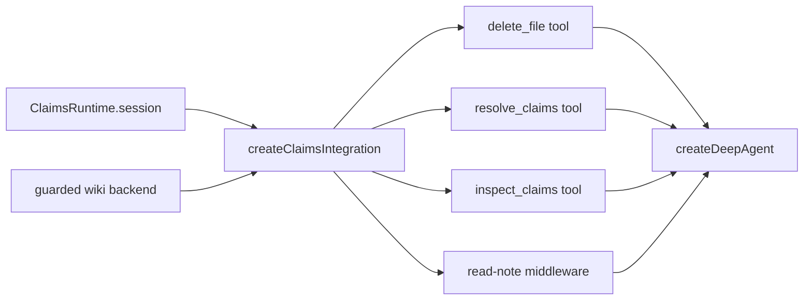

# Claims Agent Integration

The Claims subsystem reaches the documentation agent through a small, purpose-built surface: a set of tools plus one middleware. `createClaimsIntegration` composes both from a prepared [Claims runtime](runtime-and-store.md) and the guarded backend, and the graph wires them in only when a run has a Claims runtime (repository `init`/`update`).

## Composition

`createClaimsIntegration` returns exactly two things bound to the run's session:

- **tools** — a `delete_file` tool plus the mutation/inspection tools (`resolve_claims`, `inspect_claims`), and
- **middleware** — the read-note middleware that surfaces lazy claim debt.

_Claims tools and middleware wired into the agent graph._

## Tools

**`resolve_claims`** applies one cross-page mutation. Operations for the same page are merged, and each page's operations are applied **atomically** through the session. It accepts the compact `add`/`confirm`/`update`/`retract` operations, where an `update` must supply a statement or evidence.

**`inspect_claims`** reads selected claims **without** creating a write obligation — either by claim `ids` (for targeted cross-page inspection) or by `pages`, with exactly one selector required.

**`delete_file`** exists to fill a gap in DeepAgents: deleting a generated page. A successful Markdown deletion is recorded in the session (`recordDeletion`) so finalization removes the owning sidecar automatically, without model-managed retractions.

## Read-note middleware

`createClaimsReadNoteMiddleware` wraps filesystem reads. When the agent successfully reads a **grounded** wiki page, the middleware appends a compact, non-persisted note describing that page's claim debt:

- if the page has grounding **issues**, the note lists each issue as `claimId (stale|unresolved)` and directs the agent to inspect and resolve only the relevant ones;
- if the page has **no claims yet** (ungrounded), the note instructs the agent to call `resolve_claims` for the facts this update introduces or changes before writing, and not to backfill unrelated prose.

The note lives **only in the tool result** presented to the model — the backend content and the generated Markdown are unchanged. Failed reads are left untouched, and the middleware supports both structured and plain-string tool results so the note reaches the model in production and in lightweight test harnesses.

## Graph wiring

In `createOpenWikiAgentGraph`, the Claims integration is built from the run's `claimsRuntime` (and is `undefined` for `chat` and local-wiki runs). Its tools and middleware are contributed to `createDeepAgent` alongside the connector tools and the OKF middleware. Because Claims tools and read notes only appear when a runtime exists, chat runs carry no Claims surface at all.

For the underlying session, store, and mutation semantics see [runtime-and-store.md](runtime-and-store.md); for the concept and lifecycle see [overview.md](overview.md); for how the full middleware pipeline is ordered see [../agent/middleware.md](../agent/middleware.md).
