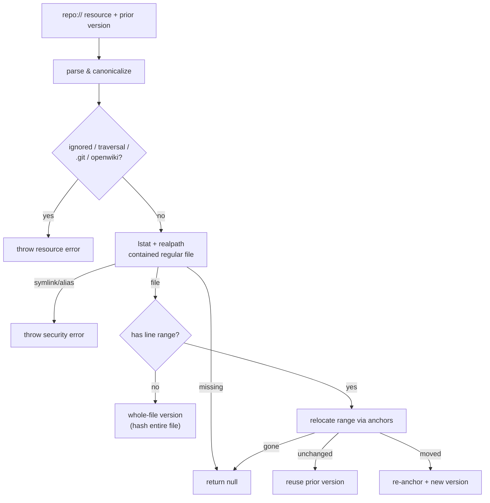

# Claims Evidence (`repo://` Resources)

Every Claim is backed by **evidence**: a stable resource identity plus an opaque version token. The only supported evidence namespace is the repository, resolved deterministically by `RepositoryEvidenceResolver` without any model involvement.

## The `repo://` resource

An evidence resource is a `repo://` URI naming a repository-relative path, optionally with a GitHub-style line fragment:

- `repo://path/to/file.ts` — whole-file evidence.
- `repo://path/to/file.ts#L10-L24` — a bounded, language-agnostic line range.

A single-line fragment such as `#L8` is accepted as input and **canonicalized** to `#L8-L8`. Path segments are percent-encoded/decoded, and a resource is re-parsed after formatting to guarantee it round-trips to a canonical form.

Parsing rejects anything that would let evidence point outside the intended surface: control characters, invalid percent-encoding, absolute or drive-letter paths, `..` traversal, and — explicitly — `.git` metadata or the generated `openwiki/` output. A line fragment must match `L<start>` or `L<start>-L<end>` with `end >= start` and safe integers.

## Versioning

Evidence versions are opaque, algorithm-prefixed SHA-256 tokens so staleness is a simple version comparison:

- **Whole-file** evidence versions (`repo-file-v1:sha256:...`) hash the complete file text.
- **Line-range** evidence versions (`repo-lines-v1:sha256:...`) hash the selected range **and embed resolver-owned anchors** — the selected line count plus hashes of the first/last selected lines and the preceding/following context.

_Resolving one repo:// resource to current evidence._

## Range relocation

Line-range evidence survives ordinary edits. When a prior version is supplied, the resolver uses its embedded anchors to relocate the range:

- if the selected range is **unchanged** at (or near) its hinted location, the prior version is reused verbatim;
- if the range **moved or resized**, the resolver locates the changed span via its context anchors and re-anchors it into a new version;
- if the range can no longer be located safely, resolution returns `null` (treated as unresolved).

Source is split into exact lines that retain their terminators, and a terminal newline does not create a phantom trailing line, so hashing is stable across platforms.

## Security boundary

The resolver enforces containment at multiple layers before reading any file:

- a `.openwikiignore` match throws rather than silently resolving, so evidence cannot cite an excluded path;
- the target is `lstat`-ed and a **symbolic link is refused**, and the `realpath` must equal the expected physical path inside the physical repository root — defeating alias/symlink traversal;
- a genuinely missing file resolves to `null` (deleted evidence), distinct from a security violation, which throws.

The resolver shares the same `.openwikiignore` rules as the agent (see [../agent/backend.md](../agent/backend.md)), so the read boundary is consistent across the whole system. For how versions are compared and cached, see [runtime-and-store.md](runtime-and-store.md); for the concept, see [overview.md](overview.md).
