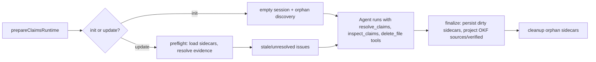

# Grounded Claims

The Grounded Claims system gives every generated wiki page a machine-checkable factual backbone. Each material proposition the wiki relies on is recorded as a **Claim** — an atomic, evidence-backed statement persisted in a JSON sidecar — so a future update can verify, refresh, or retract it deterministically rather than re-deriving the wiki's grounding from prose alone.

Claims are active only for **repository** (`code`) init and update runs. Chat, personal-brain, and non-repository output modes skip the Claims runtime entirely.

## How it fits into a run

`prepareClaimsRuntime()` in `src/claims/brains/code/runtime.ts` prepares the run-scoped `ClaimsRuntime` before the agent runs. For an init, it creates an empty session and discovers orphan sidecars (from deleted pages). For an update, it runs a **preflight** that loads every persisted sidecar, resolves each evidence resource against current source, and classifies issues as `stale` (the source changed since the claim was established) or `unresolved` (the source no longer exists). The issue count is surfaced to diagnostics but does not block the update no-op skip or create mandatory agent work.

The runtime is wired into the agent graph by `createClaimsIntegration()` in `src/claims/brains/code/integration.ts`, which adds three tools and one middleware:

- **`resolve_claims`** — validate and apply a batch of claim mutations.
- **`inspect_claims`** — read claim state without a write obligation.
- **`delete_file`** (Claims-aware) — record a page deletion so its sidecar is cleaned up.
- **Claims read-note middleware** — decorates `read_file` results for grounded pages with a non-persisted note listing stale/unresolved claim ids.

After the agent finishes, `ClaimsRuntime.finalize()` persists dirty sidecars, rechecks evidence is still current, stamps a verification event, and cleans orphan sidecars. Finalization runs inside the run's `finalize` stage alongside wiki artifact finalization. See [Agent workflow § Claims finalization](../agent/workflow.md#claims-finalization).

## Claim structure and sidecar persistence

A Claim is an atomic factual proposition with a stable OpenWiki-generated identifier:

| Field       | Type         | Description                                          |
| ----------- | ------------ | ---------------------------------------------------- |
| `id`        | `string`     | Stable `claim_`-prefixed UUID, allocated by OpenWiki |
| `statement` | `string`     | One concise, falsifiable proposition                 |
| `evidence`  | `Evidence[]` | One or more source resources with version tokens     |

Each `Evidence` carries a `resource` (a resolver-owned source identity such as `repo://src/agent/index.ts#L195-L210`) and a `version` (an opaque resolver-owned token observed when the claim was established). The version lets the resolver detect whether the source changed and, for line ranges, relocate the evidence rather than treating a shifted range as stale.

Sidecars live at `openwiki/.claims/<page-path>.json` and follow the `PageClaims` schema:

| Field           | Type        | Description                                    |
| --------------- | ----------- | ---------------------------------------------- |
| `schemaVersion` | `1`         | Sidecar format version                         |
| `pageVersion`   | `string`    | `sha256:<hex>` hash of the generated Markdown  |
| `claims`        | `Claim[]`   | Complete proposition set owned by the page     |
| `verification`  | `{by, at}?` | Last successful complete Claims reconciliation |

The `ClaimsStore` in `src/claims/brains/code/store.ts` owns all sidecar I/O: it resolves paths through a physical containment gate (using `realpath` to prevent symlink-based escapes), validates every sidecar against a strict Zod schema on load, and writes atomically. Reserved wiki files (`index.md`, `log.md`, `instructions.md`, `_plan.md`) and the `.claims` directory itself are excluded from Claims ownership by `isGroundedWikiPage()` in `src/claims/brains/code/paths.ts`.

## Mutation operations

`resolve_claims` accepts an array of pages, each with an ordered list of atomic operations applied in sequence. The four operation types:

| Operation | Purpose                                             | Requires                           |
| --------- | --------------------------------------------------- | ---------------------------------- |
| `add`     | Add a new claim; OpenWiki allocates the id          | `statement`, `evidence`            |
| `confirm` | Reaffirm an existing claim against current evidence | `id`                               |
| `update`  | Revise a claim's statement and/or evidence          | `id` + (`statement` or `evidence`) |
| `retract` | Remove an obsolete claim                            | `id`                               |

`applyClaimOperations()` in `src/claims/core/mutations.ts` validates the full starting claim set, resolves all evidence through the resolver, and then applies operations — **atomically per page**. If any operation fails (unknown id, duplicate id targeting, evidence that does not resolve, duplicate evidence resource), the entire batch throws without partial changes. The resolver is memoized per batch via `cacheEvidenceResolver()` so a resource shared across operations resolves once.

Two safety invariants enforced during mutation:

- A claim id is **globally unique** across all pages: `claimOwners` in `ClaimSession` tracks the owning page of every id, and `assertClaimOwnershipAvailable()` rejects an `add` whose id already belongs to a different page.
- A claim targeted by `confirm`/`update`/`retract` must exist in the current page's claim set; targeting the same id twice in one batch is rejected.

## Evidence resolution

The `RepositoryEvidenceResolver` in `src/claims/evidence/repository/resolver.ts` resolves `repo://` evidence URIs against the working tree:

- **Whole-file evidence** (`repo://path`) — version is a SHA-256 of the file content.
- **Line-range evidence** (`repo://path#L10-L24`) — version carries relocation metadata (first/last selected line hashes, preceding/following context hashes) encoded into an opaque `repo-lines-v1:sha256:` token. When the source changed, the resolver uses these anchors to relocate the range rather than reporting it stale, so a claim survives a refactor that shifted lines without changing the cited content.
- Path containment is enforced: the resolved physical path must stay inside the repository root (checked via `realpath`), and `.openwikiignore` rules are honored so evidence cannot be established against ignored paths. Security failures throw `EvidenceSecurityError` rather than degrading.

The resource URI scheme is parsed and formatted by `src/claims/evidence/repository/resource.ts`: paths are percent-encoded, fragments use `#Lx` or `#Lx-Ly` syntax, and the format/parse round-trip is verified for normalization.

## Preflight and read-note debt

For update runs, `runClaimsPreflight()` in `src/claims/brains/code/preflight.ts` loads every current page's sidecar and resolves each evidence resource against current source. Each claim's evidence is classified:

- **`stale`** — the resource resolves but its version changed (the source was modified).
- **`unresolved`** — the resource no longer exists (the file was deleted or moved beyond relocation).

Issues are **lazy**: they are surfaced only when the agent reads the affected page, via the Claims read-note middleware. The note is appended to the `read_file` tool result (never to the file on disk) and lists the affected claim ids and their issue kind. This keeps preflight from creating mandatory global work — an update touching only one page never sees debt notes for unrelated pages.

Pages with no Claims yet receive a different note guiding the agent to establish Claims before writing factual prose. This is the `[OpenWiki Claims: this page has no Claims yet...]` note visible at the bottom of pages in this wiki.

## OKF front-matter projection

Claims project two OKF v0.2 front-matter fields deterministically:

### `sources` — evidence projection

`synchronizeClaimSources()` in `src/okf/claim-sources.ts` runs during wiki finalization (after Mermaid, index sync, and link validation, but before generated provenance). It reads each page's current evidence resources, converts line-range resources to whole-file form, and writes them into the `sources` front-matter field with deterministic `openwiki-source-` prefixed IDs. Producer-authored source entries are retained; only OpenWiki-owned entries are replaced, so a later reconciliation can update its own projection without clobbering independently authored sources.

### `verified` — verification stamp

`synchronizeClaimsVerification()` in `src/okf/claims-verification.ts` projects the durable verification event (`{by: openwiki/<version>, at: <run time>}`) into the `verified` front-matter field. It retains human and process events while replacing only events in the `openwiki/` producer actor family. A page without an active durable event (e.g. evidence debt, empty Claims) loses its OpenWiki verification without touching other events. Bare verifier mappings are normalized to list form when touched.

Both projections run inside `finalizeWikiArtifacts()` in `src/agent/wiki-finalizer.ts`, which is the shared finalization pipeline used by both the native agent's OKF middleware and the MCP host session manager. The `claims_sources` step runs only when a Claims runtime is active.

## Finalization behavior

`ClaimSession.finalize()` in `src/claims/brains/code/session.ts` persists only **dirty** pages (those whose claims changed during the run). For each dirty page it:

1. Awaits any pending mutation.
2. Rejects if unresolved evidence debt remains for the page.
3. Rechecks that all evidence is still current against the resolver.
4. Hashes the current Markdown (throws `ClaimsPageMissingError` if the file disappeared).
5. Writes the sidecar with the updated `pageVersion` and `verification` event.

Page-local persistence failures are **isolated as warnings** rather than aborting the run: a page whose Markdown disappeared gets its sidecar removed and a warning is recorded, but the rest of finalization continues. Non-recoverable errors (e.g. a security boundary violation) do throw. Orphan sidecars (whose Markdown pages no longer exist) are cleaned up during finalization.

The verification event stamped during finalization is `{by: OPENWIKI_PRODUCER_ACTOR, at: <runTimestamp>}`, sharing the same single run timestamp used by the `generated` provenance stamp, so every page whose Claims were reconciled in one run shares one `verified.at`.

## The delete_file tool

The Claims system wraps DeepAgents' `delete_file` with a Claims-aware variant in `src/claims/brains/code/tools.ts`. A successful deletion calls `ClaimSession.recordDeletion()`, which marks the page as deleted so its sidecar is removed during finalization. The tool is gated to grounded wiki pages only — it rejects paths outside `/openwiki/`, reserved files, and the `.claims` directory.

## Agent prompt integration

The `CODE_SYSTEM_PROMPTS` init template in `src/agent/prompts/code.ts` imports `CLAIMS_SUBSTANCE_GUIDANCE` from `src/claims/guidance.ts` and embeds it in the system prompt. This shared guidance defines the substance standard for Claims: atomic means one coherent falsifiable idea (not one symbol or source line), one component may support several Claims when each records a different truth, and the materiality test asks whether a false proposition would change a reader's architectural model or safe-change plan.

The init workflow instructs the agent to establish Claims **before** writing factual prose for each page, cite the narrowest sufficient source span as `repo://path#L10-L24`, and call `resolve_claims` before the corresponding `write_file` or `edit_file` for new or materially changed factual prose. Style- or navigation-only edits require no Claims call.

## Key source files

| File                                         | Role                                                                           |
| -------------------------------------------- | ------------------------------------------------------------------------------ |
| `src/claims/core/types.ts`                   | `Claim`, `Evidence`, `ClaimOperation`, `EvidenceResolver` interfaces           |
| `src/claims/core/mutations.ts`               | `applyClaimOperations()` — atomic batch validation and application             |
| `src/claims/core/errors.ts`                  | `ClaimsError` hierarchy (session, persistence, evidence, security)             |
| `src/claims/core/resolver-cache.ts`          | `cacheEvidenceResolver()` — per-phase memoization                              |
| `src/claims/evidence/repository/resolver.ts` | `RepositoryEvidenceResolver` — `repo://` resolution with line-range relocation |
| `src/claims/evidence/repository/resource.ts` | `repo://path#Lx-Ly` URI parse/format                                           |
| `src/claims/brains/code/types.ts`            | `PageClaims`, `ResolveClaimsInput`, `GroundingIssue`                           |
| `src/claims/brains/code/runtime.ts`          | `prepareClaimsRuntime()` — run preparation                                     |
| `src/claims/brains/code/session.ts`          | `ClaimSession` — run-scoped state, mutation, inspection, finalization          |
| `src/claims/brains/code/store.ts`            | `ClaimsStore` — sidecar persistence with path containment                      |
| `src/claims/brains/code/tools.ts`            | `resolve_claims`, `inspect_claims`, Claims-aware `delete_file`                 |
| `src/claims/brains/code/middleware.ts`       | Claims read-note middleware                                                    |
| `src/claims/brains/code/preflight.ts`        | `runClaimsPreflight()` — stale/unresolved detection                            |
| `src/claims/brains/code/paths.ts`            | Path canonicalization, reserved-file exclusion                                 |
| `src/claims/brains/code/integration.ts`      | `createClaimsIntegration()` — wires tools + middleware                         |
| `src/claims/guidance.ts`                     | `CLAIMS_SUBSTANCE_GUIDANCE` — shared substance standard                        |
| `src/okf/claim-sources.ts`                   | `synchronizeClaimSources()` — OKF `sources` projection                         |
| `src/okf/claims-verification.ts`             | `synchronizeClaimsVerification()` — OKF `verified` projection                  |

## Focused tests

| Test file                                          | Coverage                                                        |
| -------------------------------------------------- | --------------------------------------------------------------- |
| `test/claims/brains/code/session.test.ts`          | Mutation batches, claim ownership, finalization, deletion       |
| `test/claims/brains/code/store.test.ts`            | Sidecar load/write, path containment, orphan discovery          |
| `test/claims/brains/code/tools.test.ts`            | Tool schema validation, cross-page batching, delete_file gating |
| `test/claims/brains/code/preflight.test.ts`        | Stale/unresolved classification, issue ordering                 |
| `test/claims/brains/code/middleware.test.ts`       | Read-note decoration, failed-read handling                      |
| `test/claims/brains/code/runtime.test.ts`          | Init vs update preparation, finalization warnings               |
| `test/claims/core/mutations.test.ts`               | Atomic application, duplicate detection, evidence resolution    |
| `test/claims/evidence/repository/resolver.test.ts` | Line-range relocation, path containment, `.openwikiignore`      |
| `test/claims/evidence/repository/resource.test.ts` | URI round-trip, normalization, percent encoding                 |
| `test/okf/claim-sources.test.ts`                   | Source projection, producer entry retention, deduplication      |
| `test/okf/claims-verification.test.ts`             | Verification projection, actor filtering, list normalization    |
| `test/agent/claims-agent-integration.test.ts`      | End-to-end agent run with Claims                                |
| `test/agent/claims-run-lifecycle.test.ts`          | Claims runtime lifecycle in a full run                          |

## Things to watch when changing Claims

- Claims are **page-owned**: a claim id belongs to exactly one page. Moving a claim between pages requires a `retract` on the old page and an `add` on the new one.
- The `claimOwners` map in `ClaimSession` is the single source of truth for id-to-page ownership. Any new mutation path must update it via `replaceClaimOwnership()`.
- Finalization rechecks evidence **after** the agent finishes, so a source edit made during the run is detected. If the evidence changed, finalization throws (not a warning) unless the page also has unresolved debt, in which case it is a warning.
- The `claims_sources` projection step in `finalizeWikiArtifacts()` must run **before** `generated_provenance` so the OKF `sources` field is current before the generated stamp is reconciled.
- `isGroundedWikiPage()` in `paths.ts` is the single gate for which pages receive sidecars. If a new reserved or structural file is added under `openwiki/`, add it to `RESERVED_WIKI_FILES` to keep it out of Claims.
- The Claims runtime is shared with the MCP host session manager (see [Coding-agent integrations](../integrations/coding-agents.md)). Changes to `prepareClaimsRuntime` or `ClaimSession` affect both the native agent and host-authored runs.
