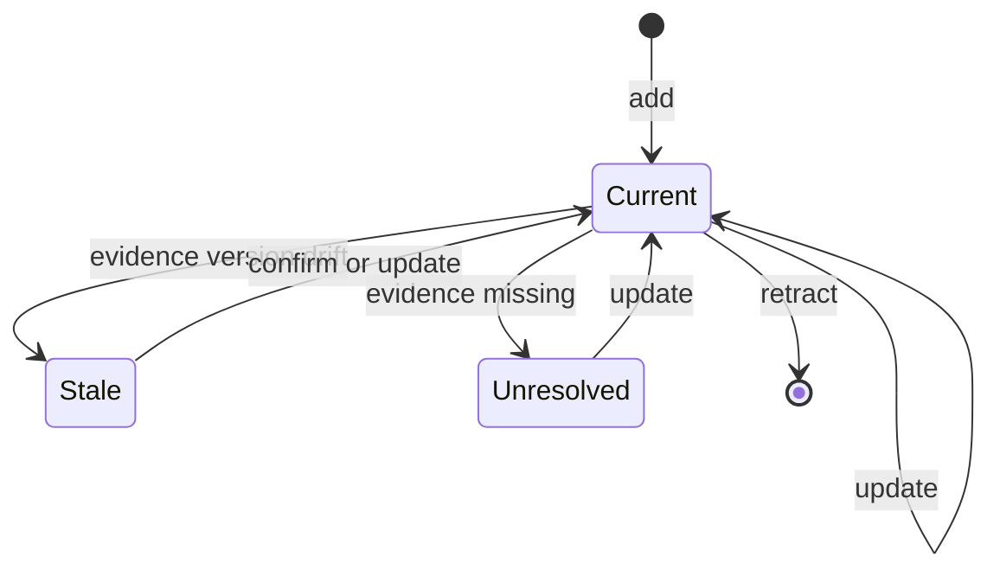

# Grounded Claims Overview

Grounded Claims keep a code wiki honest. Every material fact the wiki relies on is recorded as a **Claim** tied to versioned source **evidence**. When that evidence changes or disappears, OpenWiki knows exactly which propositions need to be confirmed, rewritten, or retired.

## What a Claim is

A Claim is an atomic, independently verifiable factual proposition about the system, backed by one or more evidence resources that jointly support it. "Atomic" means one coherent, falsifiable idea — not one symbol or source line — so a single Claim may connect multiple components and cite multiple resources when they establish one relationship or end-to-end behavior. The shared `CLAIMS_SUBSTANCE_GUIDANCE` standard codifies this materiality test so it stays consistent across init, update, migration, and tool descriptions.

Each **Evidence** entry pairs a stable, resolver-owned `resource` identity with an opaque `version` token captured when the claim was established. That stored version is what later staleness detection compares against.

## Lifecycle

Claims are mutated through four operations:

| Operation | Effect                                                         |
| --------- | -------------------------------------------------------------- |
| `add`     | Creates a claim; OpenWiki allocates its identifier             |
| `confirm` | Re-affirms an existing claim against current evidence versions |
| `update`  | Revises the statement and/or evidence of an existing claim     |
| `retract` | Removes an obsolete claim                                      |

`confirm`, `update`, and `retract` target an existing claim by its stable `id`; only `add` allocates a new one.

_Claim states and the operations that move between them._

## Staleness

A grounding issue on an existing claim is classified as either **stale** (its evidence still exists but its version has drifted) or **unresolved** (its evidence can no longer be located). Preflight resolves each evidence resource once at its stored version and, for a given claim, records **unresolved** when any resource is missing, otherwise **stale** when a resolved resource's version has changed — so unresolved takes precedence over stale when both conditions touch the same claim. Resolution errors propagate rather than being treated as deleted evidence, so a transient read failure cannot be mistaken for a retired claim. These issues are surfaced lazily when the owning page is read, so the agent sees exactly which propositions need attention during a run, and are emitted in a stable page-then-kind-then-claimId order.

## Storage layout

Only **code-brain** (repository) claims exist — there is no personal Claims brain. Claims persist as per-page sidecars under the `.claims` directory relative to the wiki root. The reserved files `index.md`, `log.md`, and `instructions.md` never own claims, and `.claims` itself is excluded from page paths.

A page's sidecar records:

- a **schema version** (`1` in the current code-brain format) for the persisted format,
- a **page-version** content snapshot of the generated Markdown — in schema v1 its drift is informational and does not create agent work,
- the complete **claim set** owned by the page, and
- an optional **verification event** marking the last successful full reconciliation.

For the evidence resolver and `repo://` identities behind each Evidence entry, see [evidence.md](evidence.md). For the run-scoped runtime that persists sidecars, applies mutations, and runs preflight, see [runtime-and-store.md](runtime-and-store.md). For how the `submit_page` tool and the page-worker lifecycle present Claims to the agent, see [agent-integration.md](agent-integration.md). For how Claims are stamped into OKF front matter alongside deterministic provenance, see [okf/overview.md](../okf/overview.md).
