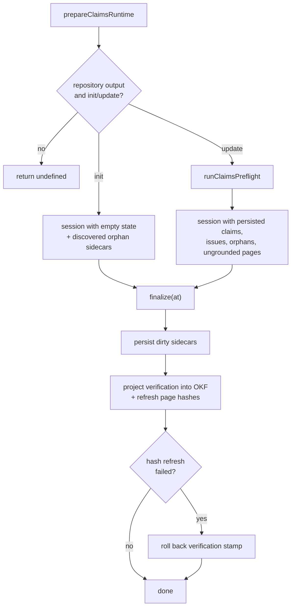

# Claims Runtime & Store

The Claims runtime is the run-scoped machinery that loads persisted claim state, exposes it to the agent, and writes it back at the end of a run. It exists only for repository code wikis; there is no personal Claims brain.

## Preparing the runtime

`prepareClaimsRuntime` builds a Claims runtime **only** for repository output mode and the `init`/`update` commands. It returns `undefined` for `chat` runs and for local-wiki output, so those runs carry no Claims obligation at all.

- **init** creates a session with **empty** persisted state, but still seeds it with the orphan sidecars discovered on disk — so a fresh generation cleans up sidecars left behind by a previous wiki.
- **update** first runs [preflight](#preflight-and-staleness) against the persisted sidecars, then constructs the session from the preflight's persisted claims, lazy issues, orphan pages, and ungrounded pages.

_Runtime preparation and finalization for init and update runs._

## Finalization

`ClaimsRuntime.finalize` persists dirty claims at the shared run timestamp, reports any non-fatal warnings through the caller's sink, then projects durable **verification** into OKF front matter and refreshes the affected pages' content hashes.

If a page-local hash refresh cannot persist after the verification projection, the verification stamp is **rolled back** for exactly those pages — so a sidecar's stored page hash can never disagree with the Markdown it stamped as verified.

Warning delivery is wrapped defensively: an exception thrown by the caller's diagnostic sink is swallowed, so telemetry noise can never fail a run.

## Store and sidecar layout

Persistence is rooted at `openwiki/.claims` under the repository root, and the store requires an absolute repository root. Each page owns a strict JSON sidecar validated by schema:

- `schemaVersion` — a literal version constant,
- `pageVersion` — a `sha256:`-prefixed 64-hex content hash of the generated Markdown,
- `claims` — an array where each claim carries at least one evidence entry, and
- `verification` — an optional last-successful-reconciliation event.

`discoverPages` enumerates the current grounded Markdown pages, while `discoverSidecarPages` enumerates the pages a sidecar exists for; the **difference** identifies orphan sidecars for cleanup. `hashPage` computes the `sha256:` page version from the current Markdown bytes and raises a page-missing error when the file is gone.

Sidecars are written **atomically** — a randomized temporary file is written and renamed into place, with the temporary file removed if the write fails. All store reads and writes resolve the physical regular file **without following symlinks** and enforce repository containment, so a path alias cannot redirect persistence outside the repository.

## Atomic mutations

`applyClaimOperations` is all-or-nothing: it validates every operation and **pre-resolves all evidence** before touching a cloned claim set. A batch is rejected if it targets the same existing claim id more than once, or references an unknown id.

| Operation | Behavior                                                                                                              |
| --------- | --------------------------------------------------------------------------------------------------------------------- |
| `add`     | Allocates a fresh unique id (default `claim_`-prefixed hex UUID) and stores the trimmed statement + resolved evidence |
| `confirm` | Re-resolves an existing claim's evidence at current versions                                                          |
| `update`  | Replaces statement and/or evidence, defaulting each unspecified field to the current value                            |
| `retract` | Removes the claim                                                                                                     |

Evidence resolution rejects a proposed set that **repeats a resource** or resolves two identities to the **same canonical resource**, and rejects any resource that does not resolve at all.

## Evidence caching

`cacheEvidenceResolver` memoizes each `(resource, prior-version)` resolution for exactly **one processing phase** — preflight, a single mutation batch, or a single finalization pass. A fresh wrapper is created per phase so caching never crosses a freshness boundary and stale reads cannot leak between phases.

## Preflight and staleness

On update, preflight resolves each claim's evidence at its stored version (once per run, via the cache) and records a per-claim issue:

- **unresolved** when _any_ evidence resource cannot be located, otherwise
- **stale** when a resolved resource's current version has drifted from the stored one.

Resolution **errors propagate** rather than being treated as deleted evidence, so a transient read failure is never mistaken for a retired claim. Pages that are current but carry no material claims (**ungrounded pages**) are tracked in memory only, as lazy guidance — they never create empty sidecars or mandatory global work.

For the evidence resolver and `repo://` identities these calls depend on, see [evidence.md](evidence.md). For how tools and middleware present this state to the agent, see [agent-integration.md](agent-integration.md).
