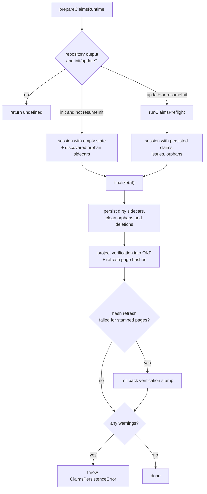
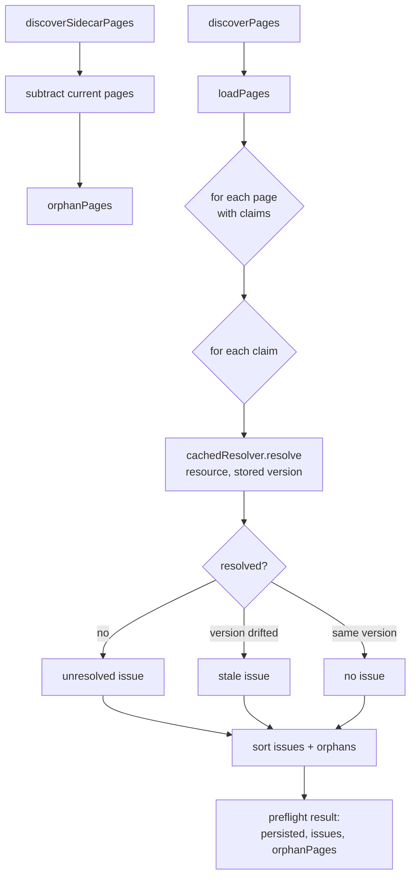

# Claims Runtime & Store

The Claims runtime is the run-scoped machinery that loads persisted claim state, exposes it to the agent through a `ClaimSession`, and writes it back at the end of a run. It exists only for repository code wikis; there is no personal Claims brain, and `chat` runs carry no Claims obligation.

## Preparing the runtime

`prepareClaimsRuntime` builds a Claims runtime **only** for `repository` output mode and the `init`/`update` commands. It returns `undefined` for `chat` runs and for `local-wiki` output, so those runs carry no Claims obligation at all. The preparation mode also depends on `PrepareClaimsRuntimeOptions.resumeInit`:

- **Fresh `init`** creates a session with **empty** persisted state, but still seeds it with the orphan sidecars discovered on disk — so a fresh generation cleans up sidecars left behind by a previous wiki. Preflight is not run, so `issueCount` is always `0`.
- **`resumeInit: true`** (or any `update`) takes the preflight path: it runs [preflight](#preflight-and-staleness) against the persisted sidecars, then constructs the session from the preflight's persisted claims, lazy issues, and orphan pages. The repository lifecycle uses `resumeInit: true` when resuming an interrupted `init` so it reloads the current-run sidecars instead of discarding them as orphans.

_Runtime preparation and finalization for fresh init, resumed init, and update runs._

## Finalization

`ClaimsRuntime.finalize(at)` persists dirty claims at the shared run timestamp, reports any non-fatal warnings through the caller's sink, then projects durable **verification** into OKF front matter and refreshes the affected pages' content hashes. Concretely it delegates to `ClaimSession.finalize`, which:

1. For each dirty page, blocks on its pending mutation, refuses to persist any page that still carries unresolved evidence debt, and re-resolves all evidence against current versions (`assertEvidenceStillCurrent`) before hashing the page and queuing it for persistence.
2. Deletes orphan sidecars and sidecars whose Markdown disappeared during the run, isolating those failures as recoverable warnings rather than aborting.
3. Writes each ready page's sidecar with a fresh `pageVersion` hash and, when the page has material claims, a `verification` event stamped `{ by: OPENWIKI_PRODUCER_ACTOR, at }`.
4. Computes a `verificationByPage` eligibility map: a page is eligible only when it is persisted, not dirty, has material claims, has no issues, and carries a verification event; otherwise it maps to `null`.

After persistence, `finalizeVerificationProjection` runs `synchronizeClaimsVerification`, which rewrites the OKF `verified` front matter of every grounded page so it retains human and other-producer events while replacing OpenWiki's own event with the active one (or removing it when the page is ineligible). It then refreshes page hashes so each sidecar describes the final Markdown bytes.

### Hash-refresh rollback

If a page-local hash refresh cannot persist after the verification projection, the verification stamp is **rolled back** for exactly those pages whose new stamp could not be synchronized — restoring their original Markdown via `rollbackClaimsVerification` — so a sidecar's stored page hash can never disagree with the Markdown it stamped as verified. Refresh failures are reported only for pages that had just received a non-null verification event; debt-driven removals stay removed even when their hash cannot be refreshed.

### Warnings fail the run

Any non-fatal warning produced during finalization is forwarded to the caller's `onWarning` sink **and** causes `finalize` to throw `ClaimsPersistenceError("Claims finalization was not fully durable: …")`. So partial-durability conditions are strict failures, not silent best-effort results. Warning delivery to the caller's sink is wrapped defensively: an exception thrown by the sink is swallowed, so telemetry noise can never fail a run.

## Store and sidecar layout

Claims persistence is rooted at `openwiki/.claims` under the repository root, and the store requires an absolute repository root. Each page owns a strict JSON sidecar validated by a Zod schema:

- `schemaVersion` — the literal `CODE_CLAIMS_SCHEMA_VERSION` (currently `1`),
- `pageVersion` — a `sha256:`-prefixed 64-hex content hash of the generated Markdown,
- `claims` — an array where each claim carries an `id`, a `statement`, and at least one `evidence` entry, and
- `verification` — an optional last-successful-reconciliation event (`{ by, at }`).

Cross-record uniqueness is enforced on top of the schema: a sidecar with a duplicate claim `id`, or a claim that repeats an evidence `resource`, is rejected. `discoverPages` enumerates the current grounded Markdown pages (skipping reserved files like `index.md`, `log.md`, and `instructions.md`), while `discoverSidecarPages` enumerates the pages a sidecar exists for; the **difference** identifies orphan sidecars for cleanup. `hashPage` computes the `sha256:` page version from the current Markdown bytes and raises `ClaimsPageMissingError` when the file is gone.

### Atomic, contained writes

Sidecars are written **atomically** — a randomized temporary file (`.‹basename›.‹uuid›.tmp`) is written and renamed into place, with the temporary file removed (forcefully) if the write fails. All store reads and writes resolve the physical regular file **without following symlinks**: every path is `lstat`-checked (a symlink raises `ClaimsPersistenceSecurityError`), then `realpath`-resolved and verified against the canonical repository root, so a path alias cannot redirect Claims persistence outside the repository. Directory creation walks each existing ancestor the same way before `mkdir`.

## Atomic mutations

`applyClaimOperations` is all-or-nothing: it validates the starting claim set, validates every operation, and **pre-resolves all evidence** before touching a cloned claim set. A batch is rejected if it contains no operations, targets the same existing claim id more than once, or references an unknown id. Evidence is resolved through a per-batch `cacheEvidenceResolver` wrapper.

| Operation | Behavior                                                                                                              |
| --------- | --------------------------------------------------------------------------------------------------------------------- |
| `add`     | Allocates a fresh unique id (default `claim_`-prefixed hex UUID) and stores the trimmed statement + resolved evidence |
| `confirm` | Re-resolves an existing claim's evidence at current versions                                                          |
| `update`  | Replaces statement and/or evidence, defaulting each unspecified field to the current value                            |
| `retract` | Removes the claim                                                                                                     |

At the session level, `ClaimSession.resolveClaims` serializes page-local mutations through a `pendingMutation` promise, asserts claim-id ownership is unique across all pages (`assertClaimOwnershipAvailable`), marks the page dirty, and clears preflight issues for the targeted claim ids. Evidence resolution rejects a proposed set that **repeats a resource** or resolves two identities to the **same canonical resource**, and rejects any resource that does not resolve at all.

## Evidence caching

`cacheEvidenceResolver` memoizes each `(resource, prior-version)` resolution for exactly **one processing phase** — preflight, a single mutation batch, or a single finalization pass. A fresh wrapper is created per phase (`runClaimsPreflight`, each `applyClaimOperations` call, and `ClaimSession.finalize` each instantiate their own), so caching never crosses a freshness boundary and stale reads cannot leak between phases. Because the cache stores the in-flight `Promise`, concurrent resolutions of the same key within one phase deduplicate rather than race.

## Preflight and staleness

On update (and on resumed init), preflight resolves each claim's evidence at its stored version (once per run, via the cache) and records a per-claim issue:

- **unresolved** when _any_ evidence resource cannot be located, otherwise
- **stale** when a resolved resource's current version has drifted from the stored one.

Issues are sorted deterministically (page, then kind, then claim id), as are orphan pages. Resolution **errors propagate** rather than being treated as deleted evidence, so a transient read failure is never mistaken for a retired claim. Pages that are current but carry no material claims (**ungrounded pages**) are tracked in memory only, as lazy guidance — they never create empty sidecars or mandatory global work.

_Preflight freshness checking for update and resumed-init runs._

For the evidence resolver and `repo://` identities these calls depend on, see [evidence.md](evidence.md). For how tools and middleware present this state to the agent, see [agent-integration.md](agent-integration.md).
