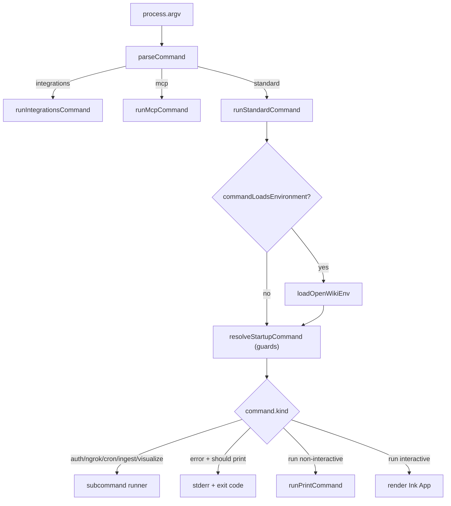

# CLI Command Parsing & Dispatch

The `openwiki` binary turns process arguments into one typed command, applies startup guards, and dispatches to the right handler — a host-integration runner, a standard subcommand runner, a startup error, non-interactive print output, or the interactive Ink app.

## Entry pipeline

`cli.tsx` is the process entrypoint. It installs the crash guard _before any run starts_ so an escaped rejection (for example a subagent error surfacing on the microtask queue) is still recorded and stamped rather than hard-killing the process with no telemetry. It then parses argv once with `parseCommand` and splits dispatch into two surfaces: the host-integration commands (`integrations`, `mcp`) go straight to dedicated runners in `integrations.ts`, while every other command goes through `runStandardCommand`, the native OpenWiki startup and rendering pipeline.

_Argument parsing through command dispatch, including the host-integration split._

## Host-integration commands

`integrations` and `mcp` are dispatched _before_ the standard path and deliberately do not load OpenWiki model credentials, because they run against the host coding agent's own authenticated session rather than OpenWiki's provider env.

- `openwiki integrations install|list|uninstall <target> [--force] [--project [path]]` is registry-driven: `parseIntegrationsCommand` resolves the target through the host target registry, selects a `user` (home) or `project` scope, and `runIntegrationsCommand` reports per-target install status or performs a transactional skill + managed-MCP install/uninstall.
- `openwiki mcp [--host <id>]` starts the internal rootless stdio MCP server. `parseMcpCommand` validates the host identifier (1–64 lowercase letters, digits, or hyphens), and `runMcpCommand` resolves the host target and launches `runOpenWikiMcp` with the target's producer actor.

For the install transaction and registry internals see [../integrations/install.md](../integrations/install.md).

## The command union

`parseCommand` returns a single discriminated `CliCommand` whose `kind` drives all downstream behavior. The kinds cover the host-integration commands (`integrations`, `mcp`), the credential/help commands (`auth`, `ngrok`, `visualize`, `ingest`, `cron`, `help`), the generative `run` command (`chat`/`init`/`update`), and an `error` command carrying a message and exit code 1. Every parse failure is represented as an `error` variant rather than a thrown exception, keeping the exit path uniform.

A `run` command records not just the OpenWiki `command` but the run `mode` (`personal` or `code`) and how the mode was chosen (`default`, `option`, or `positional`), plus `dryRun`, `print`, `shouldStart`, `language`, `languageWarning`, `modelId`, `userMessage`, and `telemetryFile`.

## Run-command parsing rules

`parseRunCommand` walks argv once and enforces several invariants:

- `--init` and `--update` cannot be combined; a conflicting explicit command is rejected.
- `--dry-run` is accepted only in development mode (`NODE_ENV=development` or `OPENWIKI_DEV=1`); otherwise it is reported as an unknown option.
- `--debug` sets `OPENWIKI_DEBUG=1` at parse time so full credential/error diagnostics are opted into before any run starts.
- A mode word (`personal`/`code`) in the first positional slot selects the mode even when flags precede it (e.g. `openwiki --print code --update`), matching the `openwiki code ...` form; otherwise it would silently become the user message.
- Conflicting explicit modes (a positional mode plus a different `--mode` value) are rejected.
- A non-chat command (init/update) whose mode is still `default` falls back to `code`, so repository generation targets the repository rather than the personal wiki.
- `--print` requires that the run actually starts (a message, `--init`, or `--update`); a bare print run with nothing to do is rejected.

## Run mode → output mode

Run mode maps deterministically to where output is written: `code` mode writes `repository` output at the code runtime's cwd, while `personal` mode writes `local-wiki` output into the OpenWiki local wiki directory. This mapping is what makes a `code` run dispatch into repository generation and a `personal` run stay in the local wiki.

## Startup guards

`resolveStartupCommand` runs before any telemetry event is sent and can rewrite a `run` command into an `error`:

- interactive chat with no message and no TTY is rejected (must pass a message or `--init`/`--update`);
- a non-interactive start (print mode, or no TTY) with missing provider credentials is rejected with a provider-specific hint, unless a `--print` update can be skipped as a clean no-op before credentials are even required;
- an explicitly empty user message is rejected.

The clean-no-op escape hatch loads the `OpenWikiIgnore` rules and asks `getUpdateNoopStatus` whether the update would change nothing; if so the run is allowed to proceed even without credentials on the non-interactive path.

## Rendering decision

After guards, `runStandardCommand` decides once whether this is the first run on the machine (which mints the install id) before any event is sent — but only for commands that emit telemetry (non-dry-run `init`/`update`). It then dispatches:

- subcommand runners for `auth`/`ngrok`/`cron`/`ingest`/`visualize`;
- a startup error printed to stderr when print mode, no TTY, or an explicit start was requested;
- non-interactive print mode with a framed first-run notice on stderr to keep piped stdout clean;
- otherwise the interactive TUI with the notice rendered as a box above the app.

`shouldRunNonInteractively` sends a run to the print path when `--print` was requested or stdin is not a TTY and the run was asked to start; interactive chat without a message still requires a TTY. `shouldAutoExitStartupRun` marks a real (non-dry-run, non-print) init or update run that was asked to start so the UI exits automatically when it finishes.

## Repository generation dispatch

Both render paths ultimately call `runOpenWikiAgent` in `src/agent/index.ts`. When the resolved output mode is `repository` and the command is `init` or `update`, `runOpenWikiAgent` routes into the native repository generation lifecycle (`runNativeRepositoryGeneration`) rather than the chat agent core. This is the single dispatch boundary where a CLI `code` run becomes a durable repository-generation run: planning → page agents → finalizing, with source-drift replanning when `finishRepositoryRun` invalidates. The run-mode → output-mode mapping in the CLI is therefore what selects this branch.

For the agent run internals see [../agent/overview.md](../agent/overview.md); for the print-mode runner that wraps this in the telemetry boundary see [runners.md](runners.md); for the interactive Ink app see [tui.md](tui.md); for the subcommand runners see [runners.md](runners.md).
