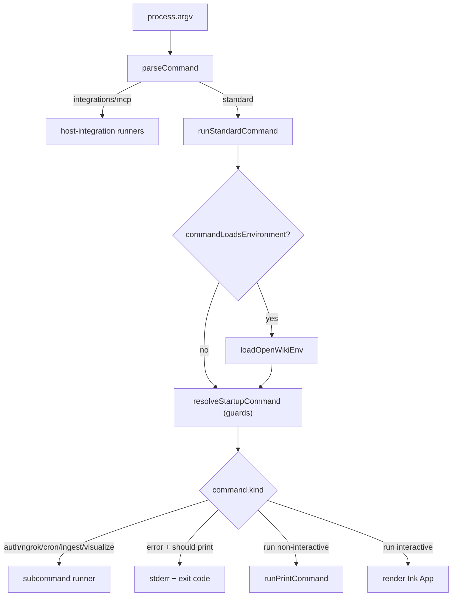

# CLI Command Parsing & Dispatch

The `openwiki` binary turns process arguments into one typed command, applies startup guards, and dispatches to the right handler — a subcommand runner, a startup error, non-interactive print output, or the interactive Ink app.

## Entry pipeline

`cli.tsx` is the process entrypoint. It installs the crash guard _before any run starts_ so an escaped rejection is still recorded and stamped rather than hard-killing the process with no telemetry. It then parses argv and dispatches the host-integration commands (`integrations`, `mcp`) separately from the standard command surface.

_Argument parsing through command dispatch._

## The command union

`parseCommand` returns a single discriminated `CliCommand` whose `kind` drives all downstream behavior. The kinds cover the host-integration commands (`integrations`, `mcp`), the credential/help commands (`auth`, `ngrok`, `visualize`, `ingest`, `cron`, `help`), the generative `run` command (`chat`/`init`/`update`), and an `error` command carrying a message and exit code 1.

A `run` command records not just the OpenWiki `command` but the run `mode` (`personal` or `code`) and how the mode was chosen (`default`, `option`, or `positional`), plus `dryRun`, `print`, `shouldStart`, `language`, `modelId`, and `userMessage`. `--init` and `--update` cannot be combined, and `--dry-run` is only accepted in development mode.

## Run mode → output mode

Run mode maps deterministically to where output is written: `code` mode writes `repository` output at the code runtime's cwd, while `personal` mode writes `local-wiki` output into the OpenWiki local wiki directory.

## Startup guards

`resolveStartupCommand` runs before any telemetry is sent and can rewrite a `run` command into an `error`:

- interactive chat with no message and no TTY is rejected (must pass a message or `--init`/`--update`);
- a non-interactive start with missing provider credentials is rejected with a provider-specific hint, unless a `--print` update can be skipped as a clean no-op before credentials are even required;
- an explicitly empty user message is rejected.

## Rendering decision

After guards, `runStandardCommand` decides once whether this is the first run on the machine (which mints the install id) before any event is sent. It then dispatches: subcommand runners for `auth`/`ngrok`/`cron`/`ingest`/`visualize`; a startup error printed to stderr when print mode, no TTY, or an explicit start was requested; non-interactive print mode with a framed first-run notice on stderr to keep piped stdout clean; otherwise the interactive TUI with the notice rendered as a box above the app.

For the interactive TUI internals see [tui.md](tui.md); for the subcommand runners see [runners.md](runners.md); for the run lifecycle these commands drive see [../agent/overview.md](../agent/overview.md).
