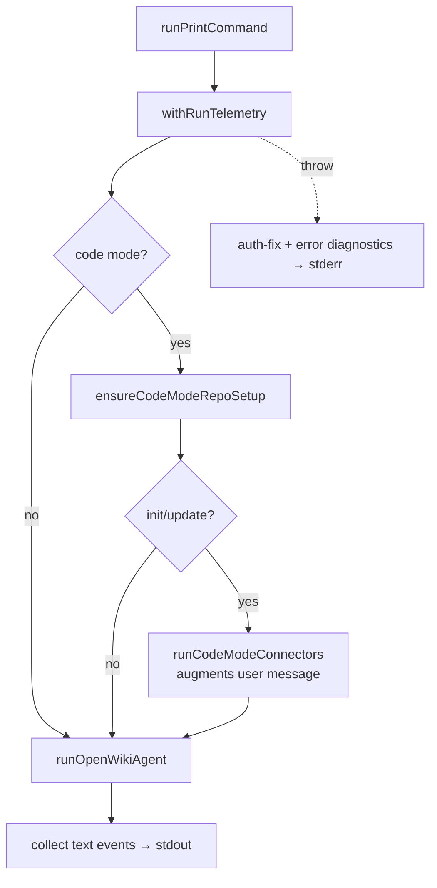

# CLI Subcommand Runners & Diagnostics

Each non-app CLI command is handled by a dedicated runner in `runners.ts` (plus the host-integration runners in `integrations.ts`). Every runner writes user output to stdout, routes errors to stderr, and sets `process.exitCode`.

## Runner responsibilities

| Command       | Runner                | What it does                                                                              |
| ------------- | --------------------- | ----------------------------------------------------------------------------------------- |
| `ngrok start` | `runNgrokCommand`     | Starts an ngrok tunnel for OAuth callback delivery                                        |
| `visualize`   | `runVisualizeCommand` | Serves the visualizer, or exports a static bundle when `--export` is set                  |
| `cron`        | `runCronCommand`      | Lists/pauses/resumes/deletes connector schedules and re-prints the resulting schedule set |
| `ingest`      | `runIngestCommand`    | Runs personal ingestion and prints a per-source summary; exit 1 if any source errored     |
| `auth`        | `runAuthCommand`      | Lists providers, or configures / OAuths / discovers tools for one provider                |
| `run` (`-p`)  | `runPrintCommand`     | Non-interactive `chat`/`init`/`update`                                                    |

## Print mode mirrors interactive

`runPrintCommand` runs a generative command with no TUI but the _same_ pre-agent steps as interactive. It resolves the run-mode cwd and output mode, then wraps everything in `withRunTelemetry` — the single boundary that records the run — so a throw in repository setup or the connector pull is recorded, not just printed to stderr.

_Print-mode run through the telemetry boundary._

In code mode, `ensureCodeModeRepoSetup` runs first (creating the workflow only on `init`), and for non-chat code runs the code-mode connectors pull their evidence and _augment the agent's user message_ before the run — so `--print` behaves exactly like interactive. Only `text` events are collected and flushed to stdout.

## Non-interactive diagnostics

On a print-mode failure the runner mirrors the interactive help so CI and piped runs get the same guidance: `writePrintAuthFix` prints concise, key-name-only "How to fix" steps when the failure looks like an auth error, and `writePrintErrorDiagnostics` prints labeled error diagnostics. Both are no-ops when they have nothing to add.

For interactive rendering of these same runs see [tui.md](tui.md); for the agent run they invoke see [../agent/overview.md](../agent/overview.md); for scheduling see [../operations/scheduling.md](../operations/scheduling.md).
