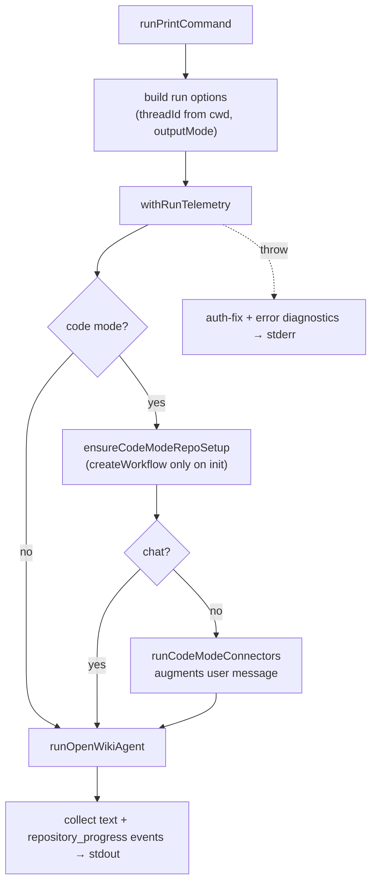

# CLI Subcommand Runners & Diagnostics

Each non-app CLI command is handled by a dedicated runner in `runners.ts` (plus the host-integration runners in `integrations.ts`). Every runner writes user output to stdout, routes errors to stderr, and sets `process.exitCode`.

## Runner responsibilities

| Command            | Runner                    | What it does                                                                              |
| ------------------ | ------------------------- | ----------------------------------------------------------------------------------------- |
| `ngrok start`      | `runNgrokCommand`         | Starts an ngrok tunnel for OAuth callback delivery                                        |
| `visualize`        | `runVisualizeCommand`     | Serves the visualizer, or exports a static bundle when `--export` is set                  |
| `cron`             | `runCronCommand`         | Lists/pauses/resumes/deletes connector schedules and re-prints the resulting schedule set |
| `ingest`           | `runIngestCommand`        | Runs personal ingestion and prints a per-source summary; exit 1 if any source errored     |
| `auth`             | `runAuthCommand`          | Lists providers, or configures / OAuths / discovers tools for one provider                |
| `integrations`     | `runIntegrationsCommand`  | Lists, installs, or uninstalls a host target into the user or project scope               |
| `mcp`              | `runMcpCommand`           | Starts the local stdio MCP server for a resolved host                                      |
| `run` (`-p`/`--print`) | `runPrintCommand`      | Non-interactive `chat`/`init`/`update`                                                    |

### Integrations and MCP runners

`runIntegrationsCommand` is registry-driven: it resolves the install root from the command scope (user home directory or the project root), then for `list` it queries each registered host target's status; for `install`/`uninstall` it resolves the target and delegates to the installer, printing the skill directory, MCP config path, optional backup path, and — on install — post-install restart guidance scoped to the host.

`runMcpCommand` resolves the host target from the integration registry and starts the local stdio MCP server (`runOpenWikiMcp`), passing the target's `producerActor` (falling back to the host id) so the server produces under the right actor.

## Print mode mirrors interactive

`runPrintCommand` runs a generative command with no TUI but the _same_ pre-agent steps as interactive. It resolves the run-mode cwd and output mode, builds run options (thread id derived from the cwd, debug flag, model, language, telemetry file), then wraps the body in `withRunTelemetry` — the single boundary that records the run — so a throw in repository setup or the connector pull is recorded, not just printed to stderr.

_Print-mode run through the telemetry boundary._

In code mode, `ensureCodeModeRepoSetup` runs first (creating the workflow only on `init`), and for non-`chat` code runs the code-mode connectors pull their evidence and _augment the agent's user message_ before the run — so `--print` behaves exactly like interactive. The print event handler collects both `text` events and `repository_progress` events (the latter formatted as concise lifecycle lines via `formatRepositoryPrintProgress`) into a single output buffer, then flushes the trimmed combined output to stdout.

## Non-interactive diagnostics

On a print-mode (or ingest) failure the runner mirrors the interactive help so CI and piped runs get the same guidance: `writePrintAuthFix` prints concise, key-name-only "How to fix" steps when the failure looks like an auth error, and `writePrintErrorDiagnostics` prints labeled error diagnostics. Both are no-ops when they have nothing to add.

`getAuthFix` returns an `AuthFix` (provider, API-key env var name, and whether that var came from the shell) only when the failure looks like an auth error — performing existence checks only and never reading the secret value. `getAuthFixSteps` then tailors the steps to the provider: AWS-SDK credential-chain providers get `aws sts` / credential-chain / bearer-token guidance, while key-based providers get "unset the shadowing shell export" when the key came from the shell, plus a re-enter-your-key fallback.

`getErrorDiagnostics` extracts a deduped list of allowlisted, non-secret error fields for the `--debug` panel. It walks the error, its OpenRouter metadata, any attached `openRouterDebug` payload, and (in debug mode) its `cause`/`error`/`response` nesting, reading only known-safe keys. Every value passes through `sanitizeDiagnosticText` and secret-like keys are redacted, so raw secret material never leaves.

## Schedule formatting

`schedule-format.ts` renders cron output: `formatScheduleMutationResult` prints the mutation summary (changed and skipped connectors, warnings, and Mac wake status); `formatScheduleHeader` prints the listing banner with a pluralized count; `formatPowerScheduleStatus` prints the Mac wake window; and `formatScheduleStatus` prints a per-connector block describing its cron expression, launchd installation state (paused / loaded / plist-exists-not-loaded / plist-missing / not-installed), and any warning.

For interactive rendering of these same runs see [tui.md](tui.md); for the agent run they invoke see [../agent/overview.md](../agent/overview.md); for scheduling see [../operations/scheduling.md](../operations/scheduling.md); for host-integration installation internals see [../integrations/install.md](../integrations/install.md).
