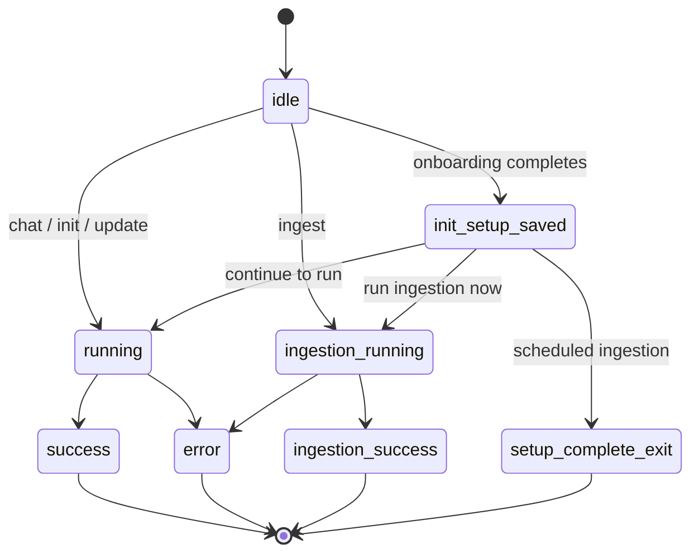

# Interactive TUI (Ink)

When a TTY is available the CLI renders an Ink application (`app/app.tsx`) instead of print mode. The app hosts chat input, a run view, and a header, and it consumes the same `OpenWikiRunEvent` stream a print run does — but folds it into a live, bounded progress model rather than raw text. Both render paths are described in [runners](runners.md); the events themselves are produced by [runOpenWikiAgent](../agent/overview.md).

## Run lifecycle state

The app tracks a finite `RunState` whose variants each carry exactly the data their render branch needs — streaming logs while a run is live, the result plus optional credential diagnostics once it settles, the concise message plus allowlisted error diagnostics and auth "how to fix" context on failure, and setup results while the onboarding wizard is open.

_App run lifecycle; states omit the opt-in credential diagnostics carried alongside `running`, `success`, and `ingestion-*` states._

Late resolutions are guarded against a superseded run. Every run bumps a per-process `activeRunId`, and the event handler, credential-diagnostics callback, and settle callbacks all check `activeRunId.current === runId` plus `mountedRef.current` before mutating state — so a result from an interrupted or superseded run cannot resurrect settled state.

Opt-in credential diagnostics (from `--debug`) are folded into a live run only while it is still `running`; `updateRunningCredentialDiagnostics` records them on a ref so a later settle can carry them forward, but is a no-op on any other status. A late diagnostics resolution therefore can never resurrect a settled run.

### Settle and auto-exit

- An **error** run sets `process.exitCode = 1` and calls `app.exit()`.
- A successful **init** or **update** startup run auto-exits with code 0 when `shouldAutoExitStartupRun` is set.
- A successful **ingestion** run auto-exits with code 0, or 1 when any source result has status `error`.

### Interrupt

<!-- openwiki: broken internal link [../reference/process-interrupt.md] file "../reference/process-interrupt.md" does not exist. Fix the href or restore the target, then delete this comment. -->
`Ctrl-C` calls `requestProcessInterrupt`, which restores the terminal first and then delivers `SIGINT` on the next tick so the Ink renderer never sees a half-torn terminal. See [process-interrupt](../reference/process-interrupt.md).

### Provider, model, and reasoning effort

The App persists provider, model, and reasoning-effort selections to the OpenWiki env immediately. Switching run mode re-mints the agent thread id so code and personal conversations never share history. A saved reasoning effort is cleared when a model change leaves it unsupported.

## The run-log reducer

`appendRunLogEvent` folds each `OpenWikiRunEvent` into a bounded `RunLogItem[]`. The reducer is a pure function over the current log and a `nextLogId` ref; the App keeps the authoritative log in `activeRunLog.current` and only snapshots it into `runState` for redraw. The five item types are `repository_progress`, `activity`, `tool`, `text`, and `debug`.

### Repository progress

A `repository_progress` event is kept as a **single replaceable item**. If one already exists it is replaced in place (preserving its id); otherwise it is prepended. It is never bounded away. The stage is one of `planning`, `generating`, `finalizing`, `replanning`, or `noop`, and carries optional `resumed`, `page`, `pageIndex` (one-based), and `pageCount` fields.

| Stage | Rendered label |
| --- | --- |
| `planning` | "Planning repository wiki" / "Resuming repository wiki planning" when `resumed` |
| `replanning` | "Repository changed during generation · rebuilding the plan" |
| `generating` | "Documenting page `N` of `M` · `path`" when `pageIndex` and `pageCount` are present, else "Documenting `path`" |
| `finalizing` | "Finalizing repository wiki" |
| `noop` | "Repository wiki is already current" (update) / "Repository wiki needs no changes" (init) |

`RunView` prefers the structured repository-progress label over the activity-derived stage while a native repository run is live; for a `noop` result it renders the same label in the completed-run details.

### Main-agent prose

Main-agent text is kept as a **single replaceable buffer**: consecutive `text` events concatenate onto the last text item, reusing its id. Subgraph prose (`source === "subgraph"`) and empty text are discarded entirely. A later `tool_start` drops any accumulated text — a tool call proves that earlier prose was narration, not the final answer — so only prose after the last tool call survives into the final response.

### Tool summary

A `tool_start` updates the **single aggregate tool summary** (`type: "tool"`) rather than emitting one line per call:

- `actionCount` increments for every started call.
- `readCount` increments for `read_file`; `searchCount` for `glob`/`grep`/`ls`; `writeCount` for `edit_file`/`write_file`.
- `taskCount` adds the number of delegated `task` targets (`tasks`/`subagents`/`agents`/`items`).
- `activeToolCallIds` accumulates the call ids still in flight; the summary's `status` is `running` while any are active, `done` when all finish cleanly, and `error` when any failed (with `errorCount` tracked separately).

`formatRunCounts` renders the live counts as "N reads · N searches · N writes · N tasks", falling back to "N actions" when no category is non-zero, and appending failures when present. After completion `formatCompletedRunCounts` omits write counts (the completion title reports unique written pages instead).

### Filesystem activity

Filesystem tool calls contribute **exact path activity** entries. `getToolPathActivities` extracts paths only from tools with trustworthy provenance — `read_file`, `edit_file`/`write_file`, `glob`, `grep`, `ls` — and deliberately excludes shell `execute` commands. Paths are normalized to repository-relative form (leading slashes and `./` stripped, backslashes converted, parent traversal rejected) and classified:

- **Operation**: `read`, `search`, or `write`.
- **Scope**: `openwiki` for paths under `openwiki/` or `.claims/`; `repository` for everything else. Search scopes collapse glob/grep patterns to their non-wildcard ancestor directory.

Each activity is activated by appending the calling tool's id to `activeToolCallIds`. Re-activating the same path+operation reuses the existing id and unions the call ids, so a shared path stays `active` until **every** reader has finished. On `tool_end`:

- The activity's `activityStatus` becomes `recent` (or `error` if the call errored and no other call is active).
- A successful repository read adds the path to the summary's unique `exploredPaths`.
- A successful write to a persistent OpenWiki Markdown page (`openwiki/*.md`, excluding sidecars) adds it to unique `writtenPaths`. Failed writes record no page.

Activities are bounded by `boundActivityLog`: all active activities are retained, plus the most recent `MAX_RECENT_ACTIVITIES` (8) non-active ones, oldest evicted. Touched activities are reordered to the end on completion so the live view reflects the just-finished call.

### Debug items

`debug` events are retained only when the run is in debug mode, and are capped at `MAX_DEBUG_ITEMS` (20); the oldest is evicted once the limit is reached.

## Rendering

`RunView` renders the live view from the bounded log:

- A spinner and "Working" label while live, or a `✓` plus `formatRunCompletionTitle` when done (e.g. "Generated 2 OpenWiki pages in 1m 2s", "OpenWiki is up to date in 3s").
- The repository-progress label, or an activity-derived stage (`getRunStage`) when no structured progress exists.
- The aggregate tool summary counts.
- **Activity sections** grouped by scope and operation ("Reading OpenWiki", "Writing OpenWiki", "Writing repository"), each rendered as a compact tree that shares directory ancestry via `buildActivityTreeLines`.
- A **cumulative exploration map** (`buildExplorationTreeLines`) listing every successfully read repository file, with the currently active read highlighted. The map is viewport-scrolled to follow the active file, and supports `j`/`k`/arrows/PgUp/PgDn scroll with `f` to return to follow mode.
- A "Recent activity" list of completed operations.
- Debug lines and, when done, the written page paths (capped at 5 visible with an "N additional pages" overflow) and the final assistant response.

### Render coalescing

The App coalesces tool-lifecycle events so Ink redraws at most a few times per second (`RUN_LOG_RENDER_DELAY_MS = 250`) while updating the in-memory log immediately. Assistant `text` tokens are retained for the final response but do **not** trigger a live redraw — tool lifecycle events provide the stable, structured progress signal while the model is working. A pending render is cancelled on settle and on unmount.

## Relationship to the run

The TUI is one of two render paths (the other is [print mode](runners.md)); both consume the events produced by [runOpenWikiAgent](../agent/overview.md). In code mode the interactive run ensures repository setup and pulls code-mode connector evidence into the agent message before invoking `runOpenWikiAgent`, and the whole pre-agent sequence is wrapped in `withRunTelemetry` so any pre-agent throw is recorded. Diagnostic text shown in the log is sanitized before display (see [../reference/platform.md](../reference/platform.md)). On failure the App builds a concise message, allowlisted error diagnostics, and auth how-to-fix context; the full credential dump is opt-in via `--debug`.
