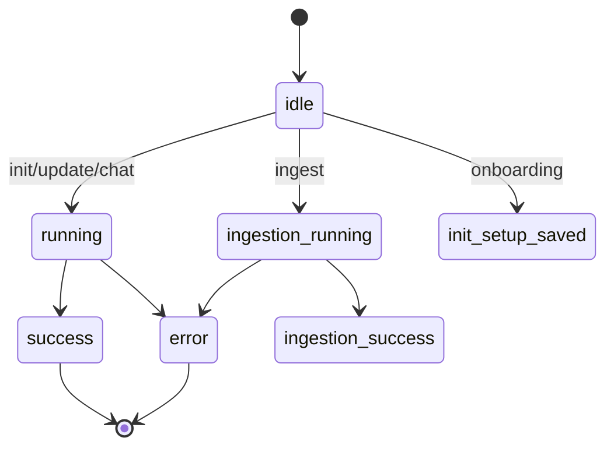

# Interactive TUI (Ink)

When a TTY is available the CLI renders an Ink application (`app/app.tsx`) instead of print mode. The app hosts chat input, a run view, and a header, and it consumes the same `OpenWikiRunEvent` stream a print run does — but folds it into a live, bounded progress model rather than raw text.

## Run lifecycle state

The app tracks a finite `RunState`, where each variant carries exactly the data its render branch needs.

_App run lifecycle; states omit the credential-diagnostics carried alongside them._

Opt-in credential diagnostics (from `--debug`) are folded into a live run only while it is still `running`; a late diagnostics resolution can never resurrect a settled run.

## The run-log reducer

`appendRunLogEvent` folds each run event into a bounded `RunLogItem[]`:

- **Main-agent prose** is kept as a single replaceable text buffer; **subgraph prose is discarded**, and empty text is ignored.
- A **`tool_start`** discards any earlier prose — a later tool call proves that prose was narration, not the final answer — and updates the single aggregate tool summary counters (actions, reads, searches, tasks, writes, errors).
- Filesystem tool calls contribute **exact path activity** entries (read/search/write, scoped `openwiki` vs `repository`) without exposing the tool transcript.
- **Debug** items are retained only when opted in and are capped, evicting the oldest beyond the limit.

This makes the live view show _what the agent is doing to which files_, plus counts, rather than a scrolling transcript. Activity paths are merged into a compact tree via shared ancestry.

## Relationship to the run

The TUI is one of two render paths (the other is [print mode](runners.md)); both consume the events produced by [runOpenWikiAgent](../agent/overview.md). Diagnostic text shown in the log is sanitized before display (see [../reference/platform.md](../reference/platform.md)).
