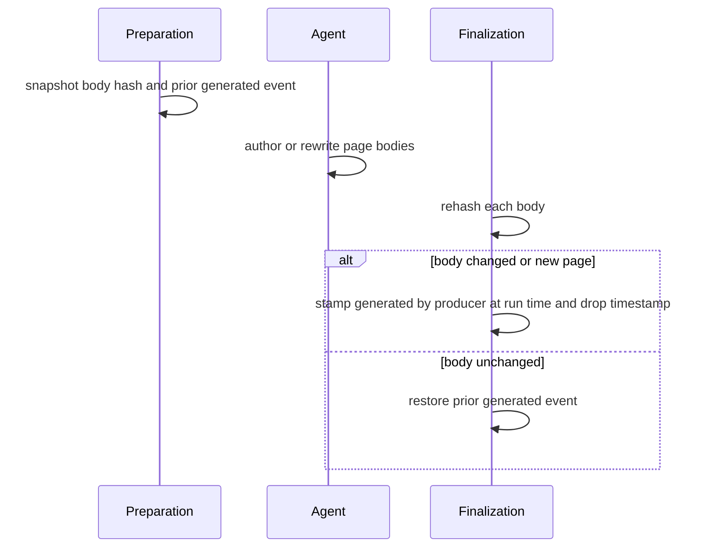
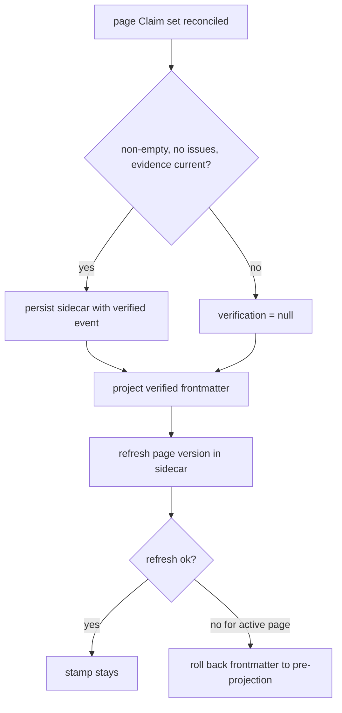
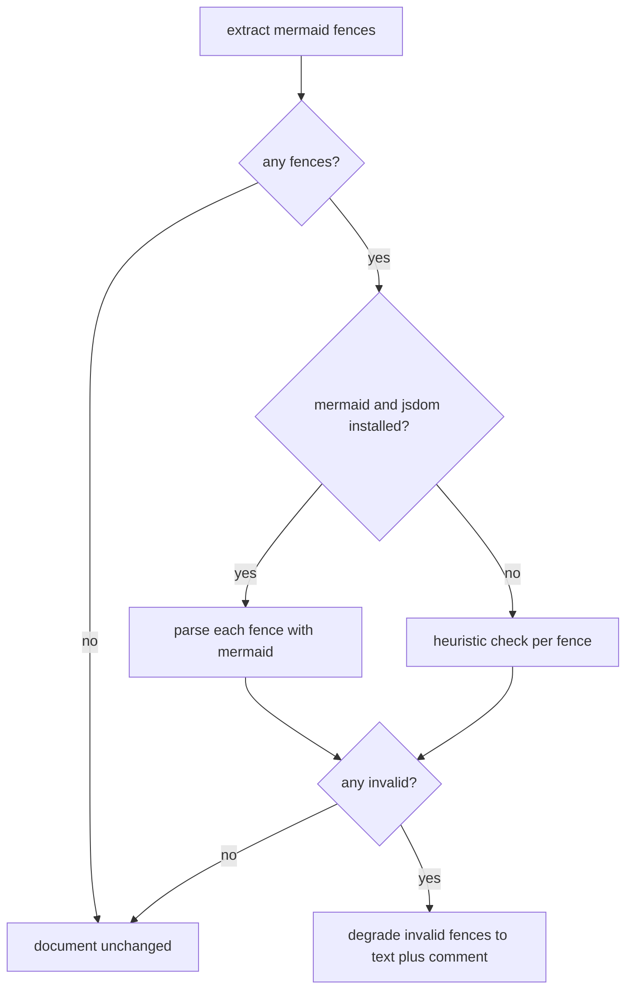

# Open Knowledge Format Output

OpenWiki emits documentation in the Open Knowledge Format (OKF): every concept
page begins with a validated YAML frontmatter block, carries code-owned
generation provenance, projects its grounded Claims into `sources` and
`verified` trust metadata, is reachable through a deterministically synchronized
directory `index.md`, and may embed Mermaid diagrams that are validated (and, if
broken, degraded) before the wiki is finalized. These guarantees are applied by
deterministic post-authoring passes rather than by the authoring agent, so the
persisted wiki is conformant regardless of what the agent wrote.

These passes run in a fixed order inside the wiki finalizer: a pre-run
preparation phase migrates existing pages to OKF and snapshots provenance, and a
post-authoring phase validates Mermaid, synchronizes indexes, validates internal
links, synchronizes claim sources, and finalizes generated provenance. The
`verified` trust field is projected separately by the repository Claims runtime
after each page's Claim set is reconciled and persisted. See
[wiki finalization](../workflows/wiki-finalization.md) for the surrounding
lifecycle and [architecture overview](../architecture/overview.md) for where OKF
output sits in the system.

## Frontmatter fields and validation

`validateOkfFrontmatter` parses the leading `---` block and reports structured
issues rather than throwing. The one required field is `type`; when it is absent
the validation fails with a `missing_type` issue. Optional string fields
(`type`, `title`, `description`, `resource`, and the tolerated legacy
`timestamp`) must be non-empty strings when present, and `tags`, when present,
must be a YAML list of non-empty strings.

Beyond the core fields, the validator checks the OKF v0.2 provenance, trust, and
lifecycle families when they appear: `generated` must be an actor event (`{by,
at}` with a non-empty `by` and an optional ISO 8601 `at` carrying an explicit UTC
offset); `verified` may be a single such event or a list of them; `sources` must
be a list of mappings each with a non-empty `resource`; `status` must be one of
`draft`, `stable`, or `deprecated`; and `stale_after` must be an ISO 8601
datetime with an explicit offset. Timestamps are validated against real calendar
components, not just a regex shape, and require an explicit offset so freshness
comparisons never depend on a consumer's local timezone. Unknown producer-defined
keys inside these families are tolerated so extensions survive round trips.

Authors own `type`, `title`, `description`, and `tags`. OpenWiki owns the
provenance/trust fields (`generated`, `verified`, `sources`) and control markers,
and writes them deterministically — pages should not hand-author them.

## Repairing non-conformant pages

Before the agent runs, `migrateWikiToOkf` normalizes every concept page so the
agent operates over an already-conformant wiki. `normalizeConceptContent`
delegates to `repairOkfFrontmatter`, which applies a conservative rule: if the
frontmatter already parses and validates, the page is left byte-for-byte
unchanged. When the YAML mapping is parseable but a recognized field is invalid,
the repair is surgical — only the offending recognized field is rewritten or
removed through the line-preserving setters, so every unrelated line (including
producer extension fields such as `openwiki_translation_pending`) survives
byte-for-byte. A missing `type` receives the localized fallback and stamps
`openwiki_generated: true` (via `OPENWIKI_GENERATED_FIELD`) so the agent knows
the metadata was code-derived; an invalid `title` is re-derived from the first
H1 or filename; invalid optional scalars are removed; non-conformant `verified`
and `sources` entries are filtered to the conformant subset and re-rendered;
and unprovable trust assertions (`generated`, `status`, `stale_after`) are
removed rather than rewritten into a false assertion.

Only when the YAML mapping itself is unparseable, or the surgical repair still
cannot produce a valid block, does `repairOkfFrontmatter` fall back to
`rebuildMinimalConcept`: the entire frontmatter is discarded and replaced with
the smallest truthful valid block — just `type`, `title`, and
`openwiki_generated: true`, emitted by `renderFrontmatter` — prepended to the
original body. In this fallback path producer extensions and prior provenance
are lost, which is why it is reserved for genuinely unusable YAML. `renderFrontmatter`
emits the `openwiki_generated: true` marker through `OPENWIKI_GENERATED_FIELD`
so the flag is named consistently with the surgical path.

`deriveMinimalFrontmatter` supplies only `type` (defaulting to a localized
"Reference") and a `title` taken from the first H1 or the filename; it
deliberately omits `description`, since a code-guessed one is usually poor.

Because a page that already declares a usable `type` is never rewritten, an
author's custom `type` and producer-defined fields are preserved even when
optional fields like `title` contain junk; the index generator simply ignores
unusable optional values.

## Editing frontmatter without destroying it

Most frontmatter writes edit the raw block line-by-line rather than parsing and
re-rendering, because a full re-render only knows a fixed set of fields and would
drop producer extensions. `setFrontmatterField` sets or replaces one scalar field
(JSON-quoting the value so colons stay safe) while preserving every other line;
`setGeneratedEvent` writes the `generated` mapping as a single-line flow mapping;
`setOkfSources` and `setOkfVerified` replace an entire structured field, rendering
only that field through YAML and removing it when given an empty list; and
`removeFrontmatterField` drops a field (and the whole block if it becomes empty).
This byte-preserving discipline is what lets deterministic producers stamp
code-owned metadata without normalizing author-written frontmatter.

## Generation provenance

The `generated` frontmatter event records who produced a page's body and when.
It is reconciled deterministically around the run so it advances only when a body
actually changes. Before authoring, `snapshotGeneratedProvenance` records, for
every existing concept, a SHA-256 hash of the exact Markdown body (frontmatter
excluded, whitespace retained) and the prior valid `generated` event.

After authoring, `finalizeGeneratedProvenance` walks every concept again and
compares body hashes: a new page or any page whose body changed receives the run
stamp (`{by: producerActor, at: now}`, and any legacy `timestamp` field is
removed); an unchanged body has its prior stamp restored, so an agent rewrite
that removed or altered the event cannot spuriously advance it, and a page that
was previously unstamped stays unstamped. The finalizer refuses to run with an
empty producer actor. The snapshot is serialized in a deterministic sorted order
so it survives a process restart between the two phases.



Provenance is reconciled by comparing pre-run and post-run body hashes.

## Sources projection from grounded Claims

Repository pages carry an OKF `sources` list that mirrors the evidence files
backing their grounded Claims. During finalization, `synchronizeClaimSources`
projects the current page-owned Claims evidence into the `sources` field. It
runs after Mermaid validation, index synchronization, and link validation, but
before generated provenance is reconciled, so a body's trust metadata reflects
the final accepted Claims state.

The projection is deterministic and ownership-aware. Each evidence resource is
normalized to a whole-file `repo://<path>` form — precise `#Lx-Ly` line ranges
are kept inside Claims state but stripped from the OKF `sources` projection,
because page-level provenance only records which source files a page depends on.
OpenWiki-owned entries are stamped with a stable, portable id derived from a
SHA-256 prefix of the resource (`openwiki-source-<24 hex chars>`), so a later
reconciliation can replace or remove only its own projection without touching
anything else.

`mergeClaimSources` reconciles in two passes. First it retains every existing
entry that is *not* OpenWiki-owned — independently authored sources (for example
a human-written footnote) survive every run, and deduplicated against the
projected set so a producer entry pointing at the same file is not duplicated.
Then it projects the current evidence resources, sorted and de-duplicated, as
fresh OpenWiki-owned entries. The result is written through `setOkfSources` only
when it differs from the current list; a page whose projected sources match what
is already persisted is left untouched, so unchanged pages produce no diff noise.
A write failure aborts the run rather than shipping a page whose `sources` lie
about its evidence.

## Verification provenance

The `verified` field records that a page's complete Claim set was reconciled
against current evidence and persisted. Unlike `generated` and `sources`, it is
not written by the wiki finalizer: it is projected by the repository Claims
runtime through `synchronizeClaimsVerification`, which runs after
`ClaimSession.finalize` successfully persists each page's sidecar.

A page becomes eligible for a `verified` event only after its Claim set is
complete and clean. During `finalize`, every dirty page is rechecked: unresolved
evidence debt (missing, moved, or version-drifted evidence caught by
`assertEvidenceStillCurrent`) disqualifies it, and a page with zero Claims
receives no verification event at all. Only a page that is persisted, not dirty,
has a non-empty Claim set, has no open issues, and already holds a verification
event contributes a non-null active event; everything else contributes `null`,
meaning OpenWiki removes its own prior stamp without touching human or process
events.

`synchronizeClaimsVerification` walks every discovered page and reconciles the
`verified` list ownership-aware: it retains every event whose `by` is not an
`openwiki/<version>` actor (human reviews, CI, and other producer events survive
indefinitely), removes all prior OpenWiki-owned events, and appends the single
active durable event when one exists. A bare mapping is normalized to the
canonical list form when the field is touched. Because an empty retained-plus-
active list removes the field entirely, a page that loses eligibility loses only
its OpenWiki stamp — never the independent verifications around it.

After the frontmatter is written, `refreshPageVersions` re-hashes every affected
page into its sidecar, because the deterministic finalizers may have changed
code-owned frontmatter without changing the verification event. If a refresh
fails for a page that had an active (non-null) stamp, `rollbackClaimsVerification`
restores that page's exact pre-projection Markdown, so a stale sidecar hash can
never vouch for bytes that no longer match. Any remaining refresh warnings
surface as a strict `ClaimsPersistenceError`, failing the run rather than
shipping partially durable trust metadata.



Verification is stamped only after a clean, non-empty Claims reconciliation, and rolled back when the sidecar can no longer prove the final bytes.

## Index synchronization

`synchronizeWikiIndexes` renders an `index.md` for every directory in the wiki.
It recursively collects directories, and for each one lists concept files and
subdirectories, skipping hidden entries and the reserved `index.md`, `log.md`,
and `INSTRUCTIONS.md`. Each file link uses the page's `title` (falling back to the
basename) and its `description` from validated frontmatter as the link caption;
subdirectory links point at the child folder. Links are sorted by href, and file
labels are Markdown-escaped. An index is written only when its rendered content
differs from what already exists, so unchanged indexes produce no diff noise.

Index synchronization also normalizes each concept file it visits (via the same
`normalizeConceptContent` path) so it can read clean metadata. The root
directory's index additionally carries an `okf_version: "0.2"` frontmatter
marker; nested indexes have no frontmatter.

The two section headings ("Files" and "Directories") and the derived concept
`type` word ("Reference") are treated as structural navigation chrome rather than
translated prose. `resolveIndexLabels` and `resolveConceptTypeLabel` look them up
from curated per-language tables keyed by BCP-47 tag, trying the full tag, then
the primary subtag, then falling back to English — so an unlisted or malformed
language degrades to English headings deterministically and without a model call.

## Mermaid validation pipeline

Diagrams embedded in generated pages pass through a validation pipeline before
the wiki is finalized, so a broken diagram never reaches a renderer.

`extractMermaidFences` scans a Markdown document line-by-line and returns every
fenced `mermaid block, recording line indices, indentation, and the backtick
marker so fences round-trip on rewrite. It tracks generic fences too, so a
`mermaid example nested inside a longer ````markdown fence is ignored rather
than mistaken for a real diagram.

`findInvalidMermaidFences` parses each extracted fence. When the optional
`mermaid` and `jsdom` peer dependencies are installed, `loadMermaid` returns the
authoritative parser and each fence is checked with `mermaid.parse`. When they
are absent, validation falls back to `heuristicError`, a deliberately
conservative check that flags only near-certain breakages (a reserved `end` used
as a flowchart node id, a semicolon inside a label, or an unescaped angle bracket
inside a label) so a valid diagram is never degraded.

`loadMermaid` imports mermaid lazily and memoizes the result, and it always calls
`ensureDomGlobals` first. The DOM shim installs a jsdom `window` and `document`
because Mermaid's flowchart and state-diagram parsers call DOMPurify, which
requires a DOM; in bare Node those diagram types otherwise fail to parse. Because
ordering matters — the globals must exist before mermaid is first imported —
mermaid must be loaded only through `loadMermaid` and never imported directly
elsewhere. A missing peer dependency (or any load failure) resolves to
`undefined` and falls back to heuristics rather than crashing the run.



Fence extraction feeds parser or heuristic validation, and only invalid fences are degraded.

When a fence is invalid, `degradeInvalidMermaidFences` rewrites the document
bottom-up (so earlier line indices stay valid), replacing each broken `mermaid
fence with a plain `text fence carrying the original body, preceded by an HTML
comment beginning `openwiki: mermaid parse failed` that embeds the parser error.
The comment lets a later update run find the degraded diagram inline and repair
it. A document whose every fence parses is returned unchanged. Parser errors are
made safe for the comment by `sanitizeMermaidError`, which redacts secrets via
`sanitizeDiagnosticText`, flattens the message to one line while keeping the
useful `Expecting ... got ...` diagnosis, collapses the comment-terminating `--`
sequence, and length-caps the result.

`validateWikiMermaid` drives this across the whole generated wiki. It walks the
wiki through the backend virtual filesystem (rooted at `/` for `local-wiki`
output and `/openwiki` for `code` output), scans every non-reserved Markdown
file, degrades invalid fences in place, and reports how many files were scanned,
how many fences were checked, how many were degraded, and which files were
rewritten. Files with no failing fences are left byte-for-byte unchanged, and a
missing wiki root yields an empty scan rather than an error.
