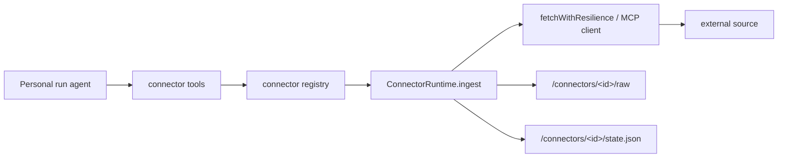

# Connectors Overview

Connectors pull external knowledge (Slack, Gmail, X, Notion, Hacker News, web search, LangSmith, git repositories, and arbitrary MCP servers) into raw files that a personal wiki run can document. They share one registry, one ingest contract, one home layout, and one resilient HTTP layer.

## Registry and identity

`createConnectorRegistry` returns a fixed map of nine connector ids to `ConnectorRuntime` instances. Each runtime is a `ConnectorDefinition` (id, display name, backend, `code`/`personal` mode, required env, agentic-discovery support) plus an `ingest` function. The registry is also the source of truth for which connectors are _configured_ — those whose required env vars are all set — which telemetry uses as an adoption signal.

## Ingest contract and home state

Every connector's `ingest` returns a `ConnectorIngestResult` with a status of `success`, `skipped`, or `error`, the raw files it wrote, and any warnings. State and raw output live under the OpenWiki home per connector:

- config is read from `<home>/connectors/<id>/config.json`, merged over a default,
- run state is read/written as versioned JSON, and
- raw payloads are written as private JSON under a per-run directory.

State retains only the most recent runs (bounded), each summarized by timestamp, run id, status, raw files, and warnings.

## Resilient HTTP

All direct-API connectors and the HTTP MCP client fetch through `fetchWithResilience`, which adds a per-request timeout, bounded exponential backoff with full jitter on 429 and 5xx (honoring `Retry-After` within a cap), and the same backoff on network errors. Auth failures (401/403) and other 4xx are returned as-is so callers like Gmail can trigger a token refresh instead of wasting retries.

## MCP connectors

`custom-mcp` and `notion` are MCP-backed. The MCP runtime discovers tools via `tools/list`, records the discovery as raw data, and calls only exact discovered tool names. Read-only enforcement uses `allowedTools`/`readOnlyHint` rather than guessing which tools mutate.

_Connector ingestion flow from agent tools to raw data and state._

## Code vs personal scoping

Connector tools are a **personal / local-wiki** capability. `createOpenWikiConnectorTools` returns an empty set for `repository` output, because a code-mode run documents a codebase and must never be handed connector ingestion — which would otherwise throw on missing credentials and waste tokens discovering sources it has no business touching.

For per-source specifics see [sources.md](sources.md); the LangSmith connector, which is the exception that runs in code mode, is covered in [langsmith.md](langsmith.md).
