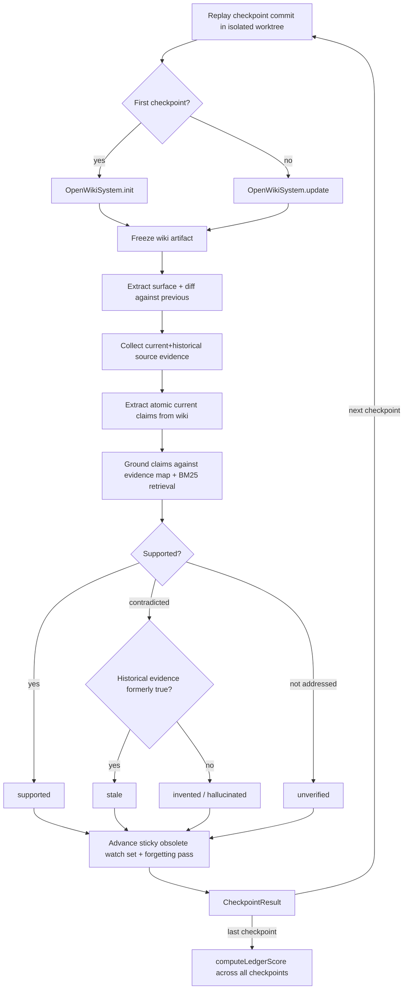

# LEDGER longitudinal wiki-grounding benchmark

LEDGER (Longitudinal Evaluation of Documentation Grounding, Evolution, and Revision) is a source-grounded TypeScript benchmark under `evals/ledger/` that measures whether generated knowledge artifacts stay accurate and current as their source of truth evolves. It replays a benchmark's ordered Git checkpoints inside an isolated worktree, drives OpenWiki through `init` then `update` at each checkpoint, freezes the resulting wiki snapshot, and evaluates every current factual claim against current and historical source evidence.

Unlike the sibling [DeepSWE evaluation harness](./deepswe-harness.md), which measures whether OpenWiki-generated docs help a coding agent solve tasks, LEDGER measures the _grounding and forgetting_ of the documentation itself across an evolution trace. Both harnesses are downstream consumers of the [Agent workflow](../agent/workflow.md): LEDGER drives it through the `OpenWikiSystem` adapter (`evals/ledger/system/openwiki-system.ts`), which calls `runOpenWikiAgent` with `outputMode: "repository"` so the worktree `cwd` is honored. The generated wiki's quality directly drives the measured claim health.

## What it measures

At each checkpoint the evaluator reads every generated Markdown document, splits it into text units, and extracts atomic factual claims. Navigation, opinions, instructions, wiki self-description, and other non-factual material produce no claims; explicit historical narration is kept in the audit record but excluded from the headline snapshot metric. Each current-tense claim ends in exactly one state:

| State        | Meaning                                                                                                              |
| ------------ | -------------------------------------------------------------------------------------------------------------------- |
| `supported`  | Current source evidence establishes the claim.                                                                       |
| `stale`      | Current source contradicts the claim and historical source establishes that it was formerly true.                    |
| `invented`   | Current source contradicts the claim and historical source does not establish it. The CLI calls this `hallucinated`. |
| `unverified` | The supplied evidence neither establishes nor contradicts the claim.                                                 |

All four rates share one denominator (`supported + stale + invented + unverified`). The run-level **LEDGER score** is opportunity-weighted claim health across the trace: `supported / all current claims across checkpoints` (`computeLedgerScore()` in `evals/ledger/metrics/score.ts`). Stale, hallucinated, and unverified claims all lower the score because they remain in the denominator. The score does not measure topic coverage; that limitation is explicit.



## Claim evaluation pipeline

Claim grounding follows a deterministic pipeline (see `evals/ledger/evaluator/`):

1. **Extraction** — classify every text unit and extract atomic claims with exact artifact quotes; non-verbatim extractor quotes are rejected and repaired before grounding.
2. **Deduplication** — remove normalized exact duplicates.
3. **Evidence-map routing** — BM25 matches claim prose to the benchmark's semantic evidence-map _concepts_ (topic descriptions, never expected answers), then resolves `path#symbol` selectors, exact paths, and globs to raw source. Routing is evaluator-only metadata, never input to OpenWiki, and adds no evaluator model calls.
4. **Evidence collection** — current evidence comes from the active checkpoint; evidence captured at every earlier checkpoint is marked historical. A named source path is always included, routed evidence-map files are mandatory, and a claim naming a missing file receives the complete tracked-file manifest. Small corpora are supplied in full; larger ones use direct-source BM25 to fill a minimum eight-excerpt candidate set within a soft character budget.
5. **Judgment** — each claim is judged `supported`, `contradicted`, or `not addressed` against resolved evidence. A contradicted claim is then checked against distinct historical evidence: formerly true → `stale`; not established → `invented`. Not addressed → `unverified`.

Current claims are grounded against current evidence first; historical snapshots cannot crowd current truth out of the retrieval window. Byte-identical historical excerpts are deduplicated, and historical evidence is consulted only after current source establishes a contradiction. Evaluator failures do not abort the run: a judgment that remains invalid after isolated repair falls back to `unverified`, and a failed extraction unit contributes no claims; both lower the separately reported evaluator-completeness rate.

## Forgetting model

LEDGER treats forgetting as sticky but not permanent. Once a fact version goes obsolete (detected by `diffSurface()` between checkpoint surfaces), it enters the forgetting watch set and stays there for every later checkpoint until the requirements revive that knowledge — the fact is active again with the version's own statement (`advanceObsoleteWatchSet()` in `evals/ledger/benchmark/surface.ts`). A version already judged forgotten is still re-checked at later checkpoints, which is what lets the **Stale-Knowledge Lifetime** diagnostic measure how long stale knowledge lingers and keeps a later lingering regression visible. This adds a forgetting-pass evaluation per watched version per checkpoint (`evals/ledger/evaluator/forgetting.ts`), using a bounded BM25-ranked section window with exhaustive fallback.

## Benchmark contract

A benchmark is a directory containing a `benchmark.json` manifest plus a source-of-truth Git repository. The manifest (`RawBenchmark` in `evals/ledger/benchmark/benchmark.ts`) declares:

- `name` and `description` — cosmetic, for reports.
- `difficulty` — an author-declared rating from `easy` / `medium` / `hard` (ascending). Required and validated against an allowlist; a benchmark must declare an explicit rating so weak results on a `hard` benchmark read differently from the same results on an `easy` one.
- `sourceRepo` — path to the repository the benchmark replays, resolved relative to the benchmark directory into an absolute `sourceRepoPath`.
- `trace.checkpoints` — an ordered sequence of `{ id, commit, label? }` entries. Length ≥ 1; index 0 is the `init` point, every later index is an `update`. Commit SHAs are validated against `/^[0-9a-f]{7,40}$/`.
- `evidenceMap` (optional) — reviewed semantic routing metadata: topic-to-source routes that help translate wiki prose into likely source locations without encoding answers. Each entry's `concept` should identify a fact _category_, never its conclusion (e.g. `task queue insertion, ordering, and removal behavior`, not `tasks are removed FIFO`). Selectors may refer to symbols that exist only at some checkpoints; unresolved selectors are ignored where that source is absent. Multiple matched entries are unioned before grounding.

Two checked-in benchmarks ship with evidence maps:

| Benchmark  | Difficulty | Checkpoints | What it exercises                                                                                                                                                                                                                                                                                                                                                                                                                                                                                                                      |
| ---------- | ---------- | ----------- | -------------------------------------------------------------------------------------------------------------------------------------------------------------------------------------------------------------------------------------------------------------------------------------------------------------------------------------------------------------------------------------------------------------------------------------------------------------------------------------------------------------------------------------- |
| `calc`     | `easy`     | 3           | A small arithmetic library across add → subtract → remove-negate/bump; measures point-in-time knowledge and longitudinal correction/forgetting/retention.                                                                                                                                                                                                                                                                                                                                                                              |
| `taskflow` | `hard`     | 5           | A production-shaped in-memory task queue (~37 commits, 8 per update gap) with structural traps: a `MemoryStore`→`InMemoryStore` rename with file move, a reverted experimental `RedisStore`, a `TaskError`→`TaskExecutionError` rename with deprecated alias, and a same-named `TaskError` resurrected with new meaning in a new file. Three signature-stable bug fixes (LIFO→FIFO dequeue, batched→streaming worker pool, off-by-one retry backoff) flip behavior invisibly to the surface and are reachable only as claim staleness. |

Each benchmark's source repository may be stored as a committed `repo.bundle` and reconstructed on demand by `ensureSourceRepoAvailable()` (`evals/ledger/benchmark/source-repo.ts`), so a benchmark is self-contained without a checked-out working tree.

## Run lifecycle

`evals/ledger/run.ts` is the CLI entrypoint. It resolves config (`resolveRunConfig()`), loads and validates the benchmark (`loadBenchmark()`), prepares a results directory, constructs the `OpenWikiSystem` system under test and a `ModelEvaluationBackend` evaluator, then calls `runBenchmark()` (`evals/ledger/run/runner.ts`).

Preflight validation runs before any system call and checks three things for the trace: every checkpoint SHA resolves to a commit in the source repo, every checkpoint is a Git ancestor of the one that follows it, and no checkpoint tracks anything under the wiki directory. The runner creates an isolated workspace and a guarded `GitReplay` (`evals/ledger/replay/git-replay.ts`), then walks the trace running `init` then `update`, freezing an immutable artifact at each checkpoint and evaluating it. The workspace and worktree are always torn down, even on failure.

`GitReplay` drives the source repository through the trace inside one detached Git worktree. It creates a private local clone and the worktree under a caller-provided temp parent, records their realpaths, and confines every destructive operation to them. The generated wiki lives as untracked files inside the worktree, so `checkout` (which never touches untracked files) preserves it from one checkpoint to the next; `GitReplay` never runs `git clean`, which would delete the wiki and defeat longitudinal updates.

`OpenWikiSystem` (`evals/ledger/system/openwiki-system.ts`) is the baseline system under test: today's OpenWiki driven through its single `runOpenWikiAgent` entrypoint. It passes `outputMode: "repository"` so the worktree `cwd` is honored and never passes a user message, so update change-detection is driven purely by the real source deltas between checkpoints. It sets `OPENWIKI_PROVIDER` (and `OPENWIKI_MODEL_ID` when overridden) into `process.env` before each run because OpenWiki resolves its provider from the environment.

## Re-evaluation

`evals/ledger/reevaluate.ts` re-evaluates a completed run without invoking OpenWiki again (`pnpm run eval:ledger:reevaluate`). Source is the ground truth — surface extraction and grounding both read the repository at each checkpoint's commit — so the working tree must still exist even for a pure re-evaluation of a saved run. This produces a fully auditable independent result alongside the original.

## Configuration and credentials

Provider and model resolution (`evals/ledger/run/run-config.ts`):

- `OPENWIKI_PROVIDER` (required) — same environment configuration as OpenWiki.
- System model — `--system-model` or `OPENWIKI_MODEL_ID`, otherwise OpenWiki's default for the provider.
- Evaluator model — `--evaluator-model` or `LEDGER_EVALUATOR_MODEL_ID`, falling back to the system model. The evaluator model must resolve to a concrete id because the evaluator constructs its model directly rather than deferring to OpenWiki's default resolution.

Unknown CLI flags and missing values are hard errors rather than silent defaults (`parseArgs()` in `evals/ledger/run/args.ts`), so a typo never runs with a surprising configuration.

## Commands

```bash
# Run a benchmark end to end (replay + OpenWiki + evaluation)
OPENWIKI_PROVIDER=anthropic \
LEDGER_EVALUATOR_MODEL_ID=claude-sonnet-5 \
pnpm run eval:ledger -- --benchmark evals/ledger/benchmarks/taskflow

# Re-evaluate a saved run without re-running OpenWiki
OPENWIKI_PROVIDER=anthropic \
LEDGER_EVALUATOR_MODEL_ID=claude-sonnet-5 \
pnpm run eval:ledger:reevaluate -- \
  --benchmark evals/ledger/benchmarks/taskflow \
  --run evals/ledger/.results/taskflow-<timestamp>
```

CLI flags: `--benchmark <dir>` (required), `--results <dir>`, `--system-model <id>`, `--evaluator-model <id>`, `--verbose` (print every stale and hallucinated claim beneath the checkpoint that produced it). Add `--verbose` to surface individual claims in the report; the default output retains only percentages and counts, and a nonzero rate below one percent is displayed as `<1%` rather than rounded down to `0%`.

Live evaluator calibration is opt-in through `LEDGER_LIVE=1`. The normal suite is offline and substitutes deterministic evaluator and system implementations, so a CI run never spends model tokens.

## Evaluator meta-evaluation

`evals/ledger/meta/` holds the gold-agreement gate that measures the extraction/classification and source-grounding judges against human-reviewed cases. Every stage must achieve at least 0.90 agreement in the optional live-model tier. A miss below the floor is tolerated as measurement error; the only sanctioned responses are to add the missed boundary case to the gold fixture and improve the applicable prompt globally, then rerun the entire gold set. Never add a code-side regex, token list, fixture name, or other special case for one judge miss.

## Testing the harness

```bash
pnpm run eval:ledger:typecheck   # tsc --noEmit -p evals/ledger/tsconfig.json
pnpm exec vitest run evals/ledger
```

The offline suite covers the benchmark loader/validator, surface extraction and diff, the sticky obsolete watch set, the claim-state partition, the evaluator pipeline (precision, forgetting, retrieval, evidence-map routing), the runner lifecycle, and the gold-agreement gate. Claim-state mutations must remain a complete single-denominator partition; forgetting behavior is tested separately against the deterministic obsolete-API watch set.

## Things to watch when changing the harness

- Adding a benchmark means creating a `benchmark.json` with an explicit `difficulty`, a `trace` of ancestor-ordered checkpoints, and optionally an `evidenceMap` whose `concept` fields name categories, not conclusions.
- The preflight ancestry and wiki-tracking checks in `runBenchmark()` are load-bearing for longitudinal correctness; do not relax them.
- `GitReplay` must never run `git clean` — the wiki survives across checkpoints precisely because it is untracked and `checkout` leaves untracked files alone.
- The evaluator must never abort the run on a model failure; preserve the `unverified`/zero-claim fallbacks when changing the evaluator pipeline.
- The forgetting watch set is sticky until revival; changing that semantics changes the Stale-Knowledge Lifetime diagnostic and must update the forgetting tests.
- A new judge prompt must be calibrated against the full gold set, not special-cased for one miss.

## Source map

- `evals/ledger/README.md` — user-facing benchmark documentation and CLI examples.
- `evals/ledger/run.ts` — CLI entrypoint: config resolution, benchmark load, system/evaluator construction, run + persist.
- `evals/ledger/reevaluate.ts` — re-evaluation entrypoint for saved runs.
- `evals/ledger/run/runner.ts` — `runBenchmark()`: preflight, workspace/replay setup, checkpoint walk, teardown.
- `evals/ledger/run/evaluate-checkpoint.ts` — per-checkpoint evaluation and `CheckpointCarry` threading.
- `evals/ledger/run/run-config.ts`, `evals/ledger/run/args.ts` — config and argv resolution.
- `evals/ledger/run/persistence.ts`, `evals/ledger/run/finalize.ts`, `evals/ledger/run/report.ts` — result, artifact snapshot, evidence corpus, assertion inventory, and report persistence.
- `evals/ledger/benchmark/benchmark.ts`, `evals/ledger/benchmark/validation.ts`, `evals/ledger/benchmark/source-repo.ts` — benchmark loading, validation, and bundle reconstruction.
- `evals/ledger/benchmark/surface.ts` — `extractSurface`, `diffSurface`, `obsoleteTargetsFor`, `advanceObsoleteWatchSet`.
- `evals/ledger/evaluator/precision.ts`, `evals/ledger/evaluator/forgetting.ts`, `evals/ledger/evaluator/retrieval.ts`, `evals/ledger/evaluator/evidence-map.ts` — claim grounding, forgetting, BM25 retrieval, and evidence-map routing.
- `evals/ledger/evaluator/model-backend.ts`, `evals/ledger/evaluator/direct-model.ts` — bounded evaluator model invocation.
- `evals/ledger/replay/git-replay.ts`, `evals/ledger/replay/workspace.ts` — isolated, containment-guarded worktree replay.
- `evals/ledger/source/source-adapter.ts`, `evals/ledger/source/git-evidence.ts` — tracked-file evidence adapter.
- `evals/ledger/system/openwiki-system.ts` — `OpenWikiSystem` adapter over `runOpenWikiAgent`.
- `evals/ledger/metrics/score.ts`, `evals/ledger/metrics/claims.ts`, `evals/ledger/metrics/churn.ts` — LEDGER score, claim-state metrics, and churn.
- `evals/ledger/meta/gold-agreement.ts` — evaluator meta-evaluation gate.
