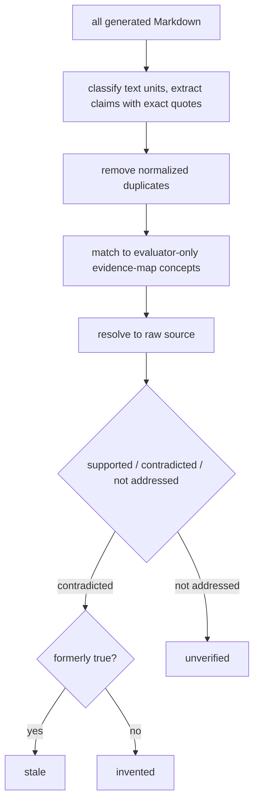

# LEDGER Evaluation Harness

LEDGER (Longitudinal Evaluation of Documentation Grounding, Evolution, and Revision) is a source-grounded framework that replays Git checkpoints, runs OpenWiki at each, and evaluates whether each frozen wiki snapshot's factual claims remain accurate as the source evolves.

## Claim states

At each checkpoint the evaluator extracts atomic factual claims from every generated Markdown document — ignoring navigation, opinions, instructions, and wiki self-description — and classifies each current-tense claim into one of four states:

| State        | Meaning                                                                    |
| ------------ | -------------------------------------------------------------------------- |
| `supported`  | Current source establishes the claim                                       |
| `stale`      | Current source contradicts it and history establishes it was formerly true |
| `invented`   | Current source contradicts it and history does not establish it            |
| `unverified` | Supplied evidence neither establishes nor contradicts it                   |

All four rates share the count of current claims as their denominator, and each checkpoint **recomputes** the partition from the entire current wiki rather than as a delta or average.

## Evaluation pipeline

_The claim evaluation pipeline._

## Running

`run.ts` is the harness entrypoint: it resolves config, loads the benchmark, prepares a run directory, drives the System Under Test and the model evaluation backend through `runBenchmark`, and finalizes the run, persisting a failure audit if the run throws. The system under test and the evaluator are **separate** backends — an `OpenWikiSystem` produces the wiki while a `ModelEvaluationBackend` scores it, each configured with its own model id.

`reevaluate.ts` re-scores a completed run **without** invoking the System Under Test, but still loads the benchmark because source is the ground truth read at each checkpoint's commit, and it persists a fully independent auditable result.

Both entrypoints stamp the start timestamp once and thread it into the run so the result is otherwise a pure function of its inputs, and each guards direct invocation so importing the module in a test does not run it.

The companion Python harness is documented in [deepswe.md](deepswe.md).
