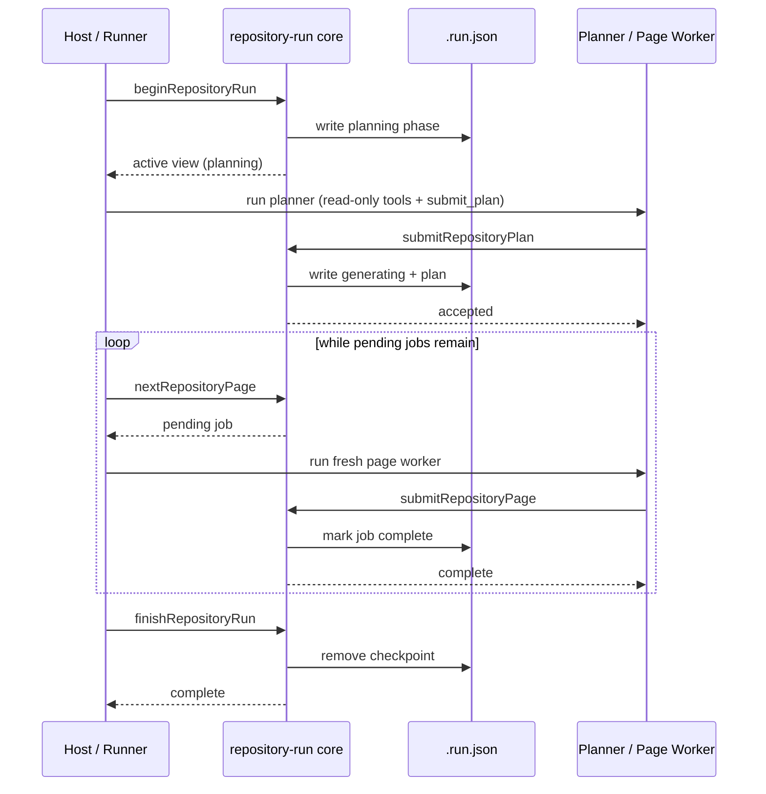
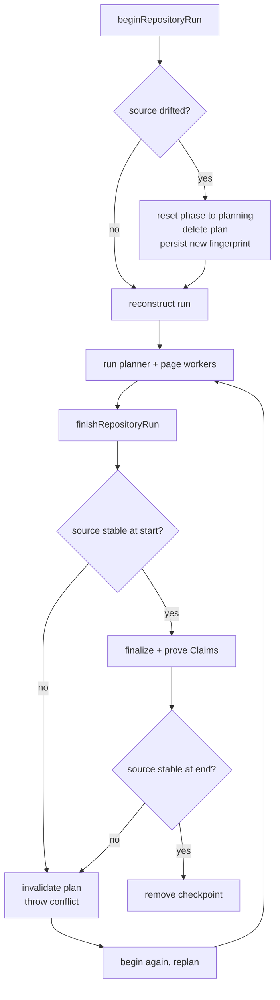
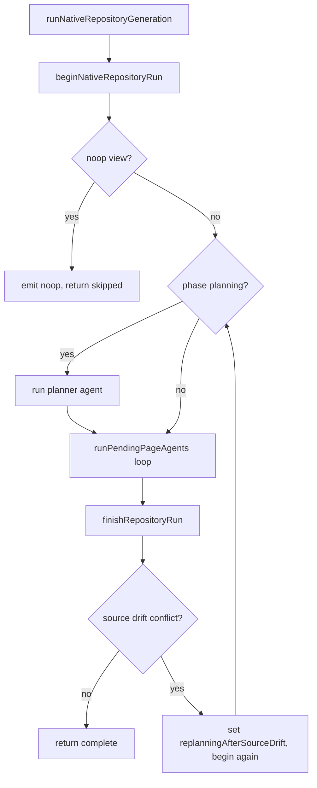

# Resumable Page-Job Lifecycle

Repository wiki generation is driven by a **durable, resumable page-job queue** in `src/generation`. Instead of a single long-running agent turn, a run is split into a planner phase and a strictly ordered sequence of independent page jobs. Each step is checkpointed to disk so an interrupted run can be reconstructed and continued, and so a host can drive the same lifecycle across separate tool calls. The agent-facing orchestration lives in `src/agent/repository-runner.ts`; the durable core lives in `src/generation/repository-run.ts`, `src/generation/run-state.ts`, and `src/generation/page-jobs.ts`.

## Lifecycle overview

A run moves through two persisted phases: `planning` then `generating`. The core exposes five host-facing operations that form the lifecycle:

- `beginRepositoryRun` — start a fresh run or reconstruct an interrupted one.
- `submitRepositoryPlan` — validate and durably install the ordered page queue, transitioning `planning` to `generating`.
- `nextRepositoryPage` — return the first pending job (without reserving it) or signal completion.
- `submitRepositoryPage` — prove one page's Claims are durable, then mark its job `complete`.
- `finishRepositoryRun` — apply deletions, finalize artifacts, prove the whole repository's Claims, and remove the checkpoint.

*The durable page-job lifecycle. Every state transition is written to `.run.json` before the in-memory checkpoint advances; the checkpoint is removed last on success.*

## Durable state: `.run.json`

All resumable state for one repository is stored in a single JSON checkpoint at `<root>/openwiki/.run.json` (`REPOSITORY_RUN_STATE_BASENAME`, schema version 1). `RepositoryRunState` captures everything required to resume a run without re-deriving it:

- `runId`, `mode` (`init` or `update`), `phase` (`planning` / `generating`), `startedAt`, `language`, `languageChanged`.
- `actor` (`producerActor`, `metadataModel`) — stable producer identity retained across resume; the producer actor cannot change for a resumable run.
- `sourceFingerprint` — SHA-256 over every model-visible repository source input; the basis for source-drift detection.
- `initialPages`, `requiredRewritePages`, `beforeContentSnapshot`, `preparedWiki` (serialized deterministic finalization state).
- `plan?` — the active normalized ordered queue; absent during planning and after source-drift invalidation.

State is written **atomically**: `writeRepositoryRunState` validates against a strict Zod schema, writes to a PID-and-UUID-named temp file with `wx`, and `rename`s it into place, cleaning up the temp file in a `finally`. A malformed checkpoint is never silently discarded — `readRepositoryRunState` throws `RepositoryRunError("invalid_state")` on parse or schema failure, "refusing to discard resumable work." Only a missing file returns `null`.

## begin: start fresh, resume, or no-op

`beginRepositoryRun` is the single entrypoint. It loads any existing checkpoint and branches:

1. **Resume** — if `.run.json` exists, `resumeRepositoryRun` reconstructs the run. It enforces resume invariants: the requested `mode`, `language`, and `producerActor` must match the durable owner (else `conflict`). It recomputes the source fingerprint; if the source drifted, the whole plan is invalidated — `phase` reset to `planning`, the `plan` deleted, and the new fingerprint persisted. A fresh `planningContext` is accepted only when the plan is absent.
2. **Strict no-op** (update only, not forced) — before creating state, `beginRepositoryRun` runs Claims validation *and* update no-op detection. A run is skipped only when `getUpdateNoopStatus` reports `shouldSkip: true` **and** `claimsRuntime.issueCount === 0`. Git cleanliness alone cannot hide stale or unresolved Claims; Claims cleanliness alone cannot hide a dirty worktree or changed HEAD. On a true no-op, the existing update metadata is refreshed and no `.run.json` is written.
3. **Fresh run** — captures initial pages, a content snapshot, prepared wiki state, the source fingerprint, and writes the checkpoint. The checkpoint write is the **durability point**: for `init`, the wiki-replacement backup is released (`replacement.commit()`) only after both the run state and `interrupted` metadata are durable. If a late step fails, init rolls back (removing the new state and restoring the old wiki); `update` never deletes a successfully-written checkpoint because that state is exactly what makes the next begin resumable.

## submit_plan: install the ordered queue

`submitRepositoryPlan` accepts a `ProposedRepositoryPlan` (pages and optional deletions) and durably installs it. `createRepositoryPlan` (`page-jobs.ts`) is the deterministic normalizer:

- Each proposed page is canonicalized into a `PageJob` with a fresh UUID `id`, trimmed `title`/`purpose` (both required), normalized `seedPaths` (non-escaping, repository-relative), `relatedPages`, `instructions`, and `status: "pending"`.
- Init plans cannot delete pages and **must** include `/openwiki/quickstart.md`; no plan may delete the canonical quickstart. Update plans must not both generate and delete the same page.
- For `update`, the planner's proposal is augmented with **required jobs the planner omitted**: `addRequiredClaimIssueJobs` inserts one reconciliation job per page with unresolved Claims preflight issues, and `addRequiredRewriteJobs` inserts rewrite jobs for pages needing a language rewrite. This guarantees stale Claims and language changes are always reconciled even when the model forgets them.
- The queue is ordered deterministically: `/openwiki/quickstart.md` is generated last (it is the synthesis/navigation page), and remaining pages sort by UTF-16 code-unit order.

A second `submit_plan` is tolerated only if it describes the **same semantic plan** (`samePlanIgnoringJobIds` compares paths, titles, purposes, seed paths, related pages, instructions, and deletions while ignoring generated IDs and progress). Any other duplicate is `invalid_state`.

## next_page and submit_page: one fresh worker per page

`nextRepositoryPage` finds the first `pending` job in the persisted queue and returns it with current context (mode, whether the page already exists, and its existing Claims). It does **not** reserve or mutate the job — workers are not durable, so reservation would be unsafe. Completion is recorded only inside `submitRepositoryPage`.

`submitRepositoryPage` enforces a strict ordering and durability contract before advancing the queue:

- Only the **current** pending job may be submitted (`invalid_state` otherwise); a duplicate submission of an already-complete job is a no-op.
- The page must have been written and be readable as text, and its OKF frontmatter must validate (`invalid_input` otherwise) — a worker cannot submit a job whose page it never wrote.
- The proposed Claim set is reconciled into session operations by `replacePageClaims` (`page-jobs.ts`): exact no-ID matches preserve IDs, ID-bearing proposals update or confirm, omitted existing Claims are retracted, and every Claim requires at least one canonical `repo://` evidence resource.
- The page's dirty Claim state is finalized, then `assertPageClaimsDurable` proves the page's Claims, page version, and verification event are durably persisted and match the current Markdown bytes. Only then is the job marked `complete` and `.run.json` rewritten.

Because the in-memory `run.state` is replaced only after the durable write succeeds, an interruption between finalize and state-write leaves the job re-doable rather than lost.

## finish: prove the whole repository and remove the checkpoint

`finishRepositoryRun` is a sequence of durable gates; `.run.json` is removed **last**, so any earlier failure leaves the run resumable:

1. `requireStableSourceFingerprint` — source must be unchanged at the start.
2. No pending jobs may remain.
3. `applyAbandonedGeneratedPageDeletions` removes current-run pages abandoned by a superseded plan (never initial pages); `applyPlannedDeletions` applies explicit deletions; `reconciledDeletedClaimPages` records deletions for orphaned sidecars.
4. `finalizeWikiArtifacts` deterministically finalizes the wiki (index labels, concept types, provenance).
5. `assertRepositoryClaimsDurable` proves the final repository has no orphaned or partially-durable Claims — every non-empty claimed page has a sidecar matching the final Markdown, and no sidecar points at a missing page.
6. `requireStableSourceFingerprint` runs **again** to close the check/use race across the deterministic finish window.
7. `persistRunMetadataIfChanged` writes `complete` metadata.
8. `removeRepositoryRunState` deletes `.run.json`.

## Source-drift invalidation and replan

The source fingerprint (`createRepositorySourceFingerprint`) hashes every model-visible source input — tracked and untracked files, plus Git status codes — excluding generated OpenWiki state and ignored paths. It is computed at begin, at every resume, and twice during finish.

If the source changes at any point, the entire plan is invalidated: `phase` returns to `planning`, the `plan` is deleted, the new fingerprint is persisted, and a `conflict` error is thrown instructing the host to call `begin` and submit a replacement plan. This is the only path that discards durable queue progress by semantic necessity — a plan generated against a different source is no longer valid.

*The source-drift replan loop. Drift at begin, during resume, or across the finish window invalidates the whole plan and forces a fresh planning pass.*

## Worker tool surfaces and the no-delegation boundary

The agent-facing runner (`runNativeRepositoryGeneration`) is deliberately **non-delegating** and shell-free. It uses bounded filesystem tool surfaces:

- **Planner worker**: read-only tools `read_file`, `ls`, `glob`, `grep` plus the `submit_plan` completion tool. It must not write documentation or delegate.
- **Page workers**: the same read-only tools plus `write_file` and `edit_file`, plus the `submit_page` completion tool. Each page worker owns exactly one page path (`writableWikiPages: [job.path]`) and may write only that file.

DeepAgents 1.12 injects a general-purpose `task` tool even when `subagents` is empty. The `NO_DELEGATION_MIDDLEWARE` removes that capability at the model boundary (`wrapModelCall` filters out any tool named `task`) after all tool-contributing middleware has run, so repository workers can never delegate or spawn subagents. Tests assert that the streamed tool surface contains neither `execute` (shell) nor `task` (delegation).

A worker that exits without calling its completion tool throws (`"planning worker exited without submit_plan"` / `"… worker exited without submit_page"`). `invalid_input` rejections from `submit_plan`/`submit_page` are returned as `error`-status `ToolMessage`s with a `retry` instruction, keeping the worker loop active for correction; other errors propagate.

## runNativeRepositoryGeneration orchestrator

`runNativeRepositoryGeneration` drives the durable core with one planner worker and one fresh worker per page. It reuses the supplied model but keeps no agent checkpointer or worker state beyond the durable core:

*The orchestrator loop. A finish-time source-drift conflict triggers a fresh begin and replan; resume without a planning phase runs page workers directly.*

The orchestrator emits bounded `repository_progress` events (`planning`, `replanning`, `generating`, `finalizing`, `noop`) and forwards only approved worker tool lifecycle events (`parseWorkerToolEvent`), never worker narration. Only tools in `WORKER_TOOL_NAMES` (the filesystem tools plus `submit_plan`/`submit_page`) are surfaced.

## Key invariants and failure semantics

- **Durability before progress**: the in-memory checkpoint advances only after the durable write succeeds; `.run.json` is removed last on success.
- **Atomic, schema-validated state**: every checkpoint write is validated and atomic; a malformed checkpoint is never discarded.
- **Strict no-op detection**: an update is skipped only when Git status is clean (no meaningful worktree changes, no non-OpenWiki committed changes) **and** Claims have zero issues.
- **Source stability across the run**: the fingerprint is checked at begin, resume, and both ends of finish; drift invalidates the whole plan.
- **Plan immutability**: page paths are final once submitted; only an equivalent re-submission is tolerated.
- **Ordered page completion**: only the current pending job may be submitted; each page's Claims must be proven durable before its job completes.
- **Resume ownership**: mode, language, and producer actor must match the durable owner; otherwise the run cannot be resumed as a different command.
