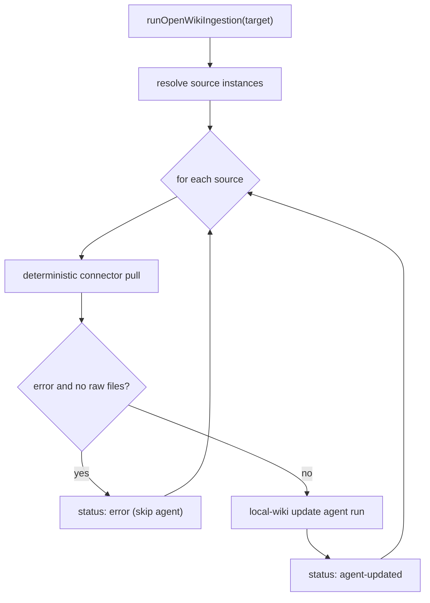

# Ingestion Orchestration

Ingestion is how external source material becomes wiki content. There are two distinct flows: **personal ingestion**, which pulls configured personal sources and synthesizes them into a local wiki, and **code-mode ingestion**, which sets up a repository and pulls code-mode connectors that augment a repository update run.

## Personal ingestion

`runOpenWikiIngestion` loads the env, ensures the OpenWiki home, reads the onboarding config, and resolves the requested target into configured source instances. A non-`all` target that matches nothing is an error.

A target is a connector id, `all`, or a specific source-instance id; `parseIngestionTarget` rejects an unsafe source-instance id.

Each personal source is ingested in **two phases**:

1. a **deterministic connector pull** writes raw files, then
2. a **local-wiki update agent run** synthesizes those raw files, with the pull result and raw files feeding the agent's user message.

_Two-phase personal ingestion per source._

A deterministic pull that errors **with no raw files** short-circuits that source to an `error` status without running the agent; otherwise the agent run marks the source `agent-updated`. Each per-source update run is wrapped in a `withRunTelemetry` boundary so ingestion runs land in telemetry like the CLI paths. The pull window is fixed at **24 hours**.

## Code-mode setup and connectors

`ensureCodeModeRepoSetup` refreshes the managed `AGENTS.md` and `CLAUDE.md` snippets on **every** run, and — only when `createWorkflow` is set (init) — creates the scheduled-update workflow if it is missing. An existing workflow file is preserved verbatim so operator customizations survive repeated runs.

`runCodeModeConnectors` runs only **code-mode** connectors against the repository, appending synthesis guidance to the agent message only for connectors that actually pulled raw data; a repo that has not configured a connector contributes nothing. A code-mode connector documents software and must never break the run it feeds, so an `ingest` throw is caught and reported as skipped rather than propagated.

The code-mode ingestion window is the hours elapsed since `openwiki/.last-update.json`; an absent or unparseable timestamp means **no floor**, so the connector bootstraps with its most recent traces.

See [connectors/overview.md](../connectors/overview.md) for the connector contract and [connectors/langsmith.md](../connectors/langsmith.md) for the one code-mode connector.
