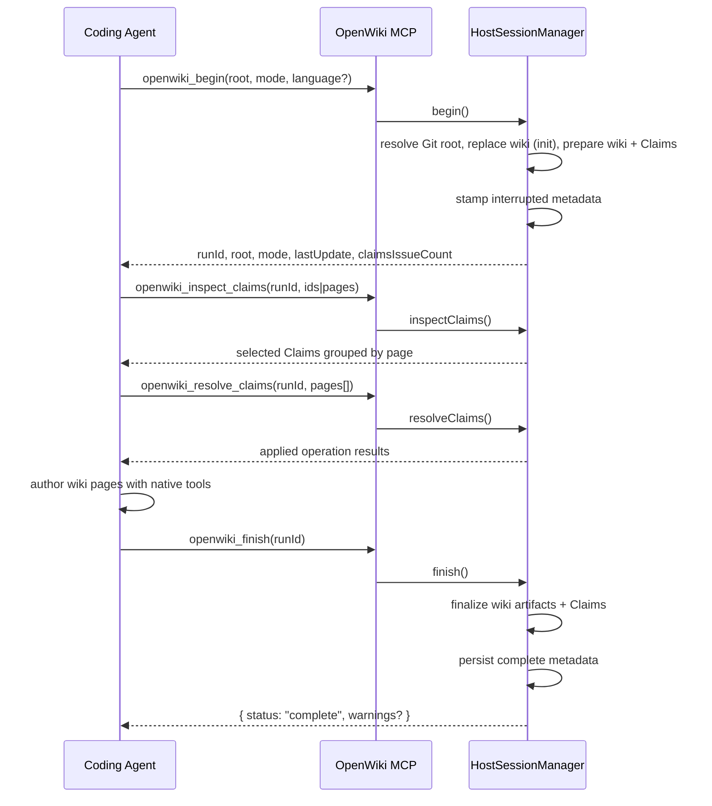

# Coding-agent integrations

OpenWiki can serve as an MCP tool server for external coding agents (Codex, Claude Code). Instead of running its own LLM, OpenWiki exposes a deterministic lifecycle — prepare the wiki, let the host agent author content with its native tools, then finalize — so the host's model does the creative work while OpenWiki owns the grounded infrastructure: OKF front matter, index synchronization, [Grounded Claims](../claims/grounded-claims.md), provenance stamping, and run metadata.

## What gets installed

The `openwiki integrations install <codex|claude>` command installs two things into the host's configuration:

1. **Skill bundle** — the `integrations/openwiki/` directory (SKILL.md plus reference docs) is copied into the host's skill directory, giving the host agent workflow instructions for init and update runs.
2. **MCP server config** — an entry pointing at `openwiki mcp --host <id>` is added to the host's MCP configuration file, so the host starts OpenWiki's stdio MCP server on demand.

| Host        | Skill directory           | MCP config (user scope) | MCP config (project scope) |
| ----------- | ------------------------- | ----------------------- | -------------------------- |
| Codex       | `.agents/skills/openwiki` | `.codex/config.toml`    | `.codex/config.toml`       |
| Claude Code | `.claude/skills/openwiki` | `.claude.json`          | `.mcp.json`                |

The registry is defined in `HOST_TARGETS` in `src/integrations/install/registry.ts`. Adding a new host means adding a `HostTarget` entry with its skill path, MCP config adapter (`json` or `codex-toml`), and producer actor.

## CLI commands

```sh
openwiki integrations list                          # list all hosts and their status
openwiki integrations install codex                 # install for Codex (user scope)
openwiki integrations install claude --scope project # install for Claude Code (project scope)
openwiki integrations uninstall codex               # remove skill and MCP config
openwiki mcp --host codex                           # start the stdio MCP server manually
```

The `integrations` and `mcp` subcommands are parsed in `src/cli/commands.ts` and executed in `src/cli/integrations.ts`. The `--scope` flag selects `user` (home directory) or `project` (repository root). The `--force` flag allows replacing unmanaged skill content (a timestamped backup is retained).

For local development, `scripts/install-local-integration.mjs` installs an integration backed by the current source checkout, pointing the MCP command at `dist/cli/cli.js` instead of the published `openwiki` binary.

## MCP lifecycle protocol

The MCP server exposes four tools, owned by `HostSessionManager` in `src/integrations/core/session-manager.ts`:



| Tool                      | Purpose                                | Key input                                                                 |
| ------------------------- | -------------------------------------- | ------------------------------------------------------------------------- |
| `openwiki_begin`          | Prepare the wiki before authoring      | `root` (absolute Git root), `mode` (`init`/`update`), optional `language` |
| `openwiki_inspect_claims` | Read Claims without a write obligation | `runId` + `ids` or `pages` (exactly one)                                  |
| `openwiki_resolve_claims` | Establish or reconcile Claims          | `runId` + `pages[]` with operations                                       |
| `openwiki_finish`         | Finalize and complete the run          | `runId`                                                                   |

The protocol is transport-neutral: `ProtocolTool` in `src/integrations/core/protocol.ts` defines the tool name, description, Zod schema, and handler. The MCP adapter in `src/integrations/mcp/server.ts` registers each tool with the MCP SDK's `McpServer`. The stdio transport is started by `runOpenWikiMcp()` in `src/integrations/mcp/stdio.ts`.

### begin

`begin()` resolves the Git repository root (via `resolveRepositoryRoot()`, which runs `git rev-parse --show-toplevel`), creates the code-mode repo setup (GitHub Actions workflow, AGENTS.md/CLAUDE.md snippets), loads `.openwikiignore`, and — for `init` runs — starts a recoverable wiki replacement via `beginRepositoryWikiReplacement()` (see [Agent workflow § Wiki replacement on init](../agent/workflow.md#wiki-replacement-on-init)) that backs up the existing wiki, removes all generated content except `openwiki/INSTRUCTIONS.md`, and returns a `RepositoryWikiReplacement` transaction retained on the session. It then creates a run context, checks the update no-op status (for updates), snapshots the current wiki content, creates the docs-only backend, prepares the Claims runtime, stamps interrupted metadata (so a crash leaves a recoverable state), and prepares the wiki for authoring. It returns the `runId`, root, mode, language, last update metadata, wiki goal, update preflight, ignore pattern count, and Claims issue count.

A new `begin` **supersedes** any abandoned run: the prior session is discarded and its metadata is left as `interrupted`. Before supersession, the prior session's pending wiki replacement is committed (the backup is discarded) so a later `begin` does not leak a held backup directory.

### finish

`finish()` removes temporary working files (`_plan.md`, `_skeleton.md`), runs `finalizeWikiArtifacts()` (Mermaid, index sync, link validation, Claims sources projection, generated provenance), reconciles deleted Claim pages, finalizes the Claims runtime, commits the wiki replacement transaction (discarding the init backup so the new wiki wins), and persists complete run metadata. The session remains active if any pre-commit step fails, allowing retry.

### inspect_claims and resolve_claims

These delegate directly to the `ClaimSession` methods, sharing the same Zod schemas (`InspectClaimsInputSchema`, `ResolveClaimsInputSchema`) as the native agent's tools. The host agent uses host-native tools to inspect source and author Markdown; Claims are maintained exclusively through the MCP tools. See [Grounded Claims](../claims/grounded-claims.md) for the mutation and inspection semantics.

## Transactional installer

The `HostIntegrationInstaller` in `src/integrations/install/installer.ts` is transactional:

1. Resolves the canonical skill bundle from the package (`resolveCanonicalSkillBundle()` in `skill-bundle.ts`).
2. Stages the skill in a private sibling directory (unique UUID-named).
3. Snapshots existing MCP config text (for rollback).
4. Writes the MCP config entry (JSON for Claude, TOML for Codex) via the adapter in `config-json.ts` or `config-toml.ts`.
5. Atomically moves the staged skill into place.
6. On failure, rolls back the MCP config and removes the staging directory.

File operations (`move`, `removeDirectory`) are injectable for deterministic transaction-failure tests. A `--force` install replaces unmanaged skill content and retains a timestamped backup. The installer asserts no symlink components in the skill path to prevent following links outside the install scope.

## Shared finalization

The host session manager reuses the same finalization pipeline as the native OpenWiki agent:

- `prepareWikiForAuthoring()` — migrates OKF front matter and snapshots generated provenance.
- `finalizeWikiArtifacts()` — validates Mermaid, synchronizes indexes, validates links, projects Claims sources, and reconciles generated provenance.
- `beginRepositoryWikiReplacement()` — for `init` runs, backs up and replaces the existing wiki transactionally with the same commit/rollback and SIGINT-recovery semantics as the native agent.

Both are defined in `src/agent/wiki-finalizer.ts` and shared with the OKF middleware. The host stamps its own `producerActor` (e.g. `codex`, `claude-code`) into the generated provenance, so host-authored page bodies are distinguishable from native OpenWiki agent runs.

## The skill bundle

The installed skill (`integrations/openwiki/SKILL.md`) instructs the host agent to follow a required sequence:

1. Resolve the Git root deterministically (`git rev-parse --show-toplevel`).
2. Call `openwiki_begin` with the root and mode.
3. Read the matching workflow reference (`references/init.md` or `references/update.md`).
4. Read `references/methodology.md`.
5. Execute every planning, evidence, authoring, and review gate.
6. Call `openwiki_finish`.

Non-negotiable rules include: never report success before `openwiki_finish` returns `complete`, never edit `openwiki/.claims` directly, never begin against an inferred or relative root, and never edit indexes, logs, provenance, or run metadata. The skill references five documents under `integrations/openwiki/references/`: `init.md`, `update.md`, `methodology.md`, `reviewers.md`, and `security.md`.

## Key source files

| File                                        | Role                                                           |
| ------------------------------------------- | -------------------------------------------------------------- |
| `src/integrations/core/protocol.ts`         | `ProtocolTool`, Zod schemas, `HostRunMode`                     |
| `src/integrations/core/session-manager.ts`  | `HostSessionManager` — begin/finish/inspect/resolve lifecycle  |
| `src/integrations/core/repository-root.ts`  | `resolveRepositoryRoot()` — Git root resolution                |
| `src/integrations/core/errors.ts`           | `HostIntegrationError` with bounded codes                      |
| `src/integrations/install/registry.ts`      | `HOST_TARGETS`, `getHostTarget()`, `defaultMcpServerCommand()` |
| `src/integrations/install/installer.ts`     | `HostIntegrationInstaller` — transactional install/uninstall   |
| `src/integrations/install/skill-bundle.ts`  | Skill bundle resolution, inventory, receipt                    |
| `src/integrations/install/config-json.ts`   | JSON MCP config adapter (Claude)                               |
| `src/integrations/install/config-toml.ts`   | Codex TOML MCP config adapter                                  |
| `src/integrations/install/install-paths.ts` | Path resolution, symlink assertions, backup/restore            |
| `src/integrations/install/types.ts`         | `HostTargetId`, `HostIntegrationScope`, `HostTarget`           |
| `src/integrations/mcp/server.ts`            | `createOpenWikiMcpServer()` — MCP SDK adapter                  |
| `src/integrations/mcp/stdio.ts`             | `runOpenWikiMcp()` — stdio transport                           |
| `src/cli/integrations.ts`                   | `runIntegrationsCommand()`, `runMcpCommand()`                  |
| `src/cli/commands.ts`                       | `integrations` and `mcp` subcommand parsing                    |
| `integrations/openwiki/SKILL.md`            | Installed skill instructions                                   |
| `scripts/install-local-integration.mjs`     | Dev helper for local-checkout installs                         |

## Focused tests

| Test file                                    | Coverage                                         |
| -------------------------------------------- | ------------------------------------------------ |
| `test/integrations/session-manager.test.ts`  | begin/finish lifecycle, supersession, retry      |
| `test/integrations/installer.test.ts`        | Transactional install/uninstall, rollback, force |
| `test/integrations/protocol.test.ts`         | Tool schemas, input validation                   |
| `test/integrations/mcp-server.test.ts`       | MCP tool registration and execution              |
| `test/integrations/mcp-stdio.test.ts`        | Stdio server startup                             |
| `test/integrations/config-adapters.test.ts`  | JSON and TOML MCP config writing                 |
| `test/integrations/repository-root.test.ts`  | Git root resolution                              |
| `test/integrations/skill.test.ts`            | Skill bundle inventory                           |
| `test/integrations/package-contents.test.ts` | Published package includes skill bundle          |
| `test/integrations/cli-dogfood.test.ts`      | CLI install/list/uninstall end-to-end            |
| `test/cli/integrations-commands.test.ts`     | Command parsing                                  |
| `test/cli/integrations-runners.test.ts`      | Runner execution                                 |

## Things to watch when changing integrations

- `HostSessionManager` holds **one active run at a time**. A new `begin` supersedes the prior run. If you add concurrency, the `operationInProgress` guard serializes mutating operations.
- The host session manager reuses `prepareClaimsRuntime`, `finalizeWikiArtifacts`, and `beginRepositoryWikiReplacement` from the native agent. Changes to those functions affect host-authored runs as well — see [Grounded Claims](../claims/grounded-claims.md) and [Agent workflow](../agent/workflow.md). Init runs commit the replacement on `finish` and roll back on a failed `begin`; a superseding `begin` commits the prior session's replacement so a held backup is not leaked.
- The MCP server instructions in `src/integrations/mcp/server.ts` are advertised during MCP initialization. Keep them aligned with the SKILL.md non-negotiable rules.
- The installer's path containment uses `assertNoSymlinkComponents()`. If you change install paths, keep the symlink assertion so a crafted skill path cannot escape the install scope.
- `defaultMcpServerCommand()` returns `openwiki mcp --host <target>`. The dev helper (`scripts/install-local-integration.mjs`) overrides this with a direct `node dist/cli/cli.js` invocation. Both paths must stay in sync with the `mcp` subcommand's `--host` parsing.
