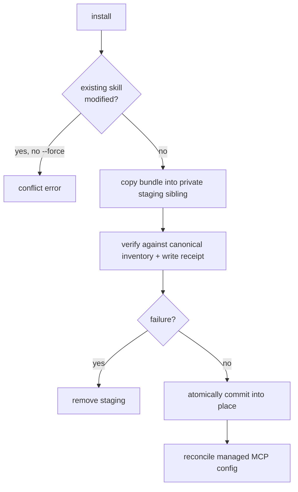

# Coding-Agent Integration Install

The installer places OpenWiki's host skill and a managed MCP server entry into a supported coding agent so the [lifecycle tools](overview.md) become available.

## Host registry

Two host targets are supported:

| Host                   | Config kind | Config path                                   | Skill directory           |
| ---------------------- | ----------- | --------------------------------------------- | ------------------------- |
| `codex` (Codex)        | TOML        | `.codex/config.toml`                          | `.agents/skills/openwiki` |
| `claude` (Claude Code) | JSON        | `.claude.json` (user) / `.mcp.json` (project) | `.claude/skills/openwiki` |

Each target carries its own producer actor. The default managed MCP command launches the `openwiki` binary as `openwiki mcp --host <target>`.

## Installing the skill

Install refuses to overwrite an unmanaged or modified existing skill unless `--force` is passed. When the installed skill already matches the current version, files, and MCP command, install only reconciles the managed config entry and reports **no skill change** — install is idempotent.

Otherwise the skill is installed **transactionally**:

_Transactional skill install._

The bundle is copied into a private staging sibling, verified against the canonical inventory, receipted, and only then atomically committed into place, with staging removed on any failure. Install also refuses to proceed through a symlinked path component in the skill directory.

## Uninstall and config edits

Uninstall refuses to remove a **modified** skill or a modified/unmanaged MCP config entry, and is a no-op when neither a managed skill nor a managed config entry exists.

Managed MCP config edits are **surgical**: the `openwiki` entry is added or replaced without discarding unrelated config, an unchanged entry reports no change, and a foreign `openwiki` entry that is not the replaceable one raises a conflict.
