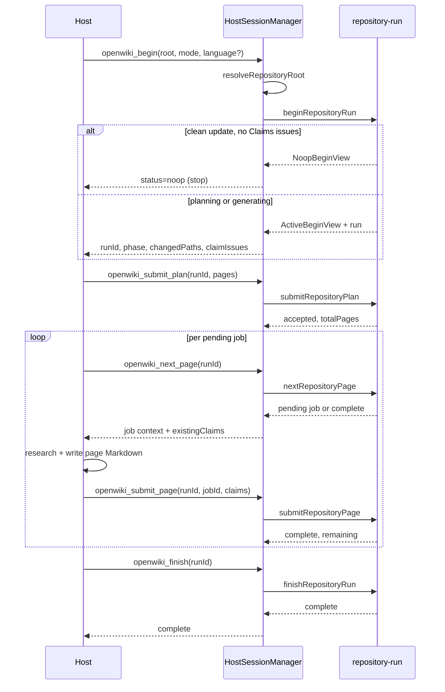

# Coding-Agent Integration (MCP Lifecycle)

OpenWiki can run inside a host coding agent instead of its own agent loop. The host uses its native repository tools to read source and author wiki pages, while OpenWiki provides a deterministic, resumable page-job lifecycle and Grounded Claims over MCP. Three coding hosts are supported through installable integrations: **Codex**, **Claude Code**, and **OpenCode**. Each registry entry carries a stable host identifier and a producer actor stamped onto generated page bodies and run metadata.

## Protocol (V0.4)

OpenWiki exposes a fixed five-tool lifecycle over MCP — `openwiki_begin`, `openwiki_submit_plan`, `openwiki_next_page`, `openwiki_submit_page`, and `openwiki_finish` — replacing the earlier V1 set (`begin`/`inspect_claims`/`resolve_claims`/`finish`). The protocol is declared as a strict `ProtocolToolName` union and materialized by `HostSessionManager.tools()`, which returns exactly those five tool definitions in order.

The MCP server is a thin adapter over a transport-neutral lifecycle provider: it advertises a static host-instructions string during MCP initialization and registers each provider tool. A stdio transport wires one `HostSessionManager` to an MCP server process. Transport-visible errors are bounded: a `HostIntegrationError` surfaces its code and message, while any other exception returns a generic `OpenWiki MCP operation failed.` message so unknown exception data is never exposed.

The advertised instructions require the host to resolve the absolute Git top-level and call `openwiki_begin` before authoring. If begin returns `status=noop`, the host must report that no update is required and **stop**. Otherwise, when the run is in planning, the host inspects the repository with its native tools and calls `openwiki_submit_plan` with final canonical page paths and page-relevant global instructions. It then repeatedly calls `openwiki_next_page`, researches exactly that page, writes exactly that generated Markdown page with native tools, and calls `openwiki_submit_page` with the page's complete material Claim set. The host must never report success before `openwiki_finish` returns `complete`, and must never directly edit OpenWiki-owned Claims sidecars, indexes, logs, provenance, run metadata, setup blocks, or scheduled workflows.

### Tool schemas

| Tool | Input schema | Returns |
| --- | --- | --- |
| `openwiki_begin` | `root`, `mode` (`init`/`update`), optional `language`, optional `force` | Active planning/generating view **or** a `noop` view |
| `openwiki_submit_plan` | UUID `runId`, `pages[]` (each `path`, `title`, `purpose`, optional `seedPaths`, `relatedPages`, `instructions`), optional `deletePages[]` | `accepted` with `totalPages` |
| `openwiki_next_page` | UUID `runId` | `pending` job + current Claims, or `complete` |
| `openwiki_submit_page` | UUID `runId`, UUID `jobId`, non-empty `claims[]` (each `id?`, `statement`, `evidence[{resource}]`) | `complete` with `remaining` |
| `openwiki_finish` | UUID `runId` | `complete` |

`openwiki_submit_plan` accepts the complete page plan: every `PlanPageInput` carries a canonical `path`, a human-readable `title`, a page-specific `purpose`, optional `seedPaths`, `relatedPages`, and `instructions`. The plan may carry an explicit `deletePages` set (init plans may not delete). The pages array may be empty for an update that has only planned deletions or no page work. `openwiki_submit_page` requires the page's complete material Claim set; structural index pages are deterministic and never become jobs, so each completed page must establish at least one repository-grounded Claim.

## Host-driven lifecycle

_A host-driven begin/submit_plan/next_page/submit_page/finish lifecycle, with the no-op short-circuit._

### begin: start, resume, or no-op

`openwiki_begin` resolves the repository root, then starts or resumes one durable repository run. It returns either an `ActiveBeginView` (a planning/generating run carrying a fresh `runId`) or a `NoopBeginView`. The host must check `status` and stop on `noop`: a no-op is produced only for `update` mode (and only when `force` is not set) when the update preflight reports the repository is unchanged **and** the Claims preflight reports zero issues. The no-op view finalizes Claims and writes successful `complete` update metadata before returning, so no further lifecycle call is needed.

A fresh begin ensures code-mode repository setup (creating the scheduled workflow only on `init`), loads the ignore boundary, builds a source fingerprint, and persists a new `.run.json` state plus `interrupted` last-update metadata. An **init** begin additionally opens a recoverable wiki replacement: the replacement is committed only after the run state and interrupted metadata are durable, and rolled back if begin itself fails. For an **update**, a begin that fails after writing `.run.json` leaves that state in place so the next begin can resume it; it is not deleted.

A later begin that finds a persisted `.run.json` reconstructs the interrupted run. Resume validates that the mode, language, and producer actor match the durable run, then recomputes the source fingerprint. If the repository source has drifted since the run was interrupted, resume invalidates the whole persisted plan (clears it and resets the phase to `planning`) so the host must submit a fresh plan; otherwise the existing plan is preserved and the host continues generating. `resolveRepositoryRoot` canonicalizes the candidate to its Git worktree top-level and refuses a non-absolute path, the filesystem root, and the user's home directory, so an ambiguous launch directory is never treated as a wiki repository.

### submit_plan: the durable page queue

`openwiki_submit_plan` validates and durably installs the ordered `PageJob` queue. It is only accepted during the `planning` phase; submitting transitions the run to `generating` and persists the plan. A plan already persisted is not silently replaced: a duplicated host call is accepted only when it describes the same semantic plan (compared ignoring generated job IDs and progress state); a different plan raises `invalid_state`. Init plans cannot delete generated pages.

### next_page / submit_page: per-page work

`openwiki_next_page` returns the first pending page job plus its current Claims (and whether the page already exists), or `status=complete` when no jobs remain. It does not reserve or mutate the job. `openwiki_submit_page` requires the active pending job's `jobId` and the page's complete intended Claim set. Before accepting Claims it requires the page's Markdown to be written and to carry valid front matter: the host must write the page with its native tools before submission. It then replaces the page's Claims, persists and verifies them durably (page version, verification event, and full Claim set must match the bytes), and only after that durability gate marks the job `complete` and advances the queue. Re-submitting an already-complete job is idempotent; only the current pending job may be submitted.

### finish: strict finalization

`openwiki_finish` runs only after every PageJob is complete. It re-checks the source fingerprint, applies abandoned-page and explicit planned deletions, reconciles deleted Claims sidecars, runs the deterministic wiki finalizers (deletion, validation, indexing, provenance), finalizes Claims and runs a whole-run durability proof, re-checks the fingerprint again across the finish window, persists complete run metadata only when content changed, and removes `.run.json` **last**. Anything that fails before that final removal leaves the run resumable, so the host can retry `finish`. The host must never report success before `finish` returns `complete`.

### Source-drift plan invalidation

Source drift can be detected at two boundaries. On **resume**, a changed source fingerprint invalidates the persisted plan and resets the run to `planning`. During **finish** (and again at the end of the finish window), `requireStableSourceFingerprint` detects drift, invalidates the plan, persists the new fingerprint, and throws a `conflict` error. Whenever a lifecycle call reports source drift, the host must call `openwiki_begin` again and submit a replacement plan; it must never reuse the invalidated plan.

## HostSessionManager

`HostSessionManager` is the in-process, single-run adapter over the transport-neutral lifecycle core. It holds at most one active `ActiveRepositoryRun` and serializes every lifecycle operation through a single `operationInProgress` guard: a second operation that arrives while one is in progress is rejected with `invalid_state` before it touches the run. Operations other than `begin` select the active run via `requireSession`, which throws `invalid_state` when no run is active or the supplied `runId` does not match the active run's durable ID — so a stale `runId` from a prior session can never address the current run.

Lifecycle-domain `RepositoryRunError`s are mapped to stable `HostIntegrationError`s at the adapter boundary (`conflict`, `invalid_input`/`not_found`, `invalid_state`), which the MCP adapter then bounds for transport. The manager validates its host identity at construction time (lowercase letters, digits, hyphens) and derives a `host-agent/<host>` metadata-model identity stamped on run metadata; the producer actor defaults to the host identity.

## Hosts and installation

The install registry declares three supported hosts, each with a stable identifier, display name, producer actor, user- and project-level skill/MCP-config destinations, and documentation URL:

- **Codex** (`codex`, producer `codex`) — `.codex/config.toml` (`codex-toml`), skill at `.agents/skills/openwiki`.
- **Claude Code** (`claude`, producer `claude-code`) — `.claude.json` (user) / `.mcp.json` (project, `json`), skill at `.claude/skills/openwiki`.
- **OpenCode** (`opencode`, producer `opencode`) — `opencode.jsonc` (`opencode-json`), skill at `.config/opencode/skills/openwiki` (user) or `.opencode/skills/openwiki` (project).

Each host launches the MCP server as `openwiki mcp --host <id>`, passing its stable identifier so run metadata records the producing host. For how an integration is installed into a host, see [install.md](install.md). For the Claims operations reused by the page lifecycle, see [claims/agent-integration.md](../claims/agent-integration.md). For the repository run state machine and page jobs, see [generation/overview.md](../generation/overview.md).
