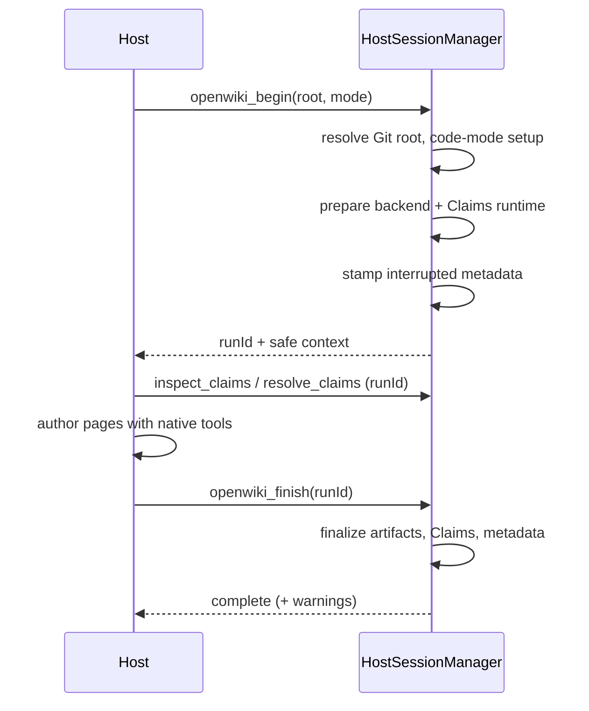

# Coding-Agent Integration

OpenWiki can run inside a host coding agent (Codex, Claude Code) instead of its own agent loop. The host uses its native tools to read source and author wiki pages, while OpenWiki provides a deterministic lifecycle and Grounded Claims over MCP.

## Protocol

The integration exposes a fixed V1 lifecycle tool set over MCP: `openwiki_begin`, `openwiki_inspect_claims`, `openwiki_resolve_claims`, and `openwiki_finish`. The MCP server is a thin adapter over a transport-neutral provider that advertises host instructions and registers each tool. Transport-visible errors are bounded: a `HostIntegrationError` surfaces its code and message, while any other exception returns a generic failure so unknown exception data is never exposed.

The advertised instructions require resolving the absolute Git top-level and calling `openwiki_begin` first, passing its `runId` to every later tool, and forbid the host from directly editing OpenWiki-owned sidecars, indexes, logs, provenance, metadata, or workflows.

The `begin` request validates `root`, an `init`/`update` mode, and an optional language; claims and finish requests require a UUID `runId`.

## Session lifecycle

`HostSessionManager` owns one begin/finish lifecycle in-process. It serializes lifecycle operations through a single in-progress flag and holds at most one active run at a time.

_Host-driven begin/finish lifecycle._

`begin` resolves the repository root, ensures code-mode setup (creating the workflow only on init), prepares the guarded docs-only backend and the Claims runtime, stamps `interrupted` run metadata, and returns an opaque `runId` plus safe context. `resolveRepositoryRoot` canonicalizes the candidate to its Git worktree top-level and refuses a non-absolute path, the filesystem root, and the user's home directory, so an ambiguous launch directory is never treated as a wiki repository.

An **init** begin opens a recoverable wiki replacement, committed on a successful finish and rolled back if begin itself fails (escalating to an `AggregateError` when rollback cannot restore the previous wiki). A later begin deliberately supersedes an interrupted host run, preserving its authored state while committing any init backup it still owned.

`finish` removes temporary working files, runs the deterministic finalizers, reconciles deleted claim pages, finalizes Claims and persists complete metadata only when content changed, then commits any wiki replacement. The session stays active on a pre-commit failure so the host can retry.

`inspect_claims`/`resolve_claims` run against the active run's Claims session using the same operations as the agent tools, guarded by the `runId` selector.

For how the integration is installed into a host, see [install.md](install.md). For the Claims operations reused here, see [claims/agent-integration.md](../claims/agent-integration.md).
