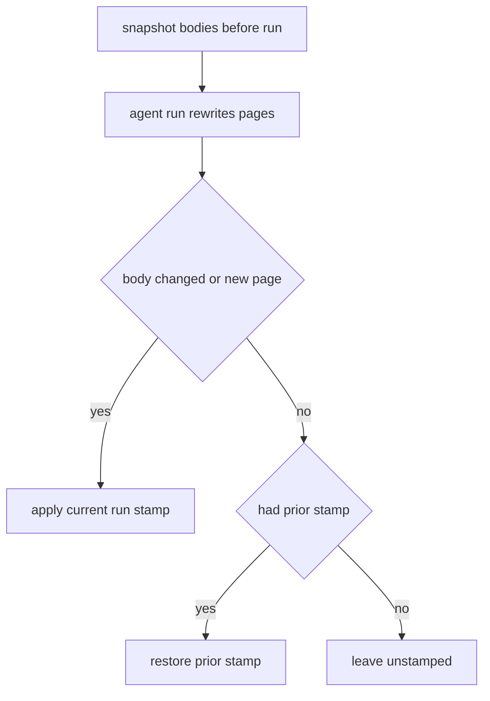
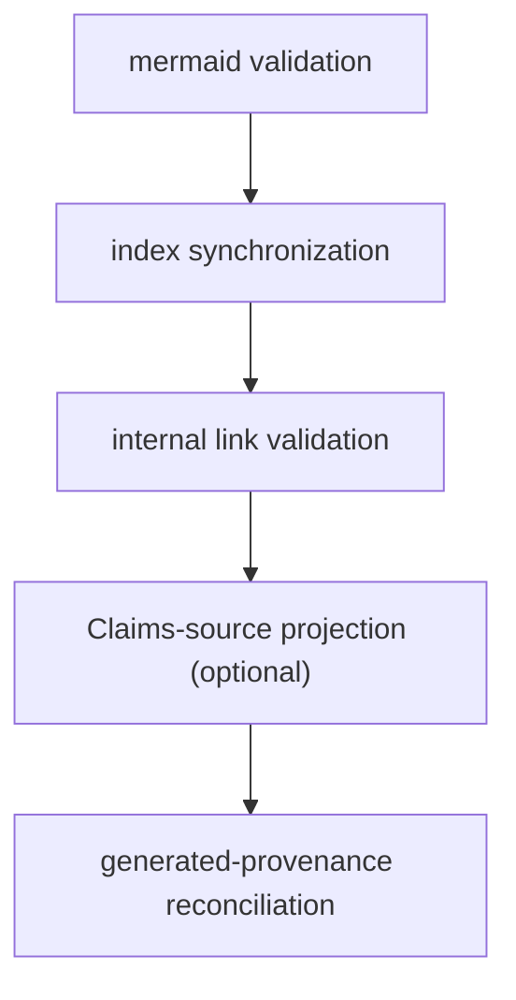

# Open Knowledge Format (OKF) Overview

Every wiki OpenWiki produces is a portable [OKF v0.2](https://github.com/GoogleCloudPlatform/knowledge-catalog/blob/main/okf/SPEC.md) Markdown bundle. Each concept page carries YAML front matter that OpenWiki validates, and each page gains deterministic generation provenance during finalization. Finalization itself is a single shared function — `finalizeWikiArtifacts` (`src/agent/wiki-finalizer.ts`) — reached from two entry points with the same fixed operation order.

## Front matter fields

The only **required** OKF field is `type`. When present, `title`, `description`, `resource`, and `timestamp` must be non-empty strings. `tags`, when present, must be a YAML list of non-empty strings.

- `status` — the page lifecycle state, one of `draft`, `stable`, or `deprecated`; an absent `status` is treated as `stable`.
- `timestamp` — tolerated for backward compatibility. OKF v0.2 supersedes it with a structured `generated.at` event, but v0.1 consumers may still fall back to it.

Any front-matter key that holds a timestamp must be an ISO 8601 datetime carrying a trailing `Z` or numeric offset, so freshness comparisons never depend on a consumer's local timezone. The validator additionally rejects regex-shaped but calendar-impossible values (for example day 30 of February) by checking real month lengths.

Beyond scalars, `validateOkfFrontmatter` checks the OKF v0.2 provenance, trust, and lifecycle families only for the shape OKF specifies, while extra keys inside entries stay tolerated so producer extensions survive round trips:

- `generated` — a `{by, at}` mapping with a non-empty actor string and an optional ISO 8601 `at`.
- `verified` — either a single `{by, at}` mapping or a YAML list of them.
- `sources` — a YAML list of mappings, each with a non-empty `resource` string.
- `stale_after` — an ISO 8601 datetime with an explicit UTC offset.

## Deterministic provenance

After the agent run, OpenWiki reconciles producer provenance against the final post-processed wiki:

- **New pages** and pages whose Markdown **body changed** in any way receive the current run's `generated` stamp (and any legacy `timestamp` field is removed).
- A page whose **body is unchanged** retains its prior stamp (restored if an agent rewrite removed or altered it).
- Pages that were **previously unstamped** remain unstamped.

The pre-run baseline retains only body hashes and the prior producer event, keeping the snapshot bounded without writing temporary files beside the documentation.

_How generation provenance is reconciled after a run._

Body-change detection hashes only the Markdown body with the front matter split off (`hashConceptBody` via `splitFrontmatter`), so a front-matter-only edit — including a Claims `sources` projection — does not advance a page's `generated` stamp. Because the body hash retains whitespace, any body change advances the event.

## Validation and repair

When a page fails OKF validation (no front matter, unparseable YAML, or a missing `type`), its front matter is rebuilt from a minimal derived block that derives only `type` and a `title` (the `description` is left for the agent to supply) and is flagged `openwiki_generated: true`. A page that already has a usable `type` is left untouched even when optional fields are junk, so an author's `type` and custom extension fields are never overwritten.

To avoid silently discarding metadata during that repair, OpenWiki preserves across the rebuild:

- the OpenWiki translation-pending marker (`openwiki_translation_pending`), and
- the structured `generated`, `verified`, and Claims-derived `sources` fields (carried verbatim as raw field blocks rather than re-quoted).

The `generated` and `sources` families are code-owned, so listing them for preservation keeps deterministic provenance and [Grounded Claims](../claims/overview.md) evidence intact even when a page also trips the repair path.

## Claims-source projection

During finalization OpenWiki projects each page's [Grounded Claims](../claims/overview.md) evidence into that page's OKF `sources` front matter (`synchronizeClaimSources`). The reconciliation is non-destructive:

- Entries whose `id` begins with the reserved `openwiki-source-` prefix are OpenWiki-owned; they are removed and rebuilt on every run. Every other, producer-authored entry is **retained** untouched.
- Projected resources are deduplicated to **whole-file** form (`toWholeFileRepositoryResource` drops the `#Lx-Ly` line range), sorted, and skipped when a retained producer entry already covers the same resource. Precise line ranges stay in the Claims sidecar; only the page-level source file surfaces in `sources`.
- Each OpenWiki source `id` is a deterministic SHA-256 digest of its resource, which is what lets a later run replace or remove exactly its own projection.
- A page not present in the current concept set, or whose computed `sources` is deep-equal to the existing one, is not rewritten.

A separate `verified` projection (`synchronizeClaimsVerification`, `src/okf/claims-verification.ts`) runs later inside the repository Claims runtime's `finalize` step — outside `finalizeWikiArtifacts`. It reconciles OpenWiki-owned `verified` events against durable Claims state while retaining human, process, and other producer events, and rolls back stamps whose sidecar hash refresh failed.

## Finalization: two entry points, one order

`finalizeWikiArtifacts` is the single deterministic post-authoring routine, called from two places so chat/local-wiki and repository runs converge on identical conformance behavior:

- **OKF middleware `afterAgent` hook** (`src/agent/okf-middleware.ts`) — for `local-wiki` `init`/`update` runs that flow through the shared agent core. (`chat` mounts no middleware at all, so it never finalizes.) The matching `beforeAgent` hook runs `prepareWikiForAuthoring`, which migrates pages to valid front matter and snapshots their bodies into a `PreparedWikiState` held in closure for the `afterAgent` finalization.
- **`finishRepositoryRun`** (`src/generation/repository-run.ts`) — for `repository` `init`/`update` runs that use the durable page-job lifecycle instead of the shared agent graph. It reconstructs the prepared state from `.run.json` (`deserializePreparedWikiState`) so a resumed run finalizes deterministically.

Both paths run the post-authoring lifecycle in the same fixed order:

1. **`mermaid`** — rewrite unparseable Mermaid fences into a `text` fence with an `openwiki: mermaid parse failed` marker.
2. **`index_sync`** — regenerate every directory `index.md` deterministically.
3. **`link_validation`** — stamp broken relative internal links in place.
4. **`claims_sources`** *(optional)* — project page-owned Claims evidence into OKF `sources`, only when a `claimSources` callback is supplied. The repository path supplies one (page evidence from the Claims runtime); the local-wiki path omits it, so the step is skipped.
5. **`generated_provenance`** — reconcile every page against the pre-authoring snapshot and stamp code-owned `generated` provenance on new or changed pages.

Because claims-source projection runs **immediately before** generated-provenance reconciliation, and the generated-provenance body hash excludes front matter, a page whose only change this run is a Claims `sources` edit is **not** given a fresh `generated` stamp — its prior stamp is restored, so evidence bookkeeping never masquerades as a content change.

## Shared stamp time

The whole run shares **one ISO 8601 stamp time**, threaded in by the caller so every page generated in a run receives the same `generated.at` and stamping stays deterministic under test.

- **Local-wiki / shared core** — `runTimestamp` is computed once in `runOpenWikiAgent` (`new Date().toISOString()`) and passed through `createOpenWikiAgentGraph` into the OKF middleware's `now`, which forwards it as finalization's `at`.
- **Repository generation** — `finishRepositoryRun` passes `run.state.startedAt` (captured at `beginRepositoryRun`) as `at`, and a separate producer actor (`run.state.actor.producerActor`) identifies who authored the body changes. The same `startedAt` is later passed to the Claims runtime `finalize`, so `generated` and `verified` events in one repository run share one time.

Finalization requires a non-empty producer actor and throws otherwise; `generated` provenance reconciliation applies the shared stamp only to pages whose bodies actually changed.
