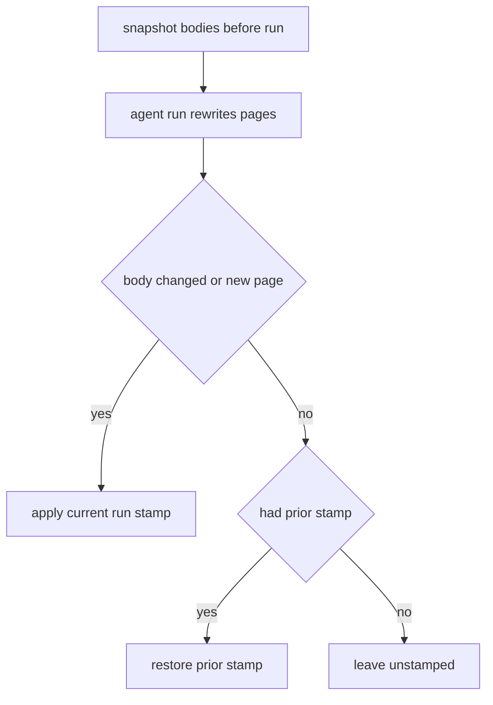

# Open Knowledge Format (OKF) Overview

Every wiki OpenWiki produces is a portable [OKF v0.2](https://github.com/GoogleCloudPlatform/knowledge-catalog/blob/main/okf/SPEC.md) Markdown bundle. Each concept page carries YAML front matter that OpenWiki validates, and each page gains deterministic generation provenance during finalization.

## Front matter fields

The only **required** OKF field is `type`. When present, `title`, `description`, `resource`, and `timestamp` must be non-empty strings.

- `status` — the page lifecycle state, one of `draft`, `stable`, or `deprecated`; an absent `status` is treated as `stable`.
- `timestamp` — tolerated for backward compatibility. OKF v0.2 supersedes it with a structured `generated.at` event, but v0.1 consumers may still fall back to it.

Any front-matter key that holds a timestamp must be an ISO 8601 datetime carrying a trailing `Z` or numeric offset, so freshness comparisons never depend on a consumer's local timezone.

## Deterministic provenance

After the agent run, OpenWiki reconciles producer provenance against the final post-processed wiki:

- **New pages** and pages whose Markdown **body changed** in any way receive the current run's `generated` stamp.
- A page whose **body is unchanged** retains its prior stamp (restored if an agent rewrite removed or altered it).
- Pages that were **previously unstamped** remain unstamped.

The pre-run baseline retains only body hashes and the prior producer event, keeping the snapshot bounded without writing temporary files beside the documentation.

_How generation provenance is reconciled after a run._

## Validation and repair

When a page fails OKF validation, its front matter is rebuilt from a minimal derived block that derives only `type` and a `title`. To avoid silently discarding metadata during that repair, OpenWiki preserves across the rebuild:

- the OpenWiki translation-pending marker, and
- the structured `generated`, `verified`, and Claims-derived `sources` fields.

The `generated` and `sources` families are code-owned, so listing them for preservation keeps deterministic provenance and [Grounded Claims](../claims/overview.md) evidence intact even when a page also trips the repair path.

## Claims-source projection

During finalization OpenWiki projects each page's [Grounded Claims](../claims/overview.md) evidence into that page's OKF `sources` front matter (`synchronizeClaimSources`). The reconciliation is non-destructive:

- Entries whose `id` begins with the reserved `openwiki-source-` prefix are OpenWiki-owned; they are removed and rebuilt on every run. Every other, producer-authored entry is **retained** untouched.
- Projected resources are deduplicated to **whole-file** form (`toWholeFileRepositoryResource` drops the `#Lx-Ly` line range), sorted, and skipped when a retained producer entry already covers the same resource. Precise line ranges stay in the Claims sidecar; only the page-level source file surfaces in `sources`.
- Each OpenWiki source `id` is a deterministic SHA-256 digest of its resource, which is what lets a later run replace or remove exactly its own projection.
- A page not present in the current concept set, or whose computed `sources` is deep-equal to the existing one, is not rewritten.

This projection runs **immediately before** generated-provenance reconciliation in the fixed finalization order (see [Middleware Pipeline](../agent/middleware.md)). Because the generated-provenance body hash excludes front matter (`hashConceptBody` splits it off), a page whose only change this run is a Claims `sources` edit is **not** given a fresh `generated` stamp — its prior stamp is restored, so evidence bookkeeping never masquerades as a content change.
