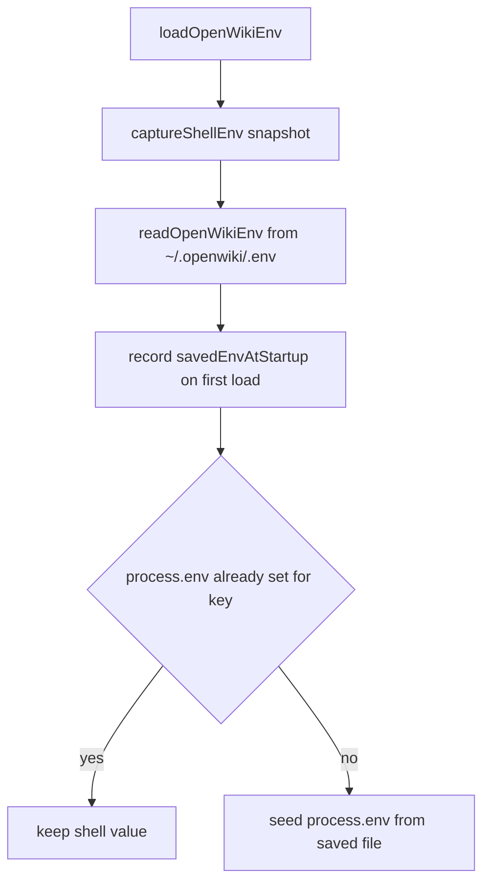
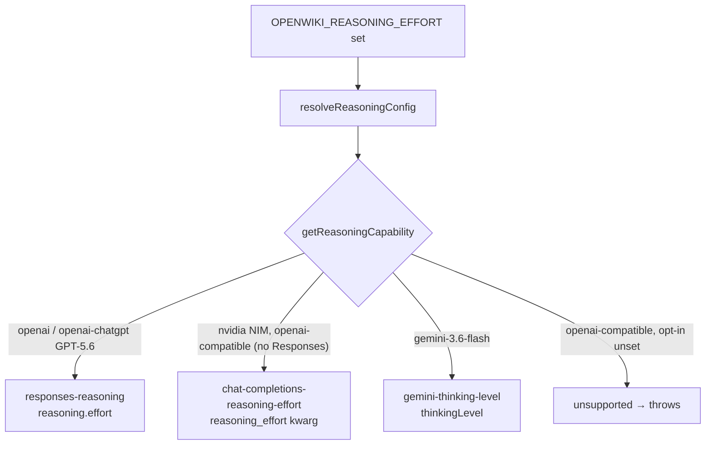
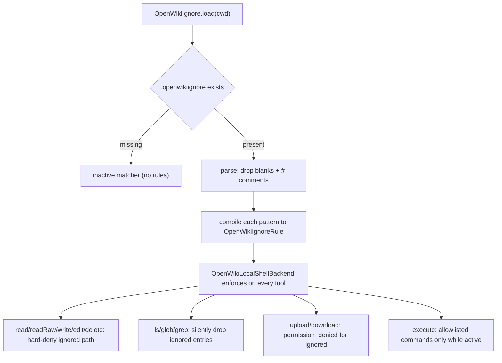

# Configuration and Environment

OpenWiki is configured almost entirely through environment variables. Provider
credentials, model selection, token limits, streaming toggles, and reasoning
effort are all read from `process.env`, with a persisted fallback file at
`~/.openwiki/.env`. This page describes where that state lives, how values are
loaded and saved, the precedence between the shell and the saved file, how
secrets are sanitized, and the key settings a reader needs to operate OpenWiki.

Related reading: [Model providers](../concepts/model-providers.md),
[CLI reference](./cli-reference.md), and [Onboarding](../workflows/onboarding.md).

## The state directory

All persistent OpenWiki state lives under a single home directory, resolved by
`resolveOpenWikiHomeDir`. By default this is `~/.openwiki`
(`path.join(os.homedir(), ".openwiki")`), but it can be relocated with the
`OPENWIKI_CONFIG_DIR` environment variable. A configured directory is
tilde-expanded manually (because `path.resolve` does not expand a leading `~`)
so values like `~/custom` that come from PowerShell, docker-compose, or a
hand-edited `.env` resolve correctly.

`ensureOpenWikiHome` creates the home directory and its subdirectories —
`connectors`, `conversation_history`, `wiki`, and `skills` — each with owner-only
`0o700` permissions. The persisted environment file lives at
`<home>/.env` (`openWikiEnvPath`), displayed to users as `~/.openwiki/.env`.

### Windows ACL handling

POSIX `0o700` intent does not translate to Windows, where `fs.chmod` only toggles
the read-only attribute and leaves ACLs untouched. To preserve owner-only access
on Windows, directory creation runs `restrictDirToCurrentUser`, which uses
`icacls` to grant full control to the current user and the well-known SYSTEM SID
(`*S-1-5-18`, referenced by SID so it resolves regardless of display language),
then removes inherited ACEs. The grant runs before the inheritance reset so a
failed grant can never lock the user out of the directory. It is best-effort by
design: it returns `false` instead of throwing so ACL tooling problems never
block a run, and it is a no-op on non-Windows platforms.

## Managed keys as the single source of truth

`MANAGED_ENV_KEYS` in `src/config/env.ts` lists every environment variable
OpenWiki reads or persists, in the exact order they are written to
`~/.openwiki/.env`. It is the single source of truth: both the credential
diagnostics list (`CREDENTIAL_DIAGNOSTIC_ENV_KEYS`) and the agent's debug-dump
key list (`DEBUG_ENV_KEYS`) are derived from it by filtering, so they cannot
silently drift out of sync when a new managed key is added. LangChain
project/tracing settings are managed but are not credentials, so they are
excluded from the diagnostics panel via `NON_CREDENTIAL_ENV_KEYS`.

## Loading and precedence

Precedence when OpenWiki loads its persisted environment file.

`loadOpenWikiEnv` reads `~/.openwiki/.env` and copies each value into
`process.env` only when that key is not already set. This makes a shell export
win over the saved file at runtime: OpenWiki never overwrites a variable the user
exported in their shell. Deprecated keys (`OPENAI_ORG_ID`, `OPENAI_PROJECT`) are
skipped on load. Reading a non-existent file is not an error — `readOpenWikiEnv`
returns an empty map when the file is missing.

To reason about this precedence, OpenWiki captures two in-memory snapshots at
startup, both held in memory only and never persisted or logged:

- `captureShellEnv` records the shell's values for managed credential keys before
  any load or save wrote to `process.env`. It is idempotent — the first call
  wins — so a later load or save cannot capture values OpenWiki itself seeded.
  `getShellEnvValue` exposes this snapshot.
- `savedEnvAtStartup` records the file's values as of the first load, exposed via
  `getSavedEnvValue`. This lets the setup wizard pre-fill fields from the saved
  config rather than `process.env` (which a shell var may shadow), so editing
  config never accidentally captures a shell override.

## Saving: serialized, atomic, and shell-aware

`saveOpenWikiEnv` serializes all writes through a promise queue
(`saveOpenWikiEnvQueue`) so concurrent saves cannot interleave; a failed save is
swallowed in the queue chain so it does not permanently block later saves, while
the original caller still receives the error.

The locked save (`saveOpenWikiEnvLocked`) merges updates over the current file
contents, drops deprecated keys, and drops any key whose value is empty — an
empty value means "not set", so persisting `KEY=""` (which would later read back
as configured) is avoided, and this also self-heals empty values left by earlier
writes. It then ensures the directory exists with `0o700`, re-applies the mode,
and calls `restrictDirToCurrentUser`.

Writes are atomic: the new contents are written to a uniquely named temp file in
the same directory (mode `0o600`) and then `rename`d into place. A plain
`writeFile` would open the existing credential file with `O_TRUNC`, so a failure
mid-write (ENOSPC, crash, power loss) would truncate `~/.openwiki/.env` and lose
every saved token and key; the rename keeps the original intact until the new
contents are fully written.

After writing the file, `process.env` is updated to mirror the save — but a key
whose value came from a shell export at startup is left untouched, so an
in-process update never masks a shell variable that wins at runtime.

### File format

`formatEnv` writes managed keys first, in `MANAGED_ENV_KEYS` order, followed by
any other keys sorted alphabetically. Values are always double-quoted and
escaped by `formatEnvValue`, which replaces in a fixed order — backslash first,
then double-quote, then newline, then carriage-return — so the reverse read can
always undo each escape without ambiguity. `parseEnv` reads the file back: it
ignores blank lines and `#` comments, accepts an optional `export ` prefix,
requires shell-style `UPPER_SNAKE_CASE` keys, and unescapes double-quoted
values through `parseEnvValue`.

`parseEnvValue` performs unescaping as a **single atomic left-to-right pass**.
It strips the surrounding quotes and replaces each `\\` + character escape with
a single `replace` over `/\\(.)/gsu`, switching on the escaped character
(`n` → newline, `r` → carriage return, `"` → quote, `\` → backslash) and leaving
any other escaped pair intact. This replaced the earlier sequential independent
`replace()` calls, which were unsafe: unescaping `\\n` (an escaped backslash
followed by `n`) back into a raw `\` first and only then scanning for `\n` could
let a later pass re-read that raw backslash plus the next character as a brand
new escape pair. The concrete failure was a Windows path such as
`C:\name\creds.json` — its `\\` + `name` segment would be misread as `\n` +
`ame`, corrupting the value with a real newline. Consuming each backslash
escape as one atomic unit in a single pass closes that window, because no
unescaped output is ever re-scanned.

## Key environment variables

### Provider and model selection

`OPENWIKI_PROVIDER` selects the provider and `OPENWIKI_MODEL_ID` selects the
model. When `OPENWIKI_PROVIDER` is unset, `resolveConfiguredProvider` infers the
provider from whichever credential is present, checking API keys in a fixed order
(`OPENAI_API_KEY`, then OpenAI-compatible, OpenRouter, Anthropic, Baseten,
Fireworks, Nebius, NVIDIA, then Bedrock access/secret keys) and falling back to
`DEFAULT_PROVIDER` (`openai`). Each provider declares its own credential env
variables and optional base-URL override in `PROVIDER_CONFIGS`; see
[Model providers](../concepts/model-providers.md) for the full registry.

### Token limits

OpenWiki caps per-request output tokens through three settings, resolved by
`resolveConfiguredMaxOutputTokens` in a fixed precedence:

1. `OPENWIKI_MAX_OUTPUT_TOKENS` — the provider-neutral cap, parsed by
   `resolveMaxOutputTokens`, which accepts only a positive safe integer (no
   fractions, exponents, or hex). When set, it applies to every provider.
2. Provider-specific caps, used only when the neutral setting is unset:
   - On **OpenRouter**, `OPENWIKI_OPENROUTER_MAX_TOKENS` is a legacy cap retained
     for existing low-balance installations. It takes precedence over the
     Bedrock default whenever set, because without a cap OpenRouter's credit
     pre-check budgets the model's full advertised output ceiling and rejects
     requests with HTTP 402.
   - On **Bedrock**, `OPENWIKI_BEDROCK_MAX_TOKENS` caps output for the Bedrock
     Converse API. `resolveBedrockMaxTokens` **defaults to
     `BEDROCK_DEFAULT_MAX_TOKENS` (16000)** when unset, matching
     `@langchain/anthropic`'s built-in ceiling for Claude models — without an
     explicit `maxTokens`, Bedrock caps output at 4096 tokens and truncates long
     wiki pages mid-write. Override it for models with a lower ceiling.
3. When all of the above are unset, the resolved cap is `undefined` and the
   provider SDK's own default applies (Bedrock excepted, which always gets the
   16000 default).

In short: `OPENWIKI_MAX_OUTPUT_TOKENS` > provider-specific (OpenRouter legacy /
Bedrock default) > unset.

### Streaming and Responses API toggles

For the `openai-compatible` provider, three independent boolean toggles control
transport and capability, each true only when the value trims to `"true"`:

- `OPENWIKI_OPENAI_COMPATIBLE_USE_RESPONSES_API`
  (`resolveOpenAiCompatibleUseResponsesApi`) routes generation through the OpenAI
  Responses API instead of chat completions.
- `OPENWIKI_OPENAI_COMPATIBLE_STREAMING` (`resolveOpenAiCompatibleStreaming`)
  forces the SSE streaming HTTP transport for every generation, for gateways that
  only serve streaming and otherwise fail silently with blank output.
- `OPENWIKI_OPENAI_COMPATIBLE_REASONING_EFFORT_SUPPORTED`
  (`resolveOpenAiCompatibleReasoningEffortSupported`) is the opt-in that gates
  whether the `openai-compatible` provider supports reasoning effort at all; see
  [Reasoning effort](#reasoning-effort) below.

A separate, distinct axis is `OPENWIKI_OPENAI_COMPATIBLE_STREAM_MESSAGES`
(`resolveOpenAiCompatibleStreamMessages`), which controls how LangGraph surfaces
a run in the TUI ("messages" stream mode) rather than the HTTP transport.

`OPENWIKI_STREAM_IDLE_TIMEOUT` sets the milliseconds to wait for the first or
next Bedrock stream chunk; `resolveStreamIdleTimeoutForProvider` applies it only
to the `bedrock` provider, and a value of `0` disables the stream watchdog
entirely (stalled streams may then hang indefinitely).

`OPENWIKI_PROVIDER_RETRY_ATTEMPTS` (`resolveProviderRetryAttempts`) sets provider
retry attempts, defaulting to `DEFAULT_PROVIDER_RETRY_ATTEMPTS` (3).

### Reasoning effort

`OPENWIKI_REASONING_EFFORT` selects a reasoning effort from
`REASONING_EFFORT_VALUES` (`none`, `low`, `medium`, `high`, `xhigh`, `max`).
`resolveReasoningConfig` returns `undefined` when the variable is unset, but
throws when it is set to an invalid value, when the selected provider/model has
no reasoning capability, or when the value is outside the values that
capability supports. Reasoning capability is declared per provider and model in
`REASONING_CAPABILITIES`, and each capability also carries the transport used to
send it.

`REASONING_CAPABILITIES` declares three transports, each sent differently by
the agent's model constructor:

- **`responses-reasoning`** — OpenAI GPT-5.6 models on the `openai` and
  `openai-chatgpt` providers (and `openai-compatible` when the Responses-API
  opt-in is also set). Effort is sent as the Responses `reasoning.effort` payload.
- **`chat-completions-reasoning-effort`** — NVIDIA NIM, and `openai-compatible`
  when reasoning effort is opted in but the Responses API is not in use. Effort
  is sent as the chat-completions `reasoning_effort` kwarg.
- **`gemini-thinking-level`** — `gemini-3.6-flash` on the `gemini` provider.
  Effort is sent as the Gemini `thinkingLevel` option.

For the `openai-compatible` provider specifically, reasoning effort is disabled
unless `OPENWIKI_OPENAI_COMPATIBLE_REASONING_EFFORT_SUPPORTED` is set to `true`.
`getOpenAiCompatibleReasoningCapability` returns `undefined` when that opt-in is
absent (so `resolveReasoningConfig` throws "not supported"), and otherwise picks
the transport from the Responses-API toggle: `responses-reasoning` when
`OPENWIKI_OPENAI_COMPATIBLE_USE_RESPONSES_API` is set, otherwise
`chat-completions-reasoning-effort`. It supports the full
`REASONING_EFFORT_VALUES` set regardless of transport. The Gemini capability
(`gemini-3.6-flash`) supports only `low`/`medium`/`high`, and the NVIDIA NIM
capability supports only `none`/`low`/`high`, so a value like `max` is rejected
for those models even though it is valid for OpenAI GPT-5.6.

## Repository-authored configuration files

Beyond the `~/.openwiki/` state directory and env vars, OpenWiki reads three
files that live **in the repository** (under `openwiki/` or the repo root) and
are committed alongside the generated wiki. They are user-authored or
setup-authored, not OpenWiki-managed environment state.

### `.openwikiignore` — the agent read boundary

`.openwikiignore` (constant `OPENWIKI_IGNORE_FILE`) is a gitignore-style file at
the repository root listing paths the doc-generation agent must not touch. It is a
**read boundary** enforced by `OpenWikiLocalShellBackend`, not a guarantee that a
topic is never mentioned: the agent could still infer details from visible code
or tests, so it scopes *access*, not *speech*. `OpenWikiIgnore.load` reads it
from the repo root; a missing file is treated as "no rules" (an inactive matcher,
`isActive === false`), and any non-missing-file read error is rethrown rather
than silently fail-open.

How `.openwikiignore` gates the agent's filesystem and shell tools.

Syntax (parsed by `OpenWikiIgnore.parse` / `OpenWikiIgnoreRule.compile`):

- **Blank lines** and **`#` comments** are dropped (`parseIgnoreLine`).
- **`*`** matches within a single path segment; **`?`** matches one non-slash
  character; **`**`** spans directories — `**/` matches zero or more leading
  directories, a bare trailing `**` matches anything nested beneath.
- A **leading `/`** (or any embedded slash) anchors the pattern to the repo root;
  unanchored slash-free patterns (e.g. `*.log`) match at any path segment.
- A **trailing `/`** scopes a rule to directories (`build/`), but the rule still
  matches files nested under that directory.
- **`!`** negation re-includes a previously excluded path. Rules apply in file
  order with **last-match-wins**, so a trailing `!logs/keep.log` re-includes a
  file excluded by an earlier `*.log`.

Matching is case-insensitive (`i` flag) everywhere — on case-insensitive
filesystems (macOS APFS/HFS+, Windows NTFS) `Secrets/token.txt` and
`secrets/token.txt` resolve to the same file, so a case-sensitive rule would let
an alternate-cased spelling slip past an exclusion. Paths are canonicalized by
`normalizeIgnorePath` (backslashes to slashes, `.`/`..` collapsed via
`path.posix.normalize`) so equivalent spellings like `./secrets/token.txt` or
`secrets/../secrets/token.txt` cannot dodge an anchored rule.

Enforcement is layered onto every agent tool in `OpenWikiLocalShellBackend`:

- **Reads/writes/edits/deletes** of an ignored path are hard-denied with a
  `Path is excluded by .openwikiignore` error (`getIgnoredPathError`).
- **Discovery tools** (`ls`, `glob`, `grep`) silently filter out ignored entries
  rather than erroring, and short-circuit to no results when the search root
  itself is ignored.
- **Upload/download** returns `permission_denied` for ignored paths while still
  processing the allowed ones, preserving input order.
- **Shell `execute`** is restricted while any rule is active: only the
  `allowedIgnoredShellCommands` allowlist (`pwd` and `git rev-parse HEAD`) may
  run, because arbitrary shell cannot be proven not to read an ignored path.
  Everything else is refused with guidance to use the gated file tools.

When `.openwikiignore` is active, the prompt also tells the agent to skip
broad-root globs, avoid reconstructing git history through shell, and not
document excluded paths.

### `openwiki/INSTRUCTIONS.md` — the user-authored brief

`openwiki/INSTRUCTIONS.md` (`REPOSITORY_INSTRUCTIONS_FILE`) is a user-authored
Markdown brief that tells OpenWiki the repository wiki's scope and priorities.
It is read, never rewritten by OpenWiki during normal runs — `openwiki --init`
explicitly preserves it while replacing the rest of the generated wiki and
Claims. `readRepositoryWikiInstructions` reads it (trimmed; an empty/missing
file yields `undefined`), and its content is threaded into the run as `wikiGoal`
via `createRunContext` → `readRunWikiGoal`, surfacing in the agent prompt under
"Repository OpenWiki instructions".

The setup wizard writes it through `saveRepositoryWikiInstructions` with mode
`0o644` (committable), and a non-empty `wikiGoal` is required for onboarding to
be considered complete (`isOnboardingComplete`). In `local-wiki`/personal mode
the equivalent brief lives in the private state directory at
`~/.openwiki/INSTRUCTIONS.md` (`openWikiInstructionsPath`, mode `0o600`, written
by `saveOpenWikiOnboardingConfig`), read by `readWikiInstructions`.

### `openwiki/.langsmith.json` — LangSmith workspaces/projects

`openwiki/.langsmith.json` (`getLangSmithRepoConfigPath`) is a committed JSON
config read by the LangSmith connector that names the LangSmith workspaces and
projects to document — **never the API key**. Each workspace entry carries an
`apiKeyEnv` (the *name* of an env var holding the key, constrained to the
`OPENWIKI_LANGSMITH_API_KEY(_<n>)` namespace by `sanitizeLangSmithApiKeyEnv` so a
committed config cannot exfiltrate an unrelated secret) and optional `apiBaseUrl`
(validated against the three official LangSmith hosts by
`sanitizeLangSmithApiBaseUrl`, since the base URL receives the user's key as an
Authorization header). The actual key lives in `~/.openwiki/.env` or a CI secret.

`parseLangSmithRepoConfig` reads only named, allowlisted fields and drops any
workspace failing a shape or allowlist check rather than failing the whole config,
so a malicious PR cannot point the connector at an arbitrary host or name an
unrelated secret. The setup wizard writes it WYSIWYG via `saveLangSmithSetup` /
`writeLangSmithRepoConfig`, but only once the LangSmith sub-menu is opened
(`langsmithSourcesTouched`) — an untouched setup never rewrites the file.

Related reading: [Connectors](../integrations/connectors.md) for the connector
registry, and [Onboarding](../workflows/onboarding.md) for the setup flow that
writes these repo files.

## Credential diagnostics

`getCredentialDiagnostics` produces one `CredentialDiagnostic` per key in
`CREDENTIAL_DIAGNOSTIC_ENV_KEYS`, comparing the file value against the
`process.env` value. Each entry reports its source — `process.env`, the env file
path, "process.env over <file>" when both are set, or `unset` — and a
masked preview. Non-secret settings (provider, model, token limits, base URLs,
region, Google project/location, and the boolean toggles, including
`OPENWIKI_OPENAI_COMPATIBLE_REASONING_EFFORT_SUPPORTED`) are shown verbatim;
true secrets are previewed as a short masked fragment (or all-asterisks for short
values).

Diagnostics surface per-key warnings through a dedicated validator per key:
invalid provider, invalid model ID, invalid token limits (neutral, Bedrock, and
OpenRouter each have their own validator), invalid boolean, invalid reasoning
effort, invalid retry attempts, invalid stream idle timeout, base-URL provider
mismatches, credential whitespace/newline/quote issues, and a warning that the
Bedrock stream watchdog is disabled when the idle timeout is `0`. The boolean
validator `getBooleanWarnings` covers all three `openai-compatible` toggles —
`OPENWIKI_OPENAI_COMPATIBLE_USE_RESPONSES_API`,
`OPENWIKI_OPENAI_COMPATIBLE_STREAMING`, and
`OPENWIKI_OPENAI_COMPATIBLE_REASONING_EFFORT_SUPPORTED` — reporting "invalid
boolean" for any value that does not trim to `true` or `false`.

`OPENWIKI_BEDROCK_MAX_TOKENS` is treated as a **non-secret diagnostic key**: its
value is shown verbatim in the panel and validated by its own
`getBedrockMaxTokensWarnings` validator (which calls `resolveBedrockMaxTokens`
and reports "invalid output token limit" on failure), distinct from the neutral
`getMaxOutputTokensWarnings` and the OpenRouter `getOpenRouterMaxTokensWarnings`
validators.

## Secret sanitization

`sanitizeDiagnosticText` is the security boundary for anything shown to the user
or written to a log: every error message, header value, or provider response body
that could contain a credential must pass through it first. It redacts (1) the
exact values of secrets currently set in the environment, replacing each with
`[REDACTED:<KEY>]`, and (2) anything matching known key/token shapes — OpenAI and
OpenRouter `sk-…` keys, `Bearer …` headers, LangSmith `ls…` tokens, and the
"Incorrect API key provided: …" phrasing. `getErrorMessage` routes user-facing
errors through this sanitizer (with a friendlier message for provider HTTP 500s).

`isSecretLikeKey`, backed by the shared `SECRET_KEY_PATTERN_SOURCE`, is the
single source of truth for deciding whether an object key name looks
secret-bearing (matching `api_key`, `authorization`, `bearer`, `token`,
`secret`, `password`, `user_id`, or `cookie`); every redaction path — diagnostics,
OpenRouter response bodies, and MCP tool args/results — shares it, so a key
redacted by one path is redacted by all. `isAuthError` classifies failures as
credential rejections from HTTP 401/403 status and the already-redacted message,
driving whether the CLI shows the authentication "how to fix" panel.
