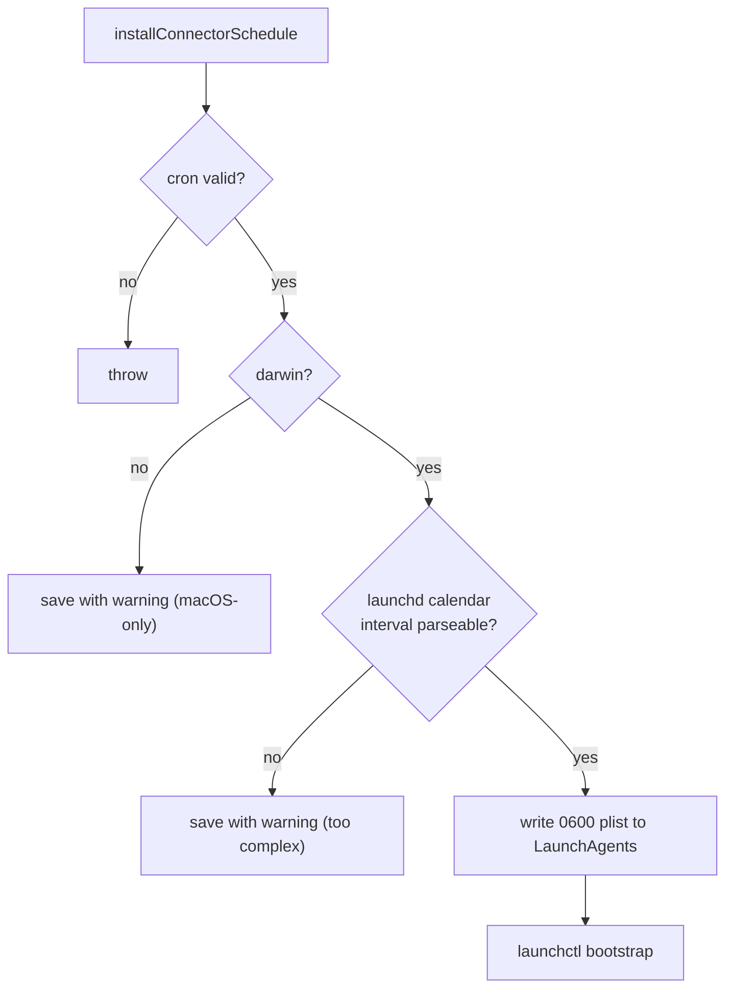

# Scheduling & Scheduled Updates

OpenWiki keeps a wiki current on a schedule in two different ways: **personal ingestion** is scheduled natively via macOS launchd, and **code-mode updates** are scheduled through a CI workflow committed to the repository.

## Cron validation

Cron expressions are validated and described using cron-parser and cronstrue, rejecting an empty or unparseable expression. The suggested expression comes from the saved ingestion schedule or defaults to a daily early-morning run.

## Native (macOS launchd) schedules

Native schedule installation is **macOS-only**, via a launchd LaunchAgent:

_Native schedule installation._

On non-darwin platforms the schedule is saved with a warning, and a cron expression too complex for a launchd calendar interval is also saved with a warning instead of installed. Installing writes a launchd plist with `0600` permissions into the LaunchAgents directory, propagates the OpenWiki config-dir override, then reloads it via `launchctl bootstrap`.

## Code-mode scheduled updates

Code-mode scheduled updates are driven by a **GitHub Actions workflow**, not launchd. `init` generates `openwiki-update.yml` with a daily cron, and equivalent example workflows exist for GitLab CI and Bitbucket Pipelines under `examples/`.

For how the workflow is created and preserved, see [ingestion/overview.md](../ingestion/overview.md).
