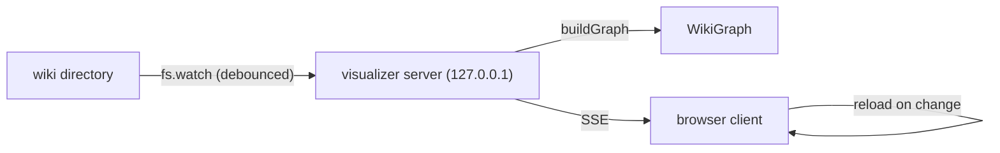

# Wiki Visualizer

The visualizer renders a generated wiki as an interactive graph of pages and the internal links between them. It can run as a live local server or be exported as a self-contained static site.

## The graph

`buildGraph` turns the generated wiki into a `WikiGraph` of page **nodes** and internal-link **edges**. Each node's title and type come from front matter with fallbacks to the first heading or filename, and its id is the `.md`-less path relative to the wiki root.

## Live server

_Loopback server with live reload._

The server binds **loopback-only** (`127.0.0.1`) and never exposes the wiki on the network. It retries a busy preferred port by incrementing across a bounded number of attempts. While running, it watches the wiki directory, debounces bursts of file changes into one rebuild, and pushes updates to connected browsers over **server-sent events** for live reload. The browser client is served as an external module under a strict Content-Security-Policy that pins CDN libraries by SRI and avoids `unsafe-inline` for scripts.

## Static export

The static export writes a self-contained directory (`index.html`, client assets, styles, and `graph.json`) whose client reads `graph.json` and opens **no** SSE connection, so it can be hosted anywhere without OpenWiki. Both the server and the static export load the same compiled browser assets that ship beside the module in `dist/`.

The `visualize` CLI runner selects between serving and exporting; see [cli/runners.md](../cli/runners.md).
