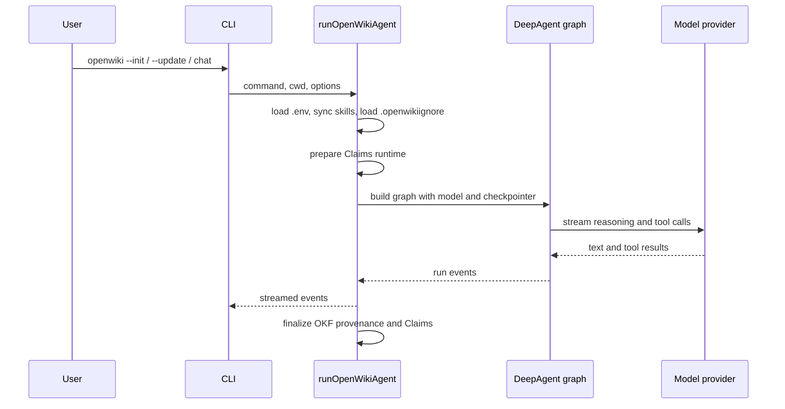

# OpenWiki Quickstart & Domain Map

OpenWiki is a Node/TypeScript CLI (`openwiki`) that uses a [Deep Agents](https://github.com/langchain-ai/deepagentsjs) documentation agent to generate and maintain a wiki. It runs in one of two modes: a **code** wiki for a repository or a **personal** wiki for your own knowledge. Output is an [Open Knowledge Format](okf/overview.md) (OKF v0.2) Markdown bundle that you own, kept current on every change and grounded by a [Grounded Claims](claims/overview.md) subsystem.

## What a run does

A generation or maintenance run is one of three commands — `chat`, `init`, or `update` — driven through `runOpenWikiAgent`. The run loads credentials from the OpenWiki home, syncs bundled skills, enforces the `.openwikiignore` boundary in repository mode, prepares Claims, builds a checkpointed agent graph over the selected model provider, and streams the agent's work back to the caller.

_End-to-end lifecycle of an OpenWiki agent run._

For the full lifecycle, output modes, and transactional wiki replacement, see [architecture/overview.md](architecture/overview.md).

## Subsystem map

| Domain            | Pages                                                                                                                                                                   | What it covers                                                                                               |
| ----------------- | ----------------------------------------------------------------------------------------------------------------------------------------------------------------------- | ------------------------------------------------------------------------------------------------------------ |
| Architecture      | [overview](architecture/overview.md), [configuration](architecture/configuration.md)                                                                                    | Run lifecycle, output modes, no-op detection, crash guard; OpenWiki home, `OPENWIKI_*` vars, ignore boundary |
| CLI               | [overview](cli/overview.md), [TUI](cli/tui.md), [runners](cli/runners.md)                                                                                               | Command parsing/dispatch, startup guards, the Ink app and run log, subcommand runners                        |
| Agent             | [overview](agent/overview.md), [model providers](agent/model-providers.md), [backend](agent/backend.md), [middleware](agent/middleware.md), [prompts](agent/prompts.md) | Deep Agent graph, providers, docs-only backend, middleware pipeline, prompts and subagents                   |
| Claims            | [overview](claims/overview.md), [runtime & store](claims/runtime-and-store.md), [evidence](claims/evidence.md), [agent integration](claims/agent-integration.md)        | Grounded Claims concept, persistence, `repo://` evidence, agent tools/middleware                             |
| OKF               | [overview](okf/overview.md)                                                                                                                                             | OKF front matter, provenance, verification stamping                                                          |
| Connectors        | [overview](connectors/overview.md), [sources](connectors/sources.md), [LangSmith](connectors/langsmith.md)                                                              | Registry and runtime, per-source connectors, the code-mode LangSmith connector                               |
| Ingestion         | [overview](ingestion/overview.md)                                                                                                                                       | Personal ingestion orchestration and code-mode repo setup/connectors                                         |
| Integrations      | [overview](integrations/overview.md), [install](integrations/install.md)                                                                                                | Coding-agent MCP lifecycle and host installer                                                                |
| Auth & onboarding | [auth](auth-and-onboarding/auth.md), [onboarding](auth-and-onboarding/onboarding.md)                                                                                    | OAuth/token flows and providers; first-run credential/onboarding wizard                                      |
| Operations        | [scheduling](operations/scheduling.md), [telemetry](operations/telemetry.md), [visualizer](operations/visualizer.md)                                                    | Cron/launchd/CI schedules, anonymous telemetry, the wiki visualizer                                          |
| Evals             | [LEDGER](evals/ledger.md), [DeepSWE](evals/deepswe.md)                                                                                                                  | Longitudinal grounding harness and the paired DeepSWE experiment                                             |
| Reference         | [mermaid](reference/mermaid.md), [platform](reference/platform.md)                                                                                                      | Mermaid validation/degradation; platform utils and secret redaction                                          |

## Task routing

- **Understand a run end to end** → [architecture/overview.md](architecture/overview.md)
- **Add or change a command, flag, or dispatch rule** → [cli/overview.md](cli/overview.md)
- **Add or debug a model provider** → [agent/model-providers.md](agent/model-providers.md)
- **Change where credentials or wikis are stored** → [architecture/configuration.md](architecture/configuration.md)
- **Understand how facts stay accurate** → [claims/overview.md](claims/overview.md)
- **Work on page metadata / bundle format** → [okf/overview.md](okf/overview.md)
- **Add or change a source connector** → [connectors/overview.md](connectors/overview.md), [connectors/sources.md](connectors/sources.md)
- **Embed OpenWiki in a coding agent** → [integrations/overview.md](integrations/overview.md)
- **Set up scheduled or CI updates** → [operations/scheduling.md](operations/scheduling.md)
- **Add or debug a connector OAuth or token flow** → [auth-and-onboarding/auth.md](auth-and-onboarding/auth.md)
- **Change the first-run credential/onboarding wizard** → [auth-and-onboarding/onboarding.md](auth-and-onboarding/onboarding.md)
- **Change parsing, dispatch, or the Ink TUI** → [cli/overview.md](cli/overview.md), [cli/tui.md](cli/tui.md)
- **Understand personal vs code-mode ingestion** → [ingestion/overview.md](ingestion/overview.md)
- **Work on anonymized telemetry or redaction** → [operations/telemetry.md](operations/telemetry.md), [reference/platform.md](reference/platform.md)
- **Work on the visualizer or static export** → [operations/visualizer.md](operations/visualizer.md)
- **Fix or add a Mermaid diagram behavior** → [reference/mermaid.md](reference/mermaid.md)
- **Evaluate wiki accuracy** → [evals/ledger.md](evals/ledger.md), [evals/deepswe.md](evals/deepswe.md)
