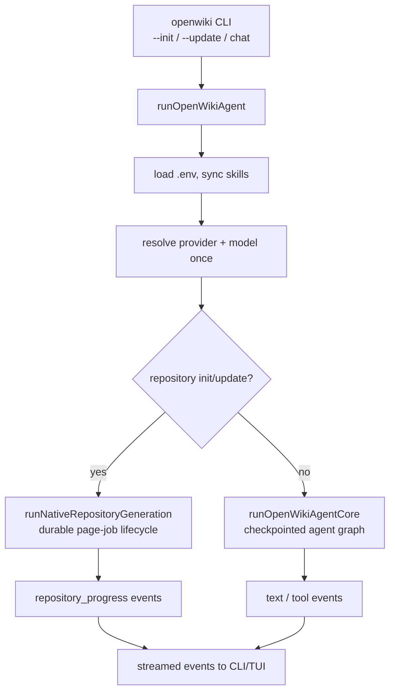
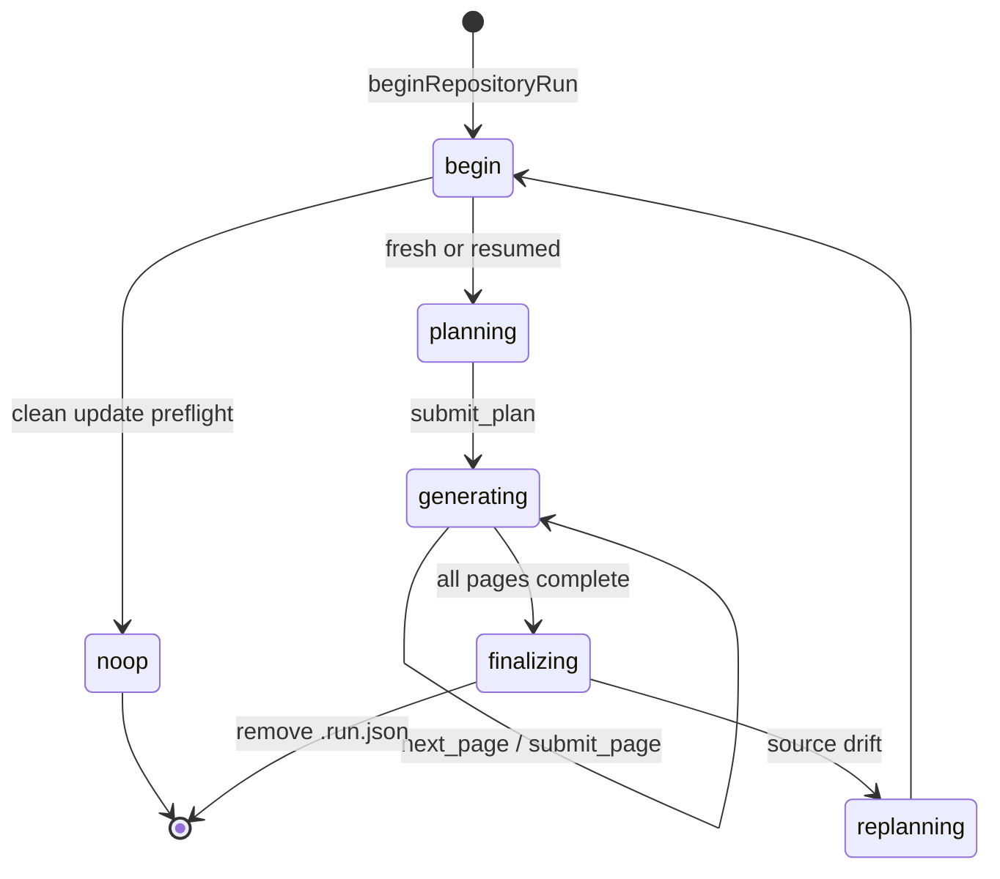

# OpenWiki Quickstart & Domain Map

OpenWiki is a Node/TypeScript CLI (`openwiki`) that uses a [Deep Agents](https://github.com/langchain-ai/deepagentsjs) documentation agent to generate and maintain a wiki. It runs in one of two modes: a **code** wiki for a repository or a **personal** wiki for your own knowledge. Output is an [Open Knowledge Format](okf/overview.md) (OKF v0.2) Markdown bundle that you own, kept current on every change and grounded by a [Grounded Claims](claims/overview.md) subsystem.

## What a run does

A generation or maintenance run is one of three commands — `chat`, `init`, or `update` — all driven through `runOpenWikiAgent`, the single entry point for generation and maintenance runs. `runOpenWikiAgent` loads the OpenWiki home `.env`, syncs bundled skills, resolves the model provider once, and then takes one of two paths depending on the command and output mode:

- **Repository generation** (`init`/`update` with `repository` output mode) routes to `runNativeRepositoryGeneration`, the durable, resumable page-job lifecycle in `src/generation/`. The model is resolved once and passed in; no agent-graph checkpointer or middleware pipeline is used for this path.
- **Chat and local-wiki runs** build a checkpointed Deep Agent graph (`runOpenWikiAgentCore` → `createOpenWikiAgentGraph`) over the selected model provider, enforce the `.openwikiignore` read boundary, and stream the agent's work back to the caller.

_The two run paths inside `runOpenWikiAgent`._

For the full lifecycle, output modes, and transactional wiki replacement, see [architecture/overview.md](architecture/overview.md).

## The resumable page-job lifecycle

Repository generation follows a durable, ordered page-job queue: `begin → submit_plan → next_page → submit_page → … → finish`. State is persisted atomically to `openwiki/.run.json`, so an interrupted run can resume when the same checkout persists; ephemeral CI runners start fresh after failure unless their workspace is preserved. The native orchestrator (`runNativeRepositoryGeneration`) drives one bounded planner worker and one fresh worker per page, reusing the single resolved model. If repository source drifts, the whole plan is invalidated and a replan is forced.

_Repository-generation lifecycle states and the source-drift replan loop._

Each `submit_page` is a durability boundary: OpenWiki persists the reconciled Claims for that page, projects verification, and proves the page's Claim set is durable before advancing the queue. `finish` repeats the whole-run proof, finalizes OKF provenance and indexes, and only then deletes `.run.json`. For details see [generation/overview.md](generation/overview.md) and [claims/agent-integration.md](claims/agent-integration.md).

## Two modes

Bare `openwiki`, `openwiki --init`, and `openwiki --update` default to **code** mode (documenting the current repository into `openwiki/`); add the `personal` positional (or `--mode personal`) for the personal brain, which documents connected sources into `~/.openwiki/wiki`.

| Mode                 | Documents              | Writes to               | Get started                |
| -------------------- | ---------------------- | ----------------------- | -------------------------- |
| **Code** _(default)_ | The current repository | `openwiki/` in the repo | `openwiki --init`          |
| **Personal**         | Your connected sources | `~/.openwiki/wiki`      | `openwiki personal --init` |

Grounded Claims currently apply to repository code wikis and repository evidence; connector-derived facts are not claimed.

## Subsystem map

| Domain       | Pages                                                                                                                                                                     | What it covers                                                                                       |
| ------------ | ------------------------------------------------------------------------------------------------------------------------------------------------------------------------- | ---------------------------------------------------------------------------------------------------- |
| Architecture | [overview](architecture/overview.md)                                                                                                                                     | Run lifecycle, output modes, no-op detection, crash guard, transactional wiki replacement           |
| CLI          | [overview](cli/overview.md), [TUI](cli/tui.md), [runners](cli/runners.md)                                                                                                 | Command parsing/dispatch, startup guards, the Ink app and run log, subcommand runners              |
| Agent        | [overview](agent/overview.md), [model providers](agent/model-providers.md), [backend](agent/backend.md), [middleware](agent/middleware.md), [prompts](agent/prompts.md) | Two run paths, providers, docs-only backend, middleware pipeline (chat/local-wiki only), prompts    |
| Generation   | [overview](generation/overview.md)                                                                                                                                       | Resumable page-job lifecycle, durable `.run.json` state, source-drift invalidation, resume          |
| Claims       | [overview](claims/overview.md), [runtime & store](claims/runtime-and-store.md), [evidence](claims/evidence.md), [agent integration](claims/agent-integration.md)        | Grounded Claims concept, persistence, `repo://` evidence, `submit_page` Claim reconciliation         |
| OKF          | [overview](okf/overview.md)                                                                                                                                               | OKF v0.2 front matter, provenance, verification stamping, repair                                    |
| Integrations | [overview](integrations/overview.md), [install](integrations/install.md)                                                                                                | Coding-agent MCP lifecycle (Codex, Claude Code, OpenCode), host installer                            |
| Reference    | [mermaid](reference/mermaid.md)                                                                                                                                           | Mermaid validation/degradation                                                                       |

## Task routing

- **Understand a run end to end** → [architecture/overview.md](architecture/overview.md)
- **Work on the resumable page-job lifecycle, `.run.json`, or resume** → [generation/overview.md](generation/overview.md)
- **Add or change a command, flag, or dispatch rule** → [cli/overview.md](cli/overview.md)
- **Change the Ink TUI or run-log reducer** → [cli/tui.md](cli/tui.md)
- **Add or debug a subcommand runner** → [cli/runners.md](cli/runners.md)
- **Understand the two agent run paths (native vs agent core)** → [agent/overview.md](agent/overview.md)
- **Add or debug a model provider** → [agent/model-providers.md](agent/model-providers.md)
- **Work on the docs-only backend or writable-page scoping** → [agent/backend.md](agent/backend.md)
- **Work on the chat/local-wiki middleware pipeline** → [agent/middleware.md](agent/middleware.md)
- **Change prompts or repository worker prompts** → [agent/prompts.md](agent/prompts.md)
- **Understand how facts stay accurate** → [claims/overview.md](claims/overview.md)
- **Work on Claims persistence, staleness, or finalization** → [claims/runtime-and-store.md](claims/runtime-and-store.md)
- **Work on `repo://` evidence identity or line ranges** → [claims/evidence.md](claims/evidence.md)
- **Work on `submit_page` Claim reconciliation** → [claims/agent-integration.md](claims/agent-integration.md)
- **Work on page metadata / bundle format / provenance** → [okf/overview.md](okf/overview.md)
- **Embed OpenWiki in a coding agent (MCP lifecycle)** → [integrations/overview.md](integrations/overview.md)
- **Install or uninstall a coding-agent integration** → [integrations/install.md](integrations/install.md)
- **Fix or add a Mermaid diagram behavior** → [reference/mermaid.md](reference/mermaid.md)
