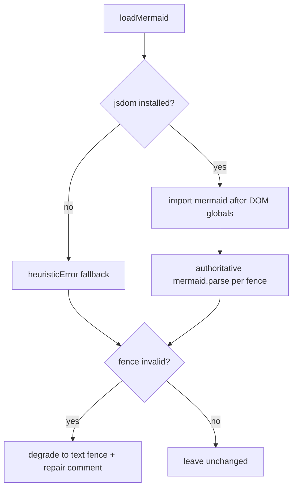
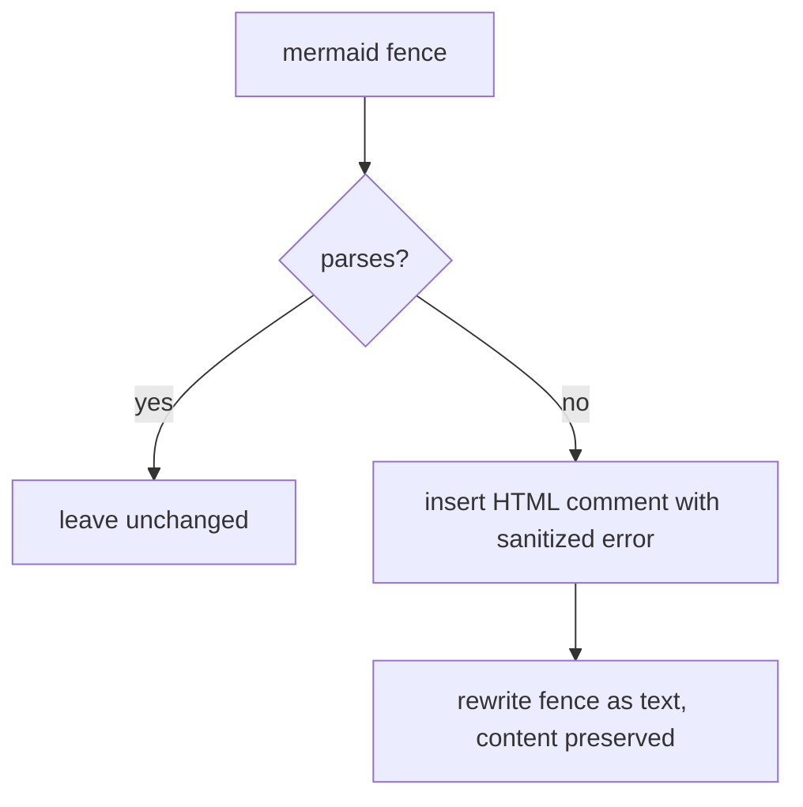

# Mermaid Validation & Degradation

Generated wikis embed mermaid diagrams. A broken diagram would break rendering, so OpenWiki validates every fence during finalization and safely degrades any that do not parse. The pass is a deterministic post-authoring step: `validateWikiMermaid` runs as the `"mermaid"` operation inside `finalizeWikiArtifacts`, ahead of index synchronization, so any in-place rewrites are settled before the index and link validation see the final text.

## The validation pass

`validateWikiMermaid` walks the generated wiki through the backend virtual filesystem — rooted at `/` for `local-wiki` and `/openwiki` for `repository` output — so writes stay inside the docs-only boundary. It lists Markdown files recursively, reads each, counts its mermaid fences, and calls `degradeInvalidMermaidFences`. Files with no failing fences are left **byte-for-byte unchanged** (no `edit` call is made for them) to avoid diff noise; only files that actually degrade are rewritten through `backend.edit`. A missing wiki root or a directory that fails to list yields an empty scan rather than throwing, matching the index middleware's tolerance.

Reserved control files are excluded from scanning: `index.md`, `log.md`, and `INSTRUCTIONS.md`. Dotfiles and dot-directories are also skipped, so a broken diagram stashed in a hidden file is never validated.

## Fence extraction

`extractMermaidFences` scans a document line by line for `` ```mermaid `` fences and records each one's open/close line indices, leading indentation, backtick marker, and body text. Two invariants matter for safe rewrite:

- A `` ```mermaid `` block nested inside a *longer* generic fence (e.g. a `` ````markdown `` example that quotes a diagram) is ignored, so documentation that *shows* a mermaid snippet is not mistaken for a live diagram and degraded.
- The opening fence's indentation is preserved, so a fence inside a list item round-trips correctly when it is rewritten in place.

## Authoritative vs heuristic

`mermaid` and `jsdom` are **optional** peer dependencies, loaded lazily and memoized in `loadMermaid`. When installed, the authoritative `mermaid.parse` validates each fence; when absent (the dynamic import rejects with `ERR_MODULE_NOT_FOUND`/`MODULE_NOT_FOUND`), validation falls back to a conservative heuristic rather than crashing the run.



_Selecting the validation path and degrading failures._

### DOM shim ordering

Mermaid's flowchart and state-diagram parsers call DOMPurify, which needs a DOM; in bare Node `mermaid.parse()` fails for those types with "DOMPurify.addHook is not a function". `ensureDomGlobals` installs a jsdom `window`/`document` so parsing works headless. **Order is an invariant**: the globals must exist before the `mermaid` module is first imported, so callers must load mermaid through `loadMermaid()` (which calls `ensureDomGlobals` first) rather than importing `mermaid` directly anywhere in the codebase. The shim is idempotent and deliberately does not touch the read-only `globalThis.navigator`.

### Heuristic fallback

The heuristic flags only near-certain breakages so a valid diagram is never degraded:

- a reserved `end` used as a flowchart node id (restricted to flowcharts, since `end` legitimately closes `loop`/`alt`/`opt` blocks in sequence and state diagrams);
- a semicolon inside a label (mermaid treats it as a statement separator);
- an unescaped angle bracket inside a label.

Because it is deliberately conservative, it misses errors the real parser would catch; install `mermaid` (e.g. in CI) for authoritative validation.

## Degradation and repair marker



_Invalid-fence degradation._

An invalid fence is degraded to a plain `` ```text `` fence so its content survives and no broken diagram reaches a renderer; rewrites happen **bottom-up** (errors reversed) so earlier line indices stay valid as lines are spliced. Each degraded fence is preceded by an HTML comment carrying the sanitized parser error and instructions to fix and restore it — that comment is the marker a later update run finds to repair the diagram.

The embedded error is made safe to put inside an HTML comment: it first passes through `sanitizeDiagnosticText` (the codebase secret-redaction boundary shared with [reference/platform.md](platform.md)), is flattened to one line keeping the meaningful diagnosis (the parse location and the `Expecting ... got ...` line) while dropping caret-underline noise, has `--` collapsed so it cannot terminate the comment, and is length-capped at 400 characters.

The degradation marker is exactly what the diagram-authoring guidance in [agent/prompts.md](../agent/prompts.md) tells the agent to detect and repair: a text fence preceded by an HTML comment starting with `openwiki: mermaid parse failed` should be fixed using the parser error in the comment, restored to a `` ```mermaid `` fence, and the comment deleted.
