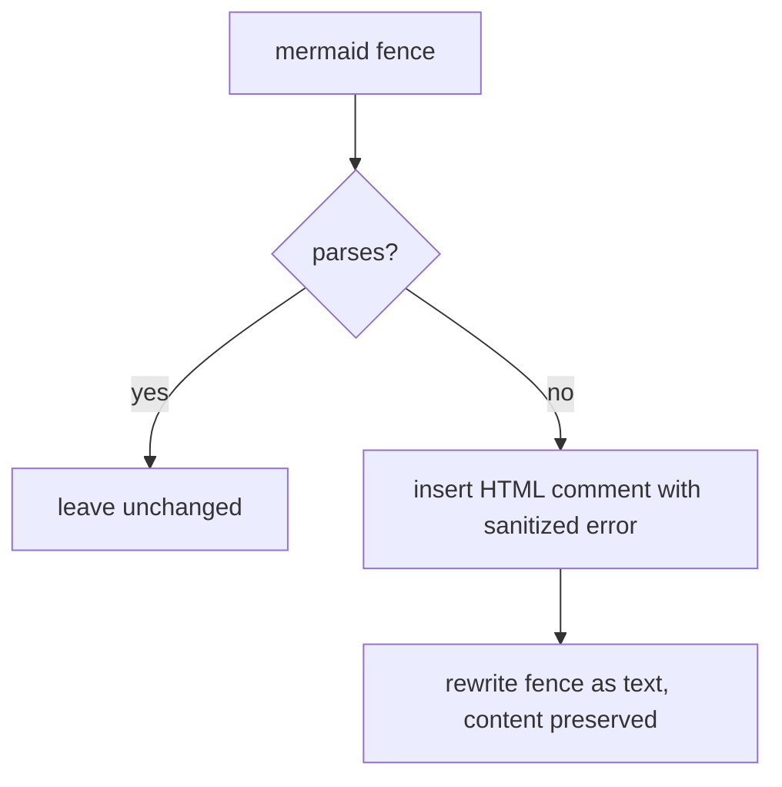

# Mermaid Validation & Degradation

Generated wikis embed mermaid diagrams. A broken diagram would break rendering, so OpenWiki validates every fence during finalization and safely degrades any that do not parse.

## The validation pass

`validateWikiMermaid` walks the generated wiki through the backend virtual filesystem — rooted at `/` for local-wiki and `/openwiki` for code — so writes stay inside the docs-only boundary. Files with no failing fences are left **byte-for-byte unchanged** to avoid diff noise, and reserved control files (`index.md`, `log.md`, `_plan.md`, `INSTRUCTIONS.md`) are excluded from scanning.

## Authoritative vs heuristic

`mermaid` and `jsdom` are **optional** peer dependencies, loaded lazily and memoized. When installed, the authoritative parser validates each fence; when absent, validation falls back to a conservative heuristic rather than crashing the run. The heuristic flags only near-certain breakages — a reserved `end` flowchart node id, a semicolon inside a label, or an unescaped angle bracket inside a label — so a valid diagram is never degraded.

## Degradation and repair marker

_Invalid-fence degradation._

An invalid fence is degraded to a plain `text` fence so its content survives and no broken diagram reaches a renderer; rewrites happen bottom-up so earlier line indices stay valid. Each degraded fence is preceded by an HTML comment carrying the sanitized parser error and instructions to fix and restore it — that comment is the marker a later update run finds to repair the diagram. The embedded error is first passed through the codebase secret-redaction boundary, flattened to one line keeping the diagnosis, made HTML-comment-safe by collapsing `--`, and length-capped.

The degradation marker is exactly what the diagram-authoring guidance in [agent/prompts.md](../agent/prompts.md) tells the agent to detect and repair. Secret redaction is shared with [reference/platform.md](platform.md).
