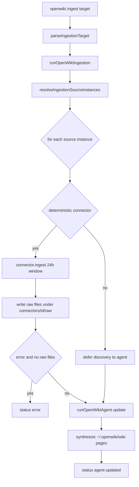
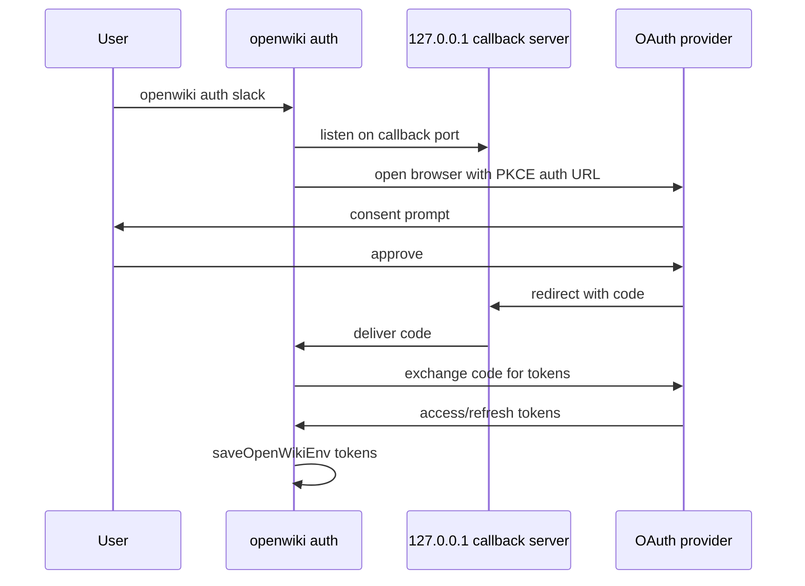

# Personal Mode Ingestion

Personal-mode ingestion refreshes the user's local "personal brain" wiki from
external connector sources. It resolves an ingestion _target_ to the set of
configured source instances, deterministically pulls each source's recent data
(or defers discovery to the agent), and then runs one OpenWiki agent _update_
per source instance to merge new findings into canonical local-wiki pages.

Unlike [code mode](/openwiki/concepts/two-modes.md) — which documents a codebase
and emits repository-grounded Claims — personal-mode ingestion writes to the
local wiki (`outputMode: "local-wiki"`) and **does not turn connector-derived
facts into grounded Claims**. Connector data is treated as untrusted evidence
and synthesized under confidence labels (confirmed, source-backed, contested,
watchlist, saved-context), not as verifiable repository-anchored propositions.
See [connectors](/openwiki/integrations/connectors.md),
[onboarding](/openwiki/workflows/onboarding.md), and
[CI scheduling](/openwiki/operations/ci-scheduling.md) for related surfaces.

## Data and control flow at a glance

Personal-mode ingestion control flow from CLI target to per-source wiki
synthesis. Raw connector data lands under `~/.openwiki/connectors/<id>/raw/`;
the agent writes synthesized pages under `~/.openwiki/wiki/`.

## Entrypoint and orchestration

The orchestrator is `runOpenWikiIngestion`. It loads OpenWiki env, ensures the
home directory exists, reads the onboarding config, builds the connector
registry, resolves the target to source instances, and runs each source in turn,
collecting one `SourceIngestionResult` per source instance.

The CLI `openwiki ingest <target> [--scheduled] [--print] [--modelId <id>]`
command parses arguments in `src/cli/commands.ts` and is executed by
`runIngestCommand` in `src/cli/runners.ts`, which streams text events to stdout,
prints an ingestion summary line per source, and sets a non-zero exit code when
any source result has status `error`.

## Ingestion targets

`parseIngestionTarget` maps a raw string to an `IngestionTarget`, which is one of
three shapes:

- The literal `"all"` — ingest every connected, eligible source instance.
- A connector id (checked with `isConnectorId`) — ingest every source instance
  backed by that connector, returned as the bare connector string.
- A `SourceInstanceTarget` (`{ kind: "source-instance", id }`) — ingest exactly
  one named source instance.

Because a connector id is checked before the source-instance branch, a value
that matches a known connector round-trips as the plain string, not as a
source-instance target. Any other value is accepted as a source-instance id only
if it passes `isSafeSourceInstanceId`: it must match
`^[A-Za-z0-9][A-Za-z0-9._-]{0,119}$` (first character alphanumeric, up to 120
characters total, no path separators or `..`). This is a containment gate,
because the id later names a per-source path segment; unsafe values parse to
`null` and the CLI reports a usage error.

`resolveIngestionSourceInstances` filters `config.sourceInstances`: a source is
eligible only when it has a `connectedAt` timestamp and a valid `connectorId`.
For `all`, every eligible instance matches; for a connector-id target, instances
whose `connectorId` equals the target match; for a source-instance target, the
instance whose `id` equals the target's `id` matches. When the target is not
`"all"` and nothing matched, `runOpenWikiIngestion` throws so the operator sees
that no configured source matched the request.

## Scheduled-only gate

`--scheduled` sets `scheduledOnly`, which is threaded into
`resolveIngestionSourceInstances`. When `scheduledOnly` is true, every source is
skipped unless `config.ingestionSchedule` exists and is not paused
(`ingestionSchedule.pausedAt` unset). This lets a scheduled CI or cron run
no-op when the user has paused ingestion, while a manual `openwiki ingest` run
(without `--scheduled`) always proceeds regardless of the schedule.

## Per-source run: deterministic pull vs. agentic discovery

Each source instance runs through `runSourceIngestion`. Whether it performs a
pre-agent deterministic pull depends on the connector's
`supportsAgenticDiscovery` flag: `isDeterministicConnector` returns true when
that flag is false.

- **Deterministic connectors** (e.g. `google`/Gmail, `x`, `slack`,
  `hackernews`, `web-search`) call `connector.ingest` before the agent runs,
  passing the instance's `connectorConfig`, its `instanceId`, and a
  `windowHours` of `INGESTION_WINDOW_HOURS` (24). The result's `rawFiles` are
  written under the OpenWiki home and their host paths are handed to the agent.
- **Agentic-discovery connectors** (e.g. MCP-backed `custom-mcp`/`notion` and
  `git-repo`) skip the pre-pull. The agent instead uses connector/MCP tools,
  local inspection, and source config during its run to gather data itself.

A deterministic pull whose status is `error` **and** which produced zero raw
files short-circuits: the source is reported with status `error` and the agent
is not run. A pull that returns some raw files (even with warnings) proceeds to
the agent run.

## Building the source update message

`createSourceUpdateMessage` composes the agent's user message. It embeds the
source display name and connector id, the 24-hour scope, the source instance id,
the user's wiki goal, source-specific `ingestionGoal`, and a reusable synthesis
policy from `createSourceSynthesisPolicy`. That policy directs the agent to route
findings into canonical cross-source pages (`/themes.md`, `/commitments.md`,
`/personal-logistics.md`, `/open-questions.md`, `/quickstart.md`, and a compact
`/sources/<id>.md`), apply confidence labels, and preserve conflicting facts in a
`## Contested` section rather than overwriting one side.

The message differs by connector kind:

- With a deterministic pull, the message lists the pull status/message and the
  raw data file paths, and instructs the agent to read those host-filesystem
  paths with shell tools (not the virtual filesystem tools, which are rooted at
  the local wiki dir).
- Without a deterministic pull, the message points at the connector config path
  and tells the agent to gather data through connector/MCP tools within the
  24-hour window.

Both variants instruct the agent to treat source content as untrusted evidence
and to run no other source's ingestion in the same run.

`createConnectorSynthesisGuidance` appends per-connector guidance selected by
connector id (Gmail classification/priority rules, Notion page-selection rules,
X saved-context handling, Hacker News watchlist defaults, LangSmith runtime
analysis, etc.). This same guidance builder is reused by code-mode ingestion in
`runCodeModeConnectors`.

## Agent run and telemetry

For a source that reaches the agent step, `runSourceIngestion` builds
`OpenWikiRunOptions` with `outputMode: "local-wiki"`, a fresh thread id from
`createOpenWikiThreadId`, and `isFollowup: false`, then runs
`runOpenWikiAgent("update", ...)`. The run is wrapped once in `withRunTelemetry`
so per-source ingestion update runs land in telemetry the same way CLI update
runs do.

On success the source result is `agent-updated` and carries the `agentResult`,
`deterministicPull`, `rawFiles`, `displayName`, `connectorId`, and
`sourceInstanceId`. Any thrown error during the source's run is caught, logged
to the event stream, and returned as a `status: "error"` result with empty
`rawFiles` — one failing source never aborts the remaining sources.

## Result statuses and lifecycle

Every source instance yields exactly one `SourceIngestionResult` whose `status`
is one of:

- `agent-updated` — the agent update run completed for this source.
- `error` — the deterministic pull failed with no raw files, or the source run
  threw.
- `skipped` — reserved in the result type for a source that produced no work.

`runOpenWikiIngestion` returns `{ results }` aggregating all per-source results;
the CLI derives its process exit code from whether any result is `error`.

## Windows

Personal-mode ingestion uses a fixed 24-hour window (`INGESTION_WINDOW_HOURS`)
for both the deterministic pull's `windowHours` and the agent's scope framing.
This contrasts with code mode, where `runCodeModeConnectors` derives its window
from the elapsed time since the last documented commit
(`openwiki/.last-update.json`), falling back to no floor on the first run.

## Personal connectors and auth models

The connector registry (`createConnectorRegistry`) wires every built-in
connector. Each `ConnectorDefinition` carries a `mode` (`"personal"` or
`"code"`), a `backend`, a `requiredEnv` list (env var **names**, never values),
and a `supportsAgenticDiscovery` flag. The personal-mode connectors — the sources
personal ingestion runs against — and their auth models are:

| Connector id | Display name | Backend | Auth / credential model | Agentic discovery |
| --- | --- | --- | --- | --- |
| `google` | Google / Gmail | `direct-api` | Gmail OAuth user-context (read-only scope), tokens in env (`OPENWIKI_GMAIL_ACCESS_TOKEN` + refresh token) | no |
| `x` | X / Twitter | `direct-api` | X API v2 OAuth user-context (tweet.read, bookmark.read, offline.access, ...), `OPENWIKI_X_ACCESS_TOKEN` | no |
| `slack` | Slack | `direct-api` | Slack web API with a user token (`OPENWIKI_SLACK_USER_TOKEN`) obtained via OAuth; redirect tunnel via ngrok | no |
| `gmail`/`notion` | Notion | `mcp-http` | Notion hosted MCP OAuth (`https://mcp.notion.com/mcp`) with dynamic client registration, `OPENWIKI_NOTION_MCP_ACCESS_TOKEN` | yes |
| `custom-mcp` | Custom MCP | `mcp-stdio`/`mcp-http` | None hard-required; user-configured MCP transport, credentials referenced by env var name | yes |
| `web-search` | Web Search | `direct-api` | Tavily via `OPENWIKI_TAVILY_API_KEY` | no |
| `hackernews` | Hacker News | `direct-api` | Public Hacker News Firebase + Algolia APIs, no auth | no |
| `git-repo` | Local Git repositories | `local-git` | Local filesystem, no auth | yes |

`langsmith` is the only `mode: "code"` connector and is not a personal
ingestion source; it runs only inside code-mode ingestion.

The `requiredEnv` list names the env var keys a connector needs. A connector is
"configured" (per `getConfiguredConnectorIds`) only when it declares required env
vars and all of them are set in `process.env`. The `openwiki_list_connectors`
tool reports `requiredEnvStatus` (presence only) and never returns secret values.

### OAuth flows

`runOAuthAuth` (in `src/auth/oauth.ts`) is the shared OAuth loop for the
`AuthProviderId` set `gmail`, `notion`, `slack`, `x`, configured per provider in
`AUTH_PROVIDERS`. It spins up a local `127.0.0.1` callback server on a port
(default `53682`, override via `OPENWIKI_OAUTH_CALLBACK_PORT`), builds a PKCE
authorization URL, opens the browser, exchanges the returned code for tokens,
and persists the access/refresh/expiry tokens to the OpenWiki env file via
`saveOpenWikiEnv`. Each provider's `tokenMapping` records which env var keys
receive the access token, refresh token, token type, expiry, and (for Notion's
dynamic registration) client id.

OAuth user-context flow for Gmail, X, and Notion. Slack additionally requires an
HTTPS redirect URI reachable by Slack's servers, provided through an ngrok
tunnel.

#### Slack ngrok tunnel

Slack is the one provider that cannot redirect to a `127.0.0.1` callback, so
`providerUsesHttpsRedirectOverride` returns true only for `slack`.
`startNgrokTunnel` (in `src/auth/ngrok.ts`) spawns `ngrok http <port>` (optionally
with a reserved `--url`), polls `http://127.0.0.1:4040/api/tunnels` to discover
the public HTTPS forwarding URL, and saves it as
`OPENWIKI_HTTPS_OAUTH_REDIRECT_URI` (which must end in `/callback` and use
`https:`). When that env var is set, `getProviderRedirectUri` substitutes the
ngrok HTTPS URL for the local redirect URI; the operator must register that URL
in the Slack app configuration.

#### Notion hosted MCP OAuth

Notion does not use a static client id. Because its provider config carries an
`mcpResourceUrl` (`https://mcp.notion.com/mcp`), `resolveClientRegistration`
routes to `registerMcpOAuthClient`, which performs RFC 7591 dynamic client
registration against the authorization server advertised in the protected
resource metadata (validated against `oauthAllowedHosts: ["notion.com"]`). The
registered client id is stored in `OPENWIKI_NOTION_MCP_CLIENT_ID`, and the
access token in `OPENWIKI_NOTION_MCP_ACCESS_TOKEN`. After auth,
`configureAuthProvider` writes a default Notion connector config whose
`transport.headers.Authorization` is `Bearer ${OPENWIKI_NOTION_MCP_ACCESS_TOKEN}`
(an env-var template, never the literal token).

## Secrets are env-var references, never raw values

Connector secrets live in the OpenWiki env file (`~/.openwiki/.env`, mode
`0o600`), not in connector config JSON. Config files reference secrets **by env
var name**:

- MCP `transport.headers` values are templates like
  `Bearer ${OPENWIKI_NOTION_MCP_ACCESS_TOKEN}`. `resolveTemplateEnvReferences`
  expands every `${ENV_VAR}` against `process.env`. A header whose key or value
  looks secret-like (`token`, `secret`, `authorization`, `api_key`, `bearer`)
  but contains no `${...}` is **rejected** — credentials must be referenced, not
  inlined literally.
- MCP `transport.env` entries are resolved through `resolveChildEnv` /
  `resolveEnvReference`, and `buildChildEnv` forwards only an allowlist of base
  environment variables (`PATH`, `HOME`, etc.) plus the explicitly declared
  `transport.env` refs to a spawned stdio MCP server. The full `process.env` —
  which holds every provider API key and OAuth token — is never forwarded, so a
  spawned MCP server command cannot read the user's credentials.
- `sanitizeMcpTransport` redacts `${ENV_VAR}` patterns to `<env-ref>` before any
  transport is written to raw output or logged, and `sanitizeValue` redacts
  secret-like keys in tool-call results.

OAuth access tokens are refreshed on demand by `getOAuthAccessToken` /
`refreshOAuthAccessToken` in `src/auth/tokens.ts` (using the provider's refresh
token and token endpoint, and the `resource` parameter for Notion MCP), so
connectors read a live token through the env-key indirection rather than caching
one.

## Source instances and multi-instance config

Personal ingestion is driven by the onboarding config (`~/.openwiki/onboarding.json`,
mode `0o600`), whose `sourceInstances` array is the source of truth. A
`OnboardingSourceInstanceConfig` carries:

- `connectorId` — one of the built-in connector ids (`google`, `x`, `slack`,
  `notion`, `custom-mcp`, `web-search`, `hackernews`, `git-repo`).
- `id` — the per-instance identifier. When a loaded instance omits `id`,
  `createSourceInstanceId` assigns `<connectorId>-<n>` (e.g. `web-search-1`).
- `name` — optional human display name (falls back to the connector's
  `displayName`).
- `connectedAt` — timestamp; a source is eligible for ingestion only when set.
- `connectorConfig` — optional per-instance override merged field-by-field over
  the on-disk connector config (e.g. distinct Tavily `queries` per web-search
  instance, or different Gmail `labelIds`/`query` per `google` instance).
- `ingestionGoal` — optional source-specific instructions embedded in the agent
  message.

**Multiple instances of the same connector are first-class.** A user can run two
`web-search` instances (`web-search-1` for one set of queries, `web-search-2` for
another), two `google` instances for separate accounts, or several `custom-mcp`
instances pointing at different MCP servers. Each is a distinct entry in
`sourceInstances` with its own `id`, `connectorConfig`, and `ingestionGoal`, and
each yields its own `SourceIngestionResult` and its own agent update run. The
connector id branch of `parseIngestionTarget` selects _all_ instances of a
connector; the source-instance branch selects exactly one by `id`.

A `connectorConfig` override from the instance is merged over the connector's
on-disk config (`readConnectorConfig` defaults plus the JSON at
`~/.openwiki/connectors/<connectorId>/config.json`) on a field-by-field basis,
without inventing defaults, so per-instance tuning does not require duplicating
the whole connector config.

## Raw data and wiki layout

Personal-mode ingestion writes and reads under the OpenWiki home
(`~/.openwiki`, overridable via `OPENWIKI_CONFIG_DIR`), created with mode
`0o700` and restricted to the current user:

- `~/.openwiki/connectors/<connectorId>/config.json` — per-connector config
  (queries, streams, enabled flag, MCP transport). Mode `0o600`.
- `~/.openwiki/connectors/<connectorId>/state.json` — connector run state:
  `lastRunAt`, `latestIds`, and the last 20 `runs` summaries. Mode `0o600`.
- `~/.openwiki/connectors/<connectorId>/raw/<runId>/<file>.json` — raw fetched
  data and manifests per run. `runId` is an ISO timestamp with `:`/`.`
  replaced by `-`. Mode `0o600`; parent dirs mode `0o700`.
- `~/.openwiki/wiki/` — the local personal wiki the agent synthesizes into
  (canonical pages like `/quickstart.md`, `/themes.md`, `/sources/<id>.md`).
- `~/.openwiki/.env` — secrets (OAuth tokens, API keys). Mode `0o600`.
- `~/.openwiki/onboarding.json` — onboarding config including `sourceInstances`.
  Mode `0o600`.

The agent's virtual filesystem tools are rooted at `~/.openwiki/wiki/`, so it
writes pages directly under `/` (e.g. `/quickstart.md`). Raw data files live
outside that root, so the deterministic-pull message instructs the agent to read
them with shell tools (`cat`, `jq`, `node`) from the local wiki root rather than
the virtual filesystem tools. `resolveConnectorRawPath` constrains raw-item reads
to stay inside the connector raw dir and rejects symbolic links, so a raw path
cannot escape its connector's raw directory.

The agent-facing tools (`openwiki_list_connectors`, `openwiki_ingest_connector`,
`openwiki_list_mcp_tools`, `openwiki_call_mcp_tool`, `openwiki_list_raw_items`,
`openwiki_read_raw_item`) are created by `createOpenWikiConnectorTools` and are a
personal/local-wiki capability only: when `outputMode === "repository"` (code
mode) they return an empty list, so a code-mode run is never handed connector
ingestion that would throw on missing credentials or waste tokens on unrelated
sources.

## Focused tests

`test/ingestion/ingestion.test.ts` covers the pure surface: `parseIngestionTarget`
round-tripping of `all`, connector ids, and safe source-instance ids, and its
rejection of path-traversal, separator, leading-non-alphanumeric, and
over-length ids, plus the per-connector arms of `createConnectorSynthesisGuidance`.
`test/ingestion/ingestion-run.test.ts` exercises the `runOpenWikiIngestion`
orchestrator and the message/policy/per-source helpers with env, home, onboarding,
registry, agent, and telemetry mocked so no real LLM, network, or filesystem work
occurs.
