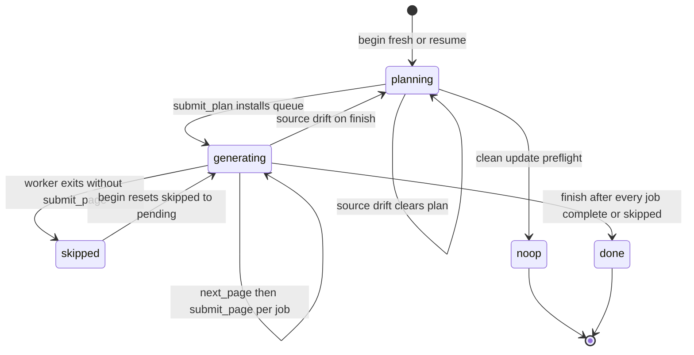

# Repository Generation Lifecycle

Repository generation is a resumable, checkpointed workflow that turns a Git
repository into a grounded OpenWiki. It is expressed as a small transport-neutral
core in `src/generation/` that owns durable state, and two thin drivers — a
native agent runner and a host/MCP adapter — that call the same five operations.
The core is the source of truth for ordering, durability, and failure semantics;
the drivers only supply models, prompts, and transport.

## The five-operation lifecycle

The whole workflow is exactly five operations, each a function in
`src/generation/repository-run.ts`:

- `beginRepositoryRun` — start a fresh durable run or reconstruct an interrupted
  one, or prove that a clean update needs no work.
- `submitRepositoryPlan` — validate, normalize, and durably install the ordered
  page queue, moving the run from `planning` to `generating`.
- `nextRepositoryPage` — read the first pending job without reserving or mutating
  it, or report queue completion.
- `submitRepositoryPage` — prove one page's Markdown and complete Claim set are
  durable, then mark that job complete.
- `finishRepositoryRun` — run deterministic deletion, indexing, provenance,
  Claims finalization, and metadata persistence, then remove the checkpoint.

Two auxiliary core operations support the failed-page path but are not part of
the five-step contract: `captureRepositoryPageSnapshot` records a page's
pre-worker Markdown and Claims, and `skipRepositoryPage` restores that snapshot
and marks the job `skipped` (see [Failed page workers are skipped, not
aborted](#failed-page-workers-are-skipped-not-aborted)).

The host adapter surfaces the five steps under stable protocol names
(`openwiki_begin`, `openwiki_submit_plan`, `openwiki_next_page`,
`openwiki_submit_page`, `openwiki_finish`).

Lifecycle phases and transitions of one repository-generation run, including the
skipped-page detour and its resume reset.

## Durable run state: openwiki/.run.json

A run's entire resumable state lives in a single JSON checkpoint,
`openwiki/.run.json`, whose basename and schema version are fixed constants. The
checkpoint carries the run's identity (`runId`, `mode`, `phase`), resolved
language, the pre-run page inventory (`initialPages`), the source fingerprint,
planning context, the stable actor, prior successful metadata, a pre-run content
snapshot, serialized wiki-preparation state, and — once installed — the ordered
`plan`.

Each `PageJob` in the plan records a `status` of `"pending"`, `"skipped"`, or
`"complete"`. `"skipped"` is a deferred state: it is not a final outcome. When
`begin` resumes a run, every `skipped` job is reset back to `"pending"` (see
[Resume](#begin-fresh-run-resume-and-clean-update-no-op)), so skipped pages are
retried on the next update rather than left skipped forever.

The checkpoint is loaded and schema-validated on read; a malformed checkpoint
raises `invalid_state` rather than being silently discarded, so resumable work is
never thrown away by accident. Writes are atomic: state is written to a
per-process temporary file with an exclusive-create flag and then renamed over
the target. The checkpoint is removed idempotently only after successful
completion or an init rollback.

The in-memory `ActiveRepositoryRun` is only advanced after the next durable state
is written; every mutating operation writes `openwiki/.run.json` first and
replaces `run.state` afterward, so a crash never leaves memory ahead of disk.

## The durable ordered page queue

`submitRepositoryPlan` turns a proposed plan into a normalized `RepositoryRunPlan`
via `createRepositoryPlan`. Normalization canonicalizes and deduplicates page
paths, rejects reserved working pages, forbids a page being both generated and
deleted, and enforces mode-specific shape rules — init plans may not delete pages
and must include `/openwiki/quickstart.md`, and `/openwiki/quickstart.md` can
never be deleted. Each page becomes a `PageJob` with a fresh UUID `id` and
`status: "pending"`.

For update runs, the plan is augmented with jobs the planner omitted:
`addRequiredClaimIssueJobs` inserts reconciliation jobs for pages with unresolved
grounding issues, and `addRequiredRewriteJobs` inserts rewrite jobs for pages
that must change language. The queue is then deterministically sorted by code-unit
path order, with `/openwiki/quickstart.md` placed last so the navigation page is
generated after the domain pages it routes to.

The installed plan is the run's persisted ordered queue: jobs are consumed in
order, and completion is tracked per job. A duplicated `submit_plan` is tolerated
only if it describes the same semantic plan (compared while ignoring generated
job IDs and progress); a different plan against an already-installed queue is
rejected with `invalid_state`.

## Page completion is the durability boundary

`nextRepositoryPage` returns the first `pending` job together with whether the
target page already exists on disk and its current Claims — but it does not
reserve or mutate anything, so it is safe to call repeatedly. Skipped jobs are
not pending, so they are invisible to `nextRepositoryPage` until a resume resets
them.

`submitRepositoryPage` is where a page becomes durable, and it is strict about
ordering: only the current pending job may be submitted, an already-complete job
is idempotently acknowledged, and an unknown job id is `not_found`. Before
recording completion it requires the page's Markdown to be present and readable,
validates its front matter, reconciles the page's complete proposed Claim set
into the process-local Claims session, finalizes Claims, and proves durability
via `assertPageClaimsDurable`. That proof checks that a sidecar was persisted,
that its page version matches the current Markdown bytes, that a verification
event was projected into the page front matter, and that every expected Claim's
statement and evidence set match exactly. Only after all of this does it write a
new checkpoint marking the job `complete`.

Because per-job completion (or skip) is persisted as `PageJob` status, page
completion is the workflow's durability boundary and recovery unit: once the run
state is durable, already-completed pages are the recovery mechanism. An
interrupted run resumes by simply replaying `next_page`/`submit_page` for the
remaining pending jobs rather than restarting the whole wiki.

## Failed page workers are skipped, not aborted

A bounded page worker is not allowed to leave the wiki half-written. Before each
worker runs, the native runner captures a `RepositoryPageSnapshot` of the current
pending job via `captureRepositoryPageSnapshot`, which reads the page's current
Markdown (or `null` if absent) and its Claims sidecar (or `null`). If the worker
exits without ever calling `submit_page` — whether the model stream ends, the
worker gives up, or it raises a non-fatal error — the runner calls
`skipRepositoryPage(run, snapshot)` rather than aborting the whole run.

`skipRepositoryPage` restores the page to its pre-worker state: it writes back
the snapshot Markdown (or deletes the page if the snapshot had none), restores
the snapshot Claims sidecar (or deletes it), rebuilds the process-local Claims
runtime from durable state, writes `interrupted` last-update metadata, and
persists a new checkpoint that marks that job `status: "skipped"`. It advances no
other state, so the next `nextRepositoryPage` simply moves to the following
pending job and the run continues.

A fatal submission failure is treated differently. `submit_page` maps a
correctable `invalid_input` rejection (bad Claim payload) into a failed tool
result so the worker can correct and retry, keeping its loop active. Any other
error thrown by `submit_page` sets a fatal-submission flag; if the worker then
fails, the runner rethrows instead of skipping, because the durable invariants
may already be violated.

Whenever a page is skipped, `emitDeferredPageWarning` emits a text event noting
that the page was restored after its worker exited without submitting, that it
was skipped for this update, and that it will be reconsidered on the next update.

## Claim reconciliation on submit

`replacePageClaims` treats the submitted Claim set as the page's complete
replacement set. A proposal that reuses an existing id confirms or updates that
Claim; a new proposal that exactly matches an existing Claim confirms it; an
otherwise-new proposal is added; and any existing Claim not present in the
submission is retracted. Duplicate proposals and ids not owned by the page are
rejected as `invalid_input`, and every Claim must carry at least one evidence
resource. This is why callers should reuse ids for unchanged or revised Claims
and omit ids only for genuinely new ones.

## begin: fresh run, resume, and clean-update no-op

`beginRepositoryRun` first ensures code-mode repository setup, then reads
`openwiki/.run.json`. If a checkpoint exists, it resumes; otherwise it starts
fresh.

For a fresh **update**, Claims preflight runs before Git-status no-op detection:
if the working tree is clean _and_ there are zero grounding issues, `begin`
returns a `noop` view without creating any run. A clean Git status alone cannot
hide stale or unresolved grounding state.

For a fresh **init**, the existing wiki is first replaced with a blank target via
a recoverable transaction that backs up `openwiki/`, preserves user-owned
`INSTRUCTIONS.md`, and installs SIGINT/SIGTERM handlers that restore the backup on
cancellation. Writing the checkpoint and the `interrupted` metadata is the
durability point; only after both are durable is the init backup committed, so
from then on partial pages — not the backup — are the recovery mechanism. If the
fresh path fails before commit, an init rollback removes any written state and
restores the previous wiki, while a failed update never deletes a successfully
written checkpoint.

Resume validates that the caller owns the durable run: a mode mismatch, a
language change, or a different producer actor all raise `conflict`, forcing the
existing run to be resumed on its own terms before anything else changes. During
resume, `begin` also resets every `skipped` job back to `"pending"`
(`resetSkippedPages`): if any planned page is `skipped`, the checkpoint is
rewritten with those pages returned to `pending` before the run is handed back.
This is what makes the skipped state a deferral rather than a permanent loss —
the next update replays the skipped pages instead of leaving them ungenerated.

## Resume on the same checkout and source-fingerprint invalidation

`createRepositorySourceFingerprint` hashes every model-visible repository source
input for the active plan — Git HEAD, tracked and untracked source files, and
porcelain status — while excluding generated OpenWiki state and ignored paths.
Git, stat, symlink, and read failures reject, because the fingerprint is a
correctness gate rather than a hint.

The fingerprint makes resume safe only on the same checkout. When `begin` resumes
and the current fingerprint differs from the checkpoint's, the whole plan is
invalidated: the phase is reset to `planning`, the new fingerprint is stored, and
`plan` is deleted from the state. Plan absence — not fingerprint equality — is the
durable signal that new planning context may replace the prior context.

`finishRepositoryRun` guards the same drift at both ends of its deterministic
window: it re-checks the fingerprint before doing any finalization and again after
Claims are finalized, closing the check/use race so source cannot change midway.
Any drift resets the run to `planning`, clears the plan, and raises a `conflict`
telling the caller to `begin` and submit a replacement plan.

## finish: deterministic finalization

`finishRepositoryRun` refuses to run while any job is still `pending`; `skipped`
jobs are allowed and are reconciled rather than treated as pending. It accepts an
optional `skippedPageSnapshots` list and requires exactly one snapshot per
skipped job, matched by `jobId` and `path` — any mismatch raises `invalid_state`
before finalization proceeds.

Once the queue has no pending jobs and source is stable, finish deletes pages
abandoned by a superseded plan (never touching `initialPages`), applies the plan's
explicit deletions, reconciles Claims sidecars for deleted pages, finalizes wiki
artifacts (indexes and provenance), and then restores each skipped page's Markdown
from its snapshot. Skipped pages are excluded from Claims finalization and from
the whole-run durability proof (`assertRepositoryClaimsDurable` receives the
skipped-page set as `excludedPages`, so neither `finalize` nor the verification
projection touches them). Finish then proves the rest of the repository has no
orphaned or partially durable Claims.

If any pages were skipped, finish writes `interrupted` (not `complete`)
last-update metadata, signalling that work remains; otherwise it persists
`complete` metadata only when content actually changed. Last of all it removes
`openwiki/.run.json`. The checkpoint is deleted last on purpose: every earlier
failure leaves the run resumable so `begin` can reconstruct and retry.

## One lifecycle, two drivers

Both entrypoints drive the identical durable core.

The **native runner** (`runNativeRepositoryGeneration`) begins the run with a
stable OpenWiki producer actor, then loops: it runs a bounded planning agent when
the phase is `planning`, runs one fresh non-delegating page worker per pending job
(each bounded to writing only its assigned page and calling `submit_page`), and
then calls `finish`. Each pending job is snapshotted before its worker runs, and
any worker that exits without submitting is skipped and its snapshot carried
forward to `finish`. If `finish` reports the specific source-drift invalidation
`conflict`, the runner rebuilds context, re-begins, and replans automatically.
Workers reuse the supplied model but keep no repository-generation state beyond
the durable core.

The **host integration** (`HostSessionManager`) exposes the same five operations
as the OpenWiki MCP tools. It holds one active `ActiveRepositoryRun`, requires the
caller's `runId` to match before every operation, serializes operations with a
single-operation guard, and maps lifecycle `RepositoryRunError` codes onto stable
host-integration errors. Because both drivers call `beginRepositoryRun`,
`submitRepositoryPlan`, `nextRepositoryPage`, `submitRepositoryPage`, and
`finishRepositoryRun`, they share the exact same ordering, durability boundary,
and source-fingerprint invalidation semantics.

## Failure semantics

Lifecycle failures are reported with stable `RepositoryRunError` codes —
`invalid_input`, `invalid_state`, `conflict`, and `not_found` — that the host
adapter maps to protocol errors and the native runner uses to drive replanning.
Correctable input rejections (bad plan or bad Claim payload) are returned to
workers as failed tool results so their loop stays active, while `invalid_state`
and `conflict` protect the durable invariants: submit in phase order, submit only
the current pending job, and never finish over changed source.
